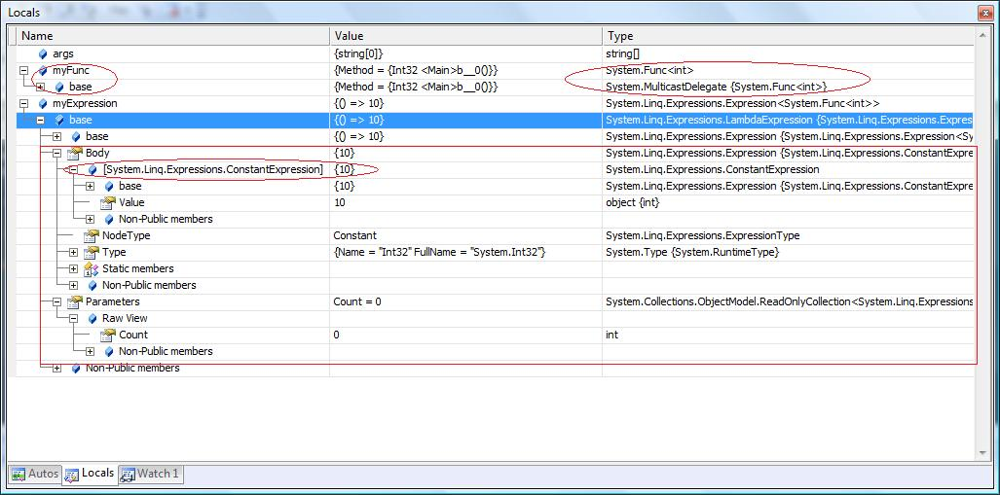

## SWK5 Übung 28.11.18

[Get started with ASP.NET Core MVC](https://docs.microsoft.com/en-us/aspnet/core/tutorials/first-mvc-app/start-mvc?view=aspnetcore-2.1)  


Alles was in der cshtml programmiert ist wird auf dem Server ausgeführt. Aus Sicht vom Browser bekommt er eine normale HTML Datei zurück (diese könnte genauso gut statisch sein, der Unterschied kann der Browser nicht feststellen).

### ProperyAnnotations

Nugget Packages können mit dem NuggetPacket Manager hinzugefügt werden. Extras -> NuGet-Package-Manager

Benötigte Nuggets:
DataAnnotationsExtensions
DataAnnotationsExtensions.MVC3

Verwendung:
```csharp
public class TariffCalculatorModel
{
    [Required(ErrorMessage = "Please enter a number.")]
    [Integer(ErrorMessage = "Please enter an integer")]
    [Min(0, ErrorMessage = "Please enter a number above 0")]
    public int LocalDuration { get; set; }
    public int LocalPeakPercent { get; set; }

    public int NationalDuration { get; set; }
    public int NationalPeakPercent { get; set; }

    public double TotalCost { get; set; }

    public IEnumerable<SelectListItem> TariffList { get; set; }

    public string SelectedTariff { get; set; }
}
```

Verwendung in Controller:
```csharp
if (!tariffCalculator.GetAllTariffs().Any(t => t.Id == model.SelectedTariff))
{
    ModelState.AddModelError(nameof(model.SelectedTariff), "invalid tarif");
}
if (ModelState.IsValid){}
```

### Routing

Startup page kann verändert werden in App_Start/route_config.cs
```csharp
routes.MapRoute(
                name: "Default",
                url: "{controller}/{action}/{id}",
                defaults: new { controller = "TariffCalculator",
                      action = "Index", id = UrlParameter.Optional }
            );
```

### cshtml

Kommentare:
```cshtml
@* *@
```

Zugriff auf ViewData:
```cshtml
<span>@ViewData["Message"]</span>
```

Zugriff auf ViewBag:
```cshtml
<span>@ViewBag.Date</span>
```

Erweiterter Csharp Block:
```cshtml
@{ 
  int x = 15;
  ...
}
```

Model in einer View verwenden:
```cshtml
@model PhoneTariff.MVC.Models.HelloModel
...
<h2>@Model.Message</h2>
```

HTML Helper (TextBox):
```cshtml
<label for="LocalDuration">Duration in min:</label>
<!-- class ist ein reserviertes Schlüsselwort, mit @ kann es trotzdem verwendet werden -->
@Html.TextBox("LocalDuration", Model.LocalDuration, new { @class = "from-control" })
		    
```

CSS Bundles:
```cshtml
<!-- Bundle Bootstrap Css und unser Css -->
<!-- Also zusammen gefügt und minifiziert -> also nur ein request für den browser -->
@Styles.Render("~/Content/css")
```

Using Anweisungen:
```cshtml
@using PhoneTariff.MVC.Utils;
```

In der _Layout.cshtml kann ein Platzhalter definiert werden, alle cshtml Dateien die dieses Layout verwenden können diesen Platzhallter überschreiben (required: ob dies in child elementen überschrieben werden muss oder nicht):
```cshtml
@RenderSection("LocalCss", required: false)

<!-- Überschreiben -->
@section LocalCss {
    <style type="text/css">
        .label-large {
            font-size: 18px;
            padding: 5px 30px;
        }
    </style>
}
```

Formular mit Dispose Methode:
```cshtml
@using (Html.BeginForm()) {}
```

### Get / Post Controller

Get / Post Request bei Controller:
```csharp
// GET Request
[HttpGet]
public ActionResult Index(){}

// Post Request
[HttpPost]
public ActionResult Index(){}
```

### partials
Dazu wird eine eigene View benötigt unter dem Shared Folder.

View:
```cshtml
@using PhoneTariff.MVC.Utils;
@using PhoneTariff.MVC.Models;

@model PhoneTariff.MVC.Models.ZoneModel

<div class="panel panel-info">
    <div class="panel-heading">
        <h3 class="panel-title">@Model.ZoneName</h3>
    </div>

    <div class="panel-body row">
        <div class="form-group col-sm-6">

            <label for="Model.TextBoxName">Duration in min:</label>
            @Html.TextBox(Model.TextBoxName, Model.Duration, 
                  new { @class = "form-control" })


        </div>
        <div class="form-group col-sm-6">

            <label for="Model.ComboBoxName">National Percent peak time:</label>
            @Html.DropDownList(Model.ComboBoxName,
                          ViewHelper.GetPercentList(10, 
                          Model.PeakPercent),
                          new { @class = "form-control" })

        </div>
    </div>
</div>

```

Aufruf:
```cshtml
@Html.Partial("_ZoneBox",
        new ZoneModel()
        {
            ZoneName = "Local Zone",
            TextBoxName = "LocalDuration",
            ComboBoxName = "LocalPeakPercent",
            Duration = Model.LocalDuration,
            PeakPercent = Model.LocalPeakPercent
        })
```

### Funktionen cshtml

Methode RenderZoneBox:
```cshtml
@helper RenderzoneBox(string zoneName, string textBoxName, 
                    string comboBoxName, int duration, int selectedValue)
{
    <div class="panel panel-info">
        <div class="panel-heading">
            <h3 class="panel-title">@zoneName</h3>
        </div>

        <div class="panel-body row">
            <div class="form-group col-sm-6">

                <label for="Model.TextBoxName">Duration in min:</label>
                @Html.TextBox(textBoxName, duration, new { @class = "form-control" })


            </div>
            <div class="form-group col-sm-6">

                <label for="Model.ComboBoxName">National Percent peak time:</label>
                @Html.DropDownList(comboBoxName, ViewHelper.GetPercentList(10, 
                          selectedValue),
                          new { @class = "form-control" })

            </div>
        </div>
    </div>
}
```

Aufruf:
```cshtml
@RenderzoneBox("Local Zone", "LocalDuration", 
                "LocalPeakPercent", 
                Model.LocalDuration, 
                Model.LocalPeakPercent)
```

#### Expression<Func<T, T>>

Mit Expressions wird eine Baumstruktur aufgebaut, mit dieser Baumstruktur kann auf das Model bzw der Name des Models zugegriffen werden. Diese Baumstruktur beschreibt was dieser Lambda Ausdruck macht, es enthält Daten über composition, expressions, variables, method calls..

```csharp
Func<int> myFunc = () => 10; // similar to: int myAnonMethod() { return 10; }
```
-> kompiliert effektiv zu einer IL Methode die 10 zurückgibt.

```csharp
Expression<Func<int>> myExpression = () => 10;
```

-> kompiliert zu einer Daten Struktur die eine Expression beschreibt die keine Parameter nimmt und value 10 zurückgibt.

Beides sieht zur Compile Zeit gleich aus, der Compiler generiert aber unterschiedliche Dinge.  

  

Funktion:
```cshtml
@helper RenderzoneBox(string zoneName,
    Expression<Func<TariffCalculatorModel, int>> duration,
    Expression<Func<TariffCalculatorModel, int>> peakPercent,
    int selectedValue)
{
    var textBoxName = Html.IdFor(duration).ToString();
    var comboBoxName = Html.IdFor(peakPercent).ToString();

    <div class="panel panel-info">
        <div class="panel-heading">
            <h3 class="panel-title">@zoneName</h3>
        </div>

        <div class="panel-body row">
            <div class="form-group col-sm-6">

                <label for="Model.TextBoxName">Duration in min:</label>
                @Html.TextBoxFor(duration,
                                new { @class = "form-control" })


            </div>
            <div class="form-group col-sm-6">

                <label for="Model.ComboBoxName">National Percent peak time:</label>
                @Html.DropDownListFor(
                    peakPercent,
                    ViewHelper.GetPercentList(10, selectedValue),
                    new { @class = "form-control" })

            </div>
        </div>
    </div>
}
```

Verwendung:
```cshtml
@RenderzoneBox("Local Zone", 
    model => model.LocalDuration, 
    model => model.LocalPeakPercent, 
    Model.LocalPeakPercent)
```
