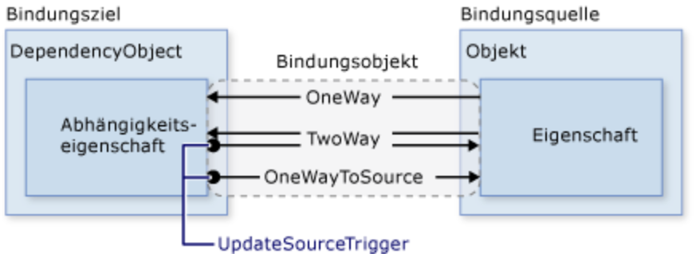

# SWK5 Übung 6 14.11.18

## Crash Course DataBinding

Durch Datenbindung wird eine Verbindung zwischen der UI der Anwendung und der Geschäftslogik hergestellt. Wenn die Bindung die ordnungsgemäßen Einstellungen aufweist und die Daten die richtigen Benachrichtigungen bereitstellen, ändern sich die an die Daten gebundenen Elemente automatisch bei jeder Änderung des Werts der Daten, sodass die Änderungen entsprechend wiedergegeben werden.

Unabhängig davon, welches Element gebunden wird und welcher Art die Datenquelle ist, erfolgt die Bindung stets gemäß dem in der folgenden Abbildung gezeigten Modell:  

 
Die folgende Tabelle enthält ein Beispielszenario für die einzelnen *UpdateSourceTrigger* -Wert mithilfe der TextBox als Beispiel:
 
| UpdateSourceTrigger-Wert | Wenn der Quelltext aktualisiert wird | Beispielszenario |
|---------------------------------------|---------------------------------------------------|---------------------------------------------------------------------------------------------------------------------------------------------|
| LostFocus (Standard für TextBox.Text) | Wenn das TextBox-Steuerelement den Fokus verliert | Eine TextBox der eine Validierungslogik zugeordnet ist |
| PropertyChanged | Während der Eingabe in die TextBox | TextBox Steuerelemente in einem chatroomfenster |
| Explicit | Wenn die Anwendung UpdateSource aufruft | TextBox Steuerelemente in einem bearbeitbaren Formular (aktualisiert die Quellwerte nur wenn der Benutzer die Schaltfläche "Senden" klickt) |

## INotifyPropertyChanged
[INotifyPropertyChanged Microsoft Doc](https://docs.microsoft.com/en-us/dotnet/framework/winforms/how-to-implement-the-inotifypropertychanged-interface)

*PropertyChanged delegates* verwenden, um Änderungen mitzuteilen. Obwohl Databinding *TwoWay* funktionieren kann, reagiert dieses Binding nicht auf Änderungen von außerhalb.

## ICommand

[ICommand Microsoft Doc](https://docs.microsoft.com/en-us/dotnet/api/system.windows.input.icommand?view=netframework-4.7.2)

Die *ICommand* Schnittstelle ist der Codevertrag für Befehle, die in .NET für Windows-Runtime-apps geschrieben sind. Diese Befehle verleihen den UI-Elementen wie zb. <kbd>Button</kbd> ein Verhalten das ausgeführt wird wenn zb. der Button gedrückt wird.

## Programm

### Media Annotator

Siehe Projekt Ue06