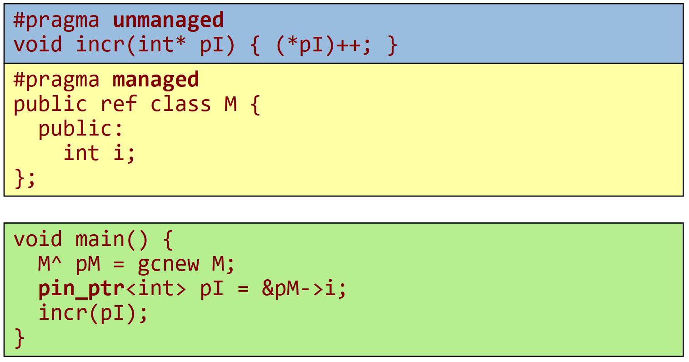

- [.NET: Interoperabilität](#net-interoperabilit%C3%A4t)
  - [Migration auf .NET](#migration-auf-net)
  - [Managed/Unmanged Code/Types](#managedunmanged-codetypes)
  - [COM – Common Object Model](#com-%E2%80%93-common-object-model)
  - [Interoperabilität mit COM](#interoperabilit%C3%A4t-mit-com)
  - [.NET -> COM](#net---com)
  - [COM -> .NET](#com---net)
  - [Visual Studio Tools for Office (VSTO)](#visual-studio-tools-for-office-vsto)
  - [VSTO: Beispiel](#vsto-beispiel)
  - [Platform Invoke (PInvoke)](#platform-invoke-pinvoke)
  - [PInvoke: Details](#pinvoke-details)
  - [IJW: "It Just Works"](#ijw-%22it-just-works%22)
  - [MC++: C++ with Managed Extensions (C++/CLI)](#mc-c-with-managed-extensions-ccli)
  - [Verbindung Managed/Unmanaged Code](#verbindung-managedunmanaged-code)
  - [Verwendung von Managed Types in Unmanged Clients](#verwendung-von-managed-types-in-unmanged-clients)
  - [Verwendung von Managed Types in Unmanged Clients](#verwendung-von-managed-types-in-unmanged-clients-1)

# .NET: Interoperabilität

## Migration auf .NET

- Motivation
  - Zugriff auf bestehende Bibliotheken (Win32, OpenGL, …),
  - Portierung von bestehendem Code.
- Realisierungsmöglichkeiten
  - Zugriff von Managed Code auf Unmanaged Code:
    - COM Interop (RCW): Zugriff auf COM-Komponenten.
    - Platform Invoke (PInvoke): Zugriff auf DLLs.
  - Portierung von C++-Code:
    - „It Just Works“ (IJW): Übersetzung von C++-Quelltext in Managed Code.
    - C++ with Managed Extensions: Implementierung von Managed Types.
  - Zugriff von Unmanaged Code auf Managed Code:
    - COM Interop (CCW): Verpacken eines Managed Types in eine COMKomponente.

#### Kommentar
    * Managed Code reicht nicht um in Managed sprachen (C#) verwendet zu werden
    * Managed Code wird automatisch generiert

## Managed/Unmanged Code/Types
- Managed Code wird von der CLR ausgeführt.
- Unmanaged Code wird direkt vom Prozessor ausgeführt.
- Alle .NET-Sprachen, außer C++, werden in Managed Code übersetzt.
- C++ Code kann entweder in nativen oder Managed Code übersetzt werden.
- Managed Code darf nicht mit Managed Types verwechselt werden. Nur Managed Types werden vom Garbage Collector automatisch freigegeben.
- Nur Managed Types können über Assembly-Grenzen hinweg verwendet werden.


#### Kommentar
      * c++ mit /clr option -> keine managed types
      * wrapper in c++ notwendig für managed types  (können als "Brückensprache" implementiert werden)
      

## COM – Common Object Model
- Komponentenmodell für Windows vor .NET
- Probleme mit C++
  - Binärlayout von Komponenten ist nicht definiert (dynamische Casts, „name mangling“, Speicherverwaltung, …).
  - Binärcode enthält keine Metadaten. (stehen im Headerfile!)
- COM:
  - Standardisierung des Binärlayouts von Komponenten,
  - Definition des Layouts der unterstützen Datentypen (Standarddatentypen, „safe arrays“, …),
  - Speicherverwaltung mittels Referenzzählung,
  - Clients kennen nur die Interfaces von Komponenten und eindeutige IDs (GUIDs),
  - Komponente enthält Beschreibung der Interfaces in Form von Typbibliotheken,
  - COM ist sprachunabhängig.

#### Kommentare
    * speichert info in registry

## Interoperabilität mit COM


#### Kommentar
    * Marshalling bedeutet, dass die DT in der Repräsentierung angepasst werden muss
    * Callable Wrapper macht diese Anpassung
    * bedeutet einen gewissen Overhead (nicht nur aufgrund des Marshallings)

## .NET -> COM

- Erzeugung einer Proxy-Klasse (Runtime Callable Wrapper):
  - **tlbimp** *COMComponent.dll [/out:Wrapper.dll]*
  - Visual Studio: Referenz auf COM-Komponente hinzufügen.
- .NET-Client:
  ```csharp
  class COMClient { [STAThread] // Client läuft in einem Single Threaded Appartment
      static void Main(string[] args) {
          ICurrencyConverter conv = null;
          try {
              conv = new CurrencyCalcClass(); // Erzeugung der Komponente
              double rate = conv.RateOfExchange("USD", "EUR"));
              // Zugriff auf Methoden der Komponente
          }
          finally {
              Marshal.ReleaseComObject(conv)
          } // Referenzzähler dekrementieren -> Speicherfreigabe
      }
  }
  ```

#### Kommentar
    * durch das Hinzufügen einer Referenz auf ein COM wird ein managed wrapper erzeugt zur verwendung in C#

## COM -> .NET

- Interfaces und Klassen in .NET implementieren
  ```csharp
  [Guid("xxxxxxxx-xxxx-xxxx-xxxx-xxxxxxxxxxxx")]
  public interface ICurrencyConverter {
      double RateOfExchange(string src, string targ);
  } 
  [Guid("xxxxxxxx-xxxx-xxxx-xxxx-xxxxxxxxxxxx")]
  public class CurrencyCalculator: ICurrencyConverter {
      public double RateOfExchange(string src, string targ) {...}
  }
  ```

- Registierung der .NET-Komponente als COM-Komponente
  - **regasm** *[/tlb:TypeLibrary.tlb] Assembly.dll*
  - Visual Studio: Projekteinstellung Register for COM Interop = True
- VB 6 Client:
  ```csharp
  Dim converter As ICurrencyConverter
  Set converter = New CurrencyCalculator
  Print converter.RateOfExchange("USD", "EUR")
  ```

## Visual Studio Tools for Office (VSTO)

- VSTO ermöglicht die Fernsteuerung und Erweiterung von Office-Anwendungen mithilfe von .NET-Sprachen.
- Zum Zugriff auf das (COM-basierte) Objektmodell erfolgt über PIAs (Primary Interop Assemblies).
  - PIAs sind verwaltete Wrapperklassen (RCW),
  - sind teilweise an die Erfordernisse von .NET angepasst.
- Unterstützte Anwendungsszenarien:
  - Fernsteuerung von Office-Anwendungen mithilfe von PIAs.
  - Office Add-ins: Office-Erweiterungen, die von der Office-Anwendung gehostet wird (CCW).
  - Dokument-bezogene Erweiterungen (Code behind).
  - Implementierung von Arbeitsbereichen mithilfe von Windows-Forms.

## VSTO: Beispiel

```csharp
using Word = Microsoft.Office.Interop.Word;
…
Word.Application wordApp;
object missing = Missing.Value;
object objFalse = false;
wordApp = new Word.Application();
wordApp.Documents.Add(ref missing, ref missing, ref missing, ref missing);
wordApp.Selection.TypeText("Hello world");
wordApp.Quit(ref objFalse, ref missing, ref missing);
```

- C# 4.0 unterstützt optionale und benannte Parameter.
- Beim Aufruf kann das Schlüsselwort ref weggelassen werden.
- Damit können COM-Clients kompakter implementiert werden:
```csharp
wordApp.Documents.Add();
wordApp.Quit(SaveChanges: false);
```

#### Kommentar
    * Word enthält C# Komponenten für COM Komponenten

## Platform Invoke (PInvoke)
- Aufgabe
  - Aufruf von Funktionen in Win32-DLLs (Unmanaged Code).
  - Konvertierung (Marshaling) der Parameter.
- Vorgangsweise
  - Deklaration einer C#-Funktion mit den Attributen static extern.
  - Zuweisung der DLL-Names und des Einstiegspunkts mit dem Attribut `DLLImport`.
  - Angabe von zusätzlichen Marshaling-Informationen.
- Einfaches Beispiel:
  ```csharp
  using System.Runtime.InteropServices;
  class Test { 
      [DllImport("msvcrt.dll")]
      public static extern int puts(string c);
      public static void Main() {
          puts("Test");
      }
  }
  ```

## PInvoke: Details

- Das Attribut DllImport liefert Informationen, die zum Aufruf der nativen Funktion notwendig sind:
  - Name der Dll: 
  ``[DllImport("msvcrt.dll")]``
  - Name der Funktion:
    ``[DllImport("msvcrt.dll"), EntryPoint="puts"]``
  - Aufrufkonvention, Zeichensatz, …
- Marshalling:
  - Mit dem Attribut MarshalAs kann Standard-Marshalling überschrieben werden.
      ```csharp
      public static extern void MyFunction(
        [MarshalAs(UnmanagedType.BStr)] string s);
      ```
  - Es existieren auch Konstrukte zur Abbildung von Arrays und Strukturen.

## IJW: "It Just Works"

- C++-Quelltext kann in Managed Code übersetzt werden.
- In C++ kann Unmanaged Code direkt aufgerufen werden:

  ```csharp
  #include <stdio.h> 
  int main() {
      puts("Hello World!");
      return 0;
  }
  ```

  ```csharp
  cl /clr ijw.cpp
  ```
  
- Vorteile:
  - Einfacher, da auf DllImport verzichtet werden kann.
  - Zugriff auf Objekte: „Name Mangling“ muss nicht berücksichtigt werden.
- Nachteil:
  - Marshaling von verwalteten Typen muss manuell durchgeführt werden.

## MC++: C++ with Managed Extensions (C++/CLI)

- Mit MC++ können .NET-Klassen verwendet werden.
  ```csharp
  using namespace System; // entspricht dem using-Befehl von C#
  int main() {
      Random^ r = gcnew Random(); // Erzeugung eines Objekts am
      Console::WriteLine(r ->Next()); // Managed Heap
      return 0;
  } // Managed Types müssen nicht freigegeben werden.

  ```

- Mit MC++ können .NET-Klassen implementiert werden, die auch in anderen .NET-Sprachen direkt verwendbar sind.
  ```csharp
  public ref class CurrencyConverter {
      std::map <string,double> *pCurrencyRates;
      public: CurrencyConverter() {…}
      double RateOfExchange(String^ src, String^ targ) {…}
  };
  ```
  
#### Kommentare
      * gcnew is auf allokation auf dem managed heap, man kann verwaltete Objekte erstellen
      * bei klasse -> ref bedeutet das ein managed objekt raus kommt (MC++)
        * diese klasse kann auch unmanaged types verwenden, muss natürlich selbst freigegeben werden

## Verbindung Managed/Unmanaged Code

- Mit MC++ implementierte Klassen können als Schnittstelle zwischen Managed und Unmanaged Code dienen.

  
  
#### Kommentar
      * muss selbst für das Marshalling der Parameter sorgen
      * bei ref kommt eine managed Klasse heraus
      * ^ ist das managed Equivalent zu * Pointer

## Verwendung von Managed Types in Unmanged Clients


## Verwendung von Managed Types in Unmanged Clients
- `pin_ptr<>` verhindert, dass Objekt verschoben wird.

  
