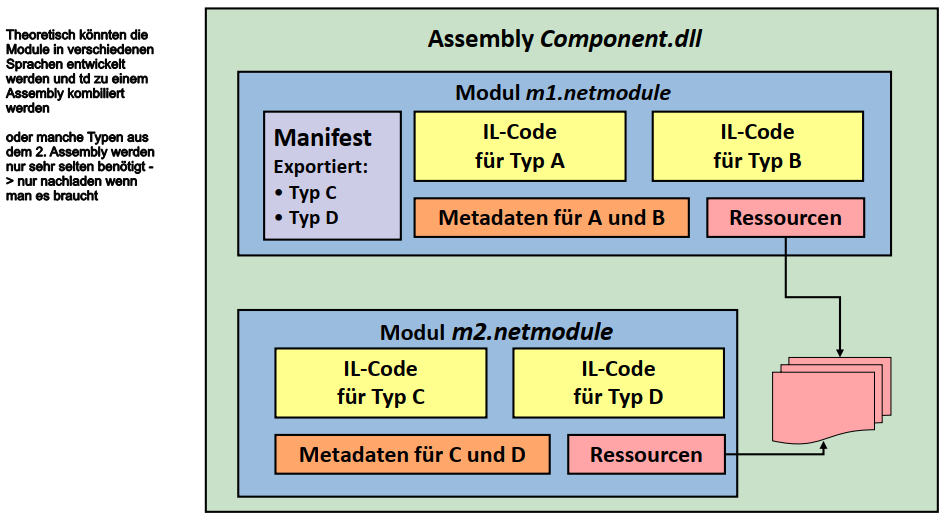
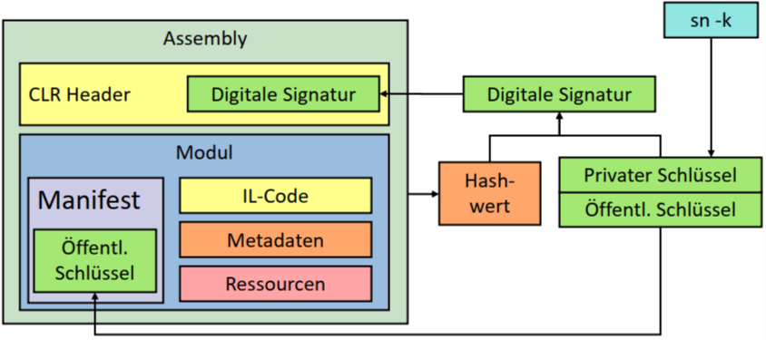
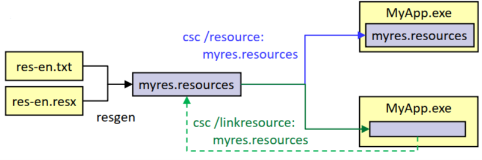
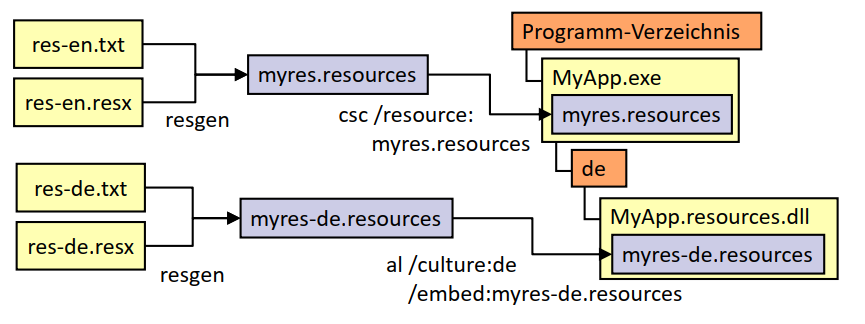
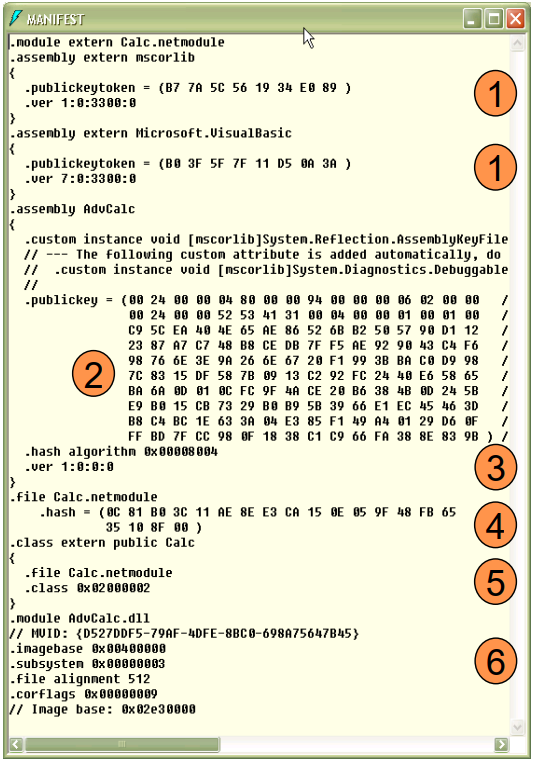
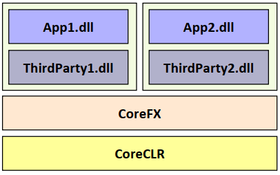

- [Was sind Assemblys?](#was-sind-assemblys)
- [Aufbau von Modulen](#aufbau-von-modulen)
- [Metadaten](#metadaten)
- [Aufbau von Assemblys](#aufbau-von-assemblys)
- [Private Assemblys](#private-assemblys)
- [Öffentliche (Shared) Assemblys](#%C3%B6ffentliche-shared-assemblys)
- [Auflösen von Assembly-Referenzen](#aufl%C3%B6sen-von-assembly-referenzen)
- [Digitales Signieren von Assemblys](#digitales-signieren-von-assemblys)
- [Ressourcen](#ressourcen)
- [Satelliten-Assemblys](#satelliten-assemblys)
- [Der Global Assembly Cache (GAC ) – Full Framework](#der-global-assembly-cache-gac--%E2%80%93-full-framework)
- [NET-Core: Framework-dependent Deployment](#net-core-framework-dependent-deployment)
- [.NET-Core: Self-contained Deployment](#net-core-self-contained-deployment)

## Was sind Assemblys?
- Eine Assembly fasst folgende Daten zu einer logischen Einheit zusammen:
  - Code: Ausführbarer IL-Code.
  - Metadaten: Selbstbeschreibung der Assembly.
  - Ressourcen: Strings, Icons, Bilder, …
- Ressourcen können in Assembly eingebettet sein oder auf externe Dateien verweisen.
- Code und Metadaten können auf mehrere Module verteilt sein.
- Assembly enthält ein Manifest: „Inhaltsverzeichnis“ der Assembly.

#### Kommentare
    * Assembly muss nicht in form von einer einzigen physischen Einheit vorkommen

## Aufbau von Modulen
- PE/COFF :
  - Standard Objekt-Format von Windows.
- CLR-Header:
  - Versionsnummer von benötigter CLR,
  - Einsprungspunkt,
  - Referenz auf Metadaten.
- Code:
  - üblicherweise CIL-Format,
  - kann aber auch „vorkompiliert“ sein. (dann Maschinencode)
- Metadaten
  - Beschreibung der definierten und Verweise auf referenzierte Typen.

## Metadaten
- Struktur der Metadaten
  - Definitionstabellen (pro Modul)
    - **TypeDef**: definierte Typen.
    - **Field**: Typ und Attribute (Zugriffsrechte, …) der Datenkomponenten.
    - **Method**: Signatur, Attribute, Parameterliste der Methoden, Verweis auf IL-Code.
  - Referenztabellen (pro Modul)
    - **AssemblyRef**: Verweis auf referenzierte Assemblys.
    - **ModuleRef** : Verweise auf „Nebenmodule“.
    - **TypeRef**: referenzierte Typen in „Nebenmodulen“ und anderen Assemblys.
  - Manifesttabellen (nur in Hauptmodul)
  
## Aufbau von Assemblys


## Private Assemblys
- Assemblys werden durch Kopieren installiert (keine Einträge in Registry).
- Private Assemblys werden von einer Anwendung benutzt.
- Installationsort von privaten Assemblys:
  - Selbes Verzeichnis wie Anwendung.
  - Unterverzeichnis mit Namen der Assembly.
  - Unterverzeichnis des Anwendungsverzeichnisses: Konfigurations-Datei Anwendung.exe.config enthält Suchpfad
  ```xml
  <configuration>
    <runtime>
      <assemblyBinding xmlns="urn:schemas-microsoft-com:asm.v1">
        <probing privatePath="bin;obj"/>
      </assemblyBinding>
    </runtime>
  </configuration>
  ```

#### Kommentare
    * Versionierung spielt keine Rolle bei priv. Assemblys
  
## Öffentliche (Shared) Assemblys
- Öffentlichen Assemblys wird ein Strong Name zugewiesen.
- Ein Strong Name besteht aus folgenden Teilen:
  - Name der Komponente
  - öffentlicher Schlüssel: Identifiziert Komponenten einer Firma.
  - Culture: Sprache/Land, z.B. neutral, „en-US“, „de-AT“.
  - Version: 
    - `<Hauptversion>.<Nebenversion>.<Buildnr.>.<lfd. Nr>`
  - Beispiel:
    - `"System, Version=1.0.3300.0, Culture=neutral, PublicKeyToken=b77a5c561934e089”`
- Öffentliche Assemblys werden im Global Assembly Cache (GAC) installiert (nur im
Full Framework).
- Jede Anwendung ist fest an bestimmte Assembly-Versionen gebunden.
- *Sidy-by-Side Execution*: CLR kann mehrere Versionen eines Assemblys verwalten und
bei Bedarf auch gleichzeitig laden.

#### Kommentare
    * Bei zwei versch. Versionen wird nicht automatisch die höhere verwendet
    * Mehrere Versionen sind aber möglich

## Auflösen von Assembly-Referenzen
- Im Manifest ist festgelegt, an welche Assembly-Versionen eine Anwendung gebunden ist.
- In der Konfigurations-Datei Anwendung.exe.config können bestehende Referenzen auf neue Version umgeleitet werden.
  ```xml
  <configuration>
    <runtime>
      <assemblyBinding xmlns=…>
        <dependentAssembly>
          <assemblyIdentity name="AdvCalc"
            publicKeyToken="ca940d6011fb6820"
            culture="neutral" />
          <bindingRedirect oldVersion="1.0.0.0-1.9.9.9"
            newVersion="2.0.0.0"/>
        </dependentAssembly>
      </assemblyBinding>
    </runtime>
  </configuration>
  ```
  
#### Kommentare
    * Es gibt ein Assembly redirect -> Version 2 statt 1 soll verwendet werden
        beim kompilieren festgelegte version wird überschrieben

## Digitales Signieren von Assemblys
- Shared Assemblys werden digital signiert.
- Ermöglicht Überprüfung, ob ein Assembly verändert wurde.
- Seit .NET 4.0 deaktiviert. Kann über Registry (maschinenweit) bzw. Konfigurationsdatei (für Assembly) aktiviert werden.   


#### Kommentar
    * Hashwert über assembly. mit privaten Schlüssel signiert. 
    * Mit öffentlichen Schlüssel kann Signatur überprüft werden. 
    * Aus performnace gründen standardmäßig deaktiviert

## Ressourcen
- Ressourcen können in einer Text- (Zeichenketten) oder einer XML-Datei (Zeichenketten, Bilder, …) definiert werden.
- Ressourcen müssen in Binärform übersetzt werden
  - resgen x.txt/x.resx -> x.resources
- Speicherort von Ressourcen:
  - In Assembly eingebettet.
  - Assembly enthält Link; Ressource ist im AssemblyVerzeichnis gespeichert.    


## Satelliten-Assemblys
- Satelliten-Assemblys enthalten sprachspezifische Ressourcen.
- Die Standardwerte der Ressourcen werden in der Haupt-Assembly gespeichert.
- Welche Satelliten-Assembly geladen wird, hängt von der Kultureinstellung (*UICulture*) ab.  



Das Assembly Manifest
- Das Manifest enthält
  - Referenzierte Assemblys (1)
  - Assembly-Identität:
    - Öffentlicher Schlüssel (2)
    - Versionsnummer (3)
  - Liste der Module, aus denen das Assembly besteht (4)
  - Exportierte Typen (5)
  - Assembly-Art (subsystem) (6)
    - Exe,
    - Windows-Exe,
    - Library.  
  

## Der Global Assembly Cache (GAC ) – Full Framework
- GAC ist der zentrale Speicherort für gemeinsam genutzte Assemblys.
- Im GAC können mehrere Versionen einer Komponente gespeichert werden.
- Im GAC werden IL-basierte und vorübersetzte Assemblys gespeichert.
- `%windir%\assembly` -> CLR 2.0, .NET Framework 2.0 – 3.5
- `%windir%\Microsoft.NET\assembly` -> CLR 4, .NET Framework 4.x
- *GAC_MSIL*: Architektur-unabhängige Assemblys.
- *GAC32/GAC64*: Assemblys für entsprechende Betriebssystem-architektur.

## NET-Core: Framework-dependent Deployment

- Es gibt eine geteilte (systemweite) Installation von .NET-Core
  - Deployment enthält Code der Komponente und Komponenten von Drittherstellern.
  - Windows:
    - C:\Program Files\dotnet\shared
  - Linux: 
    - /usr/share/dotnet/shared
- Vorteile
  - Code läuft auf verschiedenen .NET-Installationen und Plattformen
  - Effiziente Ausnutzung des (Festplatten-)Speicherplatzes
- Nachteile
  - Version, gegen die kompiliert wurde (oder höhere), muss auf Zielsystem installiert sein.
  - Verhalten einer CoreFX-Komponente könnte sich ändern.  
  
  

## .NET-Core: Self-contained Deployment
- Anwendung wird mit allen zum Betrieb notwendigen Komponenten ausgeliefert:
  - Komponente
  - Komponenten von Drittherstellern
  - Bibliotheken von .NET Core
  - Laufzeitumgebung
- Vorteile
  - Volle Kontrolle über verwendete Komponenten
  - Mehrere Laufzeitumgebungen können nebeneinander existieren
- Nachteile
  - Verschwendung von (Festplatten-)Speicherplatz  


#### Kommentare
    * Treeshaking -> was wird wirklich verwendet? Nur dieser Teil kommt ins deployment paket
