- [.NET Architektur](#net-architektur)
  - [.NET Framework 2.0 – 4.7 (Full Framework)](#net-framework-20-%E2%80%93-47-full-framework)
  - [arianten von .NET](#arianten-von-net)
  - [NET Core](#net-core)
  - [Die .Net-Plattform](#die-net-plattform)
  - [.NET Framework und die UWP (Windows 10)](#net-framework-und-die-uwp-windows-10)
  - [.Net Standard](#net-standard)
  - [NET Framework Compatibility Mode](#net-framework-compatibility-mode)
  - [Common Language Runtime (CLR)](#common-language-runtime-clr)
  - [Unterschiede zur Java Virtual Machine](#unterschiede-zur-java-virtual-machine)
  - [Komponenten der CLR](#komponenten-der-clr)
  - [Common Type System (CTS)](#common-type-system-cts)
  - [Common Type System – Beispiel](#common-type-system-%E2%80%93-beispiel)
  - [Common Language Specification (CLS)](#common-language-specification-cls)
  - [Intermediate Language (IL)](#intermediate-language-il)
  - [ILDASM](#ildasm)
  - [Virtual Execution System (VES)](#virtual-execution-system-ves)
  - [Aufgaben des VES](#aufgaben-des-ves)
  - [Übersetzung und Ausführung](#%C3%BCbersetzung-und-ausf%C3%BChrung)
  - [Just in Time Compiler (JIT)](#just-in-time-compiler-jit)
  - [.NET Native (.NET Core)](#net-native-net-core)
  - [Assemblys](#assemblys)
  - [Managed/Unmanged Code/Types](#managedunmanged-codetypes)
  - [Managed/Unmanaged Code](#managedunmanaged-code)
  - [Managed/Unmanaged Types](#managedunmanaged-types)

# .NET Architektur

## .NET Framework 2.0 – 4.7 (Full Framework)

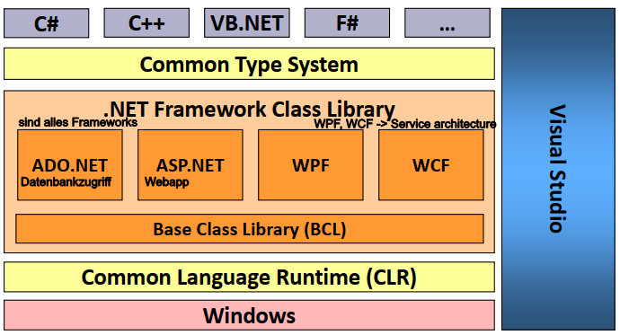

## arianten von .NET
- Das .NET-Framework steht ausschließlich für Windows zur Verfügung.
- .NET Core
  - Open-Source-Projekt unter Führung von Microsoft
  - CoreFX enthält Basisfunktionalität der .NET-Framework-Bibliothek
  - CoreCLR ist die Laufzeitumgebung
  - Unterstützte Plattformen: Linux, Mac OS X, Windows
- Mono
  - Open-Source-Projekt,
  - Laufzeitumgebung zu .NET kompatibel,
  - stellt große Teile der Funktionalität des .NET-Framework zur Verfügung
  - Unterstütze Plattformen: Linux, Mac OS X, Windows
- Die Xamarin-Plattform
  - basiert auf Mono und
  - ermöglicht die Entwicklung von nativen mobilen Anwendungen für iOS, Android und Windows Phone.
  - Xamarin wurde Anfang 2016 von Microsoft übernommen

## NET Core
- Motivation
  - Verschiedene Varianten des .NET-Frameworks für Desktop, Store Apps, Windows Phone.
  - Entwicklung Framework-übergreifender Anwendung ist schwierig ( Portable Class Libraries).
  - Maschinenweite Installation: Verschiedene Versionen beeinflussen sich gegenseitig.
- Eigenschaften
  - Plattformübergreifende Implementierung
  - Gemeinsame Codebasis für unterschiedliche Anwendungsgebiete (Windows Apps, WebAnwendungen)
  - Komponenten werden über Nuget bereitgestellt
  - Häufigere Releasezyklen (4 Snapshots pro Jahr), einzelne Assemblys können ausgetauscht werden.
  - Anwendung und Assemblys können gemeinsam deployt werden.

## Die .Net-Plattform

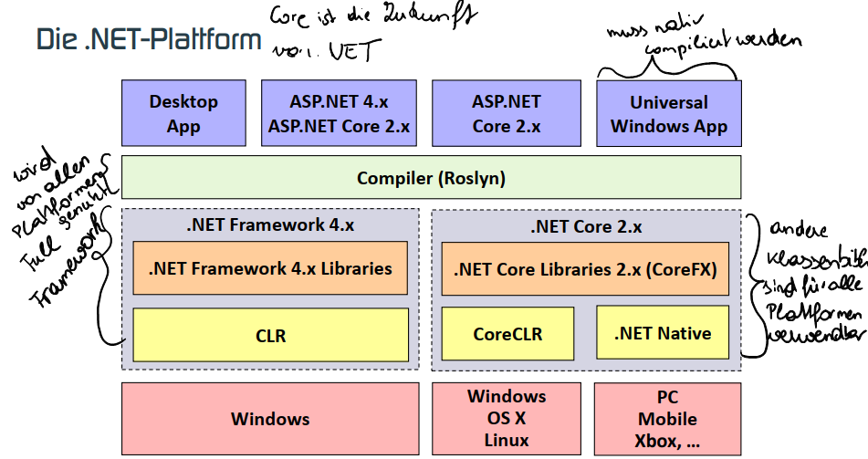

## .NET Framework und die UWP (Windows 10)

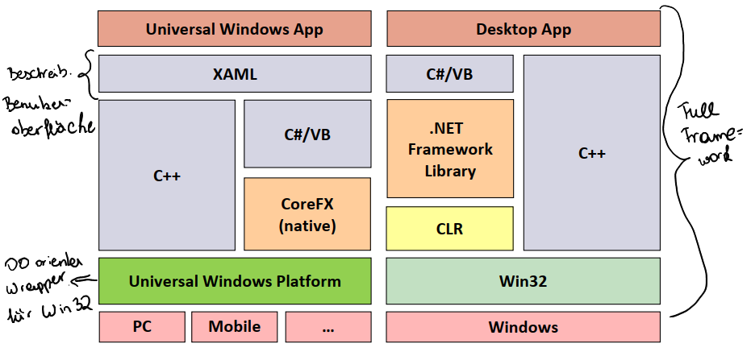

## .Net Standard

  - Es existieren viele verschiedene Varianten von .NET.
  - Portieren von Code ist aufwändig, da sich auch die Basis-Bibliotheken unterscheiden.
  - Portable Class Libraries (PCL) sind unbefriedigend, da Entwickler auf größte gemeinsame Funktionalität eingeschränkt ist.

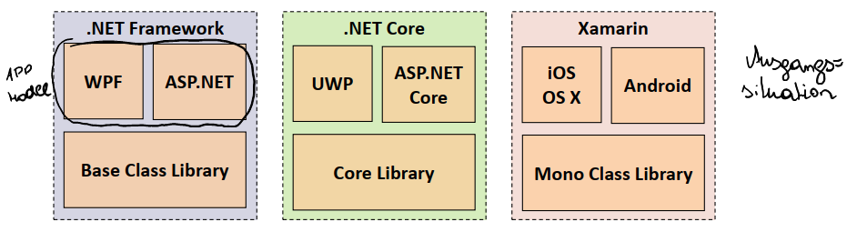

- Die .NET-Standard-Library ist eine Spezifikation von .NET-APIs, die von mehreren
Laufzeitumgebungen unterstützt werden.

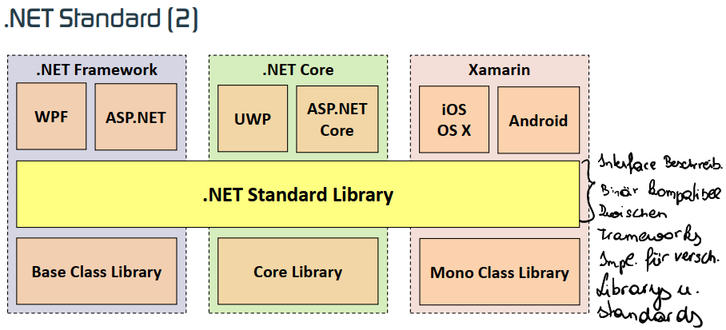
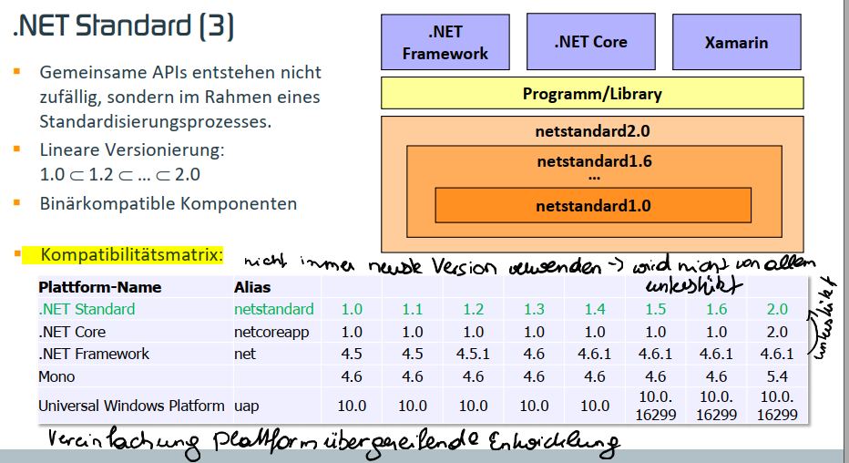

## NET Framework Compatibility Mode

- Rückwärtskompatibilität
  - Anwendungen, die mit Framework x entwickelt wurden, funktionieren mit Laufzeitumgebung von Framework y (y > x).
- Full Framework
  - Anwendung läuft auf jenem Framework, mit dem es entwickelt wurde.
  - Mehrere Frameworks können parallel installiert sein („side-by-side execution“)
  - Anwendungen für .NET-Framework ≥ 4.5 sind rückwärtskompatibel.
- .NET Standard 2.0 -> **NET Framework Compatibility Mode**
  - Beliebige *binäre* .NET-Komponenten können referenziert werden.
  - Warnung, dass Komponente möglicherweise nicht kompatibel ist.
  - Viele NuGet-Komponenten können unverändert verwendet werden.
  - Komponenten, die nicht unterstützte Bibliotheken verwenden (z. B. WPF) verursachen einen Laufzeitfehler.

#### Kommentar
    * alle DLLs können somit unter Linux... verwendet werden auch wenn alle für Windows entwickelt wurden

## Common Language Runtime (CLR)

- Jedes Framework enthält eine Implementierung der Laufzeitumgebung:
  - Full Framework -> CLR
  - .NET Core -> CoreCLR
- CLR führt .NET-Anwendungen aus:
  - führt Sicherheitsüberprüfungen aus.
  - übernimmt Speicherverwaltung und Fehlerbehandlung.
  - lädt dynamisch Komponenten (richtige Version).
- CLR stellt Verbindung zum Betriebssystem her.
- CLR versteht eine Zwischensprache , in die alle .NET-Programme übersetzt werden -> IL.
- Die Typen der Programme müssen sich an gewisse Spielregeln halten CTS.
- Zwischensprache und Informationen über Programme werden in Assemblys verpackt.

- CLR ist eine virtuelle Maschine = mit Software realisierter Prozessor.
- Vorteile:
  - `Plattformunabhängigkeit`: CLR kann auf andere reale Maschinen portiert werden.
  - `Sprachunabhängigkeit`: Compiler übersetzen in Sprache der CLR.
  - `Kompakter Code`.
  - `Optimierter Code`: CLR kann Spezifika der Zielmaschine berücksichtigen.
- CLR ist eine Stackmachine.
  - Einfache Codegenerierung

## Unterschiede zur Java Virtual Machine

- Kompilation/Interpretation
  - Bytecode wird von JVM interpretiert (Bytecode ist darauf ausgelegt).
  - Hotspot-JVMs übersetzen Teile des Bytecodes, wenn dieser häufig aufgerufen wird.
  - CLR übersetzt Zwischencode immer -> JIT-Compiler.
- Unterstützung verschiedener Sprachen und –Paradigmen (OO, prozedurale,
funktionale Sprachen)
- Selbstdefinierte Wertetype (Strukturen)
- Aufruf per Referenz
- Typsichere Methodenzeiger (Delegates)

#### Kommentar
    * JVM: Hotspot compiler übersetzt Hotspots in nativen Code

## Komponenten der CLR

- CTS: Common Type System
- CLS: Common Language Specification (damit Typen Sprachübergreifend)
- CIL: Common Intermediate Language
- JIT: Just in Time Compiler
- VES: Virtual Execution System

## Common Type System (CTS)

- CTS legt fest, wie Typen im Speicher repräsentiert werden:
  - Objektorientiertes Programmiermodell,
  - ermöglicht sprachübergreifende Verwendung von Typen.

  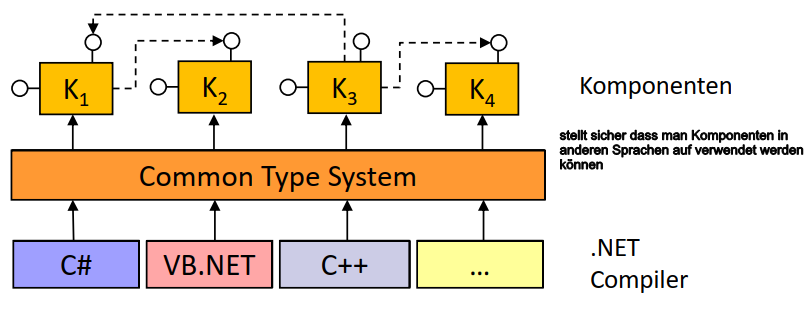

## Common Type System – Beispiel
- Über references können andere Sprachen hinzugefügt werden

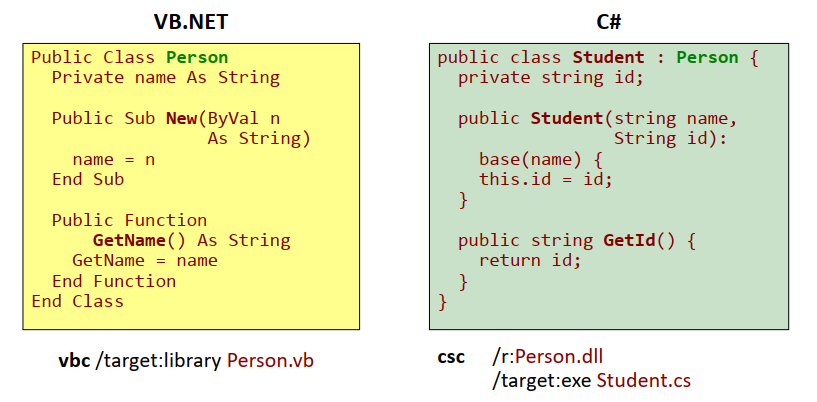

## Common Language Specification (CLS)

- Programmierrichtlinien für Entwickler, die garantieren, dass Klassen sprachübergreifend eingesetzt werden können:
  - Als Parametertypen bei öffentlichen Methoden darf nur eine Untermenge der CTS-Standardtypen verwendet werden.
  - Groß-/Kleinschreibung nicht ausnutzen.
  - Verschiedene Namen für Methoden und Felder.
- Regeln, die Compilerbauer einhalten müssen:
  - Vorschriften, gewisse Metadaten zu generieren.
- Compiler kann CLS-Konformität überprüfen.

## Intermediate Language (IL)

- Zwischencode, der von `allen .NET-Compilern erzeugt wird`.
- Zwischencode wird von CLR ausgeführt.
- IL entspricht dem Bytecode von Java.
- C++-Compiler kann IL- oder nativen Code generieren.
- Andere Bezeichnungen:
  - CIL: Common Intermediate Language (ECMA, ISO).
  - MSIL: Microsoft Intermediate Language.

## ILDASM
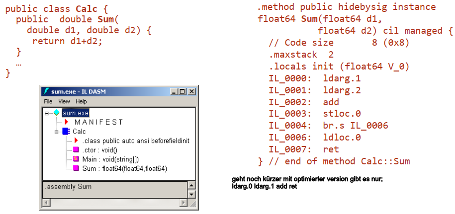

## Virtual Execution System (VES)

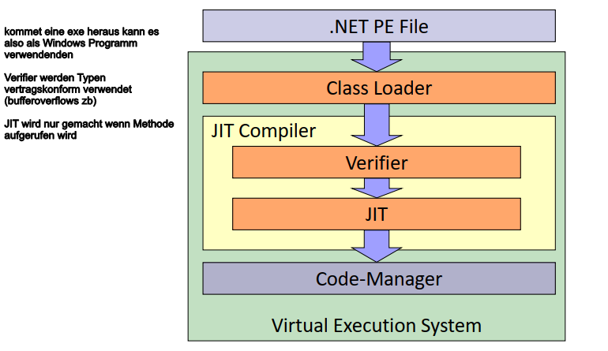

## Aufgaben des VES

- Class-Loader
  - Suchen der Assemblys (Arbeitsverzeichnis oder GAC).
  - Vorbereitung zur Ausführung: Einfügen von Stubs für JIT-Kompilierung.
- Verifier:
  - Überprüfung der Typsicherheit
    - Code darf nur auf berechtige Bereiche zugreifen.
    - Objekte werden nur über deren Schnittstelle angesprochen.
- Für typsichere Assemblys kann garantiert werden, dass sie sich nicht gegenseitig beeinflussen (-> *Application Domains*)
- Kategorien von IL-Code
  - Ungültiger Code
    - Code enthält faschen IL-Code.
  - Gültiger Code
    - Code kann nicht typsichere Anweisungen (kann durch Zeigerarithmetik entstehen) enthalten.
  - Typsicherer Code
    - Objekte halten sich an Schnittstellen.
  - Verifizierbarer Code
    - Typsicherheit kann bewiesen werden.
    - Nicht verifizierbarer Code kann aber typsicher sein.
  - Manche Compiler garantieren die Erzeugung von typsicherem Code (C#, nicht C++).
- JIT: Übersetzung von IL- in nativen Code.
- Code-Manager: Ausführung des nativen Codes
  - Garbage Collection von „Managed Types“,
  - Ausnahmebehandlung,
  - Security:
    - Code-Access Security: Berechtigungen sind von der „Herkunft“ des Codes abhängig.
    - Große Veränderungen in .NET 4.0
  - Debugging und Profiling,
  - Platform Invoke (P/Invoke):
    - Aufruf von Win32 API-Funktionen

## Übersetzung und Ausführung
  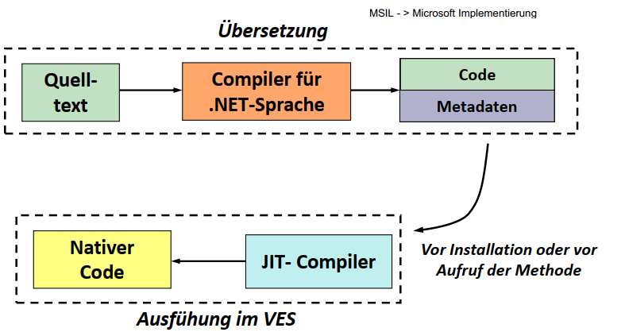

## Just in Time Compiler (JIT)

- IL-Code wird immer kompiliert.
- Code-Generierung bei erstem Methodenaufruf.

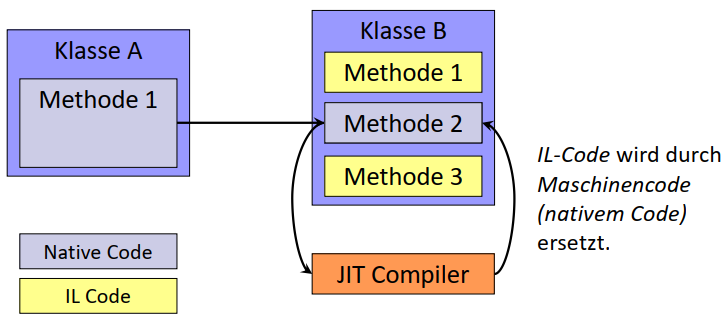

#### Kommentar
    * Bei Aufruf einer Methode also zb Methode 1 ruft Methode 2 auf, dann wird automatisch der JIT Compiler aufgerufen
    * Bei jedem weiteren Aufruf wird der native Code verwendet nur bei jenen die Aufgerufen werden 
      wird nicht gespeichert, bei Neustart gibt es wieder eine erste Verwendung der Methode, also wird der native Code nie gespeichert

## .NET Native (.NET Core)

- Der JIT-Compiler übersetzt IL-Code zur Laufzeit des Programms -> Just In Time.
- Mit .NET Native kann IL-Code bereits zur Übersetzungszeit des Programms in nativen Code kompiliert werden.
- .NET Native nutzt das Compiler-Backend von C++.
- Vorteile
  - Schnellere Ausführungszeiten
  - Schnellerer Programmstart
  - Geringerer Hauptspeicherbedarf
  - Kleinere Deployment-Pakete
- Produktiv wird .NET Native dzt. nur für UniversalWindows-Plattform-Apps (Windows 10) genutzt.

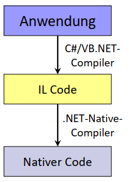

## Assemblys
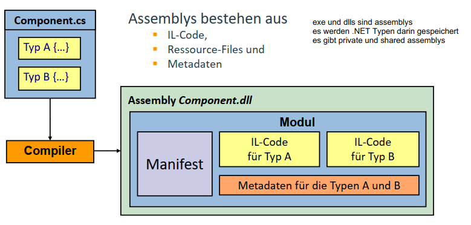

## Managed/Unmanged Code/Types

- Managed Code wird von der CLR ausgeführt.
- Unmanaged Code wird direkt vom Prozessor ausgeführt.
- Alle .NET-Sprachen, außer C++, werden in Managed Code übersetzt.
- C++-Code kann entweder in nativen oder Managed Code übersetzt werden.
- Managed Code darf nicht mit Managed Types verwechselt werden. Nur Managed Types werden vom Garbage Collector automatisch freigegeben.
- Nur Managed Types können über Assembly-Grenzen hinweg verwendet werden.

## Managed/Unmanaged Code
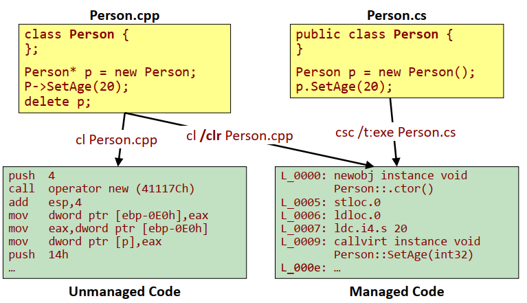

## Managed/Unmanaged Types
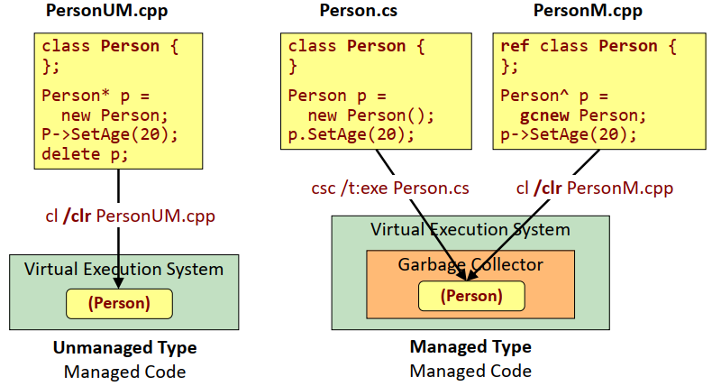