- [.NET Fortgeschrittene Konzepte von C\](#net-fortgeschrittene-konzepte-von-c)
  - [Abgrenzung C# – Java/C++](#abgrenzung-c-%E2%80%93-javac)
  - [Bezeichner und Namenskonventionen](#bezeichner-und-namenskonventionen)
  - [Deklarationen](#deklarationen)
  - [Anweisungen](#anweisungen)
  - [Operatoren](#operatoren)
  - [Präprozessor](#pr%C3%A4prozessor)
  - [Typen](#typen)
  - [Werte- und Referenztypen](#werte--und-referenztypen)
  - [Einfache Typen](#einfache-typen)
  - [Boxing und Unboxing](#boxing-und-unboxing)
  - [Nullable Types](#nullable-types)
  - [Klassen](#klassen)
  - [Sichtbarkeitsattribute](#sichtbarkeitsattribute)
  - [Konstruktoren](#konstruktoren)
  - [Destruktor](#destruktor)
  - [Verwendung von IDisposable](#verwendung-von-idisposable)
  - [Felder und Konstanten](#felder-und-konstanten)
  - [Methoden](#methoden)
  - [Arten von Parametern](#arten-von-parametern)
  - [Variable Anzahl von Parametern](#variable-anzahl-von-parametern)
  - [Properties](#properties)
  - [Indexers](#indexers)
  - [Überladen von Operatoren](#%C3%BCberladen-von-operatoren)
  - [Vererbung](#vererbung)
  - [Überschreiben von Methoden: override](#%C3%BCberschreiben-von-methoden-override)
  - [Überschreiben von Methoden: new](#%C3%BCberschreiben-von-methoden-new)
  - [Gegenüberstellung von new und override](#gegen%C3%BCberstellung-von-new-und-override)
  - [Anwendung von new](#anwendung-von-new)
  - [Abstrakte Klassen und Interfaces](#abstrakte-klassen-und-interfaces)
  - [Explizite Implementierung von Interface-Methoden](#explizite-implementierung-von-interface-methoden)
  - [Ausnahmen (Exceptions)](#ausnahmen-exceptions)
  - [Arrays](#arrays)

# .NET Fortgeschrittene Konzepte von C\#

## Abgrenzung C# – Java/C++
- Merkmale von Java
  - OOP: Vererbung, dynamische Bindung, Interfaces
  - Metainformation,
  - Ausnahmebehandlung,
  - statische und starke Typisierung,
  - Garbage Collection.
- Merkmale von C++
  - Überladen von Operatoren,
  - Möglichkeit, Pointer zu verwenden (unsafe code).
- Neue Eigenschaften
  - Attribute: Benutzerdefinierte Metainformation,
  - Aufruf per Referenz (Übergangs- und Ausgangsparameter)
  - Wertetypen (Strukturen) -> gibt es in JAVA nach wie vor nicht

## Bezeichner und Namenskonventionen
- Bezeichner
  - Kombination aus Zeichen, Ziffern, _, @
  - Unicode-Zeichen: `class Téléphone { … }`
  - Groß-/Kleinschreibung ist relevant.
- Namenskonventionen
  - Pascal-Notation für
    - Methoden: `CopyTo`
    - Properties: `ToString`
    - Typnamen: `TimeZone`
    - Öffentl. `Felder: Empty`
    - Interfaces: `ICloneable`
    - Enums: `Sat, Sun, Mon`
  - Camel-Notation für
    - Variablen: `myVar, i`
    - private Felder: `wordCount`


## Deklarationen
- Gültigkeitsbereiche
  - Namenräume
  - Klasse/Struktur, Interface
  - Enumerationen
  - Blöcke
- Deklarationsreihenfolge ist nicht relevant.
- Lokale Variablen müssen vor Verwendung deklariert werden.  
  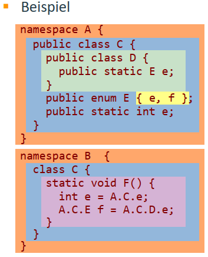


## Anweisungen
- if-, while-, do-while-Anweisung: wie in C++
- switch-Anweisung
  - Muss mit mit break abgeschlossen werden.
  - switch-Ausdruck kann numerischer Typ, Enumeration oder String sein.
  - Mit goto kann zu anderem Label gesprungen werden.
- foreach-Anweisung
  - Iteration durch Collections, die IEnumerable implementieren.
  - Beispiel:
    ```csharp
    string[] names = {"Joe", "Bill", "James"};
    foreach (string n in names)
        Console.WriteLine(n);
    ```

## Operatoren
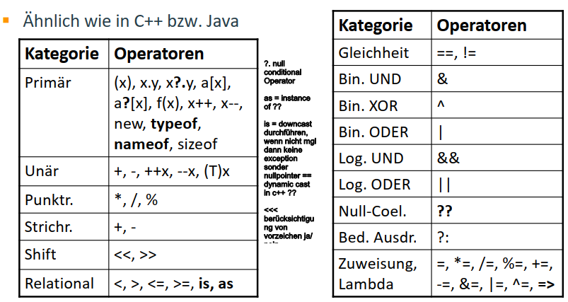

## Präprozessor
- Unterstützte Präprozessor-Direktiven:
  - #define, #undef: Symbole können nur definiert werden, ihnen kann aber kein Wert zugewiesen werden.
  - #if, #elif, #else, #endif
    ```csharp
    #define DEBUG
    #if DEBUG
    // Code für Debug-Version
    #else
    // Code für Release-Version
    #endif
    ```
  - `#region, #endregion`: Kennzeichnung von Code-Blöcken für Editoren, z. B.
automatisch generierter Code.
- Benutzerdefinierte Makros sind nicht möglich.

## Typen 
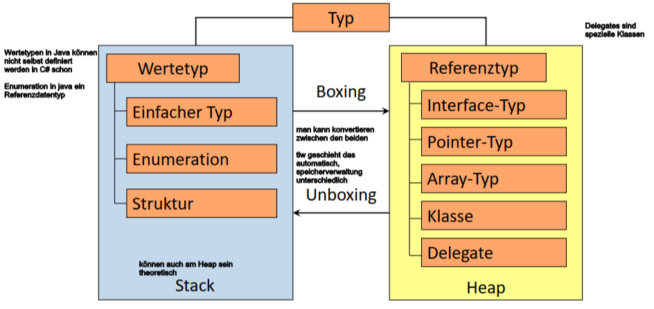

## Werte- und Referenztypen
- Wertetypen (value types)
  - Werden am Stack bzw. im umgebenden Objekt allokiert.
  - Defaultwert ist 0, '\0' bzw. false.
  - Bei Zuweisung wird Wert kopiert.
  - Im Gegensatz zu Java können Wertetypen auch selbst definiert werden (enum und struct).
- Referenztypen (reference types)
  - Werden am Heap allokiert.
  - Defaultwert ist null.
  - Bei Zuweisung wird Referenz, aber nicht das referenzierte Objekt kopiert.

#### Kommentar
    * gibt beim kopieren unterschiede, 
        achtung bei value übergabe bei werten wird Kopie übergeben 
        -> Änderungen bringen also nichts, bei Referenz schon!

## Einfache Typen

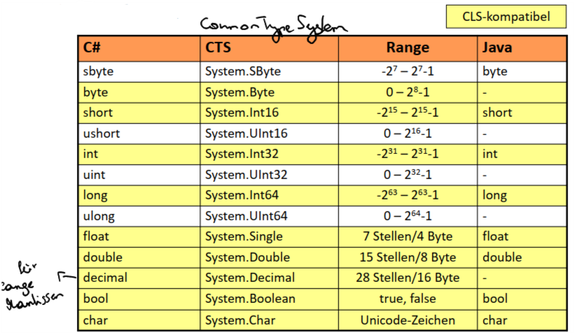

## Enumerationen
- Deklaration und Verwendung wie in C++
- Syntax: [modifiers] enum identifier [:base-type]  {enumerator-list};
- Enumerationskonstanten müssen qualifiziert werden
- Beispiel:
```csharp
enum Day:byte {Sun = 1, Mon, Tue, Wed, Thu, Fri, Sat };
Day d = Day.Sat;
Console.WriteLine("day = {0}", d);
//Output day = Sat
```

## Strukturen
- Benutzer-definierbarer Typ, der sich wie einfacher Typ verhält:
  - Werte werden am Stack/im umgebenden Objekt angelegt,
  - Lebensdauer ist auf Lebensdauer des umgebendenen Blocks beschränkt,
  - bei Zuweisung wird Wert kopiert (nicht Referenz).
- Strukturen können nicht erben oder vererben.
- Strukturen können Interfaces implementieren.
- Felder dürfen bei Deklaration nicht initialisiert werden.
- Default-Konstruktor darf nicht definiert werden.
- Vorteile
   - speichersparend,
   - müssen nicht vom GC verwaltet werden.
   
### Strukturen Beispiele
#### Definition
```csharp
struct Color {
  public byte r, g, b:
  public Color(byte r, byte g, byte b) {
    this.r = r; this.g = g; this.b = b;
  }
}
```
- kann Interface implementieren
- kann davon auch keinen Referenzdatentyp ableiten

#### Verwendung
```csharp
// Initialisierung mit Default-Werten(0)
Color black = new Color();
Color yellow = new Color(255, 255, 0);
yellow.r = 200;
```
- mit new nicht automatisch Speicherallokierung.
- new in Funktion, dann Referenzspeicherung

## Boxing und Unboxing

- *Boxing*: **Wertetyp -> Referenztyp**
- Boxing wird implizit durchgeführt, wenn ein Objekt benötigt wird, aber
ein Wert vorhanden ist.
- Beispiel:
    ```csharp
    Console.WriteLine("i={0} ", i); // viel speicher overhead
    string s = 123.ToString();
    ```
- *Unboxing*: **Referenztyp -> Wertetyp**
- Unboxing muss explizit mit Cast durchgeführt werden.
- Beispiel:
    ```csharp
    int i = 123;
    object o = i; // boxing
    int j = (int)o; // unboxing
    ```

## Nullable Types
- Nullable Types sind Wertetypen, die als Wert auch null annehmen können.
- Syntax: `T? oder Nullable<T>` (T beliebiger Wertetyp)
    ```csharp
        struct Nullable<T> {
        public Nullable(T value);
        public bool HasValue { get; }
        public T Value { get; }
    }
    ```
- Beispiel:
    ```csharp
        int? i1 = 10;
        int? i2 = null; // implicit conversion
        int j1 = i1.Value; // j1 == 10
        int j2 = (int)i1; // j2 == 10
        int j3 = i2 ?? 0; // j3 == 0
    ```
#### Kommentar
    * nullable funktioniert auch mit strukturen

## Klassen
- Inhalt einer Klasse:
  - Konstanten
  - Felder
  - Konstruktoren/Destruktor
  - Methoden
  - Operatoren
  - Properties
  - Indexer
  - Events
  - statischer Konstruktor
  - (innere) Typen
    ```csharp
    class Rational {
        const double Eps = 0.001; // implizit auch statisch
        int a, b;
        public Rational(int a, int b) { … }
        public void Add(Rational c) { … }
        public static Rational
            operator+(Rational r1, Rational r2) {…}

        public int Denom {
            get { return b; }
            set { b = value; }
        }
    }
    ```

## Sichtbarkeitsattribute

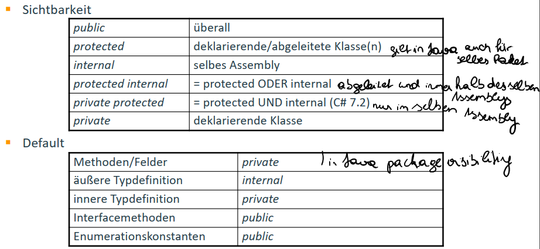

## Konstruktoren
- Konstruktoren dürfen überladen werden.
- Konstruktor der Basisklasse wird im Kopf mit base aufgerufen.
- *Anderer* Konstruktor kann im Kopf mit this aufgerufen werden.
- Generierter Default-Konstruktor initialisiert alle Felder mit Standardwerten.
    ```csharp
    public class Ellipse {
        int a, b;
        public Ellipse(int a, int b) {
            this.a = a;
            this.b = b;
        }
        public Ellipse(int r) : this(r, r) {}
    }

    public class ColoredEllipse: Ellipse {
        Color color = Color.Black;
        public ColoredEllipse(int a, int b, Color c) : base(a, b) {
            color = c;
        }
    }
    ```
## Destruktor

- Destruktor/Finalizer wird aufgerufen, unmittelbar bevor GC ein Objekt freigibt.
- Dient zur Ressourcenfreigabe (Schließen von Files, ...)
- Es ist nicht definiert, wann Speicherbereinigung durchgeführt und damit der Destruktor/Finalizer aufgerufen wird.
- Destruktor der Basisklasse wird automatisch aufgerufen (im Gegensatz zu Java).
    ```csharp
    public class A {
        ~A() { // Sichtbarkeitsattribut darf
            // nicht angegeben werden.
            // Ressourcenfreigabe
        }
    }
    ```
#### Kommentar
    * nichts anderes als ein Finalizer, wenn garbagecollector objekt 
       freigeben will wird der Finalizer aufgerufen
    * Finalizer der Base class muss explizit aufgerufen werden

## Verwendung von IDisposable
- Wenn explizite Ressourcenfreigabe möglich sein soll, kann Klasse IDisposable implementieren.
- Verwender kann *Dispose()* explizit aufrufen.    
    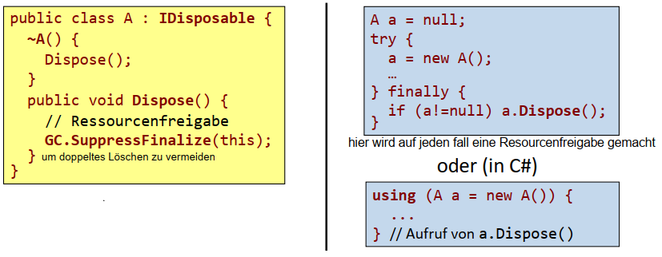

## Felder und Konstanten
- Objekt-Felder
  - Beispiel: `int size = 0;`
- Statische Felder
  - Beispiel: `static Color Red = new Color(255,0,0);`
- Konstanten
  - Wert muss von Compiler berechnet werden können.
  - Beispiel: `const int arrLen = byte.MaxValue/2 + 1;`
- Schreibgeschützte Felder (readonly)
  - Darf nur in Deklaration oder Konstruktor initialisiert werden.
  - Beispiel: 
    ```csharp
    readonly Pen defaultPen; // readonly is only initialized in constructor
    public Drawing(Color c) {
        defaultPen = new Pen(c);
    ```
## Methoden
- Objektmethoden
  - Aufruf: *object.Method()*
  - Überladen wie in Java möglich.
- Klassenmethoden (statische Methoden)
  - Aufruf: *Class.Method()*
    ```csharp
    class Date {
        enum Day { Sun, Mon, Thu, ... }
        static Day FirstDayInWeek() {
            return Day.Mon;
        }
        public static void Main() {
            Day d = Date.FirstDayInWeek();
            Date date = new Date();
            date.FirstDayInWeek(); // Syntaxfehler!
        }
    }
    ```
## Arten von Parametern
- Eingangsparameter („*call by value*“)
  - Definition: `int Twice(int m) { return 2*m; }`
  - Aufruf:     `m=5; n = Twice(m); // m==5, n==10`
- Übergangsparameter (ref-Parameter)
  - ref-Parameter muss initialisiert sein.
  - Definition: `void Twice(ref int n) { n *= 2; }`
  - Aufruf:     `n=5; Twice(ref n); // n==10`
- Ausgangsparameter (out-Parameter)
  - out-Parameter muss nicht initialisiert sein.
  - Definition: `void Twice(int m, out int n) { n = 2*m; }`
  - Aufruf:     `m=5; Twice(m, out n); // m==5, n==10`

## Variable Anzahl von Parametern
- Definition einer Methode, die eine variable Anzahl von Parametern verarbeiten kann:
    ```csharp
    double Sum(params double[] values) {
        double sum = 0;
        foreach (double val in values) sum += val;
            return sum;
    }
    ```
- Aufruf
  - Variable Anzahl von Parametern
    ```csharp
    double sum = Sum(1,2,3,4); // sum==10, 1,2,3,4 automatische Konvertierung als Array
    ```
  - Parameterübergabe in Form eines Arrays
    ```csharp
    double[] arr = {1,2,3,4};
    double sum = Sum(arr); // sum==10
    ```

## Properties
- Zusammenfassung einer Getter- und einer Setter-Methoden zu einer Einheit.
- Definition einer Property:
    ```csharp
    class Circle {
        private double rad = 0.0;
        public double Radius {      // Property Radius
            get { return rad; }     // Getter-Methode
            set { rad = value; }    // Setter-Methode
        }
    }
    ```
- Verwendung einer Property:
    ```csharp
    Circle c = new Circle();
    c.Radius = 5.0; // Ausführung der Setter-Methode
    double r = c.Radius; // Ausführung der Getter-Methode
    ```
- Uniform Access Principle
  - Zugriff auf Datenkomponente oder auf eine Property unterscheiden sich nicht.

## Indexers
- Zugriff auf ein Element einer Collection mit dem []-Opererator.
- Definition eines Indexers:
    ```csharp
    class BirthdayList {
        public DateTime this[string name] {
            get { return GetBirthDay(name); }
            set { SetBirthDay(name, value); }
        }
    }
    ```
- Verwendung eines Indexers:
    ```csharp
    BirthdayList bList = new BirthdayList();
    bList["Huber"] = new DateTime(1970, 12, 24);
    Console.Write("Geb.Tag: {0}", bList["Huber"]);
    ```

## Überladen von Operatoren
- Überladen von arithmetischen, Vergleichs- und Bitoperatoren
    ```csharp
    class Rational {
        public static Rational operator+(Rational r1, Rational r2){
            return new Rational(r1.a*r2.b + r2.a*r1.b, r1.b*r2.b);
        }
    }
    ```

- Überladen von Konversionsoperatoren
    ```csharp
    class Rational {
        public static implicit operator double(Rational r) {
            return (double)r.a/r.b;
        }
        public static explicit operator long(Rational r) {
            return r.a/r.b;
        }
    }
    ```

- Verwendung überladener Operatoren
    ```csharp
    Rational r = new Rational(1,2) + new Rational(1,4);
    double d = r; // implizite Konvertierung
    long l = (long)r; // explizite Konvertierung
    ```

## Vererbung
- Nur Einfachvererbung ist möglich.
- Wird keine Basisklasse angegeben, wird automatisch von Object abgeleitet.
- Öffentliche und geschützte Methoden werden vererbt:    
    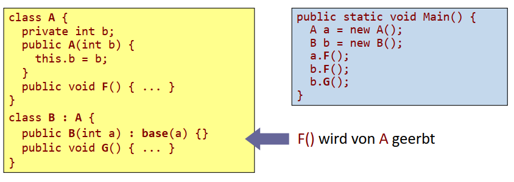

## Überschreiben von Methoden: override
- Dynamisch zu bindende Methoden müssen als virtual deklariert werden.
- Sollen virtuelle Methoden überschrieben werden, müssen sie als override oder new deklariert werden.  
    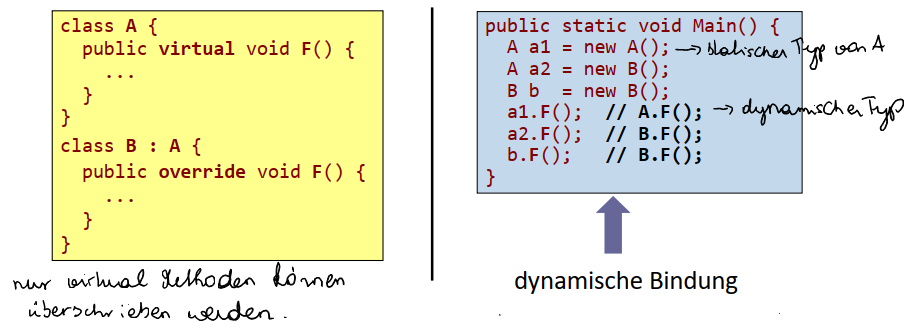

## Überschreiben von Methoden: new
- Eine mit new deklarierte Methode ist unabhängig von der gleichnamigen Methode (mit gleicher Signatur) der Basisklasse.
- Referenzen mit dem statischen Typ der Basisklasse haben keinen Zugang mehr zur mit new deklarierten Methode.  
    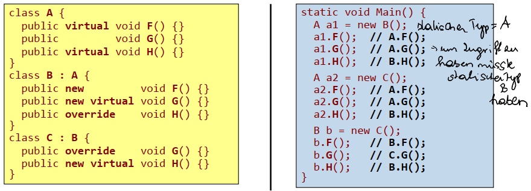

## Gegenüberstellung von new und override
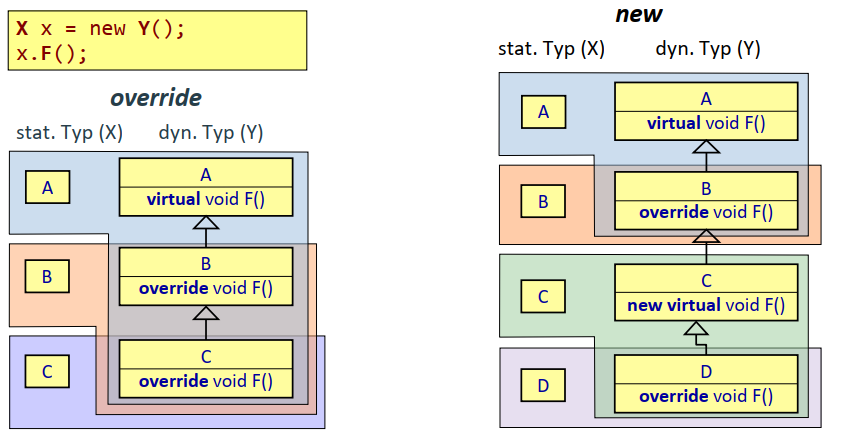

## Anwendung von new
- Austausch von Basisklassen soll sich nicht auf Funktionalität von abgeleiteten Klassen auswirken (*Fragile Base Class Problem*).  
    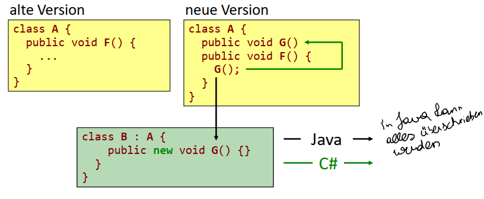

## Abstrakte Klassen und Interfaces
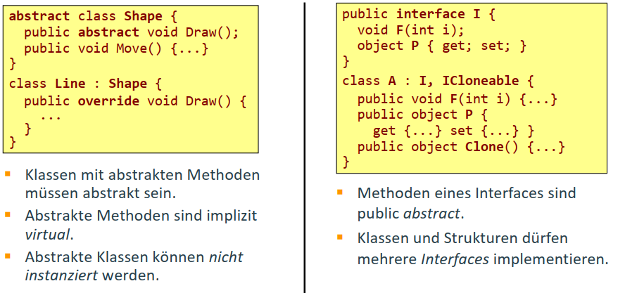

## Explizite Implementierung von Interface-Methoden
- Interface-Methoden können durch Qualifikation mit dem Interface-Namen explizit implementiert werden.
- Methode darf weder public noch private deklariert werden.
- Statischer Typ einer Referenz bestimmt, welche Methode sichtbar ist.   
    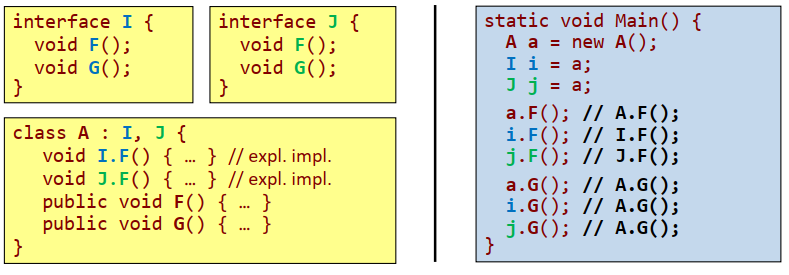

## Ausnahmen (Exceptions)
- Ausnahmen werden nicht im Methodenkopf deklariert.
- Ausnahmen müssen nicht behandelt werden.
    ```csharp
    StreamReader sr = null;
    try {
        sr = new StreamReader(
        new FileStream("data.txt", FileMode.Open));
        sr.ReadLine();
    }
    catch(FileNotFoundException e) {…}
    catch(IOException e) // Ausnahmenfilter
        when(e.InnerException is ArgumentException) {…}
    catch(IOException e) {…}
    catch { } // Behandlung aller anderen Exceptions
    finally { // wird immer durchlaufen
        if (sr != null) sr.Close();
    }
    ```

## Arrays
- Eindimensionale Arrays
  - Deklaration: `int[] arr;`
  - Initialisierung: `arr = new int[] {1,2,3};` oder `arr = {1,2,3};`
- Mehrdimensionale Arrays
  - „Jagged“ Arrays
    ```csharp
    int[][] m = new int[2][];
    m[0] = new int[]{1,2};
    m[1] = new int[]{4,5,6};
    m[1][2] = 9;
    ```
- Rechteckige Arrays
    ```csharp
    int[,] m = {{1,2,3},{4,5,6}};
    m[1,2] = 9;
    ```  
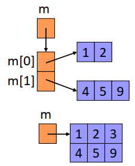
