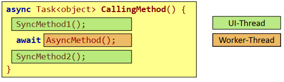
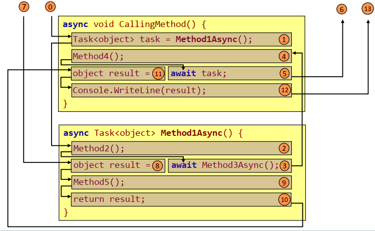

- [Spracherweiterungen C#](#spracherweiterungen-c)
  - [Neuerungen C# 3.0](#neuerungen-c-30)
    - [Objektinitialisierer(Object initializer)](#objektinitialisiererobject-initializer)
    - [Behälterinitialisierer(Collection Initializer)](#beh%C3%A4lterinitialisierercollection-initializer)
    - [Automatische Typableitung (Local Variable Type Inference)](#automatische-typableitung-local-variable-type-inference)
    - [Anonyme Typen](#anonyme-typen)
    - [Lambda-Ausdrücke](#lambda-ausdr%C3%BCcke)
    - [Erweiterungsmethoden (Extension Methods)](#erweiterungsmethoden-extension-methods)
    - [Automatische Implementierung von Properties](#automatische-implementierung-von-properties)
    - [LINQ: Language Integrated Query](#linq-language-integrated-query)
  - [Neuerungen in C# 4.0](#neuerungen-in-c-40)
    - [Benannte Parameter](#benannte-parameter)
    - [Optionale Parameter](#optionale-parameter)
    - [Dynamische Typprüfung](#dynamische-typpr%C3%BCfung)
    - [Kovarianz und Kontravarianz](#kovarianz-und-kontravarianz)
    - [Kovarianz bei Feldern](#kovarianz-bei-feldern)
    - [Kovarianz bei Generics](#kovarianz-bei-generics)
    - [Kontravarianz bei Generics](#kontravarianz-bei-generics)
    - [Ko- und Kontravarianz bei Delegates](#ko--und-kontravarianz-bei-delegates)
  - [Neuerungen in C# 5.0](#neuerungen-in-c-50)
    - [Vereinfachte asynchrone Programmierung](#vereinfachte-asynchrone-programmierung)
  - [Neuerungen in C# 6.0](#neuerungen-in-c-60)
    - [Null-Conditional Operator](#null-conditional-operator)
    - [Initialisierer für Auto-Properties](#initialisierer-f%C3%BCr-auto-properties)
    - [Verkürzte Methodendefinition](#verk%C3%BCrzte-methodendefinition)
    - [Operator nameof](#operator-nameof)
    - [String-Interpolation](#string-interpolation)
  - [Neuerungen in C# 7.0](#neuerungen-in-c-70)
    - [Tupel](#tupel)
    - [Pattern-Matching](#pattern-matching)
    - [Referenzvariablen](#referenzvariablen)
    - [Verbesserungen bei Literalen](#verbesserungen-bei-literalen)
    - [asyncMain](#asyncmain)

# Spracherweiterungen C# 

## Neuerungen C# 3.0
- Die zentrale Erweiterung von C# 3.0 ist LINQ (Language Integrated Query).
- Die meisten Erweiterungen sind Voraussetzung für die Verwendung von LINQ-Ausdrücken.
  - Einfache Initialisierung von Objekten -> Objekt- und Behälterinitialisierer.
  - Erzeugung von Objekten anonymer Typen.
  - Deklaration von Variablen, in denen Objekte von anonymen Typen gespeichert werden
  können -> automatische Typableitung.
  - Einfache Definition von Funktionen und Prädikaten -> Lambda-Ausdrücke.
  - Erweiterung von Interfaces um neue Methoden -> Erweiterungsmethoden.
  - Repräsentation von Ausdrücken -> Expression Trees.
- Andere Erweiterungen:
  - Automatische Implementierung von Properties.
  - Automatische Ableitung von Feldtypen.

### Objektinitialisierer(Object initializer)

Problem: Steht kein passender Konstruktor zur Verfügung, müssen Objekte relativ umständlich über Properties initialisiert werden.
```csharp
Employee empl = new Employee();
empl.Id = 1; 
empl.Name = "Dobler";
empl.City = "Hagenberg";
```

Lösung: Die Initialisierung von Properties kann bei der Erzeugung eines Objekts in einer Initialisierungsliste erfolgen:

```csharp
Employee empl = new Employee { Id = 1, Name = "Dobler", City = "Hagenberg" };
```

Initialisierung mit Werten kann man nicht erzwingen.
Auch Collections können so erzeugt werden.

### Behälterinitialisierer(Collection Initializer)
Auf ähnliche Weise können Behälter initialisiert werden:
```csharp
List<Employee> empls = new List<Employee> {
     new Employee { Id = 1, Name = "Jacak", City = "Linz" }, 
     new Employee { Id = 2, Name = "Dobler", City = "Hagenberg" }
}
```
- Für jedes Objekt in der Initialisierungsliste wird die Methode Add() des Behälters aufgerufen.

Auch assoziative Behälter können so initialisiert werden:

```csharp
Dictionary<int, Employee> emplDict = new Dictionary<int, Employee> { 
    { 1, new Employee { Id = 1, Name = "Jacak", City = "Linz" } },
    { 2, new Employee { Id = 2, Name = "Dobler", City = "Hagenberg" } }
};
```


### Automatische Typableitung (Local Variable Type Inference)

Problem: Sowohl bei der Deklaration als auch bei der Initialsierung einer Variablen muss der Typ angegeben werden:
```csharp
List<Employee> empls = new List<Employee>() { … }
```

Lösung: Der Compiler bestimmt automatisch den Typ der Variablen aus dem impliziten Typ des zugewiesenen Ausdrucks:
```csharp
var empls = new List<Employee>() { … }
```

Mit var deklarierte Variablen sind statisch typisiert und haben keinesfalls das Verhalten von Variants von dynamischen Sprachen:
```csharp
empls = "some string"; // ->Syntaxfehler
```

- Darf nur für die Deklaration von lokalen Variablen verwendet werden. 
- var sollte mit Bedacht verwendet werden.
- Die Hauptanwendung von var sind Variablen, denen Objekte anonymer Klassen zugewiesen

Anstatt auf der linken und rechten Seite einer Zuweisung bei der Definition dasselbe hingeschrieben werden muss kann das Keyword `var` für lokale Variablen verwendet werden. Die Änderung der Datentyps zur Laufzeit ist nicht möglich! Verwendung bei Anonymen Typen/Klassen.

```csharp
var myList = new List<String>();
```

### Anonyme Typen

Gibt es auch in Java, nur das der anonymt Typ durch ein Interface (Functional-Interface) festgelegt wird, vergleiche EventHandler in Java. Da, der Datentyp anonym angelegt wird, muss var verwendet werden.

```csharp
var myObj = {Id = 1 , name = "MyName"};
```

Anonyme Typen sind Klassen, deren Schnittstelle erst bei der Erzeugung von Objekten dieser Klasse festgelegt wird.

Da die Klassendeklaration entfällt, spricht man von anonymen Typen.  
```csharp
var obj = new { Id = 1, Name = "Dobler" }; 
Console.WriteLine(obj.GetType());
// ->f__AnonymousType0`2[System.Int32,System.String]
```

Die Struktur der anonymen C#-Klasse wird durch 
- die verwendeten Properties und 
- die impliziten Typen der zugewiesenen Ausdrücke  

festgelegt.

Bei Java wird die Struktur der anonymen Klasse aus dem implementierten Interface bzw. der Basisklasse abgeleitet.  
Hauptanwendung: Projektionen in LINQ-Ausdrücken.

### Lambda-Ausdrücke

Sind oberflächlich genauso wie in Java. Anonyme Methoden mit delegates möglich.

Methoden mit Delegateparametern sind sehr flexibel einsetzbar.
```csharp
public delegate bool Predicate<T>(T obj); 
private static IEnumerable<T> FilterWhere(IEnumerable<T> numbers, Predicate<T> filter) {
    foreach (T n in numbers) 
        if (filter(n))
            yield return n;
}
```

An diese Methoden können anonyme Methoden übergeben werden:
```csharp
var oddNumbers = FilterWhere(numbers, 
    delegate(int n) { return n % 2 != 0; });
```

Lambda-Ausdrücke ermöglichen eine einfachere Schreibweise für anonyme Methoden:
```csharp
var oddNumbers = FilterWhere(numbers, n => n % 2 != 0);
```

In LINQ-Ausdrücken werden sehr häufig anonyme Methoden benötigt.

### Erweiterungsmethoden (Extension Methods)

Problem: Hat man keine Kontrolle über ein Interface, kann zusätzliche Funktionalität nur mittels Klassenmethoden implementiert werden.
```csharp
static class Enumerator { 
    public static int Sum(IEnumerable<int> numbers) { 
        int sum = 0; 
        foreach (int i in numbers) 
            sum += i; 
        return sum;
    }
}
```

Beim Aufruf der Methode muss das Objekt, dessen Klasse erweitert worden ist, als Parameter übergeben werden:
```csharp
var numbers = new List<int> { 2, 3, 5, 7 }; 
int s = Enumerator.Sum(numbers);
```

Man möchte die Erweiterungsmethode aber wie eine Objektmethode aufrufen.

Lösung:
```csharp
namespace EnumeratorExt { 
    public static class Enumerator { 
        // this bedeutet es ist eine 
        // Erweiterungsmethode für IEnumerable
        public static int Sum(this IEnumerable<int> numbers) { 
            int sum = 0; 
            foreach (int i in numbers) 
                sum += i; 
            return sum;
        }
    }
}
```

Die Erweiterungsmethode kann nun wie eine Objektmethode aufgerufen werden:
```csharp
using EnumeratorExt; 
var numbers = new List<int> { 2, 3, 5, 7 };
int s = numbers.Sum();
```

Nur wenn der Namespace verwendet wird, ist die Erweiterungsmethode `Sum()` sichtbar. Beim nachverfolgen von Methodenaufrufen muss auf diese Option geachtet werden. Der Compiler generiert Code, der die Erweiterungsmethode wie eine Klassenmethode behandelt.

### Automatische Implementierung von Properties

Kürzere Schreibweise von Properties seit C# 3.0.

```csharp
class Employee { 
    public string Name { get; set; }
    // anstatt von
    // get { return name;} set { name = value; }
}
```

### LINQ: Language Integrated Query

Ist in C#/VB.NET direkt eingebaut. Der Compiler kann syntaktische Korrektheit der Abfrage überprüfen.
Abfragesprache auf beliebige Datenbehälter, ob Datenbank, XML oder Objektbehälter bzw Datenbanktabellen.

Beispiel:
```csharp
using System.Linq; 
IEnumerable<Employee> employees = …; 
var query = from e in employees 
            where e.City == "Linz"
            select new { Id = e.Id, Name = e.Name };
``` 

LINQ-Abfragen werden in Aufrufe von Erweiterungsmethoden übersetzt:
```csharp
// employess ist IEnumerable 
// und Where und Select, etc. sind Erweiterungsmethoden 
// dieses Interfaces
var query = employees.Where(e => e.City == "Linz")
                    .Select(e => new { Id = e.Id, Name = e.Name });
```

## Neuerungen in C# 4.0
### Benannte Parameter

Die Zuordnung von Aktual- zu Formalparametern erfolgt in den meisten Sprachen über deren Position in der Aufrufliste.
```csharp
class Rational { 
    public Rational(int num, int denom) { … } …
}
Rational r1 = new Rational(1, 2);
```

Durch Qualifizierung mit dem Namen des Formalparameters können in C# die Aktualparameter in beliebiger Reihenfolge übergeben werden.
```csharp
new Rational(num:1, denom:4);
new Rational(denom:4, num:1);
```

Hauptanwendungsgebiet: Parameterübergabe bei Methoden mit langen Parameterlisten und optionalen Parametern.

### Optionale Parameter

Wie in C++, sie jedoch am Ende der Methodensignator definiert werden, außer es werden benannte Parameter verwendet, bei denen die Reihenfolge natürlich egal ist.

```csharp
class Rational { 
    public Rational(int num = 0, int denom = 1) { … } …
}
```

Beim Aufruf müssen für Parameter am Ende der Liste keine Werte übergeben werden.
```csharp
Rational r1 = new Rational(); // Rational(0,1) 
Rational r2 = new Rational(5); // Rational(5,1)
```

Mithilfe benannter Parameter können Parameter selektiv übergeben werden:
```csharp
Rational r3 = new Rational(denom: 5); 
// Rational(0,5)
```

### Dynamische Typprüfung

Mit `dynamic` wird vergleichbar mit`let`oder `var` aus JavaScript keine Typanprüfung mehr durchgeführt und es kann während der Laufzeit verschiedene Typen zugewiesen werden -> Also Typprüfung von Übersetzung in Laufzeit verlagert.

```csharp
dynamic d = "abc"; 
if (condition) d = new int[] { 5, 17, 3, 8 }; 
int len = d.Length; // runtime checks if method Length is available
object obj = d[1]; // runtime checks if indexer is defined for dynamic type d.
```

Anwendung: Einbindung von Skriptsprachen und COM-Komponenten zur Laufzeit.

```csharp
string script = @"def factorial(n): 
                    for i in range(1, n): n = n * i 
                    return n";
ScriptEngine engine = Python.CreateEngine();
ScriptScope scriptScope = engine.CreateScope(); 
ScriptSource scriptSource = engine.CreateScriptSourceFromString(script, 
    SourceCodeKind.Statements);

scriptSource.Execute(scriptScope);

dynamic mathScript = scriptScope;
int fact = mathScript.factorial(5);
```

### Kovarianz und Kontravarianz

Offizielle Microsoft [Dokumentation](https://docs.microsoft.com/de-de/dotnet/csharp/programming-guide/concepts/covariance-contravariance).

- Gegeben seien zwei Typen U und Vmit einer Relation <, die eine Ordnung auf Typen definiert im Bezug auf den Wertebereich. 
    - Beispiel 1: $int < float < double$
    - Beispiel 2: $V < U$, falls V ist eine Unterklasse von U.
- Sei f : $U -> U‘$ ist eine Abbildung, die einen Typ U auf einen anderen Typ U‘ abbildet.
    - Beispiel: $T -> IEnumerable<T> oder T -> T[]$
- Sei $V < U$. Dann ist 
    -  f ist **kovariant**, wenn $f(V) < f(U)$
    -  f ist **kontravariant**, wenn $f(U) < f(V)$
    - f ist invariant, wenn fweder kovariant noch kontravariant ist.

### Kovarianz bei Feldern

Die Abbildung $T -> T[]$ eines Referenztyps T ist in C# und Java kovariant (Ordnungsrelation ist Vererbungsbeziehung).
- U is subtype of $V => U[]$ is subtype of $V[]$

```csharp
object[] objArr; 
string[] strArr = new string[] { "abc", "efg" };
objArr = strArr;
```

Allerdings geht dadurch die Typsicherheit verloren.
- Zur Laufzeit kann eine ArrayTypeMismatchException (C#) auftreten.
```csharp
objArr[0] = DateTime.Now; // throws ArrayTypeMismatchException 
string s = strArr[0];
```

Für Wertetypen (Ordnungsrelation Wertebereich) gilt dies nicht.

```csharp
double[] fa = new float[3]; // syntax error
```

### Kovarianz bei Generics

Einer Liste von Objects kann keine Liste von Strings generische zugewiesen werden, aus dem selben Grund wie im vorherigen Punkt.

Die Abbildung $T -> GenericType<T>$ eines Referenztyps T ist in C# 3.0 und Java generell nicht kovariant.
- V is subtype of $U -> GenericType<V>$ is subtype of $GenericType<U>$

Würde `Liste<string>` von `List<obj>` abgeleitet werden, wäre sie kovariant. Aber Compiler lässt Zuweisung nicht zu. Man kann dem statischen Typ `List<obj>` nicht den dynamischen Typ `List<string>` zuweisen. Auch hier geht Typensicherheit verloren.

### Kontravarianz bei Generics

Dasselbe gilt ab C# 4.0 schon auf Interfaces, die speziel gekennzeichnet sind, z.B IEnumerable.

Falls bei einem generischen Typ `G<T>` der Typparameter T bei sämtlichen Methoden ausschließlich bei Ausgangsparametern verwendet wird, geht die
Typsicherheit nicht verloren:

```csharp
IEnumerable<object> objEnum; 
IEnumerable<string> strEnum = new List<string> { "abc", "efg" }; 
objEnum = strEnum; // valid from C# 4.0 on 

IEnumerator<object> e = objEnum.GetEnumerator();
while (e.MoveNext()) Process(e.Current);
```
In C# 4.0 ist daher die Abbildung $T -> GenericInterface<out T>$ kovariant.

Das Schlüsselwort out stellt sicher, dass T nur zur Deklaration von Ausgangsparametern verwendet wird.
```csharp
public interface IEnumerable<out T> { 
    IEnumerator<T> GetEnumerator();
}
```

### Ko- und Kontravarianz bei Delegates

- Die Abbildung T -> delegate T D() ist kovariant (T ist der Typ eines Ausgangsparameters).
    ```csharp
    delegate Person PersonFactoryHandler();
    private static Student CreateStudent() { … }
    PersonFactoryHandler pfHandler = CreateStudent;
    Person p = pfHandler();
    ```
- Die Abbildung T -> delegate void D(T t) ist kontravariant (T ist der Typ eines Eingangsparameters).
    ```csharp
    delegate void StudentHandler(Student s);
    private static void PrintPerson(Person p) { … }
    StudentHandler sHandler = PrintPerson;
    sHandler(new Student { … });
    ```

## Neuerungen in C# 5.0

### Vereinfachte asynchrone Programmierung

- Problem:
    - Zur Erhaltung der Responsivität sollten länger andauernde blockierende Methodenaufrufe vermieden werden (Windows 8: >= 50ms)
    - Die Synchronisation mit Threads ist sehr aufwändig und fehleranfällig.
- In C# 5.0 können Methoden `async` deklariert werden:
    - Methode kann die Kontrolle an den Rufer zurückgeben, bevor alle Anweisungen durchgeführt wurden.
    - Rückgabewert der Methode muss void, `Task` oder `Task<T>` sein. Tasks sind vergleichbar mit Promises, also Resultate die berechnet werden.
- Eine asynchrone Methode kann dem Schlüsselwort await auf die Ergebnisse länger andauernder Berechnungen warten.
    - Methode, in der await verwendet wird, muss asynchron sein.
    - await kann auf Methoden angewandt werden, die `Task` oder `Task<T>` zurückgeben.
    - Ist die Ausführung der Methode, auf deren Ergebnis gewartet wurde abgeschlossen, wird die Ausführung in der rufenden Methode fortgesetzt.
    - Await blockiert jedoch nicht, es wird nur in der Methode nicht fortgesetzt in der das await geschreben wurde.

- Der Synchronistionskontext regelt, welcher Thread die Kontrolle erhält, wenn eine awaitOperation abgeschlossen wurde.
- Der Synchronisationskontext von Windows-Forms-, WPF- und Windows-Store-Anwendungen sorgt dafür, dass die gesamte asynchrone Methode im UI-Thread durchgeführt wird -> keine Synchronisation notwendig.  
      
- Ist kein Synchronisationskontext vorhanden, wird die Kontrolle an den TaskScheduler übergeben, der wiederum einen Thread aus seinem Thread-Pool mit der Abarbeitung der restlichen Methode betraut.  
    



## Neuerungen in C# 6.0

### Null-Conditional Operator
- `expr.Property` bzw. `expr[index]` -> NullReferenceException, falls `expr == null`.
- `expr?.Property` bzw. `expr?[index]` -> null, falls `expr == null`.
- Beispiel:
    ```csharp
    public class Person {
        public string Name { get; set; }
        public int Age { get; set; }
        public Person[] Children { get; set; }
    }
    ```  
    ```csharp
    Person person = new Person { … };
    // Person person = null;
    string name = person?.Name;
    int? age = person?.Age;
    string childName = person?.Children?[0]?.Name;
    ```

### Initialisierer für Auto-Properties
- Auto-Properties können wie Felder initialisiert werden.
- Auch „read only“-Properties können auf diese Weise initialisiert werden.
- Beispiel:
    ```csharp
    public class Person {
        public string Name { get; set; } = "John";
        public int Age { get; } = 20;
    }
    ```

### Verkürzte Methodendefinition
- Für Methoden- und Property-Definitionen existiert eine verkürzte Schreibweise.
- Ist nur dann möglich, wenn Methodendefinition aus einer einzigen Anweisung besteht.
- Bei Methoden mit Rückgabeparameter, muss return weggelassen werden.
- Beispiel:
    ```csharp
    public class Point {
        private int x, y;
        public Point(int x, int y) { … }
        public Point Translate(int dx, int dy) => new Point(x+dx, y+dy);
        public int X => x; // read-only properties
        public int Y => y;
    }
    ```
### Operator nameof
- Mit nameof können Programmkonstrukte wie Variablen, Klassen- und Methodennamen in eine Zeichenkette konvertiert werden.
- Vorteil: Schreibfehler können verhindert werden
- Beispiel:
    ```csharp
    public class Person {
        private string lastName;
        public string LastName{
            get { return lastName; }
            set {
                name = value;
                OnNotifyPropertyChanged(nameof(LastName));
            }
        }
    }
    ```

### String-Interpolation
- Mit String-Interpolation können formatierte Zeichenketten einfacher erzeugt werden.
- Vorteil: Durch den Wegfall von Platzhaltern ist die Zeichenketten-generierung weniger fehlerträchtig.
- Mit Platzhaltern:
    ```csharp
    logger.Log(String.Format("{0} + {1} = {2:F2}", a, b, a+b));
    ```
- Mit String-Interpolation:
    ```csharp
    logger.Log($"{a} + {b} = {a+b:F2}");
    ```
`2:F2` bedeutet, dass Argument an Stelle 2 soll mit 2 Nachkommastallen formatiert werden.

## Neuerungen in C# 7.0

### Tupel
- Werte enterschiedlichen Datentyps können zu Tupel zusammengefasst werden.
    - Werte werden auf Wertetyp `System.ValueTuple<T1, …, Tn>` abgebildet.
    - NuGet-Paket System.ValueTuple muss hinzugefügt werden.
- Syntax:
    ```csharp
    (int, string) addr1 = (4232, "Hagenberg");
    Console.WriteLine($"{addr1.Item1} {addr1.Item2}");

    (int zip, string city) addr2 = (4020, "Linz");
    Console.WriteLine($"{addr2.zip} {addr2.city}");
    ```
    ```csharp
    (int, string) CreateAddress() { return (1010, "Wien"); }

    (int zip, string city) addr3 = CreateAddress();
    var (zip1, city1) = CreateAddress();
    (var zip2, var city2) = CreateAddress();
    (var zip3, _) = CreateAddress();
    ```

### Pattern-Matching
- C# 7.0 definiert folgende Arten von Mustern (patterns):
    - Konstante Muster: `v is null`
    - Typ-Muster: `v is DateTime`
    - Variablen-Muster: `v is DateTime d`
- Beispiele:
    ```csharp
    dynamic v = 42;
    if (v is int i)
        Console.WriteLine($"v is an integer with value {i}");
        switch (person) {
            case Student s:
                Console.WriteLine($"Student with matnr {s.MatNr}"); break;
            case Person p when p.Age >= 18:
                Console.WriteLine($"Adult person with name {p.Name}"); break;
            case null:
                Console.WriteLine("<null>"); break;
        }
    }
    ```

### Referenzvariablen

- C# unterstützte auch schon bisher Call-by-Reference.
- C# 7.0 ermöglicht das Speichern von und das Retournieren von Referenzen in Funktionen.
- Beispiel:
```csharp
private static void TestReferences() {
    ref int FindRef(int index, int[] a) {
    for (int i = 0; i < a.Length; i++)
        if (a[i] == index)
            return ref a[i];
        throw new IndexOutOfRangeException();
    }

    int[] array = { 1, 2, 3 };
    ref int r = ref FindRef(2, array);
    r = 9; // array = { 1, 9, 3 }
}
```
### Verbesserungen bei Literalen

- C# 7.0 unterstützt Binär-Literale:
    ```csharp
    var b = 0b1010;
    ```
- Mit dem Literaltrenner _ können Literale übersichtlich definiert werden:
    ```csharp
    var d = 1_000_000_000;
    var x = 0xFA_F9;
    var b = 0x1111_1010_1111_1001;
    ```

### asyncMain
- Problem:
    ```csharp
    static async Task SomeAsyncFunc() {
        await Task.Delay(1000);
    }

    static void Main(string[] args) {
        var result = SomeAsyncFunc().GetAwaiter().GetResult(); 
        // blockiert da main methode nicht async ist
        …
    }
    ```
- Lösung:
    ```csharp
    static async Task Main(string[] args) {
        var result = await SomeAsyncFunc();
    }
    ```
- C# 7.x (x ≥ 1) muss in Projekteinstellungen von VS von explizit aktiviert werden
