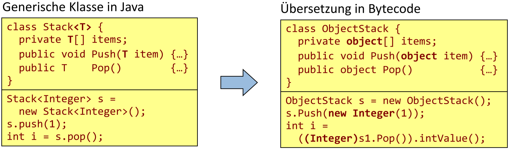

- [Generics](#generics)
  - [Einstiegsfragen](#einstiegsfragen)
  - [Probleme bei Objekt-basierten Behältern](#probleme-bei-objekt-basierten-beh%C3%A4ltern)
  - [Verwendung von Generics](#verwendung-von-generics)
  - [Derivation Constraint](#derivation-constraint)
  - [Constructor Constraint](#constructor-constraint)
  - [Struct Constraint](#struct-constraint)
  - [Generische Methoden](#generische-methoden)
  - [Implementierung von Generics in .NET](#implementierung-von-generics-in-net)
  - [Vorteile von Generics](#vorteile-von-generics)
  - [Unterschiede zu Generics in Java](#unterschiede-zu-generics-in-java)
  - [Unterschiede zu C++ Templates](#unterschiede-zu-c-templates)

# Generics

## Einstiegsfragen zu Generics bei JAVA

- Was bedeutet:
    ```csharp
    Set<T>.addAll(Collection<? extends T> c) bzw. 
    Set<T>.containsAll(Collection<?> c)?
    ```
    1. Hängt alle Elemente von c hinten an Set. Returniert boolean
    2. Gibt zurück ob alle Elemente von c in Set sind

- Warum kann in Java auf Template-Parameter der new-Operator nicht angewandt werden?
  1. ByteCode zur Laufzeit konstant ist, Template-Parameter sind unbekannt, kein ByteCode kann generiert werden
 
- Ist `ArrayList` dasselbe wie `ArrayList<Object>?`
  1. Ja, die ArrayList kann jeden von Object abgeleiteten Typ verwenden.

- Ist `ArrayList<Person>` eine Oberklasse von `ArrayList<Student>`, ist also `ArrayList<Person> pList = new ArrayList<Student>()` möglich? Wenn nein, warum nicht?
  1. Nein, da nur die Klasse Person verwendet werden kann.

- Was sind die Auswirkungen der Zuweisung `ArrayList<? extends Person> pList = new ArrayList<Student>()` ?
  1. Funktioniert da durch Wildcard alle abgeleiteten Klassen von Person verwendet werden dürfen.

## Probleme bei Objekt-basierten Behältern

Einsatz vom Datentyp `object` anstatt Generics erzeugt einen erheblichen Overhead beim Un/Boxing. Aufpassen auf statischer/dynamischer Typ zu Laufzeit. Wenn nur ein homogener Stack erzeugt werden will kann trotzdem zb. ein double oder string hineingeworfen werden.

Problem 1: Laufzeitverlust durch Boxing und Unboxing.
```csharp
// unboxing / boxing laufzeit verlust
Stack s = new Stack(10); s.Push(1);
int i = (int)s.Pop();
```

Problem 2: Typsicherheit zur Übersetzungszeit nicht überprüfbar.
```csharp
// typsicherheit zur Laufzeit nicht überprüfbar
s.Push(3.14); 
string str = (string)s.Pop();
```

## Verwendung von Generics

Beispiel für generischen Stack:
```csharp
class Stack<ElemType> { 
    private readonly int size; 
    private ElemType[] items;
    public Stack(int size) {..} 
    public void Push(ElemType item) {..} 
    public ElemType Pop() {..}
}
```

Anstatt der Verwendung von `object` wird mit den Diamantklammern `class Stack<ElementType>{...}` ein generischer Typ erzeugt. Kein Casten notwending, da der beinhaltete Typ des Behälters zur Kompilezeit festgelegt wird. Typsicherheit und bessere Performance sind deutliche Vorteile gegenüber der Verwendung von `object`.

Erzeugung konkreter Stack-Klassen:
```csharp
Stack<int> s1 = new Stack<int>(10);
s1.Push(1);
int i= s1.Pop();
```
Vorteile:
- keine Typkonversionen, 
- kein Boxing/Unboxing bei Wertetypen,
- gleiche Implementierung für verschiedene Elementtypen.

Bei Java müssen Wrapperklassen verwendet werden (nur Referenzdatentypen/Objekttypen verwendbar).

## Derivation Constraint

Beim Aufruf vom Methoden bei generischen Typen z.B `compareTo` wird in C++ vorausgesetzt, dass nur Typen verwendet werden, die diese Methoden unterstützen. Der C# Kompiler lässt dies nicht zu.

Für Parametertypen dürfen nur die Eigenschaften von Object angenommen werden:
```csharp
public class LinkedList<K,V> { 
    public V Find(K key) { 
        while (…) { 
            if (key.CompareTo(current.key)) { // Syntaxfehler
…
```

In C# kann man Contraints zum generischen Typ angeben, um weniger Probleme beim Instanziieren von diesem Datentyp zu bekommen (Aufruf von nicht implementierten Methoden).

where-Bedingung schreibt vor, dass Parametertyp bestimmte Interfaces implementiert oder von einer bestimmten Klasse abgeleitet sein muss.
```csharp
public class LinkedList<K,V> where K : IComparable<K> { 
    V Find(K key) { 
        while (…) { 
            if (key.CompareTo(current.key)) {
…
```
```csharp
LinkedList<string, int> strList;
//LinkedList<object, int> objList; // implementiert IComparable nicht
```

Durch constraints kann man den Verwender einschränken und vorgeben welche DT übergeben werden können --> strengere Typenüberprüfungen, Fehler beim Instanzieren mit falscher DT.
Unterschiede zu C++ und Java für die Klausur relevant auch einordnen können.

## Constructor Constraint

Es kann ein Default Kontruktor von einem generischen Typ gefordert werden, falls das Anlegen einer Variable dieses Typs erforderlich ist. Auch andere Konstruktoren können gefordert werden. Man kann auch bestimmen, dass ein Wertetyp übergeben wird: `where V: struct`.

```csharp
public class Node<K,V> where V : new() { 
    private K key; 
    private V value; 
    public Node() { 
        key = default(K); 
        value = new V();
    }
}
```
Die Verwendung von new für generische Typparameter ist in Java nicht möglich.

## Struct Constraint

Es kann auch von einem generischen Typ gefordert werden, dass er ein struct ist.

## Generische Methoden

Wie in Java können auch generische Methoden definiert werden, wobei auch wieder Contraints angegeben werden können.

```csharp
public class Math { 
    public static T Min<T>(T a, T b) where T : IComparable<T> {
        if (a.CompareTo(b) < 0) 
            return a;
        else 
            return b;
    }
}
```

Methode kann mit beliebigem Typ instanziert werden.
```csharp
string minStr = Math.Min<string>("abc", "efg");
```

Parametertyp kann meistens vom Compiler ermittelt werden.
```csharp
string minStr = Math.Min("abc", "efg");
```

Beim Aufrufen dieser Methode muss nicht unbedingt der generische Typ angegeben werden, wenn der Kompiler durch die übergebenen Variablen den Typ selbst bestimmen kann.

## Implementierung von Generics in .NET

Das Laufzeitsystem von C# kennt generische Typen, in Java kennt der Bytecode diese nicht. C# weiß zu Laufzeit welche Datentypen eingesetzt wurden.

Auf IL Ebene gibt es Generics. Erst zur Laufzeit folgt die Instanzierung. Erst dann wird für T ein Typ eingesetzt. Für alle referenztypen gemeinsam wird einmal instanziert. In Java hingegen schon beim Kompilieren.

C#
```csharp
class Stack<T> { 
    private readonly int size; 
    private T[ items;]
    public Stack() { size = 10; items = new T[10]; }
}
```

In IL Code
```csharp
.class Stack<T> { 
    .field private initonly int32 size 
    .field private !T[] items 
    .method public … void .ctor() … … 
        ldarg.0 
        ldc.i4.s 10 
        newarr !T 
        stfld !0[] class Stack<!T>::items …
}
```

- CLR und IL wurden für generische Typen erweitert. 
- Generische Typen können in Sprache A implementiert und in Sprache B instanziert werden. 
- Generische Typen werden zur Laufzeit (aber nur bei Bedarf) 
    - für jeden Wertetyp und
    - einmal für alle Referenztypen gemeinsam instanziert.

## Vorteile von Generics
Gemeinsame Nutzung des Codes, Kein Code-bloat ->
    - Mehrfache Instanzierung von Templates für gleiche Elementtypen. 
    - Längere Ladezeiten, erhöhter Speicherbedarf.
  
Performance-Gewinn bei generischen Behälterklassen:
- keine Typkonversionen bei Referenztypen:
  ```csharp
  List<string> list = new List<string>(); 
  string item = list[0]; // keine Typkonversion notwendig.
  ```
- Kein Boxing/Unboxing bei Wertetypen. Beim Boxing wird WrapperObjekt erzeugt, mit geringen Nutzdatenanteil und großem Overhead.:
  ```csharp
  List<int> list = new List<int>(); 
  list.add(100); int item = list[0];
  ```

- Geringerer Speicherplatzbedarf bei Behältern mit Wertetypen.   
- Zugriff auf generische Typparameter zur Laufzeit:
  ```csharp
  List<int> list = new List<int>(); 
  Type collType = list.GetType();
  Type[] paramType = collType.GetTypeParameters();
  ```
Type ist das Gegenstück zu GetClass() in Java.

Generics werden mit Assemblys ausgeliefert und können wiederverwendet werden, somit wird CodeBloat verhindert.
Keine Typenkonversion bei Referenztypen.

Geringerer Speicherplatzbedarf bei Behältern mit Wertetypen.  
Zugriff auf Typeparameter mit Reflection während der Laufzeit.

## Unterschiede zu Generics in Java

- Standarddatentypen können in Java nicht als Typparameter verwendet werden. (Es können keine Contraints definiert werden.)
  - Umwandlung in Referenztypen mithilfe von Wrapper-Klassen.

- In Java stehen für Typparameter keine Konstruktoren zur Verfügung (auch nicht der Standardkonstruktor).

- Metadaten zu Typparametern sind in Java nur eingeschränkt verfügbar.
  - z. B. für Objekte vom Typ ArrayList<String> geht die Information über den Elementtyp verloren (type erasure). Es wird nur `object` zurückgegeben. Dieses Phänomen gibt es NICHT in C#.
    ```csharp
    ArrayList<Integer> list = ...
    list.add(1); // Type erasure 
    ```
    Integer geht zur Laufzeit verloren, kann nicht über reflection gefunden werden. Statische Typen gehen nicht verloren.

- Statische Metadaten werden hingegen im Bytecode abgelegt: Für die Klasse class X implements List<String> { … } kann der Typparameter der generischen Basisklasse bestimmt werden.

- Statische Metadaten können schon herausgefunden werden.
    ```csharp
    class X implements List<String>{...}
    ```

 
  

- Für Generics musste die JVM nicht erweitert werden, da diese sowieso zur Kompilzeit übersetzt werden und es werden keine Metadaten gespeichert.
- Einbußen bei Laufzeit:
  - Zur Laufzeit müssen Typenkonversionen durchgeführt werden, was die Performance verschlechtert.
- Erhöhter Speicherplatzbedarf bei Verwendung von Wrapper-Klassen.

Man darf für T keine Konstruktoren voraussetzen. Kein T[] möglich eher Objekt[].


## Unterschiede zu C++ Templates

- Generics sind typisierte Klassen, Templates sind „Macros“ 
    - Templates werden zur Compilezeit instanziert. - Generics werden zur Laufzeit instanziert.
- Generics erhöhen Typsicherheit (bereits zur Compilezeit) 
    - Viele C++-Compiler kompilieren Template-Code nicht. 
    - Erst bei Template-Instanzierung wird Code erzeugt. 
    - Erst bei Template-Instanzierung wird überprüft, ob Operationen auf TemplateParameter möglich sind.
- `Code Bloat`
    - Mehrfache Instanzierung von Templates für gleiche Elementtypen. 
    - Längere Ladezeiten, erhöhter Speicherbedarf.
- Generics bieten weniger Funktionalität
    - Auf Parameter generischer Typen dürfen keine Operatoren angewandt werden.

In Templates kann auch die Implementation von festgelegten Methoden oder Konstrukturen festgelegt werden.


