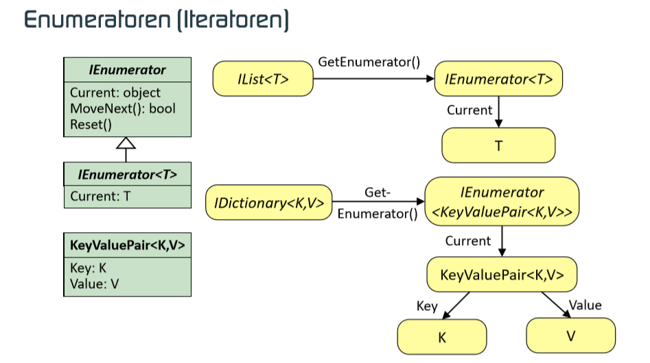

- [Class Base Library](#class-base-library)
	- [Enumeratoren (Iteratoren)](#enumeratoren-iteratoren)
	- [Automatisch generierte Iteratoren](#automatisch-generierte-iteratoren)
	- [Streams](#streams)

# Class Base Library

## Enumeratoren (Iteratoren)



## Automatisch generierte Iteratoren
- Die Implementierung von Iteratoren kann mit dem Schlüsselwort yield vereinfacht werden.
- yield kann auch eingesetzt werden, wenn eine Methode einen Behälter vom Typ IEnumerable zurückgibt.

[Deferred Execution](https://docs.microsoft.com/en-us/dotnet/csharp/programming-guide/concepts/linq/deferred-execution-example)
 
 ```csharp
 public class DaysOfTheWeek : IEnumerable<string>{
	string[] days = { "Sun", "Mon", "Tue", "Wed", "Thr",  "Fri", "Sat"};
	public IEnumerator<string> GetEnumerator() {
		for (int i=0; i<days.Length; i++)
			yield return days[i];
	}
	public IEnumerable<string> GetWorkingDays() {
		for (int i=1; i<days.Length-1; i++)
			yield return days[i];
	}
}
 ```
Bei automatisch generierten Enumeratoren wird im Hintergrund eine Statemaschine verwendet. Im oben gezeigten Beispiel wird i gespeichert wenn mit yield die Funktion verlassen wurde. Wenn MoveNext() aufgerufen wird, wird wieder bei yield mit dem vorherigen Zustand weitergearbeitet.
 

 * Mit `yield` lassen sich Iteratoren einfach relaisieren, deren Implementierung sonst aufwändig wäre.

```csharp
public class TreeSet<T> : IEnumerable<T>{
	public IEnumerator<T> GetEnumerator() {
		return EnumerateItems(root).GetEnumerator();
	}
	private IEnumerable<T> EnumerateItems(Node<T> n) { 
		if (n == null)
			yield break;
		foreach (T val in EnumerateItems(n.Left))
			yield return val;
		yield return n.Val;
		foreach (T val in EnumerateItems(n.Right))
			yield return val;
	} 
}
```

* Mit yield return realisierte Enumerationen werden verzögert ausgeführt (deferred execution).

```csharp
private IEnumerable<int> FindPrimes(int from, int to) {
    int i = from;
    while (i <= to) {
        while (! IsPrime(i))
            i++;
        if (i <= to)
            yield return i++;
    }
}

```

```csharp
IEnumerable<int> primes = primeCalc.FindPrimes(6, 11);
IEnumerator<int> pe = primes.GetEnumerator();
pe.MoveNext(); //IsPrime(6), IsPrime(7)
Console.WriteLine(pe.Current); //7
pe.MoveNext(); //IsPrime(8), …, IsPrime(11) 
Console.WriteLine(pe.Current); // 11
```

## Streams

Als nächstes dann ADA.NET