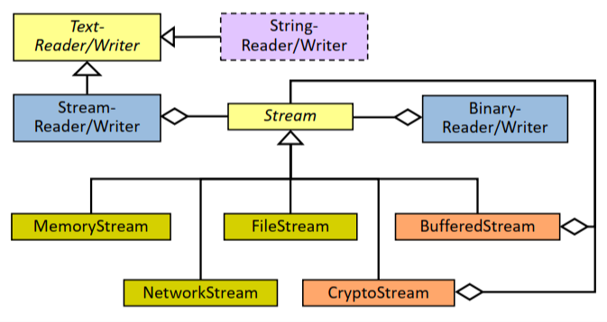
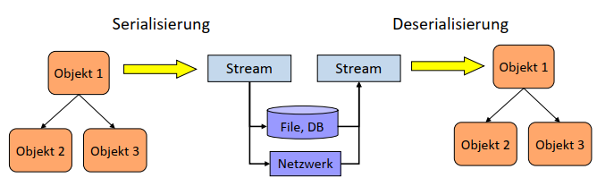

- [Class Base Library](#class-base-library)
	- [Thread-sichere Behälterklassen](#thread-sichere-beh%C3%A4lterklassen)
	- [Enumeratoren (Iteratoren)](#enumeratoren-iteratoren)
	- [Automatisch generierte Iteratoren](#automatisch-generierte-iteratoren)
	- [Streams: Klassenhierarchie](#streams-klassenhierarchie)
	- [Streams Bsp](#streams-bsp)
	- [Serialisierung](#serialisierung)
	- [Binäre Serialisierung](#bin%C3%A4re-serialisierung)
	- [XML-basierte Serialisierung](#xml-basierte-serialisierung)
	- [XmlTextReader und XmlTextWriter](#xmltextreader-und-xmltextwriter)
	- [DOM-basierte XML-Verarbeitung](#dom-basierte-xml-verarbeitung)

# Class Base Library

## Thread-sichere Behälterklassen

- System.Collections (.NET 1.0)
  - Nicht Thread-sicher.
  - Property Synchronized liefert einen Thread-sicheren Wrapper.
  - Nachteile: ineffizient, Iteration ist nicht Thread-sicher.
- System.Collections.Generic (.NET 2.0)
  - Nicht Thread-sicher.
  - Nachteil: Kein Synchronisationsmechanismus.
- System.Collections.Concurrent (.NET 4.0)
  - Spezialisierte Thread-sichere Behälterklassen:
    - BlockingCollection<T>
    - ConcurrentQueue<T>
    - ConcurrentStack<T>
    - ConcurrentBag<T>
    - ConcurrentDictionary<K,V>
  - GetEnumerator liefert einen Snapshot -> Thread-sichere Iteration

## Enumeratoren (Iteratoren)


## Automatisch generierte Iteratoren
- Die Implementierung von Iteratoren kann mit dem Schlüsselwort yield vereinfacht werden.
- yield kann auch eingesetzt werden, wenn eine Methode einen Behälter vom Typ IEnumerable zurückgibt.

[Deferred Execution](https://docs.microsoft.com/en-us/dotnet/csharp/programming-guide/concepts/linq/deferred-execution-example)
 
 ```csharp
 public class DaysOfTheWeek : IEnumerable<string>{
	string[] days = { "Sun", "Mon", "Tue", "Wed", "Thr",  "Fri", "Sat"};
	public IEnumerator<string> GetEnumerator() {
		for (int i=0; i<days.Length; i++)
			yield return days[i];
	}
	public IEnumerable<string> GetWorkingDays() {
		for (int i=1; i<days.Length-1; i++)
			yield return days[i];
	}
}
 ```
Bei automatisch generierten Enumeratoren wird im Hintergrund eine Statemaschine verwendet. Im oben gezeigten Beispiel wird i gespeichert wenn mit yield die Funktion verlassen wurde. Wenn MoveNext() aufgerufen wird, wird wieder bei yield mit dem vorherigen Zustand weitergearbeitet.
 

 * Mit `yield` lassen sich Iteratoren einfach relaisieren, deren Implementierung sonst aufwändig wäre.

```csharp
public class TreeSet<T> : IEnumerable<T>{
	public IEnumerator<T> GetEnumerator() {
		return EnumerateItems(root).GetEnumerator();
	}
	private IEnumerable<T> EnumerateItems(Node<T> n) { 
		if (n == null)
			yield break;
		foreach (T val in EnumerateItems(n.Left))
			yield return val;
		yield return n.Val;
		foreach (T val in EnumerateItems(n.Right))
			yield return val;
	} 
}
```

* Mit yield return realisierte Enumerationen werden verzögert ausgeführt (deferred execution).
	```csharp
	private IEnumerable<int> FindPrimes(int from, int to) {
		int i = from;
		while (i <= to) {
			while (! IsPrime(i))
				i++;
			if (i <= to)
				yield return i++;
		}
	}
	```
	```csharp
	IEnumerable<int> primes = primeCalc.FindPrimes(6, 11);
	IEnumerator<int> pe = primes.GetEnumerator();
	pe.MoveNext(); //IsPrime(6), IsPrime(7)
	Console.WriteLine(pe.Current); //7
	pe.MoveNext(); //IsPrime(8), …, IsPrime(11) 
	Console.WriteLine(pe.Current); // 11
	```

## Streams: Klassenhierarchie



## Streams Bsp


## Serialisierung

- Serialisierung ist der Prozess, mit dem Objekte in eine Form gebracht werden, in der sie
  - auf einem persistenten Medium gespeichert bzw.
  - zu einem anderen Prozess transportiert werden können.


## Binäre Serialisierung


## XML-basierte Serialisierung


## XmlTextReader und XmlTextWriter
- Mit XmlTextWriter/XmlTextReader können Xml-Dokumente auf Ebene der XML-Tokens verarbeitet werden.
- Dieser Ansatz entspricht konzeptionell der StaX-API von Java.
- Man hat volle Kontrolle über das XML-Dokument.
- Aufwändigste Methode zum Verarbeiten von XML-Dokumenten.
	
	

## DOM-basierte XML-Verarbeitung
- XmlDocument: Repräsentation eines XML-Dokuments im Speicher (DOM).
- Dokument kann mit einer Operation gelesen bzw. geschrieben werden. Im Speicher kann das XML-Dokument verändert werden.
	```csharp
	Stream stream = new SomeStream(…)

	XmlDocument dom = new XmlDocument();
	dom.Load(stream);
	XmlNodeList elems = dom.DocumentElement.ChildNodes;
	foreach (XmlNode elem in elems) {
		Process(elem.InnerText);

	XmlNode newElem = dom.CreateElement("elem");
	newElem.InnerText = "…";
	elems.AppendChild(newElem);

	dom.Save(stream);
	```