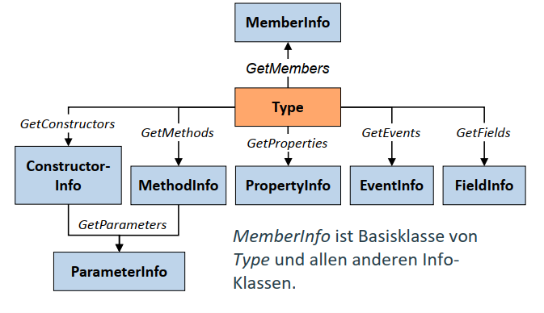
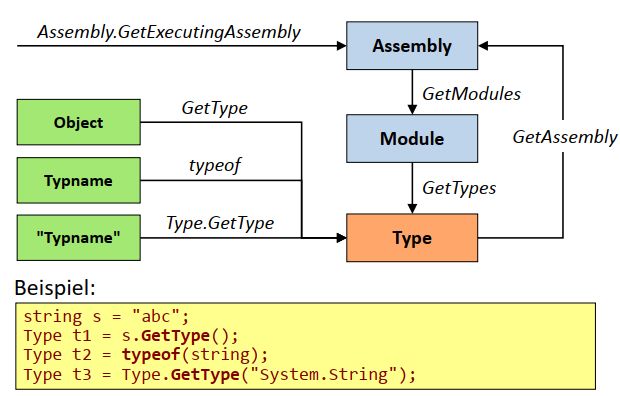
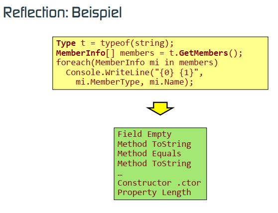

- [Metadaten, Reflection und Attribute](#metadaten-reflection-und-attribute)
- [Reflection](#reflection)
- [Anwendung von Attributen](#anwendung-von-attributen)
- [Definition von Attributen](#definition-von-attributen)
- [Zuweisung von Attributen](#zuweisung-von-attributen)
- [Zugriff auf Attribute](#zugriff-auf-attribute)


## Metadaten, Reflection und Attribute
- Metadaten enthalten eine detaillierte Beschreibung aller Bestandteile eines Assemblies:
  - Assembly: exportierte Typen eines Assemblies (Manifest).
  - Modul: definierte Typen (Klassen, Strukturen, Delegates, …)
  - Typ: Felder, Konstruktoren, Methoden, Properties, Events.
- Mit Reflection
  - kann auf Metadaten zugegriffen werden,
  - können Typen zur Laufzeit erzeugt und instanziert werden.
- Mit Attributen können Metadaten erweitert werden.
  - In der FCL sind bereits viele Attribute definiert (DllImport, MarshalAs, STAThread, Serializable, CLSCompliant, WebMethod, …).
  - Entwickler können neue Attribute definieren.

## Reflection
  
  


## Anwendung von Attributen
- Konstrukte, denen Attribute zugeordnet werden können:
    

## Definition von Attributen
- Vorgehensweise
  - Klasse von System.Attribute ableiten.
  - Festlegung, worauf Attribut angewendet werden kann (AttributeTargets).
  - Konvention: Klassenname endet mit Postfix Attribute.
  - Definition von Konstruktoren und Properties.
  - Konstruktoren und Properties definieren Attributparameter.
- Beispiel:
    ```csharp
    [AttributeUsage(AttributeTargets.Method |
                    AttributeTargets.Property]
    public class MyAttributeAttribute : System.Attribute {
        public MyAttributeAttribute(string param1) { … }
        public string Param1 { get { … }; }
        public int Param2 { get { … }; set { … } }
    }
    ```
## Zuweisung von Attributen
- Bei der Zuweisung eines Attributs
  - müssen die Parameter des Konstruktors als Positionsparameter angegeben werden,
  - können die Properties als benannte Parameter gesetzt werden.
    ```csharp
    class MyClass {
        [MyAttribute("param1")]
        void MyFirstMethod() { … }
        
        [MyAttribute("param1", Param2=5)]
        void MySecondMethod() { … }
    }
    ```
- Es können auch mehrere Attribute zugewiesen werden.
    ```csharp
    [WebMethod,CLSCompliant][MyAttribute("param1")]
    void MyMethod();
    ```
## Zugriff auf Attribute
- Mit MemberInfo.IsDefined(attributeType, inherit) kann fest-gestellt werden, ob ein bestimmtes Attribut zugewiesen wurde.
    ```csharp
    Type t = typeof(MyClass);
    if (t.IsDefined(typeof(MyAttributeAttribute), true) { … }
    ```
- MemberInfo.GetCustomAttributes(attributeType, inherit) liefert alle zugewiesenen Attributinstanzen.
    ```csharp
    Type t = typeof(MyClass);
    MethodInfo mInfo = t.GetMethod("MyMethod");
    object[] attr = mInfo.GetCustomAttribues(typeof(MyAttributeAttribute), true);

    if (attr.Length >= 1) {
        MyAttributeAttribute myAttr = (MyAttributeAttribute)attr[0];
        string p1 = myAttr.Param1;
        int p2 = myAttr.Param2;
    }
    ```