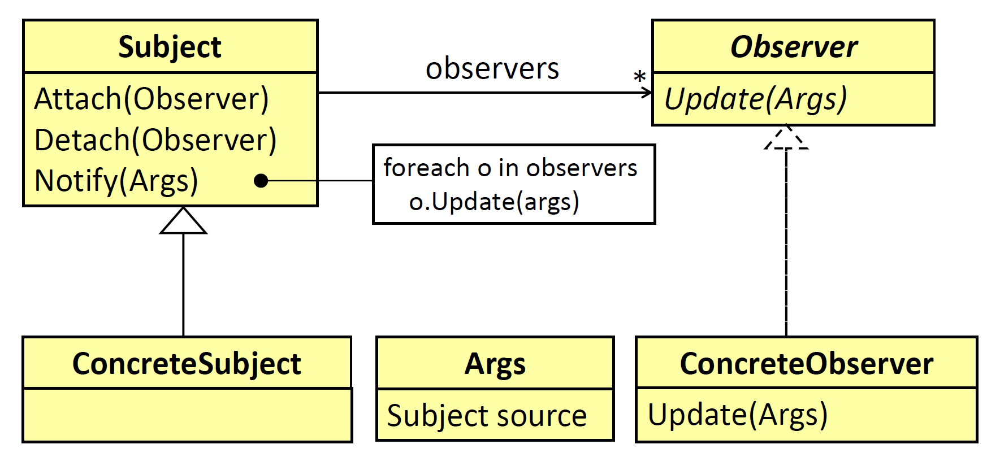
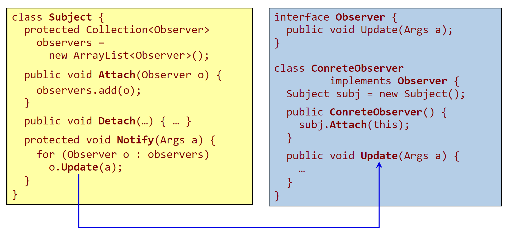
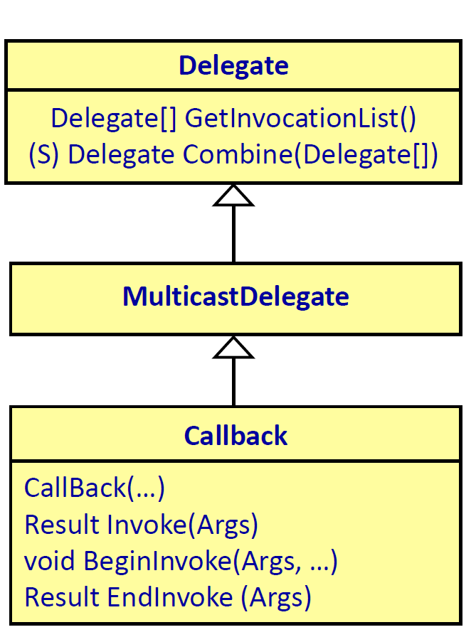
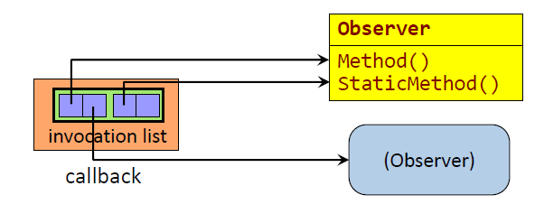
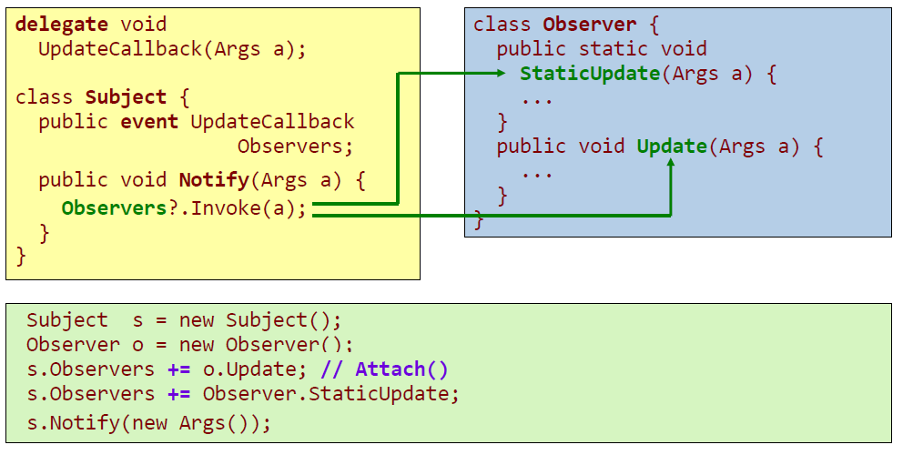
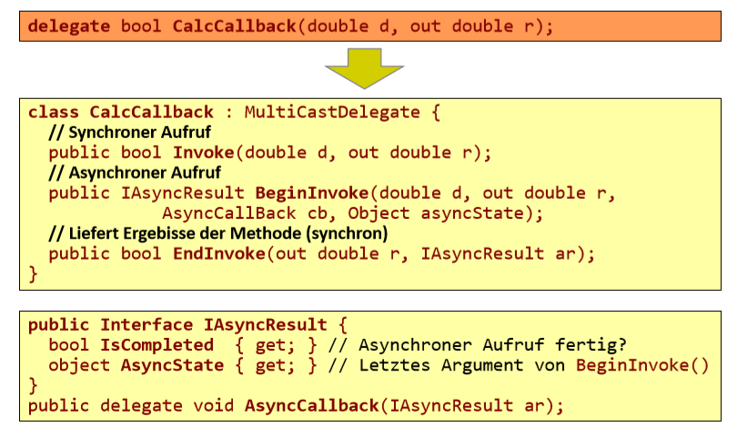

- [Delegates und Events](#delegates-und-events)
  - [Motivation](#motivation)
  - [Das Observer-Muster](#das-observer-muster)
  - [Observer Pattern: Realisierung in Java](#observer-pattern-realisierung-in-java)
  - [Definition von Delegates](#definition-von-delegates)
  - [Verwenden von Delegates](#verwenden-von-delegates)
  - [Multicast-Delegates](#multicast-delegates)
  - [Repräsentation von Delegate-Objekten](#repr%C3%A4sentation-von-delegate-objekten)
  - [Events](#events)
  - [Abfrage auf null](#abfrage-auf-null)
  - [Observer Pattern: Realisierung in C# mit Delegates](#observer-pattern-realisierung-in-c-mit-delegates)
  - [Anonyme Methoden und Lambda-Asdrücke](#anonyme-methoden-und-lambda-asdr%C3%BCcke)
  - [Lambda-Ausdrücke](#lambda-ausdr%C3%BCcke)
  - [Asynchrone Ausführung](#asynchrone-ausf%C3%BChrung)
  - [Asynchroner Aufruf mit Polling](#asynchroner-aufruf-mit-polling)
  - [Asynchroner Aufruf mit Callback](#asynchroner-aufruf-mit-callback)

# Delegates und Events

[MSDN Delegates](https://docs.microsoft.com/en-us/dotnet/csharp/programming-guide/delegates/using-delegates)
[MSDN Event](https://docs.microsoft.com/en-us/dotnet/csharp/language-reference/keywords/event)

## Motivation

- GUI-Frameworks sind ereignisorientiert.
    - Bei Eintreten bestimmter Ereignisse werden Callback-Funktionen aufgerufen.
    - Callback-Funktionen werden erst zur Laufzeit an Ereignisse gebunden.
    - Man möchte mehrere Callback-Funktionen an ein Ereignis binden.
- Funktionale Programmierung
    - Funktionen höherer Ordnung: Funktionen, an denen Funktionen als Parameter übergeben werden können.
- Implementierung in anderen Programmiersprachen
    - C++: Funktionszeiger (sind aber nicht typsicher).
    - Java: Beobachterobjekte (Listener), Lambda-Ausdrücke (ab Java 8, dahinter verbergen sich wieder anonyme Klassen).

## Das Observer-Muster
Subject stellt Methode zur Verfügung die alle Observer verständigt (Notify). Jeder Observer muss ein Interface implementieren (Observer).



## Observer Pattern: Realisierung in Java
Subject muss einen Behälter haben der alle Observer speichert. Detach und Attach fügt hinzu bzw entfernt Observer.
Functional Interfaces (Interfaces mit einer einzigen Methode sind die Basis für Lambda Ausdrücke).




## Definition von Delegates

Ähnlich wie beim Observer Pattern, können sich mehrere Listener für ein Event mit der `+=` Operation registrieren.
- Definition eines neuen Delegate-Typs (C#-Syntax):
    ```csharp
    delegate Result Callback(Args args);
    ```
    Ähnlich wie eine Methodenreferenz-Definition in C++.
- Definiert eine neue Klasse Callback.
- Ist von MultiCastDelegate abgeleitet:
    Mehrere Methoden können Delegate-Objekt
    zugewiesen werden.
- Mit Invoke werden alle mit Delegate assozierten Methoden aufgerufen.
- Invoke hat dieselbe Signatur wie Delegate-Definition.
- Mit BeginInvoke, EndInvoke können assoziierte Methoden asynchron aufgerufen werden.



## Verwenden von Delegates

* Dekleration einer Delegate-Referenz
  ```csharp
  Callback callback1 = null;
  ```
* Erzeugen eines Delegate-Objekts
    ```csharp
    class Observer {
        public Result Method(Args arg) { ... }
        public static Result StaticMethod(Args arg) { ... }
    }
    ```  
    ```csharp
    Observer o = new Observer();
    callback1 = new Callback(o.Method); //compiler warnt hier falls falscher typ
    callback2 = new Callback(Observer.StaticMethod);
    Callback3 = o.Method; // ab C# 2.0
    ```
* Aufruf der registrierten Methoden mit ()-Operator
    ```csharp
    callback1(new Args()); // callback1 muss ungleich null sein.
    callback2(new Args());
    ```
* Zusammengefasst: callback1-3 zeigen auf eine Funktion die beim Verwenden des `()` Operators aufgerufen werden.

## Multicast-Delegates
- Einem Delegate-Objekt können mehrere Methoden-Referenzen zugewiesen werden.
    ```csharp
    Observer o = new Observer();
    Callback callback = new Callback(o.Method);
    callback += new Callback(Observer.StaticMethod);
    ```
    - += wird vom Compiler in Delegate.Combine übersetzt.
    ```csharp
    callback = Delegate.Combine(callback, Oberserver.StaticMethod);
    ```
    Delegate.Combine kann mit null umgehen.

- ()-Operator ruft alle zugewiesenen Methoden auf.
    ```csharp
    Args a = new Args();
    callback(a) // -> o.Method(a);
                // -> Observer.StaticMethod(a);
    ```
- Rückgabewerte bei Multicast-Delegates:
    ```csharp
    Result r = callback1(args);
    ```
    - Letzte Delegate-Methode definiert den Rückgabewert.
    - Bei Übergangsparametern wird der Wert von Methode zu Methode weitergereicht

## Repräsentation von Delegate-Objekten
```csharp
class Observer {
    public Result Method(Args arg) { ... }
    public static Result StaticMethod(Args arg) { ... }
}
```
```csharp
Observer o = new Observer();
Callback callback = new Callback(o.Method);
callback += new Callback(Observer.StaticMethod);
```
In der invocation list gibts einen Eintrag für jeden Observer.
Beide regisrierte Methoden haben diesselbe Signatur (void).
Es können die in der invocation list definierten Methoden einzeln abgearbeitet werden.



## Events
* Delegate -Felder können als Felder können als Felder können als Felder können als `event` deklariert werden: deklariert werden:
```csharp
class EventSource {
    public Callback OnCallback;
    void FireEvent() {
        if (OnCallback != null)
            OnCallback(new Args());
    }
}
```
* Auswirkungen
    * Event kann nur von einer Methode jener Klasse, in der Event dekleriert wurde, ausgelöst werden.
    * Von außen können dem Delegate-Feld keine Werte zugewiesen werden.
```csharp
EventSource source = new EventSource();
source.OnCallback += new Callback(o.Method);

// Foldendes ist ein Syntaxfehler, da man, wenn man
// zuvor bereits Methoden dem Callback hinzugefügt hat,
// bei Neuzuweiung die vorherigen überschreibt/löscht.
source.OnCallback = new Callback(…);  // Syntaxfehler!

// Auch das Aufrufen des Callbacks ist nicht mehr
// zulässig bei Verwendung des event Keywords (oben).
source.OnCallback(new Args());        // Syntaxfehler!
```
Durch hinzufügen von event ist der = Operator nicht mehr öffentlich. Hinzufügen und entfernen mit +-/= funktioniert immer noch.

## Abfrage auf null

- Wird eine Delegate-Variablen keine Methoden-Referenz zugewiesen, ist diese null ->
- Bei Ausführung des Delegates ist dies zu berücksichtigen:
    ```csharp
    public event Callback OnCallback;
        void FireEvent() {
            if (OnCallback != null)
                OnCallback(new Args());
    }
    ```
- Mit dem Null-Conditional-Operator lässt sich die Delegate-Ausführung vereinfachen:
    ```csharp
    public event Callback OnCallback;
        void FireEvent() {
            OnCallback?.Invoke(new Args());
    }
    ```

## Observer Pattern: Realisierung in C# mit Delegates


## Anonyme Methoden und Lambda-Asdrücke

- Explizite Implementierung der Methode:
    Konstruktor Thread erwartet ein Delegate (delegate void ThreadStart();)
    ```csharp
    public class Timer {
        private void Run() { /*Implementierung von Run*/}
        private Thread thread =
        new Thread(new ThreadStart(this.Run));
    }
    ```
- Anonyme Methode:
    ```csharp
    public class Timer {
        private Thread thread =
        new Thread(
            delegate() {/*Implementierung von Run*/ } // rückgabe werd wird implizit festgestellt
        );
    }
    ```  
- Lambda-Ausdruck:
    ```csharp
    public class Timer {
        private Thread thread =
        new Thread( () => { /*Implementierung von Run*/});
    }
    ```

## Lambda-Ausdrücke

* Methoden mit Delegate-Parametern sind sehr flexibel einsetzbar:
    ```csharp
    // erstellt eine signatur für eine Methode die bool zurückgibt und ein Objekt von Typ t übernimmt
    public delegate bool Predicate<T>(T obj);
    private static IEnumerable<T> FilterWhere(this IEnumerable<T> numbers, Predicate<T> filter)
    {
    foreach (T n in numbers)
        if (filter(n))
            yield return n;
    } 
    ```
* An diese Methode können anonyme Methoden übergeben werden
    ```csharp
    var oddNumbers = numbers.FilterWhere( delegate(int n) { return n % 2 != 0; }); 
    ```
* Lambda-Ausdrücke ermöglichen eine einfachere Schreibweise für anonyme Methoden:
    ```csharp
    // typ von n wird zu laufzeit ermittelt (anhand von numbers)
    var oddNumbers = numbers.FilterWhere(n => n % 2 != 0); 
    ```
* In LINQ Ausdrücken werden sehr häufig anonyme Methoden benötigt.
  
## Asynchrone Ausführung


## Asynchroner Aufruf mit Polling
```csharp
delegate bool CalcCallback(double d, out double r);
static bool Sqrt(double d, out double r) { r = d>=0 ? Math.Sqrt(d) : 0; return d>=0; }
void DoIt() {
    // Generierung eines Delegate-Objekts.
    CalcCallback calc = new CalcCallback(Sqrt);
    // Asynchroner Aufruf von Sqrt.
    IAsyncResult ar = calc.BeginInvoke(2, out r, null, null); 
    // Warte bis Sqrt terminiert.
    while (!ar.IsCompleted) {
        // Dieser Code wird parallel zu Sqrt ausgeführt.
        Thread.Sleep(0);
    }
    // Abholen der Ergebnisse des anynchronen Methodenaufrufs.
    bool ok = calc.EndInvoke(out r, ar);
}
```
## Asynchroner Aufruf mit Callback
```csharp
delegate bool CalcCallback(double d, out double r);
CalcCallback calc;
// Callback-Methode, die aufgerufen wird, wenn Sqrt terminiert.
void CalcCompleted(IAsyncResult ar) {
	double r = 0;
	// Abholen der Ergebnisse des anynchronen Methodenaufrufs.
	bool ok = calc.EndInvoke(out r, ar);
}
void DoIt() {
	double r;
	// Generierung eines Callbacks, das bei Termination von Sqrt
	// aufgerufen wird.
	AsyncCallback cb = new AsyncCallback(CalcCompleted);
	// Asynchroner Aufruf von Sqrt.
	calc = new CalcCallback(Sqrt);
	calc.BeginInvoke(5, out r, cb, null); 
}

```
