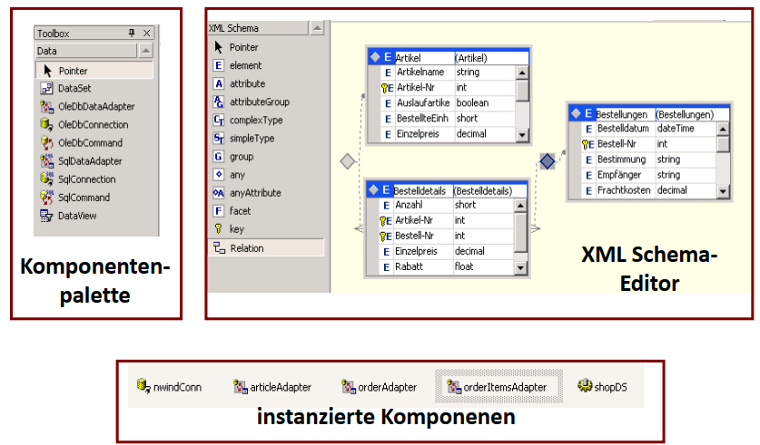

- [ADO.NET – Designziele](#adonet-%E2%80%93-designziele)
- [Architektur](#architektur)
- [Data-Provider: Konzept](#data-provider-konzept)
- [Data-Provider: Implementierungen](#data-provider-implementierungen)
- [Connection – Datenbankverbindungen](#connection-%E2%80%93-datenbankverbindungen)
- [DataReader – Iteration durch Datensätze](#datareader-%E2%80%93-iteration-durch-datens%C3%A4tze)
- [Command – Datenbank-Abfragen](#command-%E2%80%93-datenbank-abfragen)
- [Abfragen mit Parametern](#abfragen-mit-parametern)
- [Provider-unabhängige Programmierung](#provider-unabh%C3%A4ngige-programmierung)
- [Asynchrone Programmierung](#asynchrone-programmierung)
- [Transaktionen](#transaktionen)
- [Ambiente Transaktionen](#ambiente-transaktionen)
- [DataSets](#datasets)
- [Untyped Datasets](#untyped-datasets)
- [Typed Datasets](#typed-datasets)
- [Erstellen von Typed DataSets mit VS .NET](#erstellen-von-typed-datasets-mit-vs-net)
- [Manipulation von Datasets](#manipulation-von-datasets)
- [Versionsinformation in DataSets](#versionsinformation-in-datasets)
- [Manipulation von DataSets](#manipulation-von-datasets)
- [Austausch von Datasets](#austausch-von-datasets)
- [Daten-Adapter – Verbindung zur Datenquelle](#daten-adapter-%E2%80%93-verbindung-zur-datenquelle)
- [Automatische Generierung von Abfragen](#automatische-generierung-von-abfragen)
- [Daten-Adapter: Update-Verhalten](#daten-adapter-update-verhalten)
- [Domänenklassen](#dom%C3%A4nenklassen)
- [Das DAO-Muster](#das-dao-muster)
- [Domänenklassen/Datasets: Rolle in der Architektur](#dom%C3%A4nenklassendatasets-rolle-in-der-architektur)

## ADO.NET – Designziele
- Trennung von Datenzugriff und Datenmanipulation.
  - Daten können in Datenbehältern (DataSets) gespeichert werden.
  - Verbindung zur Datenbank muss nur für die Dauer des Zugriffs bestehen.
- Unterstützung mehrschichtiger Anwendungen.
  - Transport der Daten zwischen den Schichten mit DataSets.
  - Unterstützung von Connection-Pooling.
  - Unterstützung von optimistischem Sperren. (traditionelles Sperren im Web nicht gut)
- Umfassende Unterstützung von XML
  - Datenaustausch zwischen verschiedenen Plattformen und Architekturen (Web Services)

## Architektur
 

## Data-Provider: Konzept
- Geschichte
  - ODBC:
    - Gemeinsame funktionsorientierte C-API.
    - ODBC-Treiber abstrahiert Schnittstelle zu konkretem DBMS.
  - ADO
    - Zugriff erfolgt über definierte COM-Schnittstellen.
    - OLE-DB-Provider abstrahiert Schnittstelle zu DBMS.
- ADO.NET
  - DBMS-spezifischer Data-Provider direkt verwendet werden.
  - Optimierungen für konkretes DBMS sind möglich.
  - Datenbank-Unabhängigkeit geht aber teilweise verloren.
  - Durch Verwendung von Interfaces und abstrakten Basisklassen kann Datenbankspezifischer Teil sehr klein gehalten werden.

#### Kommentare
        * Ado Ziel: Sprachunabhängige DB Zugriffsschicht
        * Ado. Net erlaubt direkten Zugriff auf die Klassen des DB Providers

## Data-Provider: Implementierungen
- Implementierungen von Data-Providern
  - SqlServer
  - Oracle: ODB.NET
  - MySQL: Connector/NET
  - DB2: DB2.NET
  - ODBC/OleDb
  - Wrapper um bestehende Treiber
    -> nativer Code  
    

## Connection – Datenbankverbindungen
- Repräsentiert eine Verbindung zu einer DB.
  - ConnectionString: Parameter für Verbindungsaufbau.
    - `Server=myhost; User ID=sa; Password=susan; Pooling=true; Max Pool Size=50;`
    - `Source=(LocalDB)\MSSQLLocalDB; AttachDbFilename=C:\Db\MyDb.mdf;`
    - `DataSource=tcp:myserver.database.windows.net,1433; Initial Catalog=FhQuotesDb;ID=sa; Password=susan;`
- Open() und Close():
    ```csharp
    using (IDbConnection conn = new SqlConnection(myConnStr)) {
        conn.Open();
        using (IDbCommand cmd = new SqlCommand(sqlQuery, conn)) {
            …
        }
    } // conn.Dispose() -> conn.Close()
    ```

#### Kommentar
        * Connection Pooling: physische Verbindung bleibt offen, logische wird geschlossen
            und in den Pool zurückgegeben

## DataReader – Iteration durch Datensätze
- ExecuteReader
  - Liefert ein Objekt, das die Interfaces IDataReader und IDataRecord implementiert.
  - Mit IDataReader kann durch Ergebnis iteriert werden.
  - IDataRecord ermöglich den Zugriff auf Attributwerte.
    ```csharp
    string sql = "SELECT name, age FROM Person";
    IDbCommand selectCmd = new SqlCommand(sql, conn);

    IDataReader reader = selectCmd.ExecuteReader();

    while (reader.Read()) {
        string name = (string)reader[0];
        int age = (int)reader["age"];
    }
    ```
    

## Command – Datenbank-Abfragen
- ExecuteNonQuery:
  - Schreibende DB-Kommandos (insert, update, delete).
  - Rückgabewert ist die Anzahl der betroffen Datensätze.
    ```csharp
    string sql = "UPDATE Person SET name='Franz'";
    IDbCommand updCmd = new SqlCommand(sql, conn);
    int rowsAffected = updCmd.ExecuteNonQuery();
    ```
- ExecuteScalar:
  - Kommandos mit `skalarem Rückgabewert`.
  - Rückgabewert muss in passenden Typ konvertiert werden.
    ```csharp
    string sql = "SELECT COUNT(*) FROM Person";
    IDbCommand countCmd = new SqlCommand(sql, conn);
    int noOfPersons = (int)countCmd.ExecuteScalar();
    ```

## Abfragen mit Parametern
- Abfragen können mit Parametern versehen werden.
    ```csharp
    string sql = "UPDATE Person SET age=age+1 WHERE name = ?";
    IDbCommand updCmd = new OleDbCommand(sql, conn);
    ```
- SQLServer und Oracle unterstützen `benannte Parameter`.
    ```csharp
    string sql = "UPDATE Person SET age=age+1 WHERE name=@name";
    IDbCommand updCmd = new SqlDbCommand(sql, con);
    ```
- Eigenschaften von Parametern müssen definiert werden.
    ```csharp
    SqlParameter nameParam = new SqlParameter("@name", SqlType.VarChar);
    updCmd.Parameters.Add(nameParam);
    ```
- Parametern müssen vor Ausführung Werte zugewiesen werden
    ```csharp
    nameParam.Value = "Mayr";
    updCmd.ExecuteNonQuery();
    ```

#### Kommentar
        * bennante Parameter verhindern SQL Injection (außer es wird String Concat ausgeführt dann nicht)

## Provider-unabhängige Programmierung 


- Provider-abhängige Parameter in Konfigurations-Datei definieren
    ```xml
    <configuration>
        <connectionStrings>
            <add name="MyDbConnection"
                connectionString="…"
                providerName="System.Data.SqlClient"/>
        </connectionStrings>
    </configuration>
    ```
- Verwendung im Code
  - Factory aus Konfigurations-Parameter erzeugen
  - Factory erzeugt Provider-abhängige Objekte
  - Im Code werden Provider-unabhängige Interfaces verwendet
    ```csharp
    var connSettings = ConfigurationManager.ConnectionStrings["MyDbConnection"];
    DbProviderFactory dbfactory =
        DbProviderFactories.GetFactory(connSettings.ProviderName);

    IDbConnection dbconn = dbfactory.CreateConnection();
    dbconn.ConnectionString = connSettings.ConnectionString;

    dbconn.Open();
    IDbCommand dbcomm = dbconn.CreateCommand();
    ```
## Asynchrone Programmierung
- Für zeitaufwändige Datenbank-Operationen bietet ADO.NET asynchrone Methoden an.
- Beispiel:
    ```csharp
    using (DbConnection conn = dbFactory.CreateConnection()) {
        await conn.OpenAsync();
        
        using (DbCommand selCmd = conn.CreateCommand()) {
            selCmd.CommandText = "SELECT name, age FROM Person";
            selCmd.Connection = conn;
            using (DbDataReader reader = await selCmd.ExecuteReaderAsync()) {
                while (await reader.ReadAsync())
                    Process(new Person((string)reader["name"],
                                    (int)reader["age"]));
            }
        }
    }
    ```
#### Kommentar
        * Asynchrone Methoden nur in Abstrakten Klassen, nicht in den Interfaces

## Transaktionen
- Transaktionen sind unteilbare Aktionen in der DB.
  - Commit: alle DB-Aktionen werden gemeinsam durchgeführt.
  - Rollback: alle DB-Aktionen werden rückgängig gemacht.
- Beispiel:
    ```csharp
    DbCommand cmd = new SqlCommand(sql, connection);
    DbTransaction trans =
        connection.BeginTransaction(IsolationLevel.ReadCommitted);
    cmd.Transaction = trans;

    try {
        cmd.CommandText = "UPDATE …"; cmd.ExecuteNonQuery();
        cmd.CommandText = "UPDATE …"; cmd.ExecuteNonQuery();
        trans.Commit();
    }
    catch(Exception e) {
        trans.Rollback();
    }
    ```

## Ambiente Transaktionen
- .NET 2.0 definiert eine Transaktions-API, mit der ambiente Transaktionen definiert werden können (System.Transactions)
    ```csharp
    DbCommand cmd = new SqlCommand(sql, connection);
    using (TransactionScope txScope = new TransactionScope()) {
        cmd.CommandText = "UPDATE …"; cmd.ExecuteNonQuery();
        cmd.CommandText = "UPDATE …"; cmd.ExecuteNonQuery();
        txScope.Complete();
    }
    ```
  - Alle Anweisungen zwischen dem Aufruf des Konstruktors und der Methode Dispose() werden zu einer Transaktion zusammengefasst.
  - In Dispose() wird die Transaktion bestätigt, falls vorher Complete() aufgerufen wurde; sonst wird sie zurückgenommen.
- Vorteil: Ressourcen, die diese API unterstützen, beteiligen sich automatisch an der ambienten Transaktion.
- Ressource muss „Auto-Enlistment“ unterstützten (z.B. SqlServer, Oracle, …)

## DataSets
- DataSets bestehen aus mehreren Tabellen.
- Zwischen Tabellen können Beziehungen definiert werden.
- DataSets sind unabhängig von der Datenherkunft.
- Data Adapter stellen Verbindung zur Datenquelle her.
- DataSets sind ein Offline-Container für Daten.
- DataSets können offline modifiziert werden.


## Untyped Datasets
- Erzeugung eines Untyped Datasets:
    ```csharp
    DataSet ds = new DataSet("Shop");
    ds.Tables.Add("Article");
    ds.Tables["Article"].Columns.Add("ID", typeof(int));
    ds.Tables["Article"].Columns.Add("Price", typeof(double));
    ...
    DataColumn[] keys = new DataColumn[1];
    keys[0] = ds.Tables["Article"].Columns["ID"];
    ds.Tables["Article"].PrimaryKey = keys;
    ```
- Verwendung eines Untyped Datasets:
    ```csharp
    DataTable article = ds.Tables["Article"];
    foreach(DataRow r in article.Rows)
        Console.WriteLine("ID={0}, price={1}",
            r["ID"], r["Price"]);
    ```

## Typed Datasets
- Erzeugung eines Typed Datasets:
    
- Verwendung eines Typed Datasets
```csharp
ShopDS.ArticleDataTable article = shopDS.Article;
foreach (ShopDS.ArticleRow row in article.Rows)
    Console.WriteLine("ID={0}, Price={1}",
        row.ID, row.Price);
```

## Erstellen von Typed DataSets mit VS .NET


## Manipulation von Datasets
- Einfügen einer neuen Zeile
    ```csharp
    ShopDS.ArticleRow r = shopDS.Article.NewArticleRow();
    r.ID = 77;
    r.Price = 55.55;
    shopDS.Article.AddArticleRow(r);
    ```
- Aktualisieren einer Zeile
    ```csharp
    ShopDS.ArticleRow r = shopDS.Article.FindBy_Article_ID(88);
    r.BeginEdit(); // optional: Events werden erst bei EndEdit() gefeuert.
    r.Price = 99.99;
    r.EndEdit();
    ```
- Löschen einer Zeile
    ```csharp
    ShopDS.ArticleRow r =
    shopDS.Article.FindBy_Article_ID(99);
    r.Delete();
    ```

## Versionsinformation in DataSets
- In DataSets werden drei Versionen der Datensätze gespeichert:
- Original: Ursprüngliche Werte, nach AcceptChanges() werden aktuelle Werte in ursprüngliche Werte kopiert.
- Proposed: Änderungen zwischen BeginEdit() und EndEdit().
- Current: Änderungen werden in aktueller Version gespeichert.
- Beispiel:
    ```csharp
    foreach (ShopDS.ArticleRow r in a article.Rows)
        int id = r.RowState == DataRowState.Deleted ?
            (int)r[article.IDColumn, DataRowVersion.Original] : r.ID;
        Console.WriteLine("{0} {1}", id, r.RowState);
    ```
    

## Manipulation von DataSets
- Übernahme/Rücknahme der Änderungen
    ```csharp
    try {
        …
        shopDS.AcceptChanges();
    } catch (Exception) {
        shopDS.RejectChanges();
    }
    ```
  - AccecptChanges: Original = Current
  - RejectChanges: Current = Original
- Verbindung zu Adaptern
  - Bei Datenübernahme werden Daten in Originalversion übernommen und `Current = Original` gesetzt:
    `articleAdapter.Fill(shopDS.Article);`
  - Beim Zurückschreiben in Datenbank wird AcceptChanges aufgerufen.
    `articleAdapter.Update(shopDS.Article)`

## Austausch von Datasets
- Datasets sind für den Austausch von Daten zwischen `verschieden Schichten` ausgelegt.
- Datasets können einfach in *XML* konvertiert werden.
- Einfache Möglichkeit zum Datenaustausch mit Web-Services.
- Wesentliche Einschränkung: Datenaustausch mit Datasets ist nur innerhalb der `.NET-Plattform` praktikabel.


## Daten-Adapter – Verbindung zur Datenquelle
- Befüllen von Datasets mit Daten
    ```csharp
    SqlDataAdapter articleAdapter = new SqlDataAdapter();
    articleAdapter.SelectCommand =
        new SqlCommand("SELECT * FROM Article", connection);
    articleAdapter.Fill(shopDS.Article);
    ```
- Synchronisation mit der Datenquelle
    ```csharp
    SqlDataAdapter articleAdapter = new SqlDataAdapter();
    SqlCommand updCmd = new SqlCommand(
        "UPDATE Article SET Price=@price WHERE ID=@id", connection);
    updCmd.Parameters.Add(
        new SqlParameter("@price", SqlType.Double, 0, "price"));
    updCmd.Parameters.Add(
        new SqlParameter("@id", SqlType.Integer, 0, "id"));
    articleAdapter.UpdateCommand = updCmd;
    articleAdapter.Update(shopDS.Article);

    // id und price Spalte in Dataset
    ```

## Automatische Generierung von Abfragen
- Mit einem Daten-Adapter kann ein `CommandBuilder` verbunden werden.
    ```csharp
    adapter = new SqlDataAdapter("SELECT id, price, FROM Article", conn);
    commandBuilder = new SqlCommandBuilder(adapter);
    ```
- Der CommandBuilder erzeugt die Update-, Insert- und Delete-Abfragen, die zur Aktualisierung eines Datasets benötigt werden.
    ```csharp
    Console.WriteLine(commandBuilder.GetInsertCommand()
        .CommandText);
    ```
    ```csharp
    INSERT INTO Article (id, price) VALUES (?, ?));
    ```

## Daten-Adapter: Update-Verhalten
- ADO.NET verwendet optimistisches Locking.
  - Datensätze werden beim/nach Befüllen des DataSets nicht gelockt.
  - Nur während des Synchronisierens mit der Datenbank wird gelockt.
- CommandBuilder erzeugt Abfragen, die nur (von anderen Benutzern) unveränderte Datensätze überschreiben.
- Sonst wird eine DbConcurrencyException geworfen.
    ```csharp
    updCmd.CommandText = "UPDATE Article SET id = @id, price = @price"
                            + " WHERE (id = @origId) AND (price = @origPrice)";
    updCmd.Parameters.Add(new SqlParameter("@id", SqlType.Integer, 0, "id"));
    updCmd.Parameters.Add(new SqlParameter("@price", SqlType.Currency, 0, "price"));
    updCmd.Parameters.Add(new SqlParameter("@origId",
        SqlType.Integer, … "id", DataRowVersion.Original, …));
    updCmd.Parameters.Add(new SqlParameter("@origPrice", SqlType.Currency,
        …,"price", DataRowVersion.Original, …));
    ```
#### Kommentar
        * Pesimistic Locking: Beim lesen eines Datensatz wird dieser geblockt
            erst bei Speichern wieder Freigabe

## Domänenklassen
- Zur Repräsentation der Daten im Hauptspeicher können
  - Datasets („change sets“) oder
  - Domänenklassen verwendet werden.
- Domänenklassen sind einfache Klassen (POCOs – Plain Old CLR Objects)
  - mit Konstruktoren und Propertys
  - und optionalen Referenzen zu anderen Domänenklassen.
- Domänenklassen sind völlig technologieunabhängig.
- Die Manipulation der Daten wird in eigenen Datenzugriffsklassen (DAOs) durchgeführt.

## Das DAO-Muster
- Problem: DB-Zugriffsklassen sind technologieabhängig.
- Abhilfe:
  - Datenzugriffsobjekt implementiert ein Interface.
  - Factory liefert das gewünschte Datenzugriffsobjekt.
  - Nur in Datenzugriffsobjekten werden ADO.NET-Klassen verwendet
  - Andere Schichten verwenden ausschließlich DAO-Interfaces.


## Domänenklassen/Datasets: Rolle in der Architektur
- Domänenklassen und Datasets sind `einfach serialisierbar`.
- Sie werden zum Transport der Daten zwischen den Schichten eingesetzt.

