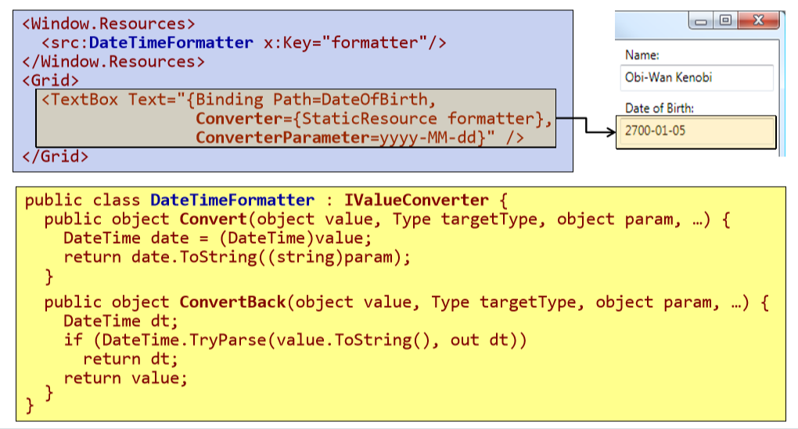
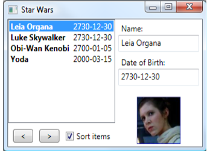
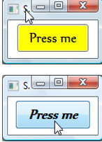

- [.NET Windows Presentation Framework (WPF)](#net-windows-presentation-framework-wpf)
  - [Historische Entwicklung](#historische-entwicklung)
  - [Architektur](#architektur)
  - [Neuerungen in der WPF](#neuerungen-in-der-wpf)
  - [Deklerative Programmierung](#deklerative-programmierung)
  - [Trennung von Layout und Code](#trennung-von-layout-und-code)
  - [Das Übersetzungsmodell](#das-%C3%BCbersetzungsmodell)
  - [XAML](#xaml)
    - [Was ist XAML](#was-ist-xaml)
    - [Abbildung XAML -> .NET Konstrukte](#abbildung-xaml---net-konstrukte)
    - [Eigenschaftselemente](#eigenschaftselemente)
    - [Kindelemente](#kindelemente)
    - [Kindelemente - Content Properties](#kindelemente---content-properties)
    - [Typkonverter](#typkonverter)
    - [Markup Extensions](#markup-extensions)
    - [Einbindung von .NET Klassen](#einbindung-von-net-klassen)
  - [Aufbau von WPF-Programmen](#aufbau-von-wpf-programmen)
    - [Klassen Application und Window](#klassen-application-und-window)
    - [Hello World mit der WPF](#hello-world-mit-der-wpf)
    - [Das "Code-Behind" Konzept](#das-%22code-behind%22-konzept)
  - [Klassen der WPF](#klassen-der-wpf)
    - [Basisklassen der WPF](#basisklassen-der-wpf)
    - [DispatcherObject](#dispatcherobject)
    - [await/async und die WPF](#awaitasync-und-die-wpf)
    - [DependencyObject](#dependencyobject)
    - [Implementierung von Dependency Properties](#implementierung-von-dependency-properties)
    - [Anwendungsbeispiele für Dependency Properties](#anwendungsbeispiele-f%C3%BCr-dependency-properties)
    - [Attached Properties](#attached-properties)
    - [Implementierung von Attached Properties](#implementierung-von-attached-properties)
    - [Visual (und Visual 3D)](#visual-und-visual-3d)
    - [Andere Basisklassen der WPF](#andere-basisklassen-der-wpf)
    - [Die wichtigsten Steuerelemente](#die-wichtigsten-steuerelemente)
    - [ContentControl](#contentcontrol)
    - [HeaderedContentControl](#headeredcontentcontrol)
    - [Steuerelemente zur Darstellung und Bearbeitung von Text](#steuerelemente-zur-darstellung-und-bearbeitung-von-text)
    - [Steuerelemente mit mehreren Kindelementen (ItemsControl)](#steuerelemente-mit-mehreren-kindelementen-itemscontrol)
    - [Listen mit Auswahlmöglichkeit (Selector)](#listen-mit-auswahlm%C3%B6glichkeit-selector)
    - [Menüs](#men%C3%BCs)
  - [Layout Klassen](#layout-klassen)
    - [Die Layout-Klassen der WPF](#die-layout-klassen-der-wpf)
    - [Layout-Klassen (Panels)](#layout-klassen-panels)
    - [Layout-Properties](#layout-properties)
    - [Layout: Canvas](#layout-canvas)
    - [Layout: StackPanel](#layout-stackpanel)
    - [Layout: DockPanel](#layout-dockpanel)
    - [Layout: WrapPanel](#layout-wrappanel)
    - [Layout: UniformGrid](#layout-uniformgrid)
    - [Layout Grid](#layout-grid)
    - [ScrollViewer und Viewbox](#scrollviewer-und-viewbox)
  - [Ressourcen](#ressourcen)
    - [Ressourcen](#ressourcen-1)
    - [Logische Ressourcen](#logische-ressourcen)
    - [Zugriff auf logische Ressourcen](#zugriff-auf-logische-ressourcen)
    - [Gültigkeitsbereiche von Ressourcen](#g%C3%BCltigkeitsbereiche-von-ressourcen)
    - [Resource Dictionaries](#resource-dictionaries)
  - [Routed Events und Kommandos](#routed-events-und-kommandos)
    - [Behandlung von Ereignissen](#behandlung-von-ereignissen)
    - [Routed Events](#routed-events)
    - [Kommandos](#kommandos)
    - [Bindung von Kommandos](#bindung-von-kommandos)
  - [Datenbindung](#datenbindung)
    - [Problemstellung](#problemstellung)
    - [Definition einer Bindung](#definition-einer-bindung)
    - [Die wichtigsten Bindungseigenschaften](#die-wichtigsten-bindungseigenschaften)
    - [Kopplung zweier GUI-Elemente](#kopplung-zweier-gui-elemente)
    - [Propagation von Eigenschaftsänderungen](#propagation-von-eigenschafts%C3%A4nderungen)
    - [Kopplung von GUI-Elementen an ein Datenobjekt](#kopplung-von-gui-elementen-an-ein-datenobjekt)
    - [Data-Templates](#data-templates)
    - [Typkonvertierung](#typkonvertierung)
    - [Validierung](#validierung)
    - [Sichten (Views)](#sichten-views)
    - [Model-View-ViewModel (MVVM)](#model-view-viewmodel-mvvm)
  - [Styles und Templates](#styles-und-templates)
    - [Styles](#styles)
    - [Arten von Styles](#arten-von-styles)
    - [Trigger](#trigger)
    - [Control-Templates](#control-templates)
    - [Beispiel: Alternatives Template für Button](#beispiel-alternatives-template-f%C3%BCr-button)
    - [TemplateBinding](#templatebinding)
  - [Animation und Grafik](#animation-und-grafik)
    - [Animation](#animation)
    - [2D-Grafik](#2d-grafik)
    - [3D-Grafik](#3d-grafik)
    - [Zusammenfassung](#zusammenfassung)

# .NET Windows Presentation Framework (WPF)

## Historische Entwicklung

* Win32-Anwendungen
    *  Kennzeichen: Direkte Verwendung von Win32-APIs: user32.dll, kernel32.dll, gdi32.dll.
    *  Layout: C/C++-Quelltext, keine Werkzeugunterstützung
    *  Repräsentation des Layouts: Quelltext. 
    *  Methodik: Hauptereignisschleife, Funktionszeiger, Windows-Nachrichten
    *  Grafikprogrammierung: GDI 

Win32 API hat sich bis heute im Kern nicht geändert, es wurde jedoch mehrere Abtrahierungsschichten hinzugefügt, die die Verwendung erleichert.

* Microsoft Foundation Classes (MFC)
    *  Kennzeichen: Dünne Schicht über Win32-APIs, Application-Framework. 
    *  Layout: Quelltext, einfache Werkzeugunterstützung.
    *  Methodik: OO-Konzepte (Vererbung und dynamische Bindung), Makros (Message-Maps). 
    *  Repräsentation des Layouts: Quelltext, Ressourcen
    *  Grafikprogrammierung :Alle Properties habe * Kennzeichen: Gute Abstraktion der Win32-API, einfache Integration von COMKomponenten, proprietäre Sprache
    * Layout: grafisches Designer-Werkzeug, einfache Verwendbarkeit von ActiveXControls (anfangs VBX-Controls).
    *  Repräsentation des Layouts: proprietäres (Text-)Format
    *  Methodik: Registrierung von Callback-Funktionen, Auslagerung der Geschäftslogik in COM-Komponenten. 
    *  Grafikprogrammierung: 
    *  Vorzüge:
        *   GUI-Entwicklung wesentlich vereinfacht (Hauptgrund für Popularität von VB6)
        *   Unterstützung komponentenorientierter SW-Entwicklung
    * NachTeile:
        * Proprietäre Programmiersprache für größere Anwendungen unbrauchbar.
        * Kein Framework.

#### Kommentare:
    * extrem gut angekommen bei den Kunden
    * Verbindung mit C++ war schwer
    * Grafik noch immer mit GDI
    * keine Geschäftslogik in VB
    * Komponentenmodell einfach erweiterbar (visuell erweiterbar)

* Windows Forms 
    *  Layout: grafisches Design-Werkzeug, Möglichkeit zur Erweiterung bzw. Neuentwicklung von Steuerelementen. 
    *  Repräsentation des Layouts: generierter Quelltext. 
    *  Methodik: Ereignisbehandlung über Delegates, einfache Anbindung der Geschäftslogik. 
    *  Grafikprogrammierung: GDI+
    *  Vorzüge: 
        *   Volle Integration in das .NET-Framework,
        *   exzellentes Design-Werkzeug,
        *   Entwicklung von vollwertigen Steuerelementen ist einfach, umfangreiches Angebot an Komponenten. 
    * Nachteile:
        * Unflexibles Layoutmanagement
        * keine konsequente Trennung von Layout und Code (da Layout auch als Code repräsentiert wird)
        * Grafikfähigkeiten moderner PCs werden nicht genutzt (da noch immer GDI32.dll als Grundlage dient)

#### Kommentare:
    * in der Industrie nach wie vor verwendet
    * einfach die BL und GUI zu verbinden 
    * basierend auf C#


## Architektur


#### Kommentare
    * wir werden uns auf REST konzentrieren
    
 
 
#### Kommentare
    * 2 Kategorien von Komponenten: 
        * unterer Bereich: native/nicht verwaltete Komponente(->OS)
            * Media Integration Layer: rendert den Szenengraph
        * oberer Bereich: .Net Komponenten
            * WPF Bestandteil des .NET Frameworks
            * DispatcherObjekt - für Asynchronität zuständig
            * jede Eigenschaft in einer WPF Anwendung -> Dependency Property
            * 2D und 3D - direkt in WPF integriert 
                (da für Animationseffekte, Skalieren von JPacks, etc. häufig gebraucht ) 
                - früher nicht direkt integriert
            * Animation: sagen eine Property ändert sich  über die Zeit und 
                die WPF stellt das dar
            * ... auf manche Punkte wird später näher eingegangen

## Neuerungen in der WPF
* Deklarative Programmierung (XAML)
* Einheitliche API:
    *  2D-Grafik (ersetzt GDI, GDI+),
    *  3D-Grafik (deckt Teilbereiche von Direct3D bzw. OpenGL ab),
    *  UI (ersetzt user32.dll bzw. Windows Forms),
    *  Bild und Ton (DirectShow).
*  Vektor-Grafik
*  Neues Programmiermodell für Grafikanwendungen
*  Starke Unterstützung von Text-Dokumenten
*  Verhalten und Aussehen von Steuerelementen sind voneinander getrennt (Styles und Templates).
*  Neues Konzept zur Datenbindung

#### Kommentare
    * alles ist Vektorgraphik (bis hin zum Text)
    * ganz wichtig: XAML (auf den Folien weggelassen)

## Deklerative Programmierung
Benutzeroberflächen können in XAML (eXtensible Application Markup Language) beschrieben werden.
```xml
<?xml version="1.0" encoding="UTF-8"?>
<Window xmlns="http://.../xaml/presentation" xmlns:x="http://.../xaml" x:Class="XamlExperiments.SimpleDialog" Title="XamlExperiments" Height="107" Width="200">
   <Grid>
      <Label Height="25" HorizontalAlignment="Left" Margin="20,15,0,0" Name="label" VerticalAlignment="Top" Width="60">Name:</Label>
      <TextBox Height="25" Margin="80,15,10,0" Name="textBox" VerticalAlignment="Top" Padding="5,5,5,5">Hallo</TextBox>
      <Button Margin="0,0,0,10" Name="button" Height="23" VerticalAlignment="Bottom" HorizontalAlignment="Center" Width="80">Ok</Button>
   </Grid>
</Window>
```

#### Kommentare
    * werden XAML selbst schreiben um ein besseres Gefühl dafür zu bekommen 
        (kann allerdings generiert werden) - vgl. HTML
    * Grid - kümmert sich um die Anordnung der Elemente
    * für graphische Repräsentierung
    * Vorteile:
        * kann sagen, dass der graphische Teil erst von einem 
            GUI Designer erstellt wird (z.B. Blend -> WPF Andwendung)
        * XAML wird aus dem Designer generiert

## Trennung von Layout und Code


#### Komentare
    * wie immer: sehr, sehr wertvoll, dass man die Arbeit aufteilen kann
    
## Das Übersetzungsmodell


#### Kommentare
    * es kommt eine dll oder exe heraus, in welcher alles drinnen steht
    * -> sehr kompakte Form

## XAML
### Was ist XAML

* XAML ist eine XML-Sprache zur Beschreibung und Initialisierung von .NET-Objektgraphen.
    * WPF: Beschreibung von Benutzeroberflächen
    * WF: Beschreibung von Workflows
* Abbildung:
    * CLR-Namenräume -> XML-Namenräume (mithilfe des Attributs XmlnsDefinitionAttribute).
    * Klassen -> XML-Elemente
    * Properties -> XML-Attribute
    * Registrierung von Ereignisbehandlungsmethoden -> XML-Attribute.
    * Es existieren zahlreiche Konverter, die Zeichenketten (Werte von XMLAttributen) in die pas Abbildung XAML -> .NET-Konstrukteenden CLR-Datenty -> .NET-AKonstruktendeln.

#### Kommentare
    * ist dafür bestimmt um statische Workflows/Objektgrafiken zu beschreiben
    * Ergebnis davon ist eine GUI (Grid, Textbox, ...)

### Abbildung XAML -> .NET Konstrukte


#### Kommentar
    * xaml element == c# objekt

### Eigenschaftselemente
* Viele Properties können komplexe Datentypen aufweisen, z. B. die Property Content von Button:  
    ```csharp
    Button btn = new Button();
    ImageSource bitmap = new BitmapImage(new Uri(…));
    Image image = new Image {
        Source = bitmap, Height = 50, Width = 80
    };
    btn.Content = image;
    ```
*  Komplexe Datentypen sind nicht direkt auf XAML-Attribute abbildbar:
    ```csharp
    <Button Content="<Image …/>" /> <!-- funktioniert nicht! -->
    ```
* Eigenschaftselemente können komplexe Datentypen aufnehmen:
    ```xaml
    <Button>
        <Button.Content>
            <Image Source="smily.jpg" Height="50" Width="80" />
        </Button.Content>
    </Button>
    ```

#### Kommentar
    * komplexe Propertys müssen als ein Property-Element dargestellt werden

### Kindelemente


### Kindelemente - Content Properties


#### Kommentare
    * gibt Steuerelemente, die haben Properties 
        * z.B. ListBox bei denen man sich mehrere Elemente erwartet
        * oder bspw. unter Dictionary erwartet man sich eine map
    * die Steuerelemente haben sehr viele Properties
        * diese Properties können auch wieder Properties haben, 
        * dadurch kann sich eine Baumstruktur aufbauen

### Typkonverter

*  In vielen Fällen können einfache Typen in XAML nur sehr schwerfällig beschrieben werden:
    ```xaml
    <Button.Background>
        <SolidColorBrush>
            <SolidColorBrush.Color>
                <Color A="255" R="255" G="255" B="255"/>
            </SolidColorBrush.Color>
        </SolidColorBrush>
    </Button.Background>
    ```
    
* Typkonverter tragen zur Vereinfachung der XAML-Beschreibung bei
    ```xaml
    <Button Background="White" />
    ```
    
* Typkonverter sind von TypeConverter abgeleitet und werden mit dem Attribut TypeConverterAttribute mit einem Typ oder einer Property verbunden
    ```csharp
    [TypeConverter(typeof(BrushConverter))] public abstract class Brush : … { … }
    ```

### Markup Extensions
* Mit Markup-Extensions können Attributwerte flexibel definiert werden:
    ```xaml
    <Element SomeProperty = "{MyMarkupExtension Prop1=Value}">
    ```
    
* Die Markup-Extension fasst Parameter zusammen, die Property-Wert bestimmen.
* ProvideValue liefert den Wert, welcher der Property zugewiesen wird. 
    ```csharp
    public MyMarkupExtension: MarkupExtension {
     public override object ProvideValue(…);
     public object Prop1 {…}
    }
    ```
    
*  Wichtigste Anwendungen:
    *  x:Static[Extension] 
    *  Bindung
    *  StaticResource[Extension] 
    *  DynamicResource[Extension]
* Beispiel:
    ```xaml
    <Button Height="{x:Static Member = SystemParameters.IconHeight}"/>
    <TextBox Text="{Binding Path=LastName}"/>
    ```

#### Kommentar
    * wird vorallem bei Datenbindung benötigt

### Einbindung von .NET Klassen

* Mit XAML können Objekte beliebiger .NET-Klassen erzeugt werden.
* Die Initialisierung erfolgt über Attribute (-> Properties) bzw. Typkonverter.  
    


#### Kommentar
    * muss auf die Namespaces aufpassen

## Aufbau von WPF-Programmen

Hello World Code:
```csharp
public class HelloWindow: Window {
 private Button btn;
 public HelloWindow() {
  btn = new Button() {
   Content = "Quit"
  };
  btn.Click += new RoutedEventHandler(OnClick);
  this.AddChild(btn);
  this.Title = "WPF Hello App";
  this.Width = 120;
  this.Height = 80;
 }
 void OnClick(object sender, RoutedEventArgs e) {
  this.Close();
 }[STAThread] static void Main(string[] args) {
  Application app = new Application();
  app.Run(new HelloWindow());
 }
}
```

#### Kommentare
    * im Main - Hauptereignisschleife 
        - muss in einem single thread liegen ->[STAThread]
    * RoutedEventHandler - kann Buttoneven z.B. auch im 
        Fenster in welchem er enthalten ist handlen
    * Applikationsobjekt (Singleton) - auch wenn es mit 
        einem Konstruktor erzeugt werden kann

### Klassen Application und Window

* Das Singleton Application verwaltet die Fenster und die Hauptereignisschleife einer WPF-Anwendung  
    ```csharp
    Application app = new Application();
    ```

*  Methode Run:  Start der Hauptereignisschleife 
    ```csharp
    Window win = new Window();
    app.Run(win);
    ```
    
* Equivalent zu: 
    ```csharp
    Window win = new Window();
    win.Show();
    app.Run();
    ```

* Methode ShutDown: Beenden der Hauptereignisschleife.
* Property MainWindow: Festlegung des Hauptfensters einer Anwendung. 
* Property ShutdownMode: OnLastWindowClose/OnMainWindowClose/OnExplicitShutdown
* Ereignis Startup: Hauptereignisschleife wurde gestartet.
* Ereignis SessionEnding: Benutzer loggt sich aus Windows aus.

#### Kommentar
    * übersprungen

### Hello World mit der WPF

```xaml
<Application
    xmlns="http://schemas.microsoft.com/winfx/2006/xaml/presentation"
    StartupUri="HelloWindow.xaml" />
```

```xaml
<Window
    xmlns="http://schemas.microsoft.com/winfx/2006/xaml/presentation"
    xmlns:x="http://shcemas.microsoft.com/winfx/2006/xaml"
    x:Class="HelloWindow"
    Title="WPF Hello App" Width="120" Height="80">
  <Button Click="OnClick">
      Quit
  </Button>
</Window>
```

```csharp
public partial class HelloWindow: Window {
 private void OnClick(object sender, RoutedEventArgs e) {
  this.Close();
 }
}
```

#### Kommentare
    * in <Application...> legt man das Hauptfenster fest, welches 
        dadurch als erstes Aufgerufen wird
    * Finger: <Window ...> in welchem die Eigenschaften festgelegt werden
    * Ereignisbehandlung ist partial, Teil generiert Teil selbstentwickelt

### Das "Code-Behind" Konzept


#### Kommentar
    *xaml wird im generierten Code geladen und verbindung hergestellt

## Klassen der WPF

### Basisklassen der WPF


#### Kommentare
    * WPF - Objektorientiertes Framework
    * Spitze vom Vererbungsbaum
    * darüber gibt es nur noch Object
    * DispatcherObject: für asynchrone Synchronisierung 
    * UIElement: kann sich auf Events registrieren
    * FrameworkElement: kann sich auf Ressourcen registrieren 

### DispatcherObject


#### Kommentar
    * bei Invoke muss man ein Delegate-Objekt angeben

### await/async und die WPF

*  await/async vereinfacht die asynchrone Programmierung enorm
*  Der Synchronisationskontext der WPF (DispatcherSynchronizationContext) sorgt dafür, dass nach Aufruf einer asynchronen Methode im UI-Thread, die Ausführung wieder im UIThread fortgesetzt wird.
    ```csharp
    void async Task < object > MethodExecutedInSomeThreadAsync() {…}
    void SomeEventHandler() {
    // wird im UI-Thread ausgeführt
    var result = await MethodExecutedInSomeThreadAsync();
    label.Content = result.ToString();
    // wird im UI-Thread ausgeführt. }
    ```

#### Kommentare
    * sobald das await zurück kommt, befindet man sich wieder im UI Thread
    * await bedeutet nicht, dass nichts gemacht wird! (UI Thread blockiert nicht)

### DependencyObject

* Ermöglicht die Definition von Dependency Properties.
* Einfache .NET-Properties verwalten nur einen Wert.
* Dependency Properties haben zusätzliche Eigenschaften
    *  Es kann ein Standardwert definiert werden.
    *  Der Wert kann von Elternelementen im Steuerelementebaum geerbt werden.
    *  Bei Wertänderungen werden Ereignisse gefeuert. 
*  Dependency Properties werden zur Realisierung zahlreicher WPFKonzepte benötigt: 
    *  Styling
    *  Datenbindung
    *  Animationen 
* Da nur von den Standardwerten abweichende Werte gespeichert werden, wird auch der Speicherplatzbedarf reduziert

#### Kommentare
    * normale Property hat nur eine Eigenschaft: Wert
    * eine Dependency Property hat mehrere Eigenschaften
    * auf der Ebene vom Fenster definiert man etwas 
        - und alle Elemente des Fensters bekommen diese Veränderung mit 
    * wird typischerweise bei Sytles verwendet (z.B. hover over btn)
    

### Implementierung von Dependency Properties

```csharp
public class Control: FrameworkElement { 
// Deklaration der Dependency Property als Klassendatenkomponente 
public static readonly DependencyProperty FontSizeProperty;
static Control() { 
//  Festlegung der Eigenschaften der Property 
Control.FontSizeProperty = DependencyProperty.Register( 
    "FontSize", //  Name 
    typeof(double), //  Propertytyp 
    typeof(Control),  //  Besitzer 
    new FrameworkPropertyMetadata(12.0, //  Standardwert 
        FrameworkPropertyMetadataOptions.AffectsRender |
        FrameworkPropertyMetadataOptions.AffectsMeasure | 
        FrameworkPropertyMetadataOptions.Inherits)
    ...
}
    //  Definition einer .NET-Property zur Verwaltung des Property-Werts 
        public double FontSize { 
        get { return (double)GetValue(Control.FontSizeProperty); } 
        set { SetValue(Control.FontSizeProperty, value); }
    }
}
        
```

#### Kommentare
    * braucht Metadaten (die mit der Klasse und nicht einem Objekt verbunden sind)
    * DependencyProperty -> statisch für alle Properties eingeführt
    * im statischen Konstruktor bzw. Initialisierer können die Eigenschaften angeführt werden
    * Metadaten die man festlegen muss sind z.B. Standardwerte
    * daher ist das eine sehr effiziente Art um sie zu speichern
    * DependencyObjects -> änderbar, einfach durch eine Zuweisung
    * für jedes Objekt ist eine Hashtabelle -> in dieser sind die Werte gespeichert
    * sind keine Werte gespeichert, so werden die Standardwerte verwendet
    * diese Werte sind bei DependencyObject realisiert

### Anwendungsbeispiele für Dependency Properties

*  Beispiel 1: Vererbung von Property-Werten
    ```xaml
    <Window FontSize="20">
        <StackPanel>
            <Button Content="My Button">
                <Label Content="Some Label" />
            </StackPanel>
        </Window>
    ```
    
*  Beispiel 2: Styling von Steuerelementen 
    ```xaml
    <Style TargetType="{x:Type Button}">
        <Setter Property="Foreground" Value="Green"/>
        <Style.Triggers>
            <Trigger Property="IsMouseOver" Value="True">
                <Setter Property="FontSize" Value="25" />
            </Trigger>
        </Style.Triggers>
    </Style>
    ```
    
*  Beispiel 3: „Abhorchen“ von Änderungen des Property-Werts 
    ```csharp
    DependencyPropertyDescriptor propDescr = 
        DependencyPropertyDescriptor.FromProperty(
            UIElement.IsMouseOverProperty, typeof(UIElement)
        );
    propDescr.AddValueChanged(button, (object source, EventArgs e) => …);
    ```


### Attached Properties

* Attached Properties sind spezielle Dependency Properties, die Objekten beliebiger Klassen zugeordnet werden können.
* Diese Klassen dienen lediglich als Datenbehälter, verwendet werden diese Attached Properties von anderen Klassen.
* Typische Anwendung: Layout-Klassen 
    * Positionsparameter müssen bei den Kindelementen gespeichert werden.
    * In Kindelementen können nicht für alle möglichen Layout-Klassen Properties vorgesehen werden (keine Erweiterungsmöglichkeit). 
* Verwendung in XAML
    
    ```xaml
    <DockPanel>
        <Button Name="button" DockPanel.Dock="Top">My Button</Button> </DockPanel> 
    ```

* Verwendung im Code
    
    ```csharp
    DockPanel.SetDock(button, Dock.Bottom);
    ```

#### Kommentare
    * AttachedProperties -> Erweiterung von DependencyProperties
    * jeder Layoutcontainer hat andere Properties
    * wenn man ein eigenes Layout speichert 
        - wie bekommt man diese Properties in die bestehende Steuerelemente hinein?
    * Erweiterungsmglk. durch AttachedoProperties
    * gespeichert wird die Property im Element vom Layoutcontainer

### Implementierung von Attached Properties

```csharp
class DockPanel: Panel {
  public static readonly DependencyProperty DockProperty;
  static DockPanel() {
   DockProperty = DependencyProperty.RegisterAttached(
       "Dock", typeof(Dock), typeof(DockPanel), new FrameworkPropertyMetadata(…)
    );
   public static Dock GetDock(UIElement element) {
    return (Dock) element.GetValue(DockPanel.DockProperty);
   }
   public static void SetDock(UIElement element, Dock dock) {
    element.SetValue(DockPanel.DockProperty, dock);
   }
  }
```

* Die Deklaration der Property erfolgt in DockPanel.
* Die Property-Werte werden aber in den Kindelementen gespeichert.


### Visual (und Visual 3D)

*  Visual stellt Funktionalität zum Zeichnen von Steuerelementen zur Verfügung. Der Visual Tree wird durchlaufen und mit Hilfe von DirectX am Anzeigegerät dargestellt (im Media Integration Layer).   
    


### Andere Basisklassen der WPF

* UIElement
    * Verarbeitung von Benutzereingaben (Routed Events)
    * Unterstützung für Layoutsystem (Positionierung, Größenbestimmung)
* FrameworkElement
    * Datenbindung
    * Styling
    * Lokale Ressourcen
* Control
    * Basisklasse für alle Elemente, mit denen Benutzer interagieren kann.
    * Unterstützung von Styles und Control-Templates.
* Panel
    * (Abstrakte) Basisklasse für alle Layout-Manager.


### Die wichtigsten Steuerelemente


#### Kommentar
    *label == beliebiger content

### ContentControl

- Steuerelemente dieser Gruppe können ein beliebiges Kindelement enthalten (nicht nur eine Zeichenkette).
- Beispiele:  
    
    
#### Kommentare
    * StackPanel bedeutet horizontal bzw. vertikal anordnen -> kann Elemente zusammenfassen
    * alles was von der WPF nicht dargestellt werden kann wird zu einem String konvertiert

### HeaderedContentControl

- Steuerelement besitzt neben dem Kindelement eine Überschrift.
- Beispiele:  
    

#### Kommentar
    * Controls die sowohl einen Content als auch einen Header haben
    
    
### Steuerelemente zur Darstellung und Bearbeitung von Text
- TextBlock: Darstellung von Text in verschiedenen Fonts und mit diversen Hervorhebungsarten.  
    

### Steuerelemente mit mehreren Kindelementen (ItemsControl)


### Listen mit Auswahlmöglichkeit (Selector)


#### Kommentare
    * Contentproperty sind die Items
    * Items dürfen wieder eine beliebige Struktur haben /beliebig komplex sein

### Menüs


#### Kommentare
    * Einen Header (_File)
    * kaskadierende Menu items (beliebige Hierachien)

## Layout Klassen

### Die Layout-Klassen der WPF


#### Kommentare
    * C# unterstützt nur Single inheritence
    * viele Steuerelemente (z.B. Contentcontrols) können eine Scrollbar hinzufügen
    * in der WPF - alles Vektorgrafik - dadurch können 
        alle Kindelemente beliebig angepasst werden

### Layout-Klassen (Panels)

* Layout-Klassen ermitteln den Platzbedarf der Kindelemente (measure) und
ordnen die Elemente im Behälter an (arrange).
* Jedem Kindelement wird eine Layout-Zelle zugeordnet. Die Positionierung
innerhalb der Zelle wird durch Layout-Properties definiert, die den
Kindelementen zugeordnet werden.
* Größenangaben erfolgen in geräteunabhängigen Einheiten (logischen Einheiten).
    * 1 logische Einheit = 1/96 Zoll
    * Beispiel: Width="96" entspricht Width="1in" bzw. Width="2.54cm".
    * Das Verhältnis logische Einheit zu physischer Einheit hängt von der physischen und der in Windows definierten Pixeldichte (DPI Scaling) ab.
    * Physische Pixeldichte = Windows-Pixeldichte = 96 DPI
        * 96 logische Einheiten = 96 physische Einheiten = 1 Zoll
    * Physische Pixeldichte = Windows-Pixeldichte = 192 DPI
        * 96 logische Einheiten = 192 physische Einheiten = 1 Zoll
    * Fonts werden ebenfalls in logischen Einheiten angegeben: FontSize="11" entspricht FontSize="8.25pt" (8.25pt = 8.25/72in = 11/96in)  
    

#### Kommentare
    * Aufgabe der Layoutcontainer: Kindelemente entsprechend der Wünsche anzupassen
    * Größenangabe in logischen Pixel (96 ohne Zusatz -> 1 inch)
    

### Layout-Properties 

- Width/Height: Fixe Breite/Höhe in logischen Einheiten.
    - Mit dem Standardwert Auto überlässt man der Layout-Klasse die Festlegung der Größe des Elements (Width="Auto").
    - Tatsächliche Größe kann mit ActualWidth/ActualHeight ermittelt werden.
- MinWidth/MinHeight/MaxWidth/MaxHeight: 
  Minimale/Maximale Breite/Höhe.
- HorizontalAlignment= ["Left"|"Right"|"Center"|"Stretch"]:  
  Horizontale Ausrichtung, falls LayoutZelle breiter ist als das Kindelement.  
    

- VerticalAlignment= ["Top"|"Bottom"|"Center"|"Stretch"]:   
  Horizontale Ausrichtung, falls LayoutZelle höher ist als das Kindelement.  
    

- Margin="Left,Top,Right,Bottom": 
  Abstand des Kindelements zu den Rändern der Layout-Zelle.
- Padding="Left,Top,Right,Bottom": 
  Abstand des Inhalts zum Rand des Kindelements.  
    


- LayoutTransform: 
  Transformationsmatrix, die auf Kindelement angewandt wird (bewirkt Verschiebung, Skalierung, Rotation bzw. Verzerrung). Umschließendes Rechteck wird neu berechnet.
- Rendertransform: 
  Wie LayoutTransform, die Größe des umschließenden Rechtecks wird aber nicht neu ermittelt  
    

#### Kommentare - Summary der folgenden Panels
    * Stackpanel - (horizontal oder vertikal) mit orientation festgelegt
    * einfache Layouts (Elemente werden untereinander üder übereinander angeordnet)
    * Wrappanel - Elemente können umgebrochen werden
    * UniformGrid - in gleiche Zeilen und Spalten aufgeteilt 
    * Grid - same nur mit verschieden gr. Zellen (damit ist man sehr flexibel)
    * Dockpanel - für Toplevellayout
    * Scrollview - wenn kein Platz ist erscheint Dohovakin und bringt Scrollbars an
    

### Layout: Canvas

* Elemente können an maximal zwei angrenzenden Kanten angehängt werden. 
* Wichtige Layout-Properties: 
    * Margin: Nur für Seiten relevant, an die das Element angehängt wurde.
    ```xaml
    <Canvas Name="layoutRoot">
        <Button                                      Background="Red"    >…</Button>
        <Button Canvas.Left="18"  Canvas.Top="18"    Background="Orange  >…</Button>
        <Button Canvas.Right="18" Canvas.Bottom="18" Background="Yellow  >…</Button>
        <Button Canvas.Right="0"  Canvas.Bottom="0"  Background="Lime"   >…</Button>
        <Button Canvas.Right="0"  Canvas.Top="0"     Background="Aqua"   >…</Button>
        <Button Canvas.Left="0"   Canvas.Bottom="0"  Background="Magenta">…</Button>
    </Canvas>
    ```  
    

### Layout: StackPanel

```xaml
<StackPanel x:Name="layoutRoot" Orientation="Vertical">
	<Button.Background="Red"...>1
	</Button>
	<Button Background="Orange">2</Button>
	<Button Background="Yellow">3</Button>
	<Button Background="Lime"  >4</Button>
	<Button Background="Aqua"  >5</Button>
</StackPanel>
```

* Elemente werden übereinander  (vertikal) oder nebeneinander (horizontal) angeordnet. 
* Wichtige Layout-Properties: 
    * Margin 
    * HorizontalAlignment (falls Orientation="Vertical")
    * VerticalAlignment (falls Orientation="Horizontal")  
    

### Layout: DockPanel

```xaml
<DockPanel>
	<Button DockPanel.Dock="Top"    Background="Red"  >1 (Top)</Button>
	<Button DockPanel.Dock="Top"    Background="Red"  >2 (Top)</Button>
	<Button DockPanel.Dock="Left"   Background="Orange">3 (Left)</Button>
	<Button DockPanel.Dock="Right"  Background="Yellow">4 (Right)</Button>
	<Button DockPanel.Dock="Bottom" Background="Lime" >5(Bottom)</Button>
	<Button Background="Aqua" >6</Button>
</DockPanel>
```

* Elemente werden entlang der Ränder des Behälters angeordnet.
* Wichtige Layout-Properties
    * Margin 
    * HorizontalAlignment: für oben, unten und im Zentrum angeordnete Elemente. 
    * VerticalAlignment: für links, rechts und im Zentrum angeordnete Elemente.  

    

### Layout: WrapPanel

```xaml
<WrapPanel Name="layoutRoot" Orientation="Horizontal">
	<Button Background="Red" >1</Button>
	<Button Background="Orange" >2</Button>
	<Button Background="Yellow" >3</Button>
	<Button Background="Lime" >4</Button>
	<Button Background="Aqua" >5</Button>
</WrapPanel>
```

*  Elemente werden von zeilenweise von rechts nach links oder spaltenweise von oben nach unten angeordnet.
*  Wichtige Layout-Properties
    *  Margin
    *  HorizontalAlignment (falls Orientation="Vertical"): Ausrichtung der Elemente innerhalb einer Zeile.
    *  VerticalAlignment (falls Orientation="Horizontal"): Ausrichtung der Elemente innerhalb einer Spalte  


### Layout: UniformGrid

```xaml
<UniformGrid x:Name=layoutRoot" Rows="2" Columns="3">
	<Button Grid.Row="0" Grid.Column="0" Background="Red">0/0</Button>
	<Button Grid.Row="0" Grid.Column="1" Background="Orange">0/1</Button>
	<Button Grid.Row="0" Grid.Column="2" Background="Yellow">0/2</Button>
	<Button Grid.Row="1" Grid.Column="0" Background="Lime">1/0</Button>
	<Button Grid.Row="1" Grid.Column="1" Background="Aqua">1/1</Button>
	<Button Grid.Row="1" Grid.Column="2" Background="LightBlue">1/2</Button>
</UniformGrid>
```

* Jedes Element bekommt eine gleich große Zelle zur Verfügung gestellt.
* Wichtige Layout-Properties
    * Margin
    * HorizontalAlignment
    * VerticalAlignment  


### Layout Grid

```xaml
<Grid x:Name= "layoutRoot">
	<Grid.RowDefinitions>
		<RowDefinition Height="60"/>
		<RowDefinition Height="*"/>
	</Grid.RowDefinitions>
	<Grid.ColumnDefinitions>
		<ColumnDefinition Width="Auto"/>
		<ColumnDefinition Width="2*" />
		<ColumnDefinition Width="3*" />
	</Grid.ColumnDefinitions>
	<Button Grid.Row="0" Grid.Column="0" Background="Red"   >…</Button>
	<Button Grid.Row="0" Grid.Column="1" Background="Orange">…</Button>
	<Button Grid.Row="0" Grid.Column="2" Background="Yellow">…</Button>
	<Button Grid.Row="1" Grid.Column="0" Background="Lime"  >…</Button>
	<Button Grid.Row="1" Grid.Column="1" Background="Aqua"  >…</Button>
	<Button Grid.Row="1" Grid.Column="2" Background="Magenta">…</Button>
</Grid>
```


* Der verfügbare Platz wird in Zeilen und Spalten zerlegt
* Die Art der Zeile/Spalte bestimmt seine Höhe/Breite:
    *  Zeile/Spalte hat eine fixe Höhe/Breite: `<RowDefinition Height="60">`
    *  Zeile/Spalte bekommt so viel Platz, wie für das größte Kindelement zumindest erforderlich ist:
        `<RowDefinition Height="Auto">`
    *  Der restliche Platz wird unter den verbleibenden Zeilen/Spalten aufgrund Ihrer Gewichtung verteilt: 
        `<RowDefinition Height="2*">`
    *   Der Standardwert ist "*". 
* Mit dem Attribut RowSpan/ColumnSpan können Kindelemente auf mehrere Spalten/Zeilen verteilt werden. 
* Layout-Properties: 
    * Margin 
    * HorizontalAlignment
    * VerticalAlignment


### ScrollViewer und Viewbox


## Ressourcen

### Ressourcen

*  WPF unterstützt 
    *  Binäre Ressourcen (auf Basis von .NET 2.0) und 
    *  Logische Ressourcen (neu in der WPF). 
*  Binäre Ressourcen 
    *  Können in Assembly eingebettet werden (Resource) oder 
    *  lose (Content) mit der Anwendung verbunden sein
*  Zugriff auf binäre Ressourcen  
    

#### Kommentar
    * binäre Ressourcen - zum "Internationalisieren"
    
### Logische Ressourcen

* Häufig benötigte Objekte können an einer zentralen Stelle definiert und mehrmals in der WPF-Anwendung verwendet werden
*  Eine Ressource kann ein beliebiges .NET-Objekt sein, dem ein Schlüssel (x:Key) zugeordnet wird. 
*  Definition von Ressourcen in XAML  
    ```yaml
    <Window.Resources>
        <SolidColorBrush x:Key="backBrush" Color="Orange" /> 
    </Window.Resources>
    ```

* Definition von Ressourcen im Code  
    
    ```csharp
    window.Resources.Add("backBrush", Brushes.Orange);
    ```

* Ressourcen können jedem Objekt, das mindestens vom Typ FrameworkElement ist, zugeordnet werden

#### Kommentare 
    * zur konsistenten Beschreibung
    * gibt dem Element einen Key und hat danach die Mglk. auf das Element mittels des Keys zuzugreifen (XAML)
    * logische Ressourcen dienen dazu gewisse Elemente im Steuerelementebaum einmal zu definieren 
        und dann zu verwenden, um Codeverdoppelung im XAML Code zu vermeiden


### Zugriff auf logische Ressourcen

* StaticResource 
    * Ressource wird beim Laden des Fensters erzeugt und nur einmal auf das Ziel angewandt
    * Ressource muss in XAML definiert werden, bevor sie verwendet wird.  
    ```yaml
    <Button Background="{StaticResource backBrush}" … />
    ```

    ```csharp
    button.Background = (Brush)button.FindResource("backBrush");
    ```

* DynamicResource 
    * Ressource wird geladen, wenn sie benötigt wird (wenn das Objekt, das die Ressource referenziert, erzeugt wird). 
    * Element wird aktualisiert, wenn sich Ressource ändert  
    ```yaml
    <Button Background="{DynamicResource backBrush}" … />
    ```

    ```csharp
    button.SetResourceReference(Window.BackgroundProperty, "backBrush");
    ```

#### Kommentar
* dynamic ressource: Objekt reagiert sofort auf eine Änderung der Resource


### Gültigkeitsbereiche von Ressourcen


* Ressourcen können für jedes Element im Elementebaum definiert werden. 
* Anwendungsglobale Ressourcen werden dem Applikationsobjekt zugeordnet
* Ressourcen werden vererbt,  d. h. ein Element kann auch auf die Ressourcen der Elternelemente zugreifen

### Resource Dictionaries


*  Ressourcen können in eigene XAML-Dateien, so genannte Resource Dictionaries, ausgelagert werden. 
*  Auf diese Weise können Ressourcen zentral verwaltet und in mehreren Projekten verwendet werden.

## Routed Events und Kommandos

### Behandlung von Ereignissen

* Die Verbindung von Ereignissen mit Ereignisbehandlungsmethoden kann in XAML oder im Code erfolgen (auf Basis von .NET-Delegates)  
    ```yaml
    <Button Name="button1" Click="ButtonClick" Content="Button 1" /> 
    ```

    ```csharp
    button1.Click += new RoutedEventHandler(ButtonClick);
    private void ButtonClick(object sender, RoutedEventArgs e) { … } 
    ```


#### Kommentare
    * Alle Properties habemehrere Varianten des rooted Eventhandlers
    * Eventhandling über delegates

### Routed Events

* Routed Events werden auch an die Eltern- bzw. Kindelemente des Ereignisauslösers weitergereicht. 
* Jedem Ereignis ist eine Routingstrategie zugeordnet
    * Bubbling: Beginnend mit dem Auslöser wird das Ereignis auch in allen Vorgängern gefeuert
    * Tunneling: Feuern des Ereignisses in allen Elementen vom Wurzelelement bis zum Auslöser
    *  Direct: Ereignis wird nur im auslösenden Element gefeuert  
    

*  Unterbrechen des Routings  
    ```csharp
    private void EventHandler(object sender, RoutedEventArgs e) { … e.Handled = true; 
    	// Ab jetzt werden keine weiteren Handler aufgerufen.
    } 
    ```
    
* Sender und Auslöser (Source) eines Ereignisses  
    ```csharp
    private void EventHandler(object sender, RoutedEventArgs e) { 
    object source = e.Source; … 
    } 
    ```
    * sender: Objekt, das sich bei der Ereignisquelle registriert hat. 
    * e.Source: Objekt, welches das Ereignis ausgelöst hat. 
    * e.OriginalSource: Objekt im Visual Tree, welches das Ereignis ausgelöst hat


#### Kommentare
    * Eventhandling: tunneling von außen nach innen, bubbling von innen nach außen
    * wichtig in diesem Zusammenhang: gibt einen Sender und eine Source, die mit geschickt werden
    * Sender: wo man sich registriert hat
    * Auslöser des Events -> Source

### Kommandos

* Abstraktion von benutzergesteuerten Aktionen
* Auslösen und Ausführen der Aktion wird voneinander getrennt  
    

#### Kommentare
    * eine Implemtierung für Aktion, egal wie diese ausgelöst wurde
    * Auslöser können viele sein, Kommando nur eines

### Bindung von Kommandos

* Es gibt vordefinierte Kommandos vom Typ RoutedUICommand (ApplicationCommands.{Save, New, Close, Copy, …) 
*  RoutedUICommand sucht im Steuerelementebaum nach CommandBindings
    *  Die damit verbundenen Methoden werden ausgeführt  
    

```yaml
<Window.InputBindings>
	<KeyBinding Command="ApplicationCommands.Save" Key="S" Modifiers="Control" />
</Window.InputBindings>
<MenuItem Header="_Save" Command="ApplicationCommands.Save" />
<Button Content="Save" Command="ApplicationCommands.Save" />
<Window.CommandBindings>
	<CommandBinding Command="ApplicationCommands.Save" Executed="SaveExecuteHandler" CanExecute="SaveCanExecuteHandler" />
</Window.CommandBindings>
```

```csharp
public void SaveExecuteHandler(object sender,ExecutedRoutedEventArgs e) {…}

public void SaveCanExecuteHandler(object sender, CanExecuteRoutedEventArgs e) {
 e.CanExecute = …;
}
```

#### Kommentare
    * Outputbinding legt fest, welche Aktion tatsächlich durchzführen ist
    * Inputbinding ->ruft Commandbinding (?)

## Datenbindung

### Problemstellung


- GUI-Elemente müssen häufig mit Datenobjekten synchronisiert werden.-
- Ohne Framework-Unterstützung ist das relativ aufwändig:
    - GUI muss aktuelle Werte aus Datenobjekt auslesen.
    - Zustandsänderungen in der GUI müssen an Datenobjekt weitergeleitet werden: Registrierung von Ereignisbehandlungsmethoden, Konvertierung, Validierung, Speichern der neuen Werte.
    - Die Synchronisation der GUI-Elemente muss manuell erfolgen.
    - Änderungen am Datenobjekt müssen manuell an die GUI-Elemente weitergegeben werden.
- Bei vielen Frameworks muss die Definition der Beziehung zwischen GUI und Datenobjekt im Code erfolgen (nicht deklarativ).

#### Kommentare
    * Callbacks sind schlecht!!! Auf Änderungen muss aufgepasst werden (Initialisierungen, null werte)
    * Callbacks testen ist schwer, vorallem die Qualität des Test muss gleich sein
    * sollte es nicht quick und dirty machen

### Definition einer Bindung
- Mithilfe einer Bindung wird eine Property eines Quellobjekts (Source) mit einer Property eines Zielobjekts (Target) automatisch synchronisiert.  
    
    ```xaml
    <Container DataContext="{StaticResource sourceObject}">
        <Target TargProperty1="{Binding Path=SrcProperty1}" />
    </Container>
    ```

- Property DataContext wird vererbt -> ermöglicht zentrale Definition
- Anforderungen an die beteiligten Properties:
    - Zielproperty muss eine Dependency-Property sein.
- Quellproperty muss eine Dependency-Property sein oder die Quelle muss
    INotifyPropertyChanged implementieren, falls Wertänderungen der Quellproperty
    weitergeleitet werden sollen.
    
#### Kommentare
    * im Container definiert man eine Context
    * dieser Context definiert alle im Container vorhandenen Properties
    * bei der Bindung kann ma noch mehr Eigenschaften angeben
    * Sowohl Ziel als auch Quelle müssen Dependency-Properties sein
    * INotifyPropertyChange - informiert die Listener darüber, dass sich der Wert geändert hat
 

### Die wichtigsten Bindungseigenschaften

```xaml
"{Binding Source=value, ElementName=value,
    Path=value, Mode=value, Converter=value, … }"
```

- Source: Referenz auf Datenquelle. Muss nur angegeben werden, falls DataContext nicht definiert wurde.
- ElementName: Name eines anderes GUI-Elements, das als Quelle fungiert.
- Path: Pfad zur Quellproperty, z.B. Name, Name.Length, Errors[0].ErrorContent
- Mode:
    - ToWay: Ziel <-> Quelle
    - OneWay: Quelle -> Ziel
    - Default: Bindungsmodus, der in den Metadaten der Dependency-Property festgelegt ist.
- Converter: Objekt, das zwischen Quell- und Zielproperty konvertiert.
- UpdateSourceTrigger: Welches Ereignis löst Aktualisierung der Zielproperty aus:
    - LostFocus, PropertyChanged, Explicit, Default

#### Kommentare
    * Pfad - eine Reihe von Properties, die man hintereinander kettet
    * Das Binding ist ein Platzhalter für einen Wert

### Kopplung zweier GUI-Elemente


```xaml
<StackPanel>
    <Slider Name="slider" 
        Value="50" Minimum="0" Maximum="100" … />
    <TextBox Name="textBox" 
        Text="{Binding ElementName=slider,
            Path=Value,
            Mode=TwoWay,
            UpdateSourceTrigger=PropertyChanged}" … />
</StackPanel>
```


### Propagation von Eigenschaftsänderungen

- Klassen, die INotifyPropertyChanged implementieren, verständigen interessierte Clients von Wertänderungen an ihren Properties.  
    ```csharp
    public class Person: INotifyPropertyChanged {
        private string name;
        public event PropertyChangedEventHandler PropertyChanged;
        public string Name {
        get {
            return name;
        }
        set {
            oldName = name;
            name = value;
            if (name != oldName)
                PropertyChanged ? .Invoke(this,
                    new PropertyChangedEventArgs(nameOf(Name)));
            }
        }
    }
    ```

- Behälterklassen müssen zusätzlich INotifyCollectionChanged implementieren, damit auch das Hinzufügen und Löschen von Elementen berücksichtigt wird.
- ObservableCollection ist eine generische Implementierung dieses Interfaces:   
    ```csharp
    public class People : ObservableCollection<Person> { … }
    ```
    
#### Kommentare
    * im viewmodel implemeniert (WPF spezifisch)
    
### Kopplung von GUI-Elementen an ein Datenobjekt


```xaml
<Window.Resources>
    <src:People x:Key="people"/>
</Window.Resources>
<Grid DataContext="{StaticResource people}">
    <TextBox Text="{Binding Path=Name}" … />
    <TextBox Text="{Binding Path=DateOfBirth}" … />
    <ListBox ItemsSource="{Binding}" DisplayMemberPath="Name">
    <Image Source="{Binding Path=ImageUrl}" … />
</Grid>
```

#### Kommentare
    * DisplayMemberPath -> verwendet Eigenschaft von Klasse zum anzeigen; 
        Bei Person wird der Name verwendet
    * durch Datenbindung - Text direkt heruasschreiben (bracht keine 2 Callbacks)
    

### Data-Templates

* Mit Data-Templates kann man definieren, wie Einträge in Listen-Steuerelementen formatiert werden sollen
* Bindungs-Ausdrücke stellen Platzhalter für Datenelemente dar.  
    

### Typkonvertierung
ValueConverter führen Typumwandlung zwischen Quell- und Ziel-Property durch.  


### Validierung
* Bei der Konvertierung zwischen der Quell- und Ziel-Property können Fehler auftreten, die behandelt werden müssen.
* Validierungsregeln sind für die Prüfung der Eingaben verantwortlich (eingebaute Regel: ExceptionValidationRule).
* Validierungsfehler können im Code behandelt werden.
* Steuerelemente können bei Validierungsfehlern mit einem eigenen Template gerendert werden (Validation.ErrorTemplate).    
    ```xaml
    <TextBox Validation.Error="HandleDateTimeValidationError" …>
        <TextBox.Text >
            <Binding Path="DateOfBirth"
                UpdateSourceTrigger="PropertyChanged"
                Converter="{StaticResource formatter}"
                ConverterParameter="yyy-MM-dd">
            <Binding.ValidationRules>
                <ExceptionValidationRule />
            </Binding.ValidationRules>
        </Binding>
        </TextBox.Text>
    </Text>
    ```

* Definition von benutzerdefinierten Validierungsregeln:  
    ```xaml
    <TextBox Validation.Error="HandleDateTimeValidationError" …>
        <TextBox.Text>
        <Binding Path="DateOfBirth" …>
            <Binding.ValidationRules>
                <src:DateValidationRule />
            </Binding.ValidationRules>
        </Binding>
        </TextBox.Text>
    </Text>
    ```

    ```csharp
    public class DateValidationRule : ValidationRule {
        public override ValidationResult Validate(object value, …) {
            DateTime dt;
            if (! DateTime.TryParse((string)value, out dt))
                return new ValidationResult(false, "Invalid date format.");
            else
                return new ValidationResult(true, null);
        }
    }
    ```

### Sichten (Views)

* Mit jedem Datenbehälter können mehrere Sichten verbunden werden.
* Sichten sind vollkommen entkoppelt von den Daten.
* In der Sicht sind Navigations-, Sortier-, Gruppierungs- und Filterparameter gespeichert  
    
    ```csharp
    private void chkSortItems_Click(object sender, RoutedEventArgs e) {
        ICollectionView view =
            CollectionViewSource.GetDefaultView(GetPeopleCollection());
        view.SortDescriptions.Clear();
        if (chkSortItems.IsChecked == true)
            view.SortDescriptions.Add(new SortDescription("Name",
                ListSortDirection.Ascending));
    }
    ```
    ```csharp
    private void btnFwd_Click(object sender, RoutedEventArgs e) {
        ICollectionView view =
            CollectionViewSource.GetDefaultView(GetPeopleCollection());
        view.MoveCurrentToNext();
        if (view.IsCurrentAfterLast) view.MoveCurrentToLast();
    }
    ```

#### Kommentar
    * kann View mit z.B. Sortierregeln festlegen

### Model-View-ViewModel (MVVM)


* ViewModel bereitet Daten für die View auf.
* View und ViewModel sind nur über Datenbindung aneinander gekoppelt.
* ViewModel gibt Werteänderung durch PropertyChange-Events weiter.

#### Kommentare
    * benötigt eigene Klassen, die die Daten so aufbereiten, wie sie auf der View dann ange

#### Beispiel


#### Navigation im View-Modell


## Styles und Templates
### Styles
* Styles fassen eine Menge von Eigenschaften zu einer Einheit zusammen.
* Ein Style kann von mehreren Steuerelementen (unterschiedlichen Typs) verwendet werden.
    ```xaml
        <Window.Resources>
            <Style x:Key="controlStyle">
                <Setter Property="Control.Background" Value="Orange" />
                <Setter Property="Control.Padding" Value="15,5,15,0" />
                <Setter Property="Control.FontFamily" Value="Pristina" />
                <Setter Property="Control.FontSize" Value="20" />
                <Setter Property="Control.Margin" Value="5" />
            </Style>
        <Window.Resources />

        <StackPanel>
            <TextBox Style="{StaticResource controlStyle}" … >abc</TextBox>
            <Button Style="{StaticResource controlStyle}" … >Press me</Button>
        </StackPanel>
    ```  
    


### Arten von Styles
* Styles können auf bestimmte Steuerelemente eingeschränkt werden ->
    typisierte Styles:    
    ```xaml
    <Style x:Key="controlStyle" TargetType="{x:Type Button}>
    <Setter Property="Background" Value="Yellow" />
    …
    </Style>
    ```
- Benannte Styles (x:Key="name") müssen explizit referenziert werden:   
    ```xaml
    <Button Style="{StaticResource controlStyle}" … >Press me</Button>
    ```
- Implizite Styles werden auf alle Instanzen eines Steuerelements angewandt:  
    ```xaml
    <Style TargetType="{x:Type Button}">
        <Setter Property="Background" Value="Yellow" />
    …
    </Style>
    ```
    ```xaml
    <StackPanel>
        <Button … >Press me</Button>
        <Button … >Press me, too</Button>
    </StackPanel>
    ```


### Trigger 
- Property-Trigger:
    - Wertänderung einer Property löst Wertänderungen von anderen Properties aus.
- Sobald die Bedingung nicht mehr erfüllt ist, werden Wertänderungen wieder zurückgenommen.  
    ```xaml
    <Style TargetType="{x:Type Button}">
        <Setter Property="Background" Value="Yellow" />
        …<
        Style.Triggers>
            <Trigger Property="IsMouseOver" Value="True">
                <Setter Property="FontStyle" Value="Italic" />
            </Trigger>
        </Style.Triggers>
    </Style>
    ```

- Ereignis-Trigger (EventTrigger)
    - Tritt ein (Routed) Event ein, werden Aktionen (TriggerAction) ausgelöst.
    ```xaml
    <Style TargetType="{x:Type Button}">
        <Style.Triggers>
            <EventTrigger RoutedEvent="Click">
                <SoundPlayerAction Source="sounds/pressed.wav" />
            </EventTrigger>
        </Style.Triggers>
    </Style>
    ```



### Control-Templates 
* Das Verhalten von WPF-Steuerelementen (Logik) ist unabhängig von ihrer visuellen Repräsentation
*  Mit Templates wird das Erscheinungsbild eines Steuerelements festgelegt, ohne auf die Logik Einfluss zu nehmen

* WPF-Steuerelemente werden daher oft als look-less bezeichnet
* Das Bindeglied zwischen Logik und Template stellen die Properties dar

### Beispiel: Alternatives Template für Button

```xaml
<Window.Resources>
	<ControlTemplate x:Key="ovalBtnTempl" TargetType="{x:Type Button}">
		<Grid>
			<Ellipse Name="ellipse" Width="100" Height="50" StrokeThickness="5" Fill="LightGreen" />
			<ContentPresenter HorizontalAlignment="Center"  VerticalAlignment="Center"/>
		</Grid>
		<ControlTemplate.Triggers>
			<Trigger Property="IsMouseOver" Value="true">
				<Setter TargetName="ellipse" Property="Stroke" Value="Green" />
			</Trigger>
			<Trigger Property="IsPressed" Value="true">
				<Setter TargetName="ellipse" Property="Fill" Value="Yellow" />
			</Trigger>
		</ControlTemplate.Triggers>
	</ControlTemplate>
</Window.Resources>
```

```xaml
<Button Template="{StaticResource ovalBtnTempl}" Content="My Button 1" … />
```


ContentPresenter ist ein Platzhalter für den Wert der Property Content.

### TemplateBinding

Für {TemplateBindingpropertyName} ist ein Platzhalter für den Wert der Property mit dem Namen propertyName.

```xaml
<Window.Resources>
	<ControlTemplate x:Key="ovalBtnTempl" TargetType="{x:Type Button}">
		<Grid>
			<Ellipse Name="ellipse" Width="{TemplateBinding Width}" Height="{TemplateBinding Height}" StrokeThickness="5" Fill="{TemplateBinding Background}" />
			<Grid Margin="10">
				<ContentPresenter HorizontalAlignment="Center"    VerticalAlignment="Center" Margin="{TemplateBinding Padding}"/>
			</Grid>
		</Grid>
	</ControlTemplate>
</Window.Resources>
```

```xaml
<Button Template="{StaticResource ovalBtnTempl}" Padding="15" Background="LightBlue" Content="My Button 2" … />
```


## Animation und Grafik
### Animation
* Viele Dependency-Properties können animiert werden: int, double, Color, Point, Size, Vector, Thickness, Rotation, …
* Mit einem StoryBoard kann festgelegt werden, wie sich ein Propertywert in der Zeit ändern soll
    
    ```xaml
    <Style TargetType="{x:Type Button}">
        <Setter Property="LayoutTransform">
            <Setter.Value>
                <ScaleTransform />
            </Setter.Value>
        </Setter>
        <Style.Triggers>
            <EventTrigger RoutedEvent="Button.MouseEnter">
                <BeginStoryboard>
                    <Storyboard>
                        <DoubleAnimation        Storyboard.TargetProperty="LayoutTransform.ScaleY" To="2" Duration="0:0:0.7" />
                    </Storyboard>
                </BeginStoryboard>
            </EventTrigger>
            <EventTrigger RoutedEvent="Button.MouseLeave"> … </EventTrigger>
        </Style.Triggers>
    </Style>
    ```

### 2D-Grafik
* Grafikelemente werden wie andere Steuerelementen automatisch gerendert
* Grafikelemente müssen nach dem Hinzufügen zum Visual Tree nicht neu gezeichnet werden
* Die WPF unterstützt eine Reihe von Primitivelementen: Rectangle, Ellipse, Line, Polygon, Polyline, Path
* Mit Path können durch Geraden- oder Bézier-Segmente begrenzte Figuren dargestellt werden. 
*  Grafikelemente können beliebig transformiert (skaliert, rotiert, …) werden
*  Grafikelemente können mit boolschen Operationen kombiniert werden
    ```xaml
    <Path Stroke="DarkGreen" StrokeThickness="3" Fill="Orange" Data="M 10,10  C 10,300 50,200 300,200  L 10,10" />
    ```


### 3D-Grafik
* WPF erlaubt die Visualisierung einfacher 3D-Modelle
* Einfachheit ist wichtiger als Schnelligkeit
* Für anspruchsvollere Anwendungen sollten OpenGL oder DirectX verwendet werden
* Die Erstellung von 3D-Modellen wird in folgenden Bereichen unterstützt
    * Beschreibung der Geometrie durch Gittermodelle mit Normalvektoren
    *  Unterstützung verschiedener Kameramodelle und Projektionen
    *  Möglichkeit der Definition von Materialeigenschaften und Texturen
    * Unterstützung diverser Lichtmodelle
    *  Unterstützung für 3D-Transformationen

### Zusammenfassung 
* Merkmale:
    *  WPF unterstützt moderne Grafikhardware. 
    *  Einheitliche API für verschiedene Grafiksubsysteme. 
    *  Viele neue Konzepte zur Unterstützung der GUIProgrammierung. 
    *  Ermöglicht neue Form der Zusammenarbeit zwischen Designer und Entwickler.
* Mögliche Probleme: 
    * Erhöhter Entwicklungsaufwand bei einfachen Anwendungen.
    * Leistungsfähige Grafikhardware ist erforderlich.
    * Mangelnde Unterstützung für Internationalisierung 
