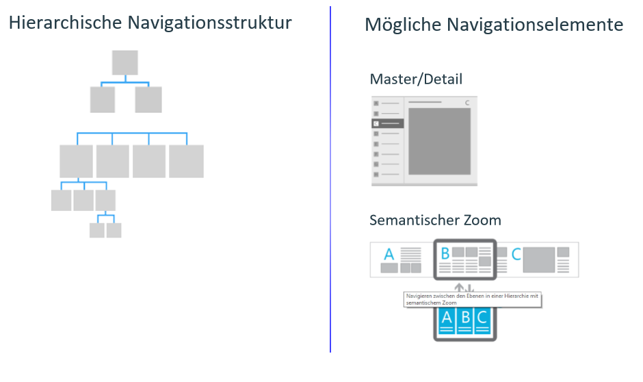

- [Universal Windows Platform](#universal-windows-platform)
  - [Überblick](#%C3%BCberblick)
  - [Entwicklungswerkzeuge](#entwicklungswerkzeuge)
  - [Design von UWP-Apps](#design-von-uwp-apps)
    - [Gestaltungsprinzipien für UWP-Apps](#gestaltungsprinzipien-f%C3%BCr-uwp-apps)
    - [Aufbau einer UWP-App](#aufbau-einer-uwp-app)
    - [Typische Muster](#typische-muster)
    - [Navigation](#navigation)
    - [Anwendungen für mehrere Gerätefamilien](#anwendungen-f%C3%BCr-mehrere-ger%C3%A4tefamilien)
    - [Neue Interaktionselemente](#neue-interaktionselemente)
    - [Responsive und Adaptive Design](#responsive-und-adaptive-design)
  - [Universal Windows Platform](#universal-windows-platform-1)
    - [Architektur der Universal Windows Platform](#architektur-der-universal-windows-platform)
    - [Besonderheiten der Windows Runtime](#besonderheiten-der-windows-runtime)
    - [Erweiterungen für Gerätefamilien](#erweiterungen-f%C3%BCr-ger%C3%A4tefamilien)
    - [Entwicklungsprozess](#entwicklungsprozess)
    - [Zugriff auf den Windows-Kern](#zugriff-auf-den-windows-kern)
    - [Das Komponentenmodell von WinRT](#das-komponentenmodell-von-winrt)
    - [Metadaten](#metadaten)
    - [Projektionen](#projektionen)
  - [Aufbau von UWP-Apps](#aufbau-von-uwp-apps)
    - [HelloWorld](#helloworld)
  - [Implementierung der Benutzeroberfläche](#implementierung-der-benutzeroberfl%C3%A4che)
    - [WinRT-Klassen zur UI-Programmierung](#winrt-klassen-zur-ui-programmierung)
    - [Layout-Klassen von WinRT](#layout-klassen-von-winrt)
    - [Layout-Klassen: Panels](#layout-klassen-panels)
    - [ListView und GridView](#listview-und-gridview)
    - [Semantisches Zoomen](#semantisches-zoomen)
    - [SplitView](#splitview)
    - [Menüs – AppBar](#men%C3%BCs-%E2%80%93-appbar)
    - [Verwaltung des Anzeigezustands](#verwaltung-des-anzeigezustands)
    - [Adaptive Design mit VisualStateManager](#adaptive-design-mit-visualstatemanager)
    - [Adaptive Design und SplitView](#adaptive-design-und-splitview)
    - [TailoredDesign](#tailoreddesign)
    - [Navigation in einer UWP-App](#navigation-in-einer-uwp-app)
    - [Back Button](#back-button)
  - [Verwaltung des Lebenszyklus](#verwaltung-des-lebenszyklus)
    - [Lebenszyklus einer UWP-App](#lebenszyklus-einer-uwp-app)
    - [Laden und Speichern der Sessiondaten](#laden-und-speichern-der-sessiondaten)
    - [Speichern der Anwendungs-Daten](#speichern-der-anwendungs-daten)
  - [Deployment](#deployment)
    - [App-Pakete](#app-pakete)
    - [Deployment](#deployment-1)

# Universal Windows Platform

## Überblick
- Design von UWP-Apps
- Windows Runtime
- Aufbau von UWP-Apps
- Implementierung der Benutzeroberfläche
- Lebenszyklus einer UWP-App
- Deployment

## Entwicklungswerkzeuge
- Windows 10
- .NET Core 1.0/2.0
- Visual Studio
    - Integrierter XAML-Designer
    - Windows-10-Simulator
- Expression Blend
- Testen
    - Lokale Maschine
    - Anderes Gerät
        - Remote Tools müssen installiert sein
        - Debuggen auf ARM-Geräten
    - Windows-10-Simulator
- Windows-10-Simulator
    - Testen unterschiedlicher Auflösungen
    - Rotieren des Geräts
    - Simulation von Touchgesten
- Mobile-Emulator für Windows 10

## Design von UWP-Apps

### Gestaltungsprinzipien für UWP-Apps
- UWP-Apps können auf Geräten aus einer oder mehrerer der folgenden Gerätegruppen laufen:
    - Handys (4 – 5 Zoll):
    - Phablets (5.5 – 7 Zoll)- Tablets (7 – 13.3 Zoll)
    - PCs und Laptops (≥ 13 Zoll)
    - Surface Hub (55 und 84 Zoll)
    - Windows IoT-Devices (≤ 3,5 Zoll oder headless)
    - Microsoft HoloLens
    - Xbox One


- Möglichkeiten zur Gestaltung der Benutzeroberfläche:
    - `Responsive Design`: Automatische Anpassung des Layouts mittels Layout-Containern
    - `Adaptive Design`: Spezifisches Layout abhängig von Bildschirmorientierung und Fenstergröße
    - `Tailored Design`: Gerätespezifisches Design

#### Kommentare
    * UWP Ups für Windows 10 auf den Geräten
    * in welche Klasse ein Gerät fällt hängt von der Bildschirmgröße ab (?)
    * ein UI Baum kann nicht gleich gut aussehen auf allen Bildschirmen
    * das .exe läuft überall - benötigt Code zum Prüfen auf welchem Gerät die Applikation 
        läuft (wenn nicht -> Absturz)
    * kann eine API voraussetzen
    * .NET Code Plattform steht hier dahinter
    * Tailored Design -> eine UI für bestimmte Geräteklassen
        * nur Frontend wir angepasst

### Aufbau einer UWP-App
- App besteht aus App-Seiten (Pages)
- App-Seite enthält
    - Navigationselemente (zur Navigation zwischen den Seiten)
    - Kommandos
    - Content


#### Kommentare
    * wesentlicher Unterschied zu klassischen Apps/Anwendungen:
        * man hat nicht mehr 1000e Fenster
        * bei Tablets etc. zB. nicht mehr mgl. mehrere Fenster nebeneinander zu haben
        * desto kleiner der Device -> desto wichtiger ist das
        * es gibt Pages, welche übereinander liegen (keine Windows - anscheinend Unterschied?)
        * einheitliches Interface
    * Page besteht aus Content
        * mehr Gestaltungsmglk.
        * ist responsive

### Typische Muster

- Active Canvas:
    - Anwendung benötigt nur eine Page
    - direkte Interaktion bzw. über Kommandos

- Master/Detail: Content + Navigation
    - Übersichtsansicht
    - Detailansicht für selektiertes Element

- Navigationsmenü: Content + Navigation
    - Navigationsleiste kann geöffnet/geschlossen werden.
    - Erlaubt die Navigation zwischen vielen Seiten.

- Reiter (Tabs and Pivots)
    - Einfache Navigationsmöglichkeit zwischen viel gleichrangigen Seiten


#### Kommentare
    * Active Canvas
        * bei Zeichenapp, vorallem bei Touch, direkt im Content 
    * Master/Detail - Nativationsmenü (?)
        * geht um Navigation, sieht Detail (z.B. Email)
    * Reiter
        * einfache Mglk. flach zu navigieren
    
### Navigation

  


#### Kommentare

    * durch Browser geprägt -> vorwärts/rückwärts gehen
    * muss in der Hierarchie zurück gehen können
    * semantischer Zoom
        * bedeutet nicht nur, dass man resized
        * kann einen ganz anderen View haben
        * z.B. PDF Viewer-> rauszoomen -
        * sieht Seite nicht nur klein, sondern sieht alle Seiten
        

### Anwendungen für mehrere Gerätefamilien
* UWP-Apps können auf mehreren Gerätefamilien laufen
     -> UI muss sich an Bildschirmgröße und –orientierung anpassen. 
* Unterstützung für Designer
    * Effektive Pixel: Die Größe eines Pixels hängt vom üblichen Bildschirmabstand und von der Pixeldichte ab.

        

    *  Universelle Steuerelemente: Steuerelemente sind an Gerätefamilien angepasst und können mit verschieden Eingabegeräten arbeiten 
    *  Universelle Styles: Steuerelement berücksichtigen „Theme“ *(„dark theme“ und „light theme“)* 
    *  Schriftsatz „Segoe“: Wird auf allen Systemen sauber gerendert. 

        

#### Kommentare
    * Effektive Pixel:
        * Plattform selbst berücksichtigt welchen Abstand ein Benutzer hat(?)
    * eingeschränkte Unterstützung von verschiedenen Designs (dark/light theme)

### Neue Interaktionselemente

* Meldungsdialoge
    *  Erfordern Antwort des Benutzers. 
    *  Andere Benutzerinteraktionen werden unterdrückt.

*  Flyouts:
    *  Information zu aktueller Benutzerinteraktion
    *  Können ignoriert werden

*  Popups (Toasts)
    *  Information, wenn sich App im Hintergrund befindet


### Responsive und Adaptive Design


* Mit Layout-Containern kann der Inhalt einer Seite vergrößert/verkleinert und neu angeordnet werden.
    *  *GridView, ListView*
*  Navigationselemente können an Platzverhältnisse angepasst werden. 
    *  *SplitView*
*  *VisualStateManager* ermöglichen den dynamischen Umbau von Teilen der UI

#### Kommentare
    * StateManager
        * kann damit reagieren  und die UI austauschen (je nachdem wie Groß das Fenster ist)

## Universal Windows Platform
### Architektur der Universal Windows Platform


#### Kommentare
    * kann direkt auf Windows Core zugreifen
    * UWP - Basis für UWP-Applikationen (WOOOW Mindblown lol)
    * Zugriff auf Komponenten über APIs (wow wirklich?)
    * verwendetes Komponentenmodel: com
    * com kann gut verwendet werden um Komponenten mit c++ zu implementieren (kein muss)
    * um effiziente Implementierung zu schaffen (fast n fluid)
    * .Net hat gewissen Overhead - daher c++
    * Metadaten - Beschreibungssprache (wie in .Net verwendet)
    * com Komponenten - Verwendung ist "com"-pliziert (lol)
    * daher benötigt man Sprachprojektionen um daruf zuzugreifen
    * Runtime Broker sorgt dafür, dass auf die Ressourcen zugegriffen werden können (wenn Erlaubnisse vorhanden)

### Besonderheiten der Windows Runtime
- Apps können nur in einer speziellen Laufzeitumgebung betrieben werden.
    - Apps und Ressourcen werden in Archiv-Datei (*.appx*) verpackt.
- Sandbox: Laufzeitumgebung gibt Apps nur eingeschränkten Zugriff auf Windows.
    - WinRT exportiert nur sichere APIs.
    - Es steht nur eine Untermenge von sicheren .NET-APIs zur Verfügung.
    - Beim Deployen einer App wird überprüft, ob App keine unerlaubten Operationen durchführt (z. B. P/Invoke auf nicht unterstützte Win32-APIs).
- Mittels *Projektionen* kann über mehrere Sprachen auf WinRT zugegriffen werden: C++, C#/VB.NET, JavaScript
- *Web-Host* ist (Out-Of-Browser-)Laufzeitumgebung von WinJSAnwendungen.
- *Runtime-Broker* regelt Zugriff auf Geräte (Benutzer kann Zugriff verweigern).

#### Kommentare
    * App läuft in einer Sandbox (keine bösen Dinge mehr)
    * Sandbox sorgt dafür, dass App nur auf erlaubte Ressourcen zugreifen darf
    
### Erweiterungen für Gerätefamilien


- Die Core-API wird um Gerätefamilien-spezifische APIs erweitert.
- App wird nicht für ein bestimmtes Betriebssystem, sondern für bestimmte Gerätefamilien entwickelt.
- Es wird aber immer ein App-Paket erstellt, das auf allen Geräten läuft.
- Steht am Zielsystem eine API-Funktion nicht zur Verfügung, wird eine Ausnahme geworfen -> Verfügbarkeit der Funktion muss überprüft werden

```csharp
bool hasHardwareButtons = ApiInformation.IsTypePresent(
    nameof(Windows.Phone.UI.Input.HardwareButtons));
    
if (hasHardwareButtons)
    Windows.Phone.UI.Input.HardwareButtons.CameraPressed += (s, e) => { … };
```

#### Kommentare
    * wenn man .Net entwickelt -> benötigt Assemblies
    * wenn man mit UWP arbeitet -> benötigt auch "Assemblies" -> UW Core API 
    * gibt verschiedene Extensions (Geräte spezifisch)

### Entwicklungsprozess


- .NET-Native-Kompilierung: Code, der nie aufgerufen werden kann, wird entfernt („tree shaking“)
- Beim Store-Deployment wird der Native-Compiler in der „Cloud“ ausgeführt.

#### Kommentare
    * Nur Core, kein Full Framework


### Zugriff auf den Windows-Kern
- Win32-API

    ```csharp
    HANDLE hFile = CreateFile("C:\\test.txt",
                        GENERIC_READ|GENERIC_WRITE,
                        FILE_SHARE_READ,NULL,OPEN_ALWAYS,
                        FILE_ATTRIBUTE_NORMAL,NULL);
    ```
    - Funktionsorientierte API.
    - Keine Metadaten -> Typsicherheit kann nicht überprüft werden.
    - Umständliche Fehlerprüfung.
- .NET Framework

    ```csharp
    FileStream fs = File.Create(path);
    ```
    - Objektorientierte API
    - Typsicherheit
    - Fehlerbehandlung mithilfe von Ausnahmen
    - Overhead durch Laufzeitumgebung (Marshalling).

### Das Komponentenmodell von WinRT


- Eigenschaften der COM-Komponenten
    - Nativer Code, Binärformat ist jedoch standardisiert
    - Selbstbeschreibung der Komponente in Metadaten-Datei (*.winmd)
    - objektorientiert und sprachunabhängig
- Verwendung der COM-Komponenten
    - Anpassung an Sprachspezifika durch Projektionen
    - Speicherverwaltung mittels Referenzzählung
    - Fehlerbehandlung mittels Fehlercodes
    - Methoden mit Laufzeit ≥ 50 ms sind asynchron implementiert
    
### Metadaten
- Beschreibung aller WinRT-APIs.
- Metadaten liegen als eigenständige Dateien vor:
    - Eine winmd-Datei für jeden Namenraum.
- Gleiches Binärformat wie bei .NETMetadaten
    - .NET-Werkzeuge können verwendet werden.
- Anwendung
    - Generierung der Projektionen für verschiedene Sprachen.
    - Autovervollständigung  

    

### Projektionen


- Projektionen lassen WinRT-Komponenten so erscheinen, als wären sie Bestandteil der Zielsprache:
    - Namenskonventionen werden angepasst.
    - Effiziente Abbildung primitiver Datentypen, z. B. `HSTRING -> System.String`.
    - Abbildung komplexer Datentypen, wie Behälterklassen, auf entsprechende Typen der Zielsprache, z. B. `IVector<T> -> IList<T>`.
    - Fehlercodes werden auf Ausnahmen abgebildet.
    - Runtime-Callable-Wrapper übernimmt Referenzzählung.

## Aufbau von UWP-Apps
### HelloWorld


```xaml
<Application x:class="HelloApp" 
        xmlns="http://…/xaml/presentation" 
        RequestedTheme="Dark"..>
    <Application.Resources>..</Application.Resources>
</Application>
```
```csharp
sealed partial class HelloApp: Windows.UI.Xaml.Application {
	public App() {
		this.InitializeComponent();
	}
	protected override void OnLaunched(LaunchActivatedEventArgs args) {
		Frame rootFrame = Window.Current.Content as Frame;
		if (rootFrame == null) {
			rootFrame = new Frame();
			Window.Current.Content = rootFrame;
		}
		if (rootFrame.Content == null) {
			if (!rootFrame.Navigate(typeof(HelloPage), args.Arguments)) {…
			}
			Window.Current.Activate();
		}
	}
}
```
```csharp
static void Main(string[] args) { // generierter Code in HelloApp.i.cs
    Application.Start(p => new HelloApp());
}
```

```xaml
<Page x:Class="HelloPage" ...>
    <Grid Background="{ThemeResource ApplicationPageBackgroundThemeBrush}">
        <Grid.RowDefinitions>...</Grid.RowDefinitions>
        <TextBlock Grid.Row ="0" Text="Hello World"
Style="{StaticResource PageHeaderTextStyle}" />
        <StackPanel Grid.Row ="1" VerticalAlignment="Center">
            <TextBlock x:Name="txtCounter" Text="0" FontSize="72" … />
            <Button FontSize="36" Content="Press Me"
Click="ClickEventHandler" … />
        </StackPanel>
    </Grid>
</Page>
```

```csharp
public sealed partial class HelloPage: Windows.UI.Xaml.Controls.Page {
	private int counter = 0;
	public MainPage() {
		this.InitializeComponent();
	}
	private void ClickEventHandler(object sender, RoutedEventArgs e) {
		txtCounter.Text = (++counter).ToString();
	}
}
```


#### Kommentare
    * app start realisiert als template Method

## Implementierung der Benutzeroberfläche
### WinRT-Klassen zur UI-Programmierung


- Klassenhierarchie in Windows.UI.Xaml und System.Windows (WPF) ist ähnlich.
- Viele UI-Konzepte wurden aus der WPF übernommen:
    - XAML
    - Abhängigkeitseigenschaften
    - Styles und Templates
- Unterschiede:
    - Neue Steuerelemente (AppBarButton etc.)
    - Änderungen im Layout-System (AppBar, GridView, RelativePanel etc.)
- Komponenten stehen auch für nichtverwaltete Sprachen (JavaScript, C++) zur Verfügung.

#### Kommentare
    * XAML auf Komponentenebene realisiert
    * xaml auch in c++ applikation verwendbar
    
### Layout-Klassen von WinRT


#### Kommentare
    * ListView, GridView - speziell für Touchbedienung ausgelegt
    * Virtualiszing Panels - stellen viele Elemente dar, aus Effizienzgründen
        * wenn man alle rendert -> Applikation langsam
        * rendert nur, wenn angezeigt werden soll
        * z.B. 10/1000 (da immer nur 10 auf dem Display ausgegeben werden)

### Layout-Klassen: Panels 
- Canvas:
    - Fixe Positionierung der Kindelemente (Canvas.Top, Convas.Left).
- Stackpanel:
    - Horizontale/Vertikale Anordnung der Kindelemente.
- Grid:
    - Anordnung der Kindelemente in unterschiedlich großen Reihen und Spalten (Grid.Row, Grid.Column).
- VariableSizedWrapGrid:
    - Anordnung in gleich großen Zeilen und Spalten mit vorgegebenem Umbruch (MaximumRowsOrColumns).

    

- VirtualizingPanel:
    - Nur die tatsächlich sichtbaren Elemente kommen in den Visual Tree -> effizienteres Rendering.
    - Werden zum Anordnen von Elementen in listenorientierten Behältern (abgeleitet von ItemsControl) verwendet.
- WrapPanel:
    - Anordnung in Zeilen bzw. Spalten.
    - Nur in ItemsControl verwendbar.
- RelativePanel:
    - Steuerelemente können relativ zueinander angeordnet werden.
    - für adaptives Design
    - meist in Kombination mit VisualStateManager

    

#### Kommentare
    * ähnlich zur WPF

### ListView und GridView
- ListView und GridView dienen zum Anzeigen von Datenbehältern.
    - `ItemsSource`: Datenquelle (meist über Binding definiert)
    - `ItemsPanel`: Layout-Steuerelement, das Kindelemente anordnet.
    - `ItemTemplate`: Schablone für Anzeige eines Kindelements.
- Sind auf Touchbedienung optimiert (im Gegensatz zu ListBox).
- Unterstützen UI-Virtualisierung.
- Unterstützen die Gruppierung von Elementen
  GridView ermöglicht die zweidimensionale Anordnung Elementen innerhalb einer Gruppe.


#### Kommentar
    * UI-Virtualiserung : erst gerendert wenn angezeigt (z.B. beim Scrollen)

#### ListView

```xaml
<ListView ItemsSource="{Binding …}"
SelectionMode="Single">
    <ListView.GroupStyle>
        <GroupStyle>
            <GroupStyle.HeaderTemplate>
                <DataTemplate>
                    <TextBlock Text="{Binding Key}" …>
                    </DataTemplate>
            </GroupStyle.HeaderTemplate>
        <GroupStyle>
    </ListView.GroupStyle>
    <ListView.ItemTemplate>
        <DataTemplate>
            <Grid>
…
                <Ellipse … />
                <TextBlock Text="{Binding Name}" />
                <TextBlock Text="{Binding Position}" />
…
            </Grid>
        </DataTemplate>
    </ListView.ItemTemplate>
</ListView>
```


#### GridView
```xaml
<GridView ItemsSource="{Binding ..}">
    <GridView.GroupStyle>
        <GroupStyle>
            <GroupStyle.HeaderTemplate>
                <DataTemplate> … </DataTemplate>
            </GroupStyle.HeaderTemplate>
    </GridView.GroupStyle>
    <GridView.ItemTemplate>
        <DataTemplate>
            <Grid>
            …
            </Grid>
        </DataTemplate>
    </GridView.ItemTemplate>
    <GridView.ItemsPanel>
        <ItemsPanelTemplate>
            <ItemsWrapGrid GroupPadding="5"
                Orientation="Horizontal" />
        </ItemsPanelTemplate>
    </GridView.ItemsPanel>
</GridView>
```


### Semantisches Zoomen
- Ermöglicht das Darstellen einer großen Datenmenge mit unterschiedlichem Detailgrad.
- Mit Zoom-Geste kann Detailgrad der Darstellung erhöht/verringert werden.

    


### SplitView
- *SplitView* ermöglicht die platzsparende Implementierung von Menüs
- *SplitView* besteht aus zwei Layout-Containern:
    - Pane enthält die Navigationsmenü
    - Content enthält einen Frame, der Pages als Kindelemente verwaltet.
- Mit `IsPaneOpen` kann die Pane auf- und zugeklappt werden.
- `DisplayMode` steuert den Anzeigemodus der Pane.  

    
    

#### Kommentare
    * SplitView enthält Pane und Content(eigener Frame)
    * in Content (Subelement von Splitview) -> Pages (Frame)
    * kann sie ein- und ausblenden
    * typisches Top-Level Element
    
    ```xaml
    <Page x:Class="SplitView.MainPage" … >
        <Grid>
            <Button Canvas.ZIndex="1">
                <FontIcon FontSize="22" Glyph="&#xE700;" />
            </Button>
            <SplitView x:Name="mySplitView"
                    DisplayMode="Inline" IsPaneOpen="True"
                    Opacity="0.7" PaneBackground="Blue"
                    CompactPaneLength="50" OpenPaneLength="160">
                <SplitView.Pane>
                    <StackPanel Margin="0,30,0,0">
                        <RadioButton … >
                            <StackPanel Orientation="Horizontal">
                                <SymbolIcon Symbol="Home"    
                                    Foreground="White" />
                                <TextBlock Text="Detail 1" 
                                    Margin="15,0,0,0" Foreground="White" />
                            </StackPanel>
                        </RadioButton>
                        <RadioButton … > … </RadioButton>
                    </StackPanel>
                </SplitView.Pane>
                <Frame x:Name="MainFrame" />
                <!-- SplitView.Conent -->
            </SplitView>
        </Grid>
    </Page>
    ```
### Menüs – AppBar
- *AppBar* hat ähnliche Funktion wie Menü und Toolbar bei DesktopAnwendungen.
- *AppBar* kann am oberen und unteren Seitenrand angebracht werden.
- *AppBar* kann
    - immer sichtbar (ClosedDisplayMode="Compact")
    - minimiert      (ClosedDisplayMode="Minimal") oder
    - unsichtbar (ClosedDisplayMode="Hidden") sein  
    
    ```xaml
    <Page.TopAppBar>
        <CommandBar IsSticky="False" IsOpen="False">
            <AppBarButton Label="Add" Icon="Add">
                <AppBarButton.Flyout> … </AppBarButton.Flyout>
            </AppBarButton>
            <AppBarButton Label="Remove" Icon="Remove" />
            <AppBarButton Label="Edit" Icon="Edit" />
            <CommandBar.SecondaryCommands>
                <AppBarButton Label= "Refresh" … />
                <AppBarButton Label= "Help" … />
            </CommandBar.SecondaryCommands>
        </CommandBar>
    </Page.TopAppBar>
    <Page.BottomAppBar> … </Page.BottomAppBar>
    ```
    
    
- Das Icon von Menü-Schaltflächen kann unterschiedlich definiert werden

    ```xaml
    <Page.BottomAppBar>
        <CommandBar>
            <AppBarButton Icon="Like" Label="SymbolIcon" />
            <AppBarButton Label="BitmapIcon">
                <AppBarButton.Icon>
                    <BitmapIcon UriSource="ms-appx:///Assets/globe.png"/>
                </AppBarButton.Icon>
            </AppBarButton>
            <AppBarButton Label="FontIcon">
                <AppBarButton.Icon>
                    <FontIcon FontFamily="Candara" Glyph="&#x03A3;"/>
                </AppBarButton.Icon>
            </AppBarButton>
            <AppBarButton Label="PathIcon">
                <AppBarButton.Icon>
                    <PathIcon Data="M 20 5 L 40 35 L 0 35"/>
                </AppBarButton.Icon>
            </AppBarButton>
        </CommandBar>
    </Page.BottomAppBar>
    ```
    
    

### Verwaltung des Anzeigezustands
- UWP-Apps können auf vielen verschiedenen Gerätefamilien laufen:
    - Bildschirmgrößen unterscheiden sich wesentlich.
    - Gerätespezifische Eigenschaften: Kamera, Hardware-Buttons etc.

    

- Möglichkeiten zur Gestaltung der Benutzeroberfläche:
    - `Responsive Design`: Durch geschickte Wahl der Layout-Container wird Benutzeroberfläche automatisch angepasst.
    - `Adaptive Design`:
        - Anpassung von Layout-Eigenschaften (z. B. mit *RelativePanel*)
        - Austausch von Teilen der Benutzeroberfläche
        - Wird von *VisualStateManager* unterstützt.
    - `Tailored Design`: Anpassung an bestimmte Gerätefamilie

### Adaptive Design mit VisualStateManager
```xaml
<Page x:Class="MyPage">
    <VisualStateManager.VisualStateGroups>
        <VisualStateGroup>
            <VisualState x:Name="LargeScreen">
                <VisualState.StateTriggers>
                    <AdaptiveTrigger MinWindowWidth="1024" />
                </VisualState.StateTriggers>
                <VisualState.Setters>
                    <Setter Target="RedRect.(RelativePanel.RightOf)" Value="GreenRect" />
                    <Setter Target="YellowRect.(RelativePanel.RightOf)" Value="RedRect" />
                </VisualState.Setters>
            </VisualState>
            <VisualState x:Name="MediumScreen"> … </VisualState>
            <VisualState x:Name="SmallScreen"> … </VisualState>
        </VisualStateGroup>
    </VisualStateManager.VisualStateGroups>
    <RelativePanel>
        <Rectangle Name="GreenRect" Fill="Green" ... />
        <Rectangle Name="RedRect" Fill="Red" ... />
        <Rectangle Name="YellowRect" Fill="Yellow" ... />
    </RelativePanel>
```
Breakpoints für Layoutanpassung: Bildschirmbreite = 320 epx, 720 epx, 1024 epx.

Width = 1024:
```xaml
<VisualState.Setters>
    <Setter
        Target="RedRect.(RelativePanel.RightOf)"
        Value="GreenRect" />
    <Setter
        Target="YellowRect.(RelativePanel.RightOf)"
        Value="RedRect" />
</VisualState.Setters>
```

Width = 720:
```xaml
<VisualState.Setters>
    <Setter 
        Target="RedRect.(RelativePanel.RightOf)"
        Value="GreenRect" />
    <Setter 
        Target="YellowRect.(RelativePanel.Below)"
        Value="RedRect" />
    <Setter 
        Target="YellowRect.(RelativePanel.AlignLeftWith)"
        Value="RedRect" />
</VisualState.Setters>
```

Width = 520
```xaml
<VisualState.Setters>
    <Setter 
        Target="RedRect.(RelativePanel.Below)"
        Value="GreenRect" />
    <Setter 
        Target="YellowRect.(RelativePanel.Below)"
        Value="RedRect" />
</VisualState.Setters>
```


### Adaptive Design und SplitView

Width = 1024
```xaml
<VisualState.Setters>
    <Setter 
        Target="MySplitView.DisplayMode"
        Value="Inline"/>
    <Setter 
        Target="MySplitView.IsPaneOpen"
        Value="True" />
</VisualState.Setters>
```

Width = 720
```xaml
<VisualState.Setters>
    <Setter 
        Target="MySplitView.DisplayMode"
        Value="CompactOverlay"/>
    <Setter 
        Target="MySplitView.IsPaneOpen"
        Value="False" />
</VisualState.Setters>
```

Width = 500
```xaml
<VisualState.Setters>
    <Setter 
        Target="MySplitView.DisplayMode"
        Value="Overlay"/>
    <Setter 
        Target="MySplitView.IsPaneOpen"
        Value="False" />
</VisualState.Setters>
```


### TailoredDesign
- Manchmal muss das Design für eine Gerätefamilie gänzlich angepasst werden.
- Vorgangsweise:
    - Erstellung eines spezifischen Ordners für eine 
      Gerätefamilie:   
          *DeviceFamily-{Desktop, Mobile, IoT, Team}*
    - Alternativ kann auch eine Datei mit dem Suffix *.DeviceFamily-{…}* erstellt werden.
    - Anlegen von XAML-Dateien mit demselben Namen wie in der Basisversion.
    - Anpassen des XAML-Codes.
- Fallback ist immer die Basisversion
- Sinnvolle Vorgangsweise: ``„Resource Dictionary“`` erstellen und dieses an die Gerätefamilie anpassen.


### Navigation in einer UWP-App


### Back Button

- Die meisten Gerätefamilien stellen auf Systemebene einen „Back Button“ zur Verfügung -> erlaubt Applikations-globale Rückwärtsnavigation

```csharp
public class MyApp: Application {
	protected async override void OnLaunched(LaunchActivatedEventArgs e) {
		if (rootFrame == null) {
			rootFrame.Navigated += 
                            (object sender, NavigationEventArgs evt) = >{
				// update the back button's visibility
				SystemNavigationManager.GetForCurrentView()
                                    .AppViewBackButtonVisibility = ((Frame) sender).CanGoBack ? AppViewBackButtonVisibility.Visible: AppViewBackButtonVisibility.Collapsed;
			};
			// register a handler for back button events
			SystemNavigationManager.GetForCurrentView()
                        .BackRequested += (s, evt) = >{
				Frame frame = Window.Current.Content as Frame;
				if (frame.CanGoBack) {
					evt.Handled = true;
					frame.GoBack();
				}
			};
		}…
	}
}
```


## Verwaltung des Lebenszyklus


### Lebenszyklus einer UWP-App
- Wird ein App in den Hintergrund geschickt (`Suspended`) verbraucht sie nur Speicher- aber keine Prozessorressourcen.
- Eine sich im Hintergrund befindende App kann vom Betriebssystem jederzeit terminiert werden.
- Wird die App suspendiert, muss sie den Zustand der Benutzer-Session speichern.
    - Zustandsspeicherung dauert länger als 5 Sekunden -> vorzeitige Suspendierung der App.
    - Laufende Zustandsspeicherung, falls dieser Vorgang lange dauert.
- Welche Aktionen bei der (Re-)Aktivierung der App erforderlich sind, hängt von ihrem Zustand ab:
    - `NotRunning`: Initialen Zustand herstellen.
    - `In Background`: App besitzt ihren alten Zustand. Eventuell sind Ressourcen zu erneuern, die aufgrund eines Timeouts u. dgl. nicht mehr verwendbar sind.
    - `Terminated`: Zustand wiederherstellen, der beim Suspendieren gespeichert wurde.
    - `ClosedByUser`: Initialen Zustand herstellen.
    
### Laden und Speichern der Sessiondaten
```csharp
public class MyApp: Application {
	public MyApp() {
		this.Suspending += OnSuspending;
	}
	protected override async void OnLaunched(LaunchActivatedEventArgs args) {
		Frame rootFrame = Window.Current.Content as Frame;
		if (rootFrame == null) {
			if (args.PreviousExecutionState == ApplicationExecutionState.Terminated) {
                            //hier laden
                        }
		}…
		Window.Current.Content = rootFrame;
	}
	private async void OnSuspending(object sender, SuspendingEventArgs e) {
		var deferral = e.SuspendingOperation.GetDeferral();
                // hier sessiondaten speuchern
		deferral.Complete();
	}
}
```
### Speichern der Anwendungs-Daten
- Gewisse Daten einer App müssen auf externem Medium gespeichert werden:
    - Sessiondaten,
    - dauerhaft zu speichernde Daten der App, z. B. Konfigurationseinstellungen.
- Speicherort
    - `LocalFolder`: Speicherung im lokalen Dateisystem 
        `(%USERPROFILE%\AppData\Local\Packages\{PackageID}\LocalState)`.
    - `RoamingFolder`: Speicherung im lokalen Dateisystem (RemoteState) und Synchronisation mit Windows Online-Account.
    - Auf diese Daten hat nur die App und der Benutzer der App Zugriff.
- Container
    - *LocalSettings/RoamingSettings*: Container zur Verwaltung von Namen/Werte-Paaren.
    - Werden von WinRT automatisch gespeichert und geladen.

## Deployment
### App-Pakete
- Die Bestandteile einer App werden in ein App-Paket verpackt.
    - Entspricht der Open Packing Convention (OPC).
    - Zip-Kompression wird verwendet.
    - Paket ist signiert.
- Bestandteile eines App-Pakets
    - *App Payload*: Code von App und Core Framework und Ressourcen (assets).
    - *App Manifest (AppxManifest.xml)*:
        - Identität: Name, Publisher, Version, Prozessor-Architektur.
        - Abhängigkeiten: erforderliche Komponenten (erforderliche Version des Zielsystems, JavaScript-, C++-Runtime, …)
        - Erforderliche Ressourcen: Webcam, Internet, Zugriff auf bestimmte Ordner, …
- *App Block Map (AppxBlockMap.xml)*: Liste der Files mit Hashwerten.
- *App Signature (AppxSignataure.p7x)*: Digitale Signatur des Pakets

### Deployment
- Installation der App erfolgt in vier Schritten:
    - *Package Validation*: Validierung von Manifest, Block-Map und Signatur.
    - *Deployment Checks*: richtige OS-Version, müssen abhängige Komponenten installiert werden, ist Speicherplatz ausreichend, …
    - *Package Staging*: Installation des Pakets
        - Installationsort: `%ProgramFiles%\WindowsApps`.
        - Verzeichnis: `PackageName_Version_Architecture_RessourceID_PublisherHash`
    - *Package Registration*: App-Anforderungen werden an OS weitergegeben.
- Aktualisierung einer App:
    - Mehrere Versionen einer App können parallel installiert sein.
    - Nur Änderungen werden heruntergeladen.
    - Verwendung von Hard-Links bei unveränderten Dateien.
- Isolierung von Apps:
    - Das App-Verzeichnis ist nicht veränderbar und wird zwischen Benutzern geteilt.
    - App kann nur auf benutzerbezogenes App-Verzeichnis zugreifen: ``%USERPROFILE%\AppData\Local\Packages\<AppId>``.
