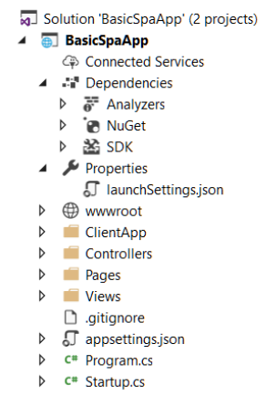

- [ASP.NET Core](#aspnet-core)
  - [Überblick](#%C3%BCberblick)
  - [Ausgangssituation](#ausgangssituation)
  - [Merkmale](#merkmale)
  - [.NET Plattform](#net-plattform)
  - [.NET vs ASP.NET Core](#net-vs-aspnet-core)
  - [Deployment von Web-Anwendungen](#deployment-von-web-anwendungen)
  - [Architektur](#architektur)
  - [Einbinden von Web-Servern](#einbinden-von-web-servern)
  - [Implementierung einer Web-Anwendung](#implementierung-einer-web-anwendung)
  - [Projektkonfiguration: Aufbau der Projektdatei (.csproj)](#projektkonfiguration-aufbau-der-projektdatei-csproj)
    - [Konfiguration des Hosts](#konfiguration-des-hosts)
    - [Konfiguration der Komponenten](#konfiguration-der-komponenten)
    - [Konfiguration der Services](#konfiguration-der-services)
  - [Middleware - Konzept](#middleware---konzept)
  - [Implementierung von Middleware-Komponenten](#implementierung-von-middleware-komponenten)
  - [Konfiguration einer Web-Anwendung](#konfiguration-einer-web-anwendung)
  - [Implementierung der ASP.NET-MVC-Anwendung](#implementierung-der-aspnet-mvc-anwendung)
  - [Werkzeuge zur plattformunabh. Softwareentwicklung](#werkzeuge-zur-plattformunabh-softwareentwicklung)
  - [Unterstützung mehrerer Frameworks](#unterst%C3%BCtzung-mehrerer-frameworks)
    - [Tag-Helper](#tag-helper)
    - [Beispiele:](#beispiele)
    - [Razor-Pages](#razor-pages)
  - [Architektur von "Single-Page" Webanwendungen](#architektur-von-%22single-page%22-webanwendungen)
  - [Entwicklung von "Single-Page" Webanwendungen](#entwicklung-von-%22single-page%22-webanwendungen)

# ASP.NET Core

## Überblick

- Ausgangssituation und Merkmale
- Architektur
- Projektstruktur und Konfiguration
- Serverseitige Werkzeuge
- Neuerungen in MVC
    - Tag-Helpers
    - Razor-Pages
- Clientseitige Werkzeuge

## Ausgangssituation

- Bestehender Web-Stack ist veraltet
    - Teile stammen aus Version 1 des .NET-Frameworks (System.Web.dll).
    - Komponenten werden geladen, obwohl sie nicht benötigt werden.
- .NET-Upgrades auf Serverseite können problematisch sein.
    - Alle Web-Anwendungen sind von .NET-Version des Servers abhängig.
- Schlechte Laufzeiteffizienz
    - Limitierungen durch Architektur der Plattform
- Starke Abhängigkeit der Komponenten und unzureichende Erweiterungsmöglichkeiten.
    - ASP.NET war auf Deployment auf dem IIS ausgerichtet.
    - Erweiterungen wurden immer häufiger notwendig: Web API, SignalR, SelfHosting etc.
- Ähnliche Funktionalität in ASP.NET MVC und Web-API wurde mehrfach implementiert: Routing, Controller, …

#### Kommentar
    * TL:DR alles veraltet
    * Neuerungen als Erweiterungen

## Merkmale
- Vollständige Neuimplementierung der Plattform in Form eines OpenSource-Projekts.
    - Basiert auf .NET Core.
    - Nur Konzepte werden übernommen.
- Plattformunabhängigkeit: Windows, OS X, Linux
- Modularer Aufbau
    - Alle Komponenten müssen explizit hinzugefügt werden.
    - Komponenten werden als Nuget-Pakete ausgeliefert.
- Berücksichtigung aktueller Trends in der Web-Entwicklung
    - Single-Page-Webanwendungen,
    - Werkzeuge für Web-Entwicklung.
- Unterstützung verschiedener Deploymentarten
- Web-Forms wird nicht unterstützt
    - Wird aber als Bestandteil des .NET-Frameworks fortgeführt

## .NET Plattform


#### Kommentare
    * ASP.NET Core auch mit Full Framework möglich


## .NET vs ASP.NET Core

- ASP.NET Core MVC ist ein Framework für die Entwicklung von WebAnwendungen und REST-Services.


## Deployment von Web-Anwendungen


#### Kommentar
    * (links)Alle Web Anwednungen verwenden selbes Framework
    * (rechts) Web Anwendung nimmt eigenes Framework mit -> einfachere Versionierung

## Architektur

- **Host**: Orchestrierung der Request-Pipeline.
    - Kann vom Web-Server übernommen werden.
    - Self-Hosting z. B. in Konsolenanwendung
- **Server**: Horchen auf Requests und Weiterleiten an Pipeline.
    - IIS und IIS Express
    - WebListener: Verwendet Http.Sys direkt
    - Kestrel: plattformunabhängiger Server
- **Middleware**: Komponente der Pipeline, die Requests verarbeitet
    - Erhält Request/Response-Kontext
    - Gibt Kontrolle an nachgelagerte Middleware-Komponente weiter.
    - Wird in *Startup*-Klasse konfiguriert.
- **Application**: Web-, SignalR-Anwendung, REST-Service, ….


#### Kommentar
    * MVC, DB Zugriff, Authentifizierung ist zB Middleware
    * Kestrel == Tomcat für .NET Core

## Einbinden von Web-Servern


#### Kommentare
    * Reverse-Proxy leitet den Traffic an den Kestrel weiter
    * Reverse Proxy: weil reversed (Request kommt von außen)

## Implementierung einer Web-Anwendung

- Erstellung eines Projekts
    - .NET CLI (Command Line Interface)
    - Projektvorlage in Visual Studio
- Projektstruktur
    - **.csproj*: Enthält Projekteinstellungen und Definition der serverseitigen Abhängigkeiten (Frameworks, verwendete Komponenten) -> XML-Format
    - Abhängigkeitsverwaltung
        - .NET-Komponenten: NuGet (*.csproj)
    - *wwwroot*: Wurzelverzeichnis der Anwendung aus Sicht des Web-Servers
    - *ClientApp.cs*: Single-Page-Webanwendung
    - *Controllers/Pages/Views*: Serverseitige Web-Anwendung
    - *Startup.cs*: Konfiguration der Anwendungskomponenten und der Middleware 
    - *Programm.cs*: Konfiguration des Hosts



#### Kommentare
    * wwwroooot -> Dinge die nach draußen gehen hier rein (statischer Content)
    * t +1

## Projektkonfiguration: Aufbau der Projektdatei (.csproj)

```xml
<Project Sdk="Microsoft.NET.Sdk.Web">
    <PropertyGroup>
        <TargetFrameworks>netcoreapp2.0;net462</TargetFrameworks>
    </PropertyGroup>
    <PropertyGroup>
        <ItemGroup>
            <PackageReference Include="Microsoft.AspNetCore.All" 
                    Version="2.0.3" />
            <PackageReference Include="Microsoft.AspNetCore.Http.Abstractions" 
                              Version="2.1.2" />
        </ItemGroup>
        <ItemGroup>
            <DotNetCliToolReference
                Include="Microsoft.EntityFrameworkCore.Tools.DotNet" 
                Version="2.0.3" />
        </ItemGroup>
    </Project>
```

- *TargetFrameworks*: „Multi-Targeting“ -> Gleichzeitige Unterstützung mehrere Frameworks. Derzeit kein IDE-Support.
- *PackageReference*: Referenzen auf Nuget-Pakete
- *DotNetCliToolReference*: Erweiterung der CLI um zusätzliche Entwicklertools (z. B. dotnet ef)

### Konfiguration des Hosts

- Der *Host* ist für Konfiguration und das Starten der Web-Anwendung bzw. des Servers verantwortlich.
- Der *Server* verarbeitet die HTTP-Anfragen.

    ```csharp
    public static void Main(string[] args) {
      var host =
        new WebHostBuilder()
          .UseKestrel()
          .UseContentRoot(
            Directory.GetCurrentDirectory())
          .UseIISIntegration()
          .UseStartup<Startup>()
          .Build();
        host.Run();

      // UseKestrel, USerContentRoot, UseIISIntegration, .UseStartup<Startup>()
      // = -> WebHost.CreateDefaultBuilder(args)
    }
    ```

- UseKestrel: Kestrel wird als Web-Server verwendet.
- UseIISIntegration: IIS wird als Reverse Proxy verwendet.
- UseStartup: Definition der Klasse, die Methoden zur Konfiguration der WebAnwendung enthält.

#### Kommentare
    * bei den () können lambda ausdrücke verwendet werden, ke nachdem was gemacht werden soll

### Konfiguration der Komponenten

- Konfiguration erfolgt in Klasse *Startup*.
  - Der Name dieser Klasse wird im Host festgelegt.
- Methode *ConfigureServices*: Konfiguration der Services, die mit Abhängigkeitsinjektion an Klassen der Web-Anwendung übergeben werden können.  

  ```csharp
  public void ConfigureServices(IServiceCollection services)
    services.AddEntityFramework().AddSqlServer();
    services.AddScoped<ILogic, BusinessLogicImpl>();
  }
  ```
  
- Methode Configure: Konfiguration der Middlewarekomponenten  

  ```csharp
  public void Configure(IApplicationBuilder app,
                        IHostingEnvironment env) {
    app.UseFacebookAuthentication(…);
    app.UseCors(…);
    if (env.IsDevelopment()) app.UseDeveloperExceptionPage();
  }
  ```
  
#### Komentare
    * Konfiguration erfolgt in der Klasse `Startup`

### Konfiguration der Services

- „Services“ in ASP.NET Core:
  - Austauschbare Komponenten: Interface und Implementierung
  - Infrastruktur- und anwendungsbezogene Services
- Implementierung eines Service:

  ```csharp
  public interface IMyService {
    void myServiceMethod();
  }
  ```
  ```csharp
  public class MyService : IMyService { … }
  ```
- Hinzufügen zum Service-Container:  

  ```csharp
  public void ConfigureServices(IServiceCollection services)
    services.AddScoped<IMyService, MyServiceImpl>();
  }
  ```
- Injektion der Abhängigkeiten im Container:

  ```csharp
  public class MyController {
    private IMyService myService;
    public MyController(IMyService myService) { this.myService = myService; }
  }
  ```
## Middleware - Konzept

* Middleware-Komponenten verarbeiten Requests und können Resultate zur Response hinzufügen.
* Middlware-Komponenten werden in der Konfiguration zu einer Kette zusammengefügt.


## Implementierung von Middleware-Komponenten

```csharp
public delegate Task RequestDelegate(HttpContext context);
  public class MyMiddleware {
  private readonly RequestDelegate next;
  public MyMiddleware(RequestDelegate next) { this.next = next; }
  public async Task Invoke(HttpContext context) {
    // process context.Request
    await next(context);
    // process context.Response
  }
}
```
```csharp
public static class MyMiddlewareExtensions {
  public static void UseMyMiddleware(this IApplicationBuilder builder) {
    builder.UseMiddleware<MyMiddleware>();
  }
}
```
```csharp
public class Startup {
  public void Configure(IApplicationBuilder app) {
    app.UseMyMiddleware();
  }
}
```

## Konfiguration einer Web-Anwendung

- Einfachste Web-Anwendung: Registrierung eines Callbacks, das für jedes Request aufgerufen wird.  

  ```csharp
  public class Startup {
    public void Configure(IApplicationBuilder app) {
      app.Run(async context => {
        await context.Response.WriteAsync("Hello ASP.NET Core");
      });
    }
  }
  ```
- Verarbeitung statischer Dateien
  - Dateien müssen sich in *wwwroot* befinden  
  
  ```csharp
  public class Startup {
    public void Configure(IApplicationBuilder app) {
      app.UseDefaultFiles();
      app.UseStaticFiles();
    }
  }
  ```


## Implementierung der ASP.NET-MVC-Anwendung
- Konfiguration

  ```csharp
  public class Startup {
    public void ConfigureServices(IServiceCollection services) {
      services.AddMvc();
    }
    public void Configure(IApplicationBuilder app) {
      app.UseMvc(routes => {
        routes.MapRoute(
          name: "default",
        template: "{controller=Home}/{action=Index}/{id?}");
      });
    }
  }
  ```
  - services.AddMvc() fügt alle für MVC notwendigen Komponenten in den Service-Container.

- Implementierung der Controller
- Implementierung der Views

## Werkzeuge zur plattformunabh. Softwareentwicklung

- dotnet ist ein plattfomunabhängiges Kommandozeilenwerkzeug zur Entwicklung von .NET-Core-Anwendungen.
- dotnet new: Erzeugung eines neuen Projekts.
  - Beispiel: 
  `dotnet new mvc --lang C#`
  - Auch *Yeoman* ist unterstützt: 
  `yo aspnet`
- dotnet restore: Herunterladen der NuGet-Pakete.
  - Wird das Kommando auf der Ebene der Solution ausgeführt, werden die Pakete aller Projekte heruntergeladen.
- dotnet restore: Bauen des Projekts und seiner Abhängigkeiten.
  - Beispiel: 
  `dotnet build --framework net46 --runtime win10-x64`
- dotnet run: Ausführen des Programms (Web: Starten des Hosts).
  - Beispiel: 
  `dotnet run --framework net46`
- dotnet publish: Verpacken der Anwendung inklusive der Abhängigkeiten und Kopieren in ein Zielverzeichnis.
  - Beispiel: 
  `dotnet publish --framework netcoreapp2.1 --output ~/target`

## Unterstützung mehrerer Frameworks

* Eine .NET-Core-Anwendung können parallel für mehrere Frameworks entwickelt werden.

  ```xml
  <TargetFramework>
    netcoreapp2.1;net472
  </TargetFramework>
  ```

* Visual Studio überprüft die Kompatiblität mit allen Frameworks.

  

* .NET Core ist ein Teil des .NET Frameworks -> für gewisse Funktionen muss Ersatz gesucht werden.

* Zu verwendendes Framework kann beim Starten der Anwendung angebeten werden:
    * `dotnet run --framework net472`

  


### Tag-Helper

- Problem bei HTML-Hilfsmethoden:

  ```cshtml
  @Html.EditorFor(model => model.Name, 
      new { htmlAttributes = new { @class ? "form-control"} })
  ```

    - C#/Razor-Code wird mit Markup-Code vermischt ->
        - schwer zu lesen
        - Code-Vervollständigung nicht verfügbar
         
- HTML-Helper
    - Verwendung:

    ```cshtml
    @addTagHelper *, Microsoft.AspNet.Mvc.TagHelpers
    <input asp-for="Name" clas="form-control" />
    ```

    - Typsicherheit bleibt erhalten
    - Es können auch benutzerdefinierte Tag-Helper implementiert werden  

  


### Beispiele:
- Sichere Generierunng von URLs, Zugriff auf das Modell

  ```html
  <a asp-action="Index" asp-controller="Home">Back to Home page</a>
  <form asp-action="Add" asp-controller="Person">
      <label asp-for="Name"></label>
      <input type="text" asp-for="Name" />
      <span asp-validation-for="Name"></span>
  </form>
  ```

- Bedingte Generierung von HTML-Code

  ```html
  <environment names="Development">
      <link rel="stylesheet" href="~/css/bootstrap.css" />
  </environment>
  <environment names="Staging,Production">
      <link rel="stylesheet"
      href="https://maxcdn.bootstrapcdn.com/…/bootstrap.min.css"/>
  </environment>
  ```

  - Generierter Code ist von Umgebungsvariable **ASPNET_ENV** abhängig


### Razor-Pages

- Umsetzung von HTML-zentrierten Web-Seiten wird vereinfacht.
- Programmiermodell:
    - Seite besteht aus
        - Razor-View (*MyPage.cshtml*) und
        - aus einer Page-Klasse (*MyPage.cshtml.cs*)
    - Page-Klasse implementiert Callback-Methoden, die mit HTTP-Verbs assoziiert sind: OnGet[Asnyc], OnPost[Asnyc], ...

- Beispiel (View):

  ```cshtml
  @page "{id:int}"
  @model EditPersonModel
  ...
  <div>
      <input asp-for="Person.Name" />
  </div

  ```

- Beispiel (Code-Behind):

  ```csharp
  public class EditPersonModel :
        Microsoft.AspNetCore.Mvc.RazorPages.PageModel {

      [BindProperty]
      public PersonData Person { get; set; }
      public async Task<IActionResult> OnGetAsync(int id) {
          Person = await Logic.FindPersonAsync(id)
          return Page()
      }

      public async Task<IActionResult> OnPostAsync() {
          if (!ModelState.IsValid)
              return Page();
          await Logic.UpdatePersonAsync(Person);
          return RedirectToPage("/Person");
      }
  }
  ```


## Architektur von "Single-Page" Webanwendungen


## Entwicklung von "Single-Page" Webanwendungen

- SPA und ASP.NET-Core-Anwendung (Backend) kann gemeinsam entwickelt werden.
- Eine Middleware-Komponente unterstützt die Entwicklung von SPAs.

  ```csharp
  public void Configure(IApplicationBuilder app) {
      app.UseSpaStaticFiles();
      app.UseSpa(spa => {
          spa.Options.SourcePath = "ClientApp";
          if (env.IsDevelopment())
              spa.UseAngularCliServer(npmScript: "start");
      });
  }
  ```

- „Development“-Modus (Start in Visual Studio)
    - **ng serve** (npm start)
- Deployment (dotnet publish)
    - **ng build --prod**


