- [ASP.NET MVC](#aspnet-mvc)
  - [Überblick](#%C3%BCberblick)
  - [ASP.NET](#aspnet)
  - [IIS 7 und ASP.NET: Systemarchitektur](#iis-7-und-aspnet-systemarchitektur)
  - [ASP.NET Web Forms](#aspnet-web-forms)
  - [Probleme von ASP.NETWeb-Forms](#probleme-von-aspnetweb-forms)
  - [ASP.NET MVC –Grundkonzept](#aspnet-mvc-%E2%80%93grundkonzept)
  - [Komponenten von ASP.NET MVC](#komponenten-von-aspnet-mvc)
  - [Eine einfache ASP.NET-MVC-Anwendung](#eine-einfache-aspnet-mvc-anwendung)
  - [Das Routing-System](#das-routing-system)
  - [Konfiguration des Routing-Systems von ASP.NET](#konfiguration-des-routing-systems-von-aspnet)
  - [Routing: Verbindung zu ASP.NET MVC](#routing-verbindung-zu-aspnet-mvc)
  - [Controller: Rolle in der MVC-Architektur](#controller-rolle-in-der-mvc-architektur)
  - [Controller: Programmiermodell](#controller-programmiermodell)
  - [Controller: Eingangs-und Kontextdaten](#controller-eingangs-und-kontextdaten)
  - [Controller: Response-Objekt](#controller-response-objekt)
  - [Controller: ViewResult](#controller-viewresult)
  - [Controller: ActionResult](#controller-actionresult)
  - [Controller: RedirectResult](#controller-redirectresult)
  - [Views: Konzept](#views-konzept)
  - [Views und View-Engines](#views-und-view-engines)
  - [Views: Das Präsentationsmodell](#views-das-pr%C3%A4sentationsmodell)
  - [View: HTML-Hilfsmethoden](#view-html-hilfsmethoden)
  - [View: Selbstdefinierte HTML-Hilfsmethoden](#view-selbstdefinierte-html-hilfsmethoden)
  - [View: Beispiel für HTML-Hilfsmethoden](#view-beispiel-f%C3%BCr-html-hilfsmethoden)
  - [Dateneingabe](#dateneingabe)
  - [Dateneingabe: Modellbindung](#dateneingabe-modellbindung)
  - [Validierung: Validierungslogik](#validierung-validierungslogik)
  - [Validierung: Anzeige der Validierungsergebnisse](#validierung-anzeige-der-validierungsergebnisse)
  - [Validierung: Client-seitige Validierung](#validierung-client-seitige-validierung)
  - [Validierung: Beispiel](#validierung-beispiel)
  - [Testen von ASP.NET-MVC-Anwendungen](#testen-von-aspnet-mvc-anwendungen)

# ASP.NET MVC

## Überblick

- Grundkonzept und Architektur
- Ein einfaches Beispiel
- Das Routingsystem
- Controller
- Ansichten (Views)
- Dateneingabe
- Validierung
- Testen

#### Kommentare
    * view = html template

## ASP.NET
- ASP.NET ist eine Sammlung von Technologien zur Entwicklung von WebAnwendungen.
- ASP.NET Web Forms
    - Nachfolger von *Active Server Pages (ASP)*, einer der ersten serverseitigen Web-Technologien von Microsoft (1996)
    - Bestandteil des .NET-Frameworks 1 und höheren Versionen (2002)
    - Entwicklung von Web-Seiten auf Basis von Steuerelemente (Web-Controls)
- ASP.NET MVC
    - MVC 1.0 wurde 2009 veröffentlicht
    - Basiert auf dem Model-View-Controller-Muster
- ASP.NET Core
    - Erste Version seit Juni 2016 verfügbar
    - Völlige Neuentwicklung des Web-Stacks auf Basis von .NET-Core
    - Unterstützung verschiedener Betriebssysteme (Windows, OS X, Linux)

#### Kommentar
    * enthält auch Klassen für REST
    * keine Web Forms in .Net Coret Core
    * MVC ist open source
    * Core entstand vor .Net Core

## IIS 7 und ASP.NET: Systemarchitektur
BILD HERE

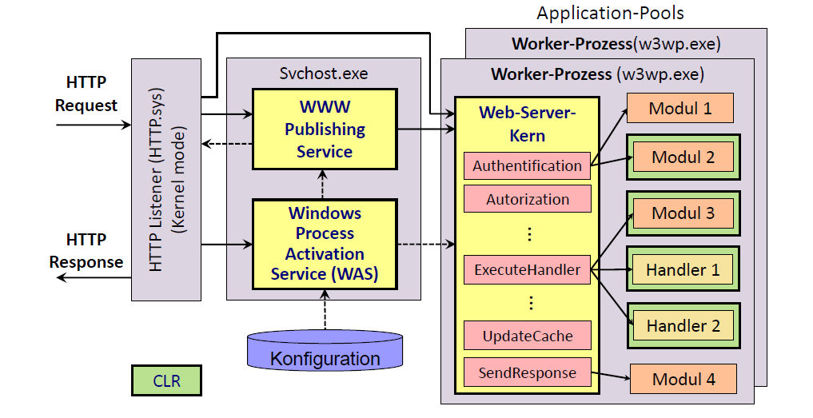

#### Kommentar
    * IIS = Internet Information Server (alt)
    * svchost.exe container für dll
    * WAS versteht verschiedene Protokolle (TCP, HTTP)
    * WEB APP laufen im Worker Process
    * WEB APP gehören zu App Pools
    * Anwendung aufgeteilt -> Session Management in DB
    * ExecuteHandler erzeugt Webseite? 

## ASP.NET Web Forms
- Ähnliches Programmierkonzept wie bei der Entwicklung von DesktopAnwendungen (Windows Forms).
- Steuerelemente
    - Aussehen und Verhalten wird durch Eigenschaften bestimmt.
    - Steuerelemente können in HTML-Fragment gerendert werden.
    - Web-Seite wird als Steuerelementebaum repräsentiert.
- Viewstate
    - Steuerelemente haben Zustand, der in Viewstate gespeichert wird.
    - Viewstate wird in Response zum Browser und in Request zurück an den Server geschickt.
- Ereignisgetriebene Programmierung
    - Anwendung reagiert in Callback- und Lebenszyklus-Methoden auf Ereignisse.
    - Änderung von Eigenschaften, Zugriff auf Geschäftslogik

#### Kommentar
    * Viewstate mit hidden field "gespeichert"

## Probleme von ASP.NETWeb-Forms 
- Laufzeiteinbußen durch Übertragung des ViewStates.
- Komplexer Lebenszyklus einer ASP.NET-Seite.
- Eingeschränkte Kontrolle über HTML
    - Verwendung von CSS teilweise schwierig
    - Probleme mit JavaScript-Code
- Vermischung von Präsentations- und Geschäftslogik im CodeBehind.
- Präsentationslogik kann kaum getestet werden.

#### Kommentar
    * html code nicht eindeutig bekannt

## ASP.NET MVC –Grundkonzept
- Konsequente Trennung von
    - `Model` (= Geschäftslogik),
    - `View` (= Beschreibung des zu generierenden HTML-Dokuments) und
    - `Controller` (= Präsentationslogik)
- Controller stellt Verbindung zu Geschäftslogik her.
- Controller ist unabhängig von der Ansicht und kann daher einfach getestet werden.

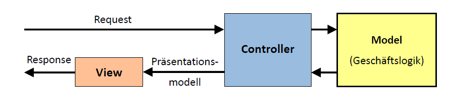


#### Kommentar
    * Controller gibts für diverse Aufgaben

## Komponenten von ASP.NET MVC
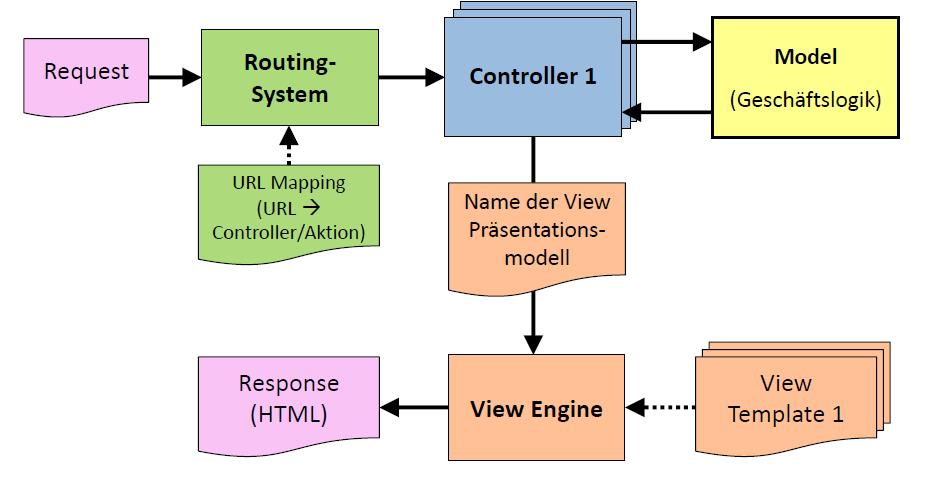

#### Kommentar
    * Routing System leitet request zu Controller oder liefert statische Webseite

## Eine einfache ASP.NET-MVC-Anwendung 
- Implementierung des Controllers:  
    ```csharp
    public class CurrenciesController: Controller {
        private ICurrencyCalculator calc = new CurrencyCalculator();
        public ActionResult Index() {
            IEnumerable < CurrencyData > model = calc.GetCurrencies().Select(
            curr = >calc.GetData(curr));
            return View("Index", model);
        }
    }
    ```
    - Das Routing-System weist der URL *http://.../Currencies[/Index]* die ControllerMethode *CurrenciesController.Index* zu.
    - Der Controller ermittelt mithilfe der Geschäftslogik (CurrencyCalculator) die ViewDaten (model).
    - Der Controller legt auch fest, welches View-Template (Index.cshtml) zum Generieren der HTTP-Antwort verwendet werden soll.

- Implementierung der View (Views/Currencies/Index.cshtml):
```html
@model IEnumerable
<CurrencyData>
<html>
   <body>
      <table border="1">
         <tr>
            <th>Code</th>
            <th>Name</th>
            <th>Region</th>
            <th>EuroRate</th>
         </tr>
         @foreach (CurrencyData curr in Model) {
         <tr>
            <td>@curr.Code</td>
            <td>@curr.Name</td>
            <td>@curr.Region</td>
            <td class="rightAligned">@string.Format("{0:F4}",
               curr.EuroRate)
            </td>
         </tr>
         }
      </table>
   </body>
</html>
```

#### Kommentar
    * System.Web enthält Routing System (Full Framework)
    * Lifecycle Methoden zB beim start
    * Routcondfig in .cs file
    * Controller werden von Controller abgeleitet (Syystem.MVC)
    * views in cshtml files

## Das Routing-System

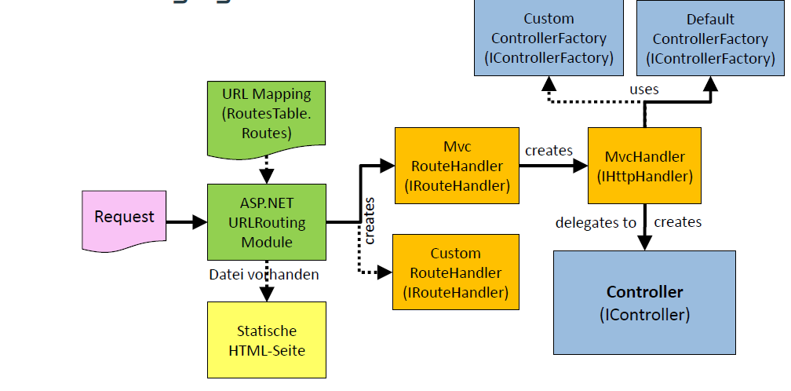

#### Kommentar
    * RouteHandler = factory für MVCHandler
    * MVCHandler = factory für Controller

## Konfiguration des Routing-Systems von ASP.NET

```csharp
protected void Application_Start() { // wird beim Starten der Web-Anw. aufgerufen
	RegisterRoutes(RouteTable.Routes);
}
public static void RegisterRoutes(RouteCollection routes) {
	routes.MapRoute("Default", // Name der Route
	"{controller}/{action}/{id}", // URL mit Parametern
	new {
		controller = "Home",
		action = "Index",
		id = (int ? ) null
	}
	// Standardwerte für Parameter
	);
}
```

| URL  | abgebildet auf |
|----------------------|----------------------------------------------------|
| /  | { controller="Home", action="Index", id=null } |
| /Products  | { controller="Products", action="Index", id=null } |
| /Products/List  | { controller="Products", action="List", id=null } |
| /Products/List/1234  | { controller="Products", action="List", id=1234 } |

#### Kommentar
    * PatternMatching mit Standardwerten für fehlende Parameter
    * new ohne name Anonymes Objekt, oft verwendet für optinale Dinge

## Routing: Verbindung zu ASP.NET MVC

- MapRoute ist eine Erweiterungsmethode, die der Route ein *MvcRouteHandler-Objekt* zuordnet:  
    ```csharp
    public static Route MapRoute(this RouteCollection routes, 
                                    string name, string url, 
                                    object defaults) {
        routes.Add(name, new Route(url, new MvcRouteHandler()) {
            Defaults = new RouteValueDictionary(defaults)
        });…
    }
    ```

- MvcRouteHandler erzeugt den HTTP-Handler *MvcHandler*.
- MvcHandler erzeugt mit Hilfe von DefaultControllerFactory einen Controller und ruft die entsprechende Methode (Action) auf.
- Beispiel: { controller="Products", action="List", id=1234 }
    - Factory erzeugt ein Objekt der Klasse *ProductsController*.
    - Aufruf der Methode *List()* oder *List(int id)* mit id=1234

## Controller: Rolle in der MVC-Architektur
- Controller sind der zentrale Einstiegspunkt für jede HTTP-Anfrage.
- An die Controller werden die Anfragedaten in aufbereiteter Form übergeben.
- Controller stellen die Verbindung zur Geschäftslogik her.
- Controller bereiten die Daten für die View vor -> Präsentationsmodell
- Controller können getestet werden:
    - Controller liefern strukturierten Ergebnisse (Präsentationsmodell) und keine unstrukturierten HTML-Dokumente.
    - Wegen loser Kopplung kann Geschäftslogik durch Mock-Objekt ersetzt werden

#### Kommentar
    * Parameter entweder direkt auslesen oder Framework injeziert Parameter in Methoden

## Controller: Programmiermodell 
- Alle Controller implementieren das Interface IController
- Einfachste Form eines Controllers:  
    ```csharp
    public class HelloController: System.Web.Mvc.IController {
	public void Execute(RequestContext req) {
            HttpResponseBase res = req.HttpContext.Response;
            res.Write("<h1>Hello World</h1>\n");
        }
    }
    ```
- Durch Ableiten von Controller werden View und Controller voneinander getrennt:  
    ```csharp
    public class HelloController: System.Web.Mvc.Controller {
        public ViewResult Index() {
            ViewData["Message"] = "Hello World";
            return View("Index");
        }
    }
    ```
    
#### Kommentar
    * Nicht von Interface sondern von Klasse ableiten

## Controller: Eingangs-und Kontextdaten 

- Über diverse Behälter (Maps) kann auf Anfrageparameter zugegriffen werden:  

| Behälter  | Beschreibung |
|--------------------------------------------|------------------------------------------------------------|
| Request.{QueryString,Form}  | Parameter bei {GET, POST}-Anfrage |
| Request.Cookies  | Cookies der Anfrage |
| RouteData.Values  | Parameter der Route |
| HttpContext.{Application, Session, Cache}  | {globale, sitzungsbezogene, gepufferte}serverseitige Daten |
| ... |  |

- Beispiel:  
    ```csharp
    public ActionResult Convert() {
        string inValueStr = Request.Form["inputValue"];
        decimal inValue = inValueStr == null ? 0 : decimal.Parse(inValueStr);
        string selectedCurrency = Request.Form["selectedCurrency"];
    }
    ```
    
- Parameter der HTTP-Anfrage und Routenparameter können auf ControllerMethoden abgebildet werden.
- Konvertierungsfehler werden in ModelState gespeichert.
    - Beispiel 1: url/converter?**inputValue**=100&**selectedCurrency**=USD  
        ```csharp
        public ActionResult Convert(decimal? inputValue,
                                    string selectedCurrency) {
            …
        }
        ```
    - Beispiel 2: url/persons/list/**10000**
        ```csharp
        routes.MapRoute(…,
                "{controller}/{action}/{id}",
                new { controller = "Home", action = "Index", id = (int?)null });
        ```
        ```csharp
        public ActionResult List(int? id, …) {
            …
        }
        ```

## Controller: Response-Objekt
- Das Ergebnis einer Controller-Methode ist eine HTTP-Antwort.
- Die HTTP-Antwort kann mithilfe des Response-Objekts (vom Typ *HttpResponseBase*) direkt generiert werden.  
    ```csharp
    public class MyController: Controller {
        public void Action1() {
            Response.Cookies["myCookie"].Value = "val";
            Response.Write("<h1>…</h1>");
        }
        public void Action2() {
            Response.Redirect("/Some/Url");
        }
    }
    ```
    - Nachteil: Controller- und Präsentationslogik werden vermengt.

        
## Controller: ViewResult

- In einem *ViewResult-Objekt* werden der Name der View und die View-Parameter (das Präsentationsmodell) an die View-Engine übergeben.  
   ```csharp
    public class MyController: Controller {
        public ViewResult Action1() {
            ViewData["param1"] = value1;
            return View("MyView");
            // oder: return new ViewResult { ViewName = "MyView",
            // ViewData = this.ViewData };
        }
    }
    ```
- Die Standard-View-Engine (WebFormViewEngine) sucht an folgenden Stellen nach dem View-Template:
    - Views/*ControllerName/ViewName.{aspx,ascx}*
    - Views/*Shared/ViewName.{aspx,ascx}*
    - Views/*ControllerName/ViewName.cshtml*
    - Views/*Shared/ViewName.cshtml*

#### Kommentar
    * Im einfachsten fall = ViewResult
    * Reihenfolge so wie sie verwendet werden würde
    
## Controller: ActionResult

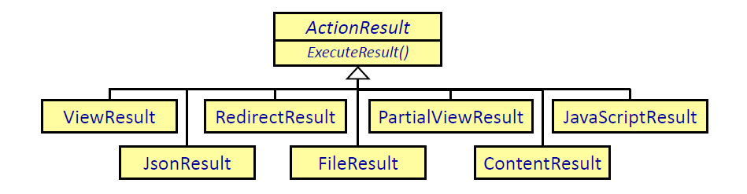


- Ergebnis einer Controller-Methode ist ein strukturiertes Objekt, das zum Testen verwendet werden kann.  
    ```csharp
    public class MyController: Controller {
        public ViewResult Action1() {
            return View("Index";
        }
        public RedirectResult Action2() {
            return RedirectToAction("Action3");
        }
    }
    ```
- HTTP-Antwort wird erst durch Aufruf von *ExecuteResult()* generiert.

## Controller: RedirectResult
- In Controller-Methoden möchte man andere Controller-Methoden aufrufen und damit Ansichten gemeinsam nutzen.  
    ```csharp
    public ActionResult AddToCart(CartItem item) {
        businessLogic.AddToCart(item)
        return this.List();
    }
    ```
- Problem: URL wird nicht aktualisiert -> Probleme bei Aktualisierung der Seite  
    ```
    http://host/Cart/AddToCart
    ```
- Soll eine der Ansicht entsprechende URL verwendet werden, ist ein zusätzlicher Roundtrip über den Client (Antwortcode 302) notwendig:  

    ```
    http://host/Cart/AddToCart
    ```
    ```csharp
    public ActionResult AddToCart(CartItem item) {
        businessLogic.AddToCart(item)
        
        // Sendet Antwortcode 302 mit URL http://.../Cart/List
        return RedirectToAction("List"); 
    } // Neue Anfrage ruft Controller-Methode List auf.

    ```
    ```
    http://host/Cart/List
    ```
    
#### Kommentar
    * Um Url zu aktualisiern (nicht mehrfache ungewünschte aktion bei Refresh)

## Views: Konzept
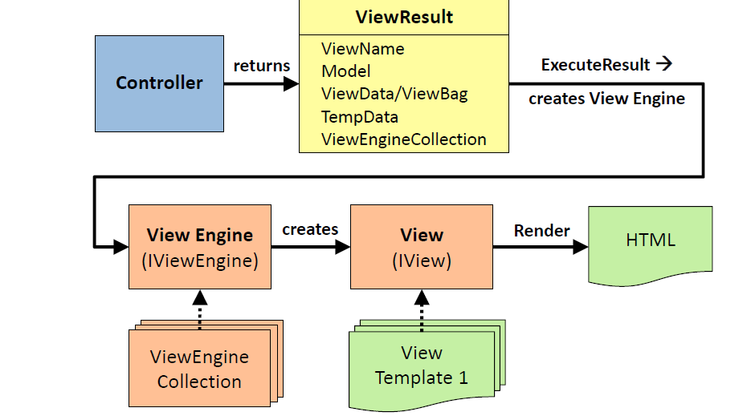

#### Kommentar
    * ViewResult von Controller
    * ViewEngine nimmt ViewResult und erzeugt die View
    * View erzeugt html

## Views und View-Engines
- ASP.NET MVC unterstützt zwei View-Engines:

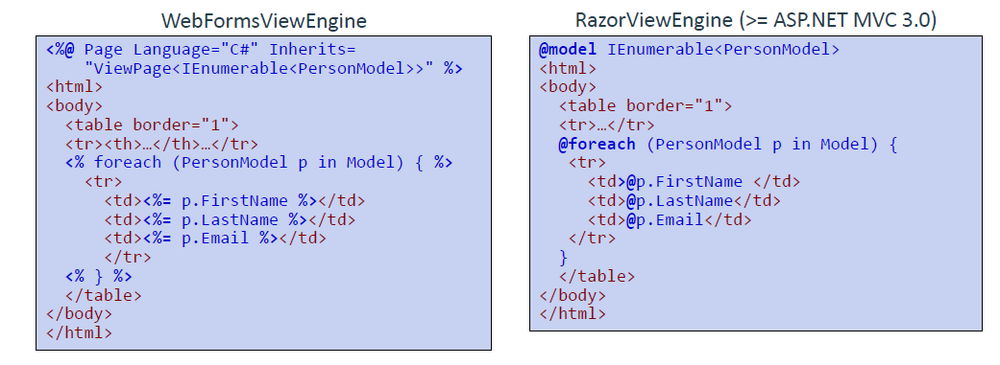

- Andere View-Engines können hinzugefügt werden: Spark, NHaml, NVelocity, …

#### Kommentar
    * RazorViewEngine erkennt unterscheided zwischen c# und html selber

## Views: Das Präsentationsmodell
- Der Controller hat verschiedene Möglichkeiten, Daten an Ansichten zu übergeben:

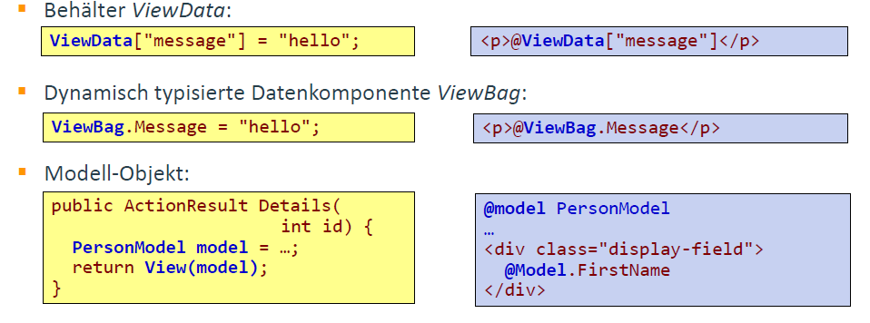

#### Kommentar
    * letzte Variante bevorzugen (Typsicherheit)

## View: HTML-Hilfsmethoden

- HTML-Hilfsmethoden erleichtern die Generierung des HTML-Codes.
- Für die meisten Formularelemente existieren Hilfsmethoden, z. B  

    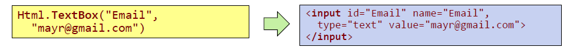

- Der angezeigte Wert im Formularelement wird folgendermaßen ermittelt:
    1. ModelState["Email"].Value.AttemptedValue, falls Validierungsfehler vorliegt.
    2. Zweiter Parameter der Hilfsmethode, falls vorhanden.
    3. ViewBag.Email
    4. ViewData["Email"]
    5. @Model.Email

- Es existieren typsichere Varianten der Hilfsmethoden:  
    ```csharp
    Html.TextBoxFor(model => model.Email)
    ```

#### Kommentar
    * Modelstate enthält fehlerinfomationen

## View: Selbstdefinierte HTML-Hilfsmethoden
- Möglichkeit 1: Implementierung von Erweiterungsmethoden für die Klasse *HtmlHelper*.
- Möglichkeit 2: Inline-Methoden (bei Verwendung der Razor-View-Engine)  
    ```csharp
    @helper CreateList(string[] items) {
    <ul>
       @foreach (string item in items) {
       <li>@item</li>
       }
    </ul>
    }
    ```

    ```html
    <p>Person List:</p>
    @CreateList(ViewBag.PeopleNames)
    ```
    - Helper können in das Verzeichnis App_Code ausgelagert werden und stehen so mehreren Views zur Verfügung.

#### Kommentare
    * 2 Möglichkeiten um Funktionalitäten in Hilfsmethoden auszulagern
    * Create List -> Inline-Methode

## View: Beispiel für HTML-Hilfsmethoden
```html
@using(Html.BeginForm()) {
@Html.HiddenFor(model => model.Id)
<div class="editor-label">
   @Html.LabelFor(model => model.FirstName)
</div>
<div class="editor-field">
   @Html.EditorFor(model => model.FirstName)
</div>
}
```

Wird zu =>
```html
<form action="/Person/Edit/1" method="post">
   <input id="Id" name="Id" type="hidden" value="1" />
   <div class="editor-label">
      <label for="FirstName">FirstName</label>
   </div>
   <div class="editor-field">
      <input id="FirstName" name="FirstName" class="text-box single-line"
         type="text" value="Franz" />
   </div>
</form>
```

#### Kommentar
    * es wird kein einziger String verwendet (nur Hilfsmethoden)

## Dateneingabe

- Über eine GET-Anfrage wird das HTTP-Formular angefordert:  
    ```csharp
    [HttpGet]
    public ActionResult Edit(int id) {
        Person pers = persAdmin.FindById(id);
        return View(new PersonModel(pers));
    }
    ```

- Mit einer POST-Anfrage wird das ausgefüllte Formular an den Server gesendet:  
    ```csharp
    [HttpPost]
    public ActionResult Edit(int id, FormCollection collection) {
        if (ModelState.IsValid) {
            Person pers = new Person {
                Id = int.Parse(collection["Id"]),
                FirstName = collection["FirstName"],
                …
            };
            persAdmin.Update(pers);
            return RedirectToAction("Index");
        }
        else return View();
    }
    ```
    
#### Kommentare
    * Get Formular befüllen mit BL Daten
    * Post Formular inhalt mit Nutzer eingaben holen

## Dateneingabe: Modellbindung
- Formularfelder können auf .NET-Objekt abgebildet werden:  

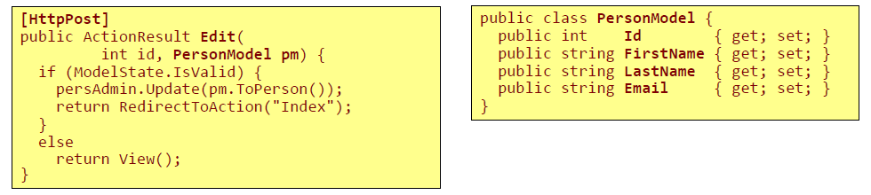

- Formularfelder werden auf gleichnamige Eigenschaften abgebildet:  
    ```html
    <input name="FirstName" type="text" value="Franz" />
    ```

    Wird zu =>  
    > pm.FirstName  

- Mit dem Attribut Bind kann der Abbildungsprozess näher definiert werden:  
    ```csharp
    public ActionResult Edit(int id,
                [Bind(Prefix="pers", Exclude="Email")] PersonModel pm) { … }
    ```
    - Feld mit dem Namen *pers.FirstName* wird auf *pm.FirstName* abgebildet

#### Kommentare
    * Redirekt, damit die Daten über die BL in die DB kommen
    * Name des Formulatfelds muss mit dem Property zusammenpassen
    

## Validierung: Validierungslogik
- Validierungsfehler werden im Objekt ModelState gespeichert.
    - Eingaben werden vom Framework im Zuge der Modellbindung automatisch auf Korrektheit überprüft.
    - In Contollermethoden können die Eingaben explizit validiert und bei Bedarf Validierungsfehler zu ModelState hinzugefügt werden.  
	```csharp
	public ActionResult Edit(int id, PersonModel pm) {
		if (ModelState.IsValidField("Email"))   // If field Email in correct format …
		if (!Logic.IsRegistered(pm.Email))      // If Email is not found in data base …
		ModelState.AddModelError("Email", "Unregistered email address");
		if (ModelState.IsValid) {               // If all fields are valid …
			persAdmin.Update(pm.ToPerson());
			return RedirectToAction("Index");
		}
		else return View();
	}
	```

#### Kommentare
    * Client- und Serverseitig durchführen
    * gibt auch Validierungen, die nur über die BL gemacht werden können (exisitert die email)
    * sonst kann man auch mit Annontation wie RegEx arbeiten(?)
    

## Validierung: Anzeige der Validierungsergebnisse

- HTML-Hilfsmethoden berücksichtigen den Zustand von ModelState und generieren entsprechenden HTML-Code.
    - Liegt für ein Eingabefeld ein Validierungsfehler vor, wird in diesem Feld der eingegebene Wert (*ModelState["field-name"].Value.AttemptedValue*) dargestellt.
    - Mit CSS-Regeln (z. B. .input-validation-error) kann die Formatierung von fehlerhaften Eingaben festgelegt werden.
- Es existieren HTML-Hilfsmethoden zur Anzeige von Fehlermeldungen:
    - Html.ValidationMessage("field-name"):
    - Html.ValidationSummary():

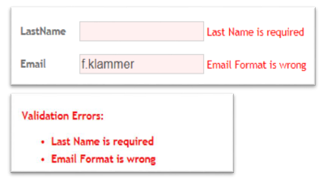

#### Kommentare
    * entweder für ein Feld oder füre alle Felder

## Validierung: Client-seitige Validierung
-  Mit Attributen können Validierungsregeln definiert werden, die bei der client- und serverseitigen Validierung berücksichtigt werden:  
    ```csharp
    public class PersonModel { 
    [Required(ErrorMessage = "Email is required")]
    [RegularExpression(@"^\w+([-+.']\w+)*@\w+([-.]\w+)*\.\w+([-.]\w+)*$", ErrorMessage = "Email format is wrong")]
        public string Email {
            get;
            set;
        }
    }
    ```
    
- *jQuery*-basierte Validierungsbibliothek muss in HTML inkludiert werden.
- HTML-Hilfsfunktionen reichern HTML-Elemente mit zusätzlichen „data-*“-Attributen an, die zur Validierung verwendet werden:  
    ```html
    <input data-val="true" data-val-regex="Email format is wrong"
            data-val-regex-pattern="^\w+..." name="Email" type="text" value="..." />
    ```

- Konzepte der Validierungslogik
    - Validierungscode ist nicht direkt mit HTML-Elementen verbunden.
    - Falls JavaScript deaktiviert ist, wird serverseitige Validierung durchgeführt (Barrierefreiheit).

#### Kommentar
    * JQuery Validate (muss man extra einfügen) führt Validierung durch
        * ob alle Elemente angezeigt werden können 
        * wenn Regeln vorhanden, prüft diese
    

## Validierung: Beispiel
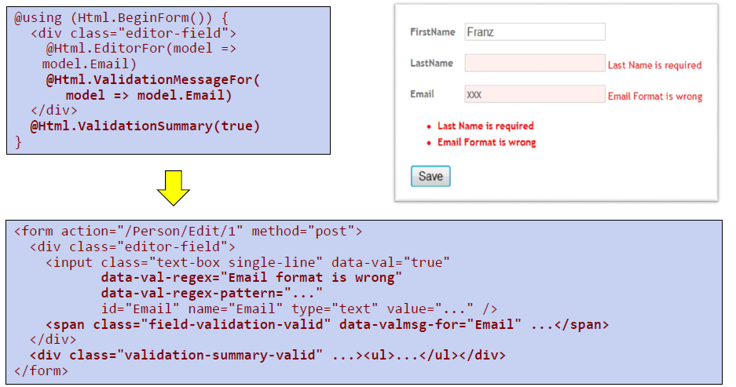

## Testen von ASP.NET-MVC-Anwendungen

- Da Controller und Ansichten konsequent getrennt sind, können für Controller sehr einfach Unittests erstellt werden:  
    ```csharp
    [TestMethod]
    public void IndexTest() {
        ConverterController controller = new ConverterController();
        ViewResult result = controller.Index("USD");
        ConverterModel model = result.Model as ConverterModel;
        Assert.AreEqual("", result.ViewName);
        Assert.IsNotNull(model);
        Assert.IsNotNull(model.CurrencyList);
        SelectListItem selItem = model.CurrencyList.FirstOrDefault(item = >item.Selected);
        Assert.AreEqual("USD", selItem.Text);
    }
    ```
    
