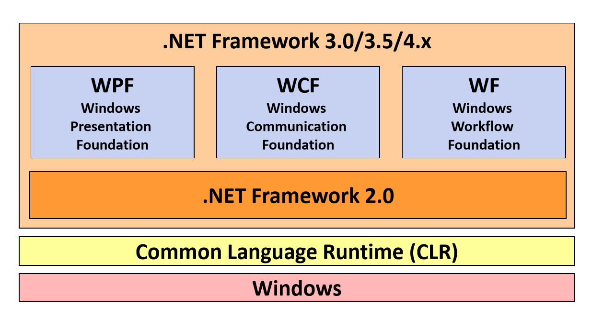
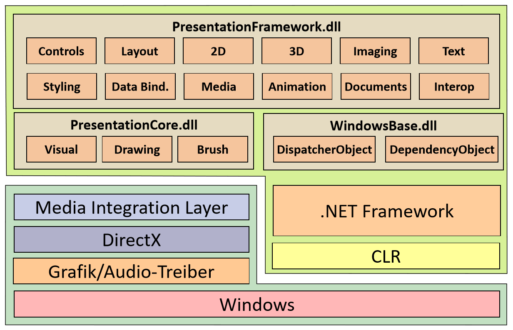
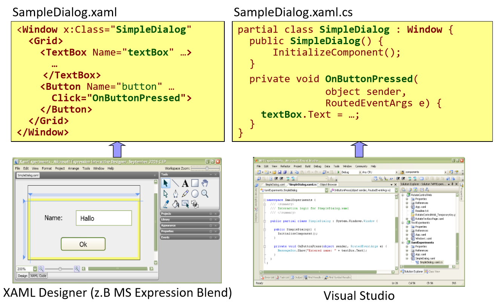
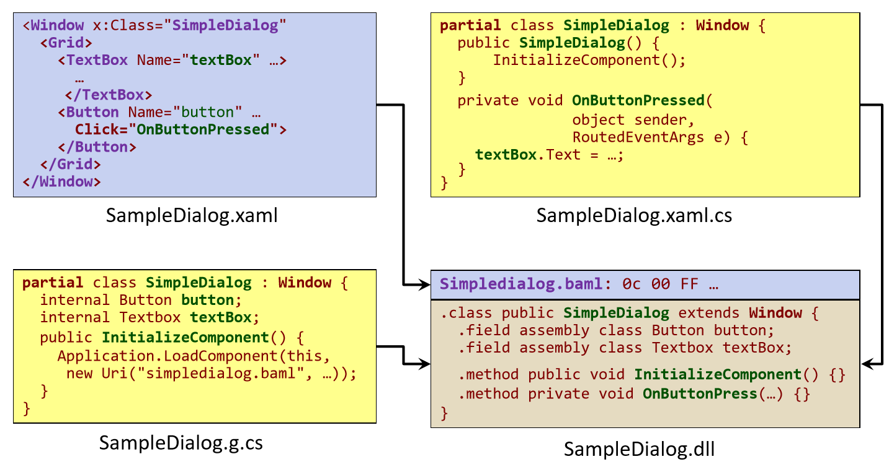
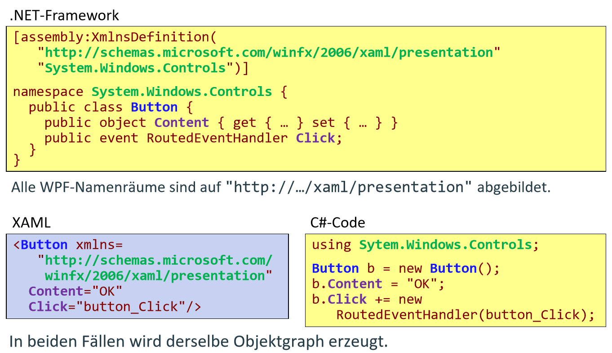

# .NET Windows Presentation Framework (WPF)

## Historische Entwicklung

* Win32-Anwendungen
    *  Kennzeichen: Direkte Verwendung von Win32-APIs: user32.dll, kernel32.dll, gdi32.dll.
    *  Layout: C/C++-Quelltext, keine Werkzeugunterstützung
    *  Repräsentation des Layouts: Quelltext. 
    *  Methodik: Hauptereignisschleife, Funktionszeiger, Windows-Nachrichten
    *  Grafikprogrammierung: GDI 

Win32 API hat sich bis heute im Kern nicht geändert, es wurde jedoch mehrere Abtrahierungsschichten hinzugefügt, die die Verwendung erleichert.

* Microsoft Foundation Classes (MFC)
    *  Kennzeichen: Dünne Schicht über Win32-APIs, Application-Framework. 
    *  Layout: Quelltext, einfache Werkzeugunterstützung.
    *  Methodik: OO-Konzepte (Vererbung und dynamische Bindung), Makros (Message-Maps). 
    *  Repräsentation des Layouts: Quelltext, Ressourcen
    *  Grafikprogrammierung : GDI

* VB (<=6)
    * Kennzeichen: Gute Abstraktion der Win32-API, einfache Integration von COMKomponenten, proprietäre Sprache
    * Layout: grafisches Designer-Werkzeug, einfache Verwendbarkeit von ActiveXControls (anfangs VBX-Controls).
    *  Repräsentation des Layouts: proprietäres (Text-)Format
    *  Methodik: Registrierung von Callback-Funktionen, Auslagerung der Geschäftslogik in COM-Komponenten. 
    *  Grafikprogrammierung: 
    *  Vorzüge:
        *   GUI-Entwicklung wesentlich vereinfacht (Hauptgrund für Popularität von VB6)
        *   Unterstützung komponentenorientierter SW-Entwicklung

    * NachTeile:
        * Proprietäre Programmiersprache für größere Anwendungen unbrauchbar.
        * Kein Framework.

#### Kommentare:
    * extrem gut angekommen bei den Kunden
    * Verbindung mit C++ war schwer
    * Grafik noch immer mit GDI
    * keine Geschäftslogik in VB
    * Komponentenmodell einfach erweiterbar (visuell erweiterbar)


* Windows Forms 
    *  Layout: grafisches Design-Werkzeug, Möglichkeit zur Erweiterung bzw. Neuentwicklung von Steuerelementen. 
    *  Repräsentation des Layouts: generierter Quelltext. 
    *  Methodik: Ereignisbehandlung über Delegates, einfache Anbindung der Geschäftslogik. 
    *  Grafikprogrammierung: GDI+
    *  Vorzüge: 
        *   Volle Integration in das .NET-Framework,
        *   exzellentes Design-Werkzeug,
        *   Entwicklung von vollwertigen Steuerelementen ist einfach, umfangreiches Angebot an Komponenten. 
    * Nachteile:
        * Unflexibles Layoutmanagement
        * keine konsequente Trennung von Layout und Code (da Layout auch als Code repräsentiert wird)
        * Grafikfähigkeiten moderner PCs werden nicht genutzt (da noch immer GDI32.dll als Grundlage dient)

#### Kommentare:
    * in der Industrie nach wie vor verwendet
    * einfach die BL und GUI zu verbinden 
    * basierend auf C#


## Architektur

 

#### Kommentare
    * wir werden uns auf REST konzentrieren

 
 
#### Kommentare
    * 2 Kategorien von Komponenten: 
        * unterer Bereich: native/nicht verwaltete Komponente(->OS)
            * Media Integration Layer: rendert den Szenengraph
        * oberer Bereich: .Net Komponenten
            * WPF Bestandteil des .NET Frameworks
            * DispatcherObjekt - für Asynchronität zuständig
            * jede Eigenschaft in einer WPF Anwendung -> Dependency Property
            * 2D und 3D - direkt in WPF integriert (da für Animationseffekte, Skalieren von JPacks, etc. häufig gebraucht ) - früher nicht direkt integriert
            * Animation: sagen eine Property ändert sich  über die Zeit und die WPF stellt das dar
            * ... auf manche Punkte wird später näher eingegangen

## Neuerungen in der WPF
* Deklarative Programmierung (XAML)
* Einheitliche API:
    *  2D-Grafik (ersetzt GDI, GDI+),
    *  3D-Grafik (deckt Teilbereiche von Direct3D bzw. OpenGL ab),
    *  UI (ersetzt user32.dll bzw. Windows Forms),
    *  Bild und Ton (DirectShow).
*  Vektor-Grafik
*  Neues Programmiermodell für Grafikanwendungen
*  Starke Unterstützung von Text-Dokumenten
*  Verhalten und Aussehen von Steuerelementen sind voneinander getrennt (Styles und Templates).
*  Neues Konzept zur Datenbindung

#### Kommentare
    * alles ist Vektorgraphik (bis hin zum Text)
    * ganz wichtig: XAML (auf den Folien weggelassen)

## Deklerative Programmierung
Benutzeroberflächen können in XAML (eXtensible Application Markup Language) beschrieben werden.

```xml
<?xml version="1.0" encoding="UTF-8"?>
<Window xmlns="http://.../xaml/presentation" xmlns:x="http://.../xaml" x:Class="XamlExperiments.SimpleDialog" Title="XamlExperiments" Height="107" Width="200">
   <Grid>
      <Label Height="25" HorizontalAlignment="Left" Margin="20,15,0,0" Name="label" VerticalAlignment="Top" Width="60">Name:</Label>
      <TextBox Height="25" Margin="80,15,10,0" Name="textBox" VerticalAlignment="Top" Padding="5,5,5,5">Hallo</TextBox>
      <Button Margin="0,0,0,10" Name="button" Height="23" VerticalAlignment="Bottom" HorizontalAlignment="Center" Width="80">Ok</Button>
   </Grid>
</Window>
```

#### Kommentare
    * werden XAML selbst schreiben um ein besseres Gefühl dafür zu bekommen (kann allerdings generiert werden) - vgl. HTML
    * Grid - kümmert sich um die Anordnung der Elemente
    * für graphische Repräsentierung
    * Vorteile:
        * kann sagen, dass der graphische Teil erst von einem GUI Designer erstellt wird (z.B. Blend -> WPF Andwendung)
        * XAML wird aus dem Designer generiert

## Trennung von Layout und Code



#### Komentare
    * wie immer: sehr, sehr wertvoll, dass man die Arbeit aufteilen kann
    
## Das Übersetzungsmodell



#### Kommentare
    * es kommt eine dll oder exe heraus, in welcher alles drinnen steht
    * -> sehr kompakte Form


## XAML
### What is XAML

* XAML ist eine XML-Sprache zur Beschreibung und Initialisierung von .NET-Objektgraphen.
    * WPF: Beschreibung von Benutzeroberflächen
    * WF: Beschreibung von Workflows
* Abbildung:
    * CLR-Namenräume -> XML-Namenräume (mithilfe des Attributs XmlnsDefinitionAttribute).
    * Klassen -> XML-Elemente
    * Properties -> XML-Attribute
    * Registrierung von Ereignisbehandlungsmethoden  XML-Attribute.
    * Es existieren zahlreiche Konverter, die Zeichenketten (Werte von XMLAttributen) in die pas Abbildung XAML  .NET-Konstrukteenden CLR-Datenty  .NET-AKonstruktendeln.

#### Kommentare
    * ist dafür bestimmt um statische Workflows/Objektgrafiken zu beschreiben
    * Ergebnis davon ist eine GUI (Grid, Textbox, ...)

### Abbildung XAML -> .NET Konstrukte



#### Kommentar
    * xaml element == c# objekt

### Eigenschaftselemente
* Viele Properties können komplexe Datentypen aufweisen, z. B. die Property Content von Button:
```csharp
Button btn = new Button();
ImageSource bitmap = new BitmapImage(new Uri(…));
Image image = new Image {
 Source = bitmap, Height = 50, Width = 80
};
btn.Content = image;
```
*  Komplexe Datentypen sind nicht direkt auf XAML-Attribute abbildbar:
```csharp
<Button Content="<Image …/>" /> <!-- funktioniert nicht! -->
```
* Eigenschaftselemente können komplexe Datentypen aufnehmen:
```xaml
<Button>
	<Button.Content>
		<Image Source="smily.jpg" Height="50" Width="80" />
	</Button.Content>
</Button>
```

#### Kommentar
    * komplexe Propertys müssen als ein Property-Element dargestellt werden

### Kindelemente

### Kindelemente - Content Properties


#### Kommentare
    * gibt Steuerelemente, die haben Properties 
        * z.B. ListBox bei denen man sich mehrere Elemente erwartet
        * oder bspw. unter Dictionary erwartet man sich eine map
    * die Steuerelemente haben sehr viele Properties
        * diese Properties können auch wieder Properties haben, 
        * dadurch kann sich eine Baumstruktur aufbauen

### Typkonverter

*  In vielen Fällen können einfache Typen in XAML nur sehr schwerfällig beschrieben werden:
```xaml
<Button.Background>
	<SolidColorBrush>
		<SolidColorBrush.Color>
			<Color A="255" R="255" G="255" B="255"/>
		</SolidColorBrush.Color>
	</SolidColorBrush>
</Button.Background>

```
* Typkonverter tragen zur Vereinfachung der XAML-Beschreibung bei
```xaml
<Button Background="White" />
```
* Typkonverter sind von TypeConverter abgeleitet und werden mit dem Attribut TypeConverterAttribute mit einem Typ oder einer Property verbunden
```csharp
[TypeConverter(typeof(BrushConverter))] public abstract class Brush : … { … }
```

### Markup Extensions
* Mit Markup-Extensions können Attributwerte flexibel definiert werden:
```xaml
<Element SomeProperty = "{MyMarkupExtension Prop1=Value}">
```
* Die Markup-Extension fasst Parameter zusammen, die Property-Wert bestimmen.
* ProvideValue liefert den Wert, welcher der Property zugewiesen wird.

```csharp
public MyMarkupExtension: MarkupExtension {
 public override object ProvideValue(…);
 public object Prop1 {…}
}
```
*  Wichtigste Anwendungen:
    *  x:Static[Extension] 
    *  Bindung
    *  StaticResource[Extension] 
    *  DynamicResource[Extension]
* Beispiel:
```xaml
<Button Height="{x:Static Member = SystemParameters.IconHeight}"/>
<TextBox Text="{Binding Path=LastName}"/>
```

#### Kommentar
    * wird vorallem bei Datenbindung benötigt

### Einbindung von .NET Klassen

* Mit XAML können Objekte beliebiger .NET-Klassen erzeugt werden.
* Die Initialisierung erfolgt über Attribute (-> Properties) bzw. Typkonverter.


#### Kommentar
    * muss auf die Namespaces aufpassen

## Aufbau von WPF-Programmen

Hello World Code
```csharp
public class HelloWindow: Window {
 private Button btn;
 public HelloWindow() {
  btn = new Button() {
   Content = "Quit"
  };
  btn.Click += new RoutedEventHandler(OnClick);
  this.AddChild(btn);
  this.Title = "WPF Hello App";
  this.Width = 120;
  this.Height = 80;
 }
 void OnClick(object sender, RoutedEventArgs e) {
  this.Close();
 }[STAThread] static void Main(string[] args) {
  Application app = new Application();
  app.Run(new HelloWindow());
 }
}
```

### Klassen Application und Window

### Hellow World mit der WPF

### Das Code-Behinde-onzept


## Klassen der WPF

### Basisklassen der WPF


### DispatcherObject


### await/async und die WPF


### DependencyObject

### Implementierung von Dependency Properties

### Anwendungsbeispiele für Dependency Properties

### Attached Properties

### Implementierung von Attached Properties

### Visual (und Visual 3D)


### Andere Basisklassen der WPF

### Die wichtigsten Steuerelemente


### ContentControl

- Steuerelemente dieser Gruppe können ein beliebiges Kindelement enthalten (nicht nur eine Zeichenkette).
- Beispiele:

    

### Header ContentControl

- Steuerelement besitzt neben dem Kindelement eine Überschrift.
- Beispiele:

    

### Steuerelemente zur Darstellung und Bearbeitung von Text
- TextBlock: Darstellung von Text in verschiedenen Fonts und mit
diversen Hervorhebungsarten.


### Steuerelemente mit mehreren Kindelementen (ItemsControl)

