# .NET Windows Presentation Framework (WPF)

## Historische Entwicklung

* Win32-Anwendungen
    *  Kennzeichen: Direkte Verwendung von Win32-APIs: user32.dll, kernel32.dll, gdi32.dll.
    *  Layout: C/C++-Quelltext, keine Werkzeugunterstützung
    *  Repräsentation des Layouts: Quelltext. 
    *  Methodik: Hauptereignisschleife, Funktionszeiger, Windows-Nachrichten
    *  Grafikprogrammierung: GDI 

Win32 API hat sich bis heute im Kern nicht geändert, es wurde jedoch mehrere Abtrahierungsschichten hinzugefügt, die die Verwendung erleichert.

* Microsoft Foundation Classes (MFC)
    *  Kennzeichen: Dünne Schicht über Win32-APIs, Application-Framework. 
    *  Layout: Quelltext, einfache Werkzeugunterstützung.
    *  Methodik: OO-Konzepte (Vererbung und dynamische Bindung), Makros (Message-Maps). 
    *  Repräsentation des Layouts: Quelltext, Ressourcen
    *  Grafikprogrammierung : GDI

* VB (<=6)
    * Kennzeichen: Gute Abstraktion der Win32-API, einfache Integration von COMKomponenten, proprietäre Sprache
    * Layout: grafisches Designer-Werkzeug, einfache Verwendbarkeit von ActiveXControls (anfangs VBX-Controls).
    *  Repräsentation des Layouts: proprietäres (Text-)Format
    *  Methodik: Registrierung von Callback-Funktionen, Auslagerung der Geschäftslogik in COM-Komponenten. 
    *  Grafikprogrammierung: 
    *  Vorzüge:
        *   GUI-Entwicklung wesentlich vereinfacht (Hauptgrund für Popularität von VB6)
        *   Unterstützung komponentenorientierter SW-Entwicklung

    * NachTeile:
        * Proprietäre Programmiersprache für größere Anwendungen unbrauchbar.
        * Kein Framework.

#### Kommentare:
    * extrem gut angekommen bei den Kunden
    * Verbindung mit C++ war schwer
    * Grafik noch immer mit GDI
    * keine Geschäftslogik in VB
    * Komponentenmodell einfach erweiterbar (visuell erweiterbar)


* Windows Forms 
    *  Layout: grafisches Design-Werkzeug, Möglichkeit zur Erweiterung bzw. Neuentwicklung von Steuerelementen. 
    *  Repräsentation des Layouts: generierter Quelltext. 
    *  Methodik: Ereignisbehandlung über Delegates, einfache Anbindung der Geschäftslogik. 
    *  Grafikprogrammierung: GDI+
    *  Vorzüge: 
        *   Volle Integration in das .NET-Framework,
        *   exzellentes Design-Werkzeug,
        *   Entwicklung von vollwertigen Steuerelementen ist einfach, umfangreiches Angebot an Komponenten. 
    * Nachteile:
        * Unflexibles Layoutmanagement
        * keine konsequente Trennung von Layout und Code (da Layout auch als Code repräsentiert wird)
        * Grafikfähigkeiten moderner PCs werden nicht genutzt (da noch immer GDI32.dll als Grundlage dient)

#### Kommentare:
    * in der Industrie nach wie vor verwendet
    * einfach die BL und GUI zu verbinden 
    * basierend auf C#


## Architektur

 

#### Kommentare
    * wir werden uns auf REST konzentrieren

 
 
#### Kommentare
    * 2 Kategorien von Komponenten: 
        * unterer Bereich: native/nicht verwaltete Komponente(->OS)
            * Media Integration Layer: rendert den Szenengraph
        * oberer Bereich: .Net Komponenten
            * WPF Bestandteil des .NET Frameworks
            * DispatcherObjekt - für Asynchronität zuständig
            * jede Eigenschaft in einer WPF Anwendung -> Dependency Property
            * 2D und 3D - direkt in WPF integriert (da für Animationseffekte, Skalieren von JPacks, etc. häufig gebraucht ) - früher nicht direkt integriert
            * Animation: sagen eine Property ändert sich  über die Zeit und die WPF stellt das dar
            * ... auf manche Punkte wird später näher eingegangen

## Neuerungen in der WPF
* Deklarative Programmierung (XAML)
* Einheitliche API:
    *  2D-Grafik (ersetzt GDI, GDI+),
    *  3D-Grafik (deckt Teilbereiche von Direct3D bzw. OpenGL ab),
    *  UI (ersetzt user32.dll bzw. Windows Forms),
    *  Bild und Ton (DirectShow).
*  Vektor-Grafik
*  Neues Programmiermodell für Grafikanwendungen
*  Starke Unterstützung von Text-Dokumenten
*  Verhalten und Aussehen von Steuerelementen sind voneinander getrennt (Styles und Templates).
*  Neues Konzept zur Datenbindung

#### Kommentare
    * alles ist Vektorgraphik (bis hin zum Text)
    * ganz wichtig: XAML (auf den Folien weggelassen)

## Deklerative Programmierung
Benutzeroberflächen können in XAML (eXtensible Application Markup Language) beschrieben werden.

```xml
<?xml version="1.0" encoding="UTF-8"?>
<Window xmlns="http://.../xaml/presentation" xmlns:x="http://.../xaml" x:Class="XamlExperiments.SimpleDialog" Title="XamlExperiments" Height="107" Width="200">
   <Grid>
      <Label Height="25" HorizontalAlignment="Left" Margin="20,15,0,0" Name="label" VerticalAlignment="Top" Width="60">Name:</Label>
      <TextBox Height="25" Margin="80,15,10,0" Name="textBox" VerticalAlignment="Top" Padding="5,5,5,5">Hallo</TextBox>
      <Button Margin="0,0,0,10" Name="button" Height="23" VerticalAlignment="Bottom" HorizontalAlignment="Center" Width="80">Ok</Button>
   </Grid>
</Window>
```

#### Kommentare
    * werden XAML selbst schreiben um ein besseres Gefühl dafür zu bekommen (kann allerdings generiert werden) - vgl. HTML
    * Grid - kümmert sich um die Anordnung der Elemente
    * für graphische Repräsentierung
    * Vorteile:
        * kann sagen, dass der graphische Teil erst von einem GUI Designer erstellt wird (z.B. Blend -> WPF Andwendung)
        * XAML wird aus dem Designer generiert

## Trennung von Layout und Code


#### Komentare
    * wie immer: sehr, sehr wertvoll, dass man die Arbeit aufteilen kann
    
## Das Übersetzungsmodell


#### Kommentare
    * es kommt eine dll oder exe heraus, in welcher alles drinnen steht
    * -> sehr kompakte Form


## XAML
### What is XAML

* XAML ist eine XML-Sprache zur Beschreibung und Initialisierung von .NET-Objektgraphen.
    * WPF: Beschreibung von Benutzeroberflächen
    * WF: Beschreibung von Workflows
* Abbildung:
    * CLR-Namenräume -> XML-Namenräume (mithilfe des Attributs XmlnsDefinitionAttribute).
    * Klassen -> XML-Elemente
    * Properties -> XML-Attribute
    * Registrierung von Ereignisbehandlungsmethoden  XML-Attribute.
    * Es existieren zahlreiche Konverter, die Zeichenketten (Werte von XMLAttributen) in die pas Abbildung XAML  .NET-Konstrukteenden CLR-Datenty  .NET-AKonstruktendeln.

#### Kommentare
    * ist dafür bestimmt um statische Workflows/Objektgrafiken zu beschreiben
    * Ergebnis davon ist eine GUI (Grid, Textbox, ...)

### Abbildung XAML -> .NET Konstrukte


#### Kommentar
    * xaml element == c# objekt

### Eigenschaftselemente
* Viele Properties können komplexe Datentypen aufweisen, z. B. die Property Content von Button:
```csharp
Button btn = new Button();
ImageSource bitmap = new BitmapImage(new Uri(…));
Image image = new Image {
 Source = bitmap, Height = 50, Width = 80
};
btn.Content = image;
```
*  Komplexe Datentypen sind nicht direkt auf XAML-Attribute abbildbar:
```csharp
<Button Content="<Image …/>" /> <!-- funktioniert nicht! -->
```
* Eigenschaftselemente können komplexe Datentypen aufnehmen:
```xaml
<Button>
	<Button.Content>
		<Image Source="smily.jpg" Height="50" Width="80" />
	</Button.Content>
</Button>
```

#### Kommentar
    * komplexe Propertys müssen als ein Property-Element dargestellt werden

### Kindelemente

### Kindelemente - Content Properties
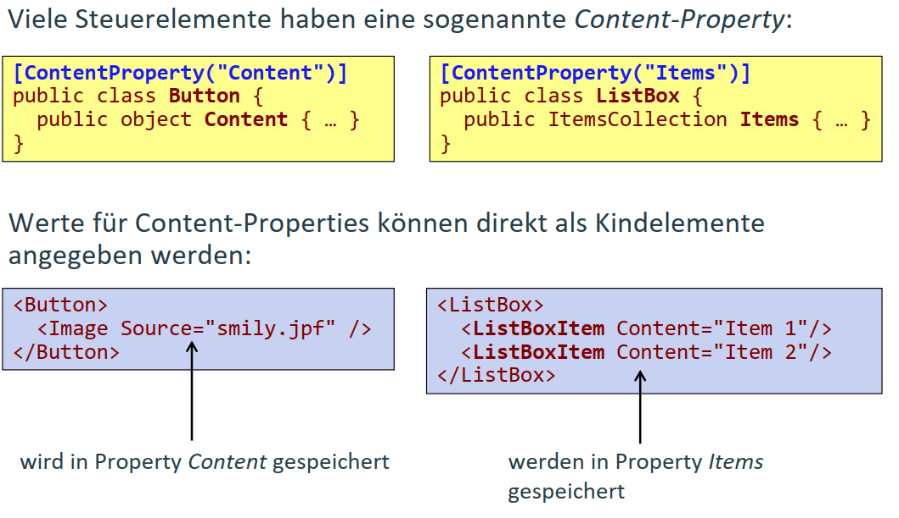

#### Kommentare
    * gibt Steuerelemente, die haben Properties 
        * z.B. ListBox bei denen man sich mehrere Elemente erwartet
        * oder bspw. unter Dictionary erwartet man sich eine map
    * die Steuerelemente haben sehr viele Properties
        * diese Properties können auch wieder Properties haben, 
        * dadurch kann sich eine Baumstruktur aufbauen

### Typkonverter

*  In vielen Fällen können einfache Typen in XAML nur sehr schwerfällig beschrieben werden:
```xaml
<Button.Background>
	<SolidColorBrush>
		<SolidColorBrush.Color>
			<Color A="255" R="255" G="255" B="255"/>
		</SolidColorBrush.Color>
	</SolidColorBrush>
</Button.Background>

```
* Typkonverter tragen zur Vereinfachung der XAML-Beschreibung bei
```xaml
<Button Background="White" />
```
* Typkonverter sind von TypeConverter abgeleitet und werden mit dem Attribut TypeConverterAttribute mit einem Typ oder einer Property verbunden
```csharp
[TypeConverter(typeof(BrushConverter))] public abstract class Brush : … { … }
```

### Markup Extensions
* Mit Markup-Extensions können Attributwerte flexibel definiert werden:
```xaml
<Element SomeProperty = "{MyMarkupExtension Prop1=Value}">
```
* Die Markup-Extension fasst Parameter zusammen, die Property-Wert bestimmen.
* ProvideValue liefert den Wert, welcher der Property zugewiesen wird.

```csharp
public MyMarkupExtension: MarkupExtension {
 public override object ProvideValue(…);
 public object Prop1 {…}
}
```
*  Wichtigste Anwendungen:
    *  x:Static[Extension] 
    *  Bindung
    *  StaticResource[Extension] 
    *  DynamicResource[Extension]
* Beispiel:
```xaml
<Button Height="{x:Static Member = SystemParameters.IconHeight}"/>
<TextBox Text="{Binding Path=LastName}"/>
```

#### Kommentar
    * wird vorallem bei Datenbindung benötigt

### Einbindung von .NET Klassen

* Mit XAML können Objekte beliebiger .NET-Klassen erzeugt werden.
* Die Initialisierung erfolgt über Attribute (-> Properties) bzw. Typkonverter.


#### Kommentar
    * muss auf die Namespaces aufpassen

## Aufbau von WPF-Programmen

Hello World Code
```csharp
public class HelloWindow: Window {
 private Button btn;
 public HelloWindow() {
  btn = new Button() {
   Content = "Quit"
  };
  btn.Click += new RoutedEventHandler(OnClick);
  this.AddChild(btn);
  this.Title = "WPF Hello App";
  this.Width = 120;
  this.Height = 80;
 }
 void OnClick(object sender, RoutedEventArgs e) {
  this.Close();
 }[STAThread] static void Main(string[] args) {
  Application app = new Application();
  app.Run(new HelloWindow());
 }
}
```

#### Kommentare
    * im Main - Hauptereignisschleife - muss in einem single thread liegen ->[STAThread]
    * RoutedEventHandler - kann Buttoneven z.B. auch im Fenster in welchem er enthalten ist handlen
    * Applikationsobjekt (Singleton) - auch wenn es mit einem Konstruktor erzeugt werden kann

### Klassen Application und Window

* Das Singleton Application verwaltet die Fenster und die Hauptereignisschleife einer WPF-Anwendung
```csharp
Application app = new Application();
```

*  Methode Run:  Start der Hauptereignisschleife 
```csharp
Window win = new Window();
app.Run(win);
```
* Equivalent zu:
```csharp
Window win = new Window();
win.Show();
app.Run();
```

* Methode ShutDown: Beenden der Hauptereignisschleife.
* Property MainWindow: Festlegung des Hauptfensters einer Anwendung. 
* Property ShutdownMode: OnLastWindowClose/OnMainWindowClose/OnExplicitShutdown
* Ereignis Startup: Hauptereignisschleife wurde gestartet.
* Ereignis SessionEnding: Benutzer loggt sich aus Windows aus.

#### Kommentar
    * übersprungen

### Hellow World mit der WPF

```xaml
<Application
    xmlns="http://schemas.microsoft.com/winfx/2006/xaml/presentation"
    StartupUri="HelloWindow.xaml" />
```

```xaml
<Window
    xmlns="http://schemas.microsoft.com/winfx/2006/xaml/presentation"
    xmlns:x="http://shcemas.microsoft.com/winfx/2006/xaml"
    x:Class="HelloWindow"
    Title="WPF Hello App" Width="120" Height="80">
  <Button Click="OnClick">
      Quit
  </Button>
</Window>
```

```csharp
public partial class HelloWindow: Window {
 private void OnClick(object sender, RoutedEventArgs e) {
  this.Close();
 }
}
```

#### Kommentare
    * in <Application...> legt man das Hauptfenster fest, welches dadurch als erstes Aufgerufen wird
    * Finger: <Window ...> in welchem die Eigenschaften festgelegt werden
    * Ereignisbehandlung ist partial, Teil generiert Teil selbstentwickelt

### Das "Code-Behind" Konzept


#### Kommentar
    *xaml wird im generierten Code geladen und verbindung hergestellt


## Klassen der WPF

### Basisklassen der WPF


#### Kommentare
    * WPF - Objektorientiertes Framework
    * Spitze vom Vererbungsbaum
    * darüber gibt es nur noch Object
    * DispatcherObject: für asynchrone Synchronisierung 
    * UIElement: kann sich auf Events registrieren
    * FrameworkElement: kann sich auf Ressourcen registrieren 

### DispatcherObject

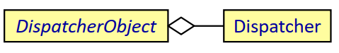

#### Kommentar
    * bei Invoke muss man ein Delegate-Objekt angeben

### await/async und die WPF

*  await/async vereinfacht die asynchrone Programmierung enorm
*  Der Synchronisationskontext der WPF (DispatcherSynchronizationContext) sorgt dafür, dass nach Aufruf einer asynchronen Methode im UI-Thread, die Ausführung wieder im UIThread fortgesetzt wird.

```csharp
void async Task < object > MethodExecutedInSomeThreadAsync() {…}
void SomeEventHandler() {
// wird im UI-Thread ausgeführt
var result = await MethodExecutedInSomeThreadAsync();
label.Content = result.ToString();
// wird im UI-Thread ausgeführt. }
```

#### Kommentare
    * sobald das await zurück kommt, befindet man sich wieder im UI Thread
    * await bedeutet nicht, dass nichts gemacht wird! (UI Thread blockiert nicht)

### DependencyObject

* Ermöglicht die Definition von Dependency Properties.
* Einfache .NET-Properties verwalten nur einen Wert.
* Dependency Properties haben zusätzliche Eigenschaften
    *  Es kann ein Standardwert definiert werden.
    *  Der Wert kann von Elternelementen im Steuerelementebaum geerbt werden.
    *  Bei Wertänderungen werden Ereignisse gefeuert. 
*  Dependency Properties werden zur Realisierung zahlreicher WPFKonzepte benötigt: 
    *  Styling
    *  Datenbindung
    *  Animationen 
* Da nur von den Standardwerten abweichende Werte gespeichert werden, wird auch der Speicherplatzbedarf reduziert

#### Kommentare
    * normale Property hat nur eine Eigenschaft: Wert
    * eine Dependency Property hat mehrere Eigenschaften
    * auf der Ebene vom Fenster definiert man etwas - und alle Elemente des Fensters bekommen diese Veränderung mit 
    * wird typischerweise bei Sytles verwendet (z.B. hover over btn)
    

### Implementierung von Dependency Properties

```csharp
public class Control: FrameworkElement { 
// Deklaration der Dependency Property als Klassendatenkomponente 
public static readonly DependencyProperty FontSizeProperty;
static Control() { 
//  Festlegung der Eigenschaften der Property 
Control.FontSizeProperty = DependencyProperty.Register( 
    "FontSize", //  Name 
    typeof(double), //  Propertytyp 
    typeof(Control),  //  Besitzer 
    new FrameworkPropertyMetadata(12.0, //  Standardwert 
        FrameworkPropertyMetadataOptions.AffectsRender |
        FrameworkPropertyMetadataOptions.AffectsMeasure | 
        FrameworkPropertyMetadataOptions.Inherits)
    ...
}
    //  Definition einer .NET-Property zur Verwaltung des Property-Werts 
        public double FontSize { 
        get { return (double)GetValue(Control.FontSizeProperty); } 
        set { SetValue(Control.FontSizeProperty, value); }
    }
}
        
```

#### Kommentare
    * braucht Metadaten (die mit der Klasse und nicht einem Objekt verbunden sind)
    * DependencyProperty -> statisch für alle Properties eingeführt
    * im statischen Konstruktor bzw. Initialisierer können die Eigenschaften angeführt werden
    * Metadaten die man festlegen muss sind z.B. Standardwerte
    * daher ist das eine sehr effiziente Art um sie zu speichern
    * DependencyObjects -> änderbar, einfach durch eine Zuweisung
    * für jedes Objekt ist eine Hashtabelle -> in dieser sind die Werte gespeichert
    * sind keine Werte gespeichert, so werden die Standardwerte verwendet
    * diese Werte sind bei DependencyObject realisiert

### Anwendungsbeispiele für Dependency Properties

*  Beispiel 1: Vererbung von Property-Werten
```xaml
<Window FontSize="20">
	<StackPanel>
		<Button Content="My Button">
			<Label Content="Some Label" />
		</StackPanel>
	</Window>
```
*  Beispiel 2: Styling von Steuerelementen 
```xaml
<Style TargetType="{x:Type Button}">
	<Setter Property="Foreground" Value="Green"/>
	<Style.Triggers>
		<Trigger Property="IsMouseOver" Value="True">
			<Setter Property="FontSize" Value="25" />
		</Trigger>
	</Style.Triggers>
</Style>
```
*  Beispiel 3: „Abhorchen“ von Änderungen des Property-Werts 
```csharp
DependencyPropertyDescriptor propDescr = DependencyPropertyDescriptor.FromProperty(UIElement.IsMouseOverProperty, typeof(UIElement));
propDescr.AddValueChanged(button, (object source, EventArgs e) => …);
```


### Attached Properties

* Attached Properties sind spezielle Dependency Properties, die Objekten beliebiger Klassen zugeordnet werden können.
* Diese Klassen dienen lediglich als Datenbehälter, verwendet werden diese Attached Properties von anderen Klassen.
* Typische Anwendung: Layout-Klassen 
    * Positionsparameter müssen bei den Kindelementen gespeichert werden.
    * In Kindelementen können nicht für alle möglichen Layout-Klassen Properties vorgesehen werden (keine Erweiterungsmöglichkeit). 
* Verwendung in XAML
```xaml
<DockPanel>
    <Button Name="button" DockPanel.Dock="Top">My Button</Button> </DockPanel> 
```

* Verwendung im Code
```csharp
DockPanel.SetDock(button, Dock.Bottom);
```

#### Kommentare
    * AttachedProperties -> Erweiterung von DependencyProperties
    * jeder Layoutcontainer hat andere Properties
    * wenn man ein eigenes Layout speichert - wie bekommt man diese Properties in die bestehende Steuerelemente hinein?
    * Erweiterungsmglk. durch AttachedoProperties
    * gespeichert wird die Property im Element vom Layoutcontainer

### Implementierung von Attached Properties

```csharp
class DockPanel: Panel {
  public static readonly DependencyProperty DockProperty;
  static DockPanel() {
   DockProperty = DependencyProperty.RegisterAttached("Dock", typeof(Dock), typeof(DockPanel), new FrameworkPropertyMetadata(…));
   public static Dock GetDock(UIElement element) {
    return (Dock) element.GetValue(DockPanel.DockProperty);
   }
   public static void SetDock(UIElement element, Dock dock) {
    element.SetValue(DockPanel.DockProperty, dock);
   }
  }
```

* Die Deklaration der Property erfolgt in DockPanel.
* Die Property-Werte werden aber in den Kindelementen gespeichert.


### Visual (und Visual 3D)

*  Visual stellt Funktionalität zum Zeichnen von Steuerelementen zur Verfügung. Der Visual Tree wird durchlaufen und mit Hilfe von DirectX am Anzeigegerät dargestellt (im Media Integration Layer). 
*  


### Andere Basisklassen der WPF

* UIElement
    * Verarbeitung von Benutzereingaben (Routed Events)
    * Unterstützung für Layoutsystem (Positionierung, Größenbestimmung)
* FrameworkElement
    * Datenbindung
    * Styling
    * Lokale Ressourcen
* Control
    * Basisklasse für alle Elemente, mit denen Benutzer interagieren kann.
    * Unterstützung von Styles und Control-Templates.
* Panel
    * (Abstrakte) Basisklasse für alle Layout-Manager.


### Die wichtigsten Steuerelemente


#### Kommentar
    *label == beliebiger content

### ContentControl

- Steuerelemente dieser Gruppe können ein beliebiges Kindelement enthalten (nicht nur eine Zeichenkette).
- Beispiele:

    
    
#### Kommentare
    * StackPanel bedeutet horizontal bzw. vertikal anordnen -> kann Elemente zusammenfassen
    * alles was von der WPF nicht dargestellt werden kann wird zu einem String konvertiert

### HeaderedContentControl

- Steuerelement besitzt neben dem Kindelement eine Überschrift.
- Beispiele:

    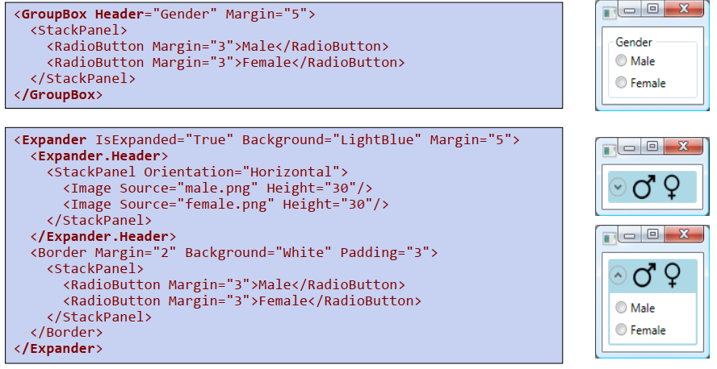

#### Kommentar
    * Controls die sowhohl einen Content als auch einen Header haben
    

### Steuerelemente zur Darstellung und Bearbeitung von Text
- TextBlock: Darstellung von Text in verschiedenen Fonts und mit
diversen Hervorhebungsarten.


### Steuerelemente mit mehreren Kindelementen (ItemsControl)


### Listen mit Auswahlmöglichkeit (Selector)
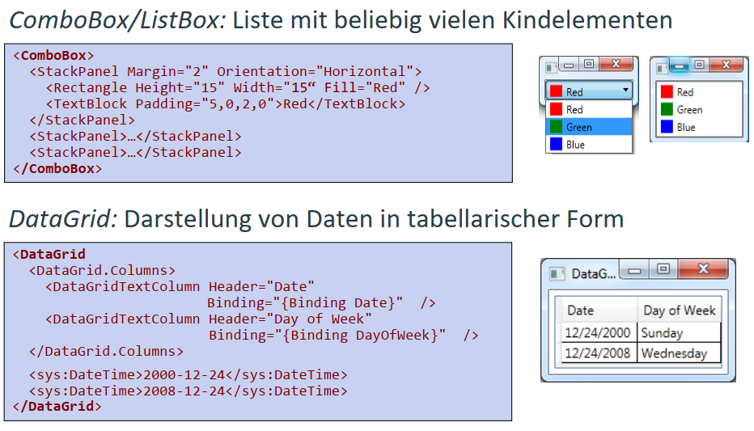

### Menüs


## Layout Klassen

### Die Layout-Klassen der WPF

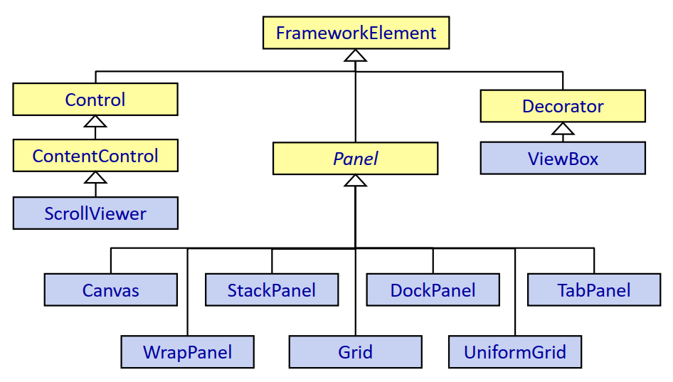

### Layout-Klassen (Panels)

* Layout-Klassen ermitteln den Platzbedarf der Kindelemente (measure) und
ordnen die Elemente im Behälter an (arrange).
* Jedem Kindelement wird eine Layout-Zelle zugeordnet. Die Positionierung
innerhalb der Zelle wird durch Layout-Properties definiert, die den
Kindelementen zugeordnet werden.
* Größenangaben erfolgen in geräteunabhängigen Einheiten (logischen Einheiten).
    * 1 logische Einheit = 1/96 Zoll
    * Beispiel: Width="96" entspricht Width="1in" bzw. Width="2.54cm".
    * Das Verhältnis logische Einheit zu physischer Einheit hängt von der physischen und der in Windows definierten Pixeldichte (DPI Scaling) ab.
    * Physische Pixeldichte = Windows-Pixeldichte = 96 DPI
        * 96 logische Einheiten = 96 physische Einheiten = 1 Zoll
    * Physische Pixeldichte = Windows-Pixeldichte = 192 DPI
        * 96 logische Einheiten = 192 physische Einheiten = 1 Zoll
    * Fonts werden ebenfalls in logischen Einheiten angegeben: FontSize="11" entspricht FontSize="8.25pt" (8.25pt = 8.25/72in = 11/96in)


### Layout-Properties 

- Width/Height: Fixe Breite/Höhe in logischen Einheiten.
    - Mit dem Standardwert Auto überlässt man der Layout-Klasse die Festlegung der Größe des Elements (Width="Auto").
    - Tatsächliche Größe kann mit ActualWidth/ActualHeight ermittelt werden.
- MinWidth/MinHeight/MaxWidth/MaxHeight: Minimale/Maximale Breite/Höhe.
- HorizontalAlignment= ["Left"|"Right"|"Center"|"Stretch"]: Horizontale Ausrichtung, falls LayoutZelle breiter ist als das Kindelement.
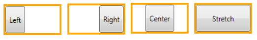

- VerticalAlignment= ["Top"|"Bottom"|"Center"|"Stretch"]: Horizontale Ausrichtung, falls LayoutZelle höher ist als das Kindelement.

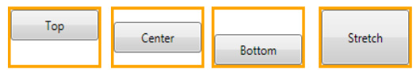

- Margin="Left,Top,Right,Bottom": Abstand des Kindelements zu den Rändern der Layout-Zelle.
- Padding="Left,Top,Right,Bottom": Abstand des Inhalts zum Rand des Kindelements.
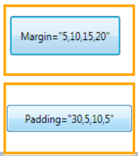


- LayoutTransform: Transformationsmatrix, die auf Kindelement angewandt wird (bewirkt Verschiebung, Skalierung, Rotation bzw. Verzerrung). Umschließendes Rechteck wird neu berechnet.
- Rendertransform: Wie LayoutTransform, die Größe des umschließenden Rechtecks wird aber nicht neu ermittelt

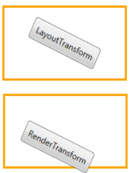

### Layout: Canvas

* Elemente können an maximal zwei angrenzenden Kanten angehängt werden. 
* Wichtige Layout-Properties: 
    * Margin: Nur für Seiten relevant, an die das Element angehängt wurde.


```xaml
<Canvas Name="layoutRoot">
	<Button                                      Background="Red"    >…</Button>
	<Button Canvas.Left="18"  Canvas.Top="18"    Background="Orange  >…</Button>
	<Button Canvas.Right="18" Canvas.Bottom="18" Background="Yellow  >…</Button>
	<Button Canvas.Right="0"  Canvas.Bottom="0"  Background="Lime" >…</Button>
	<Button Canvas.Right="0"  Canvas.Top="0"     Background="Aqua" >…</Button>
	<Button Canvas.Left="0"   Canvas.Bottom="0"  Background="Magenta">…</Button>
</Canvas>
```


### Layout: StackPanel
```xaml
<StackPanel x:Name="layoutRoot" Orientation="Vertical">
	<Button.Background="Red"...>1
	</Button>
	<Button Background="Orange">2</Button>
	<Button Background="Yellow">3</Button>
	<Button Background="Lime"  >4</Button>
	<Button Background="Aqua"  >5</Button>
</StackPanel>
```

* Elemente werden übereinander  (vertikal) oder nebeneinander (horizontal) angeordnet. 
* Wichtige Layout-Properties: 
    * Margin 
    * HorizontalAlignment (falls Orientation="Vertical")
    * VerticalAlignment (falls Orientation="Horizontal")


### Layout: DockPanel

```xaml
<DockPanel>
	<Button DockPanel.Dock="Top"    Background="Red"  >1 (Top)</Button>
	<Button DockPanel.Dock="Top"    Background="Red"  >2 (Top)</Button>
	<Button DockPanel.Dock="Left"   Background="Orange">3 (Left)</Button>
	<Button DockPanel.Dock="Right"  Background="Yellow">4 (Right)</Button>
	<Button DockPanel.Dock="Bottom" Background="Lime" >5(Bottom)</Button>
	<Button Background="Aqua" >6</Button>
</DockPanel>
```

* Elemente werden entlang der Ränder des Behälters angeordnet.
* Wichtige Layout-Properties

    * Margin 
    * HorizontalAlignment: für oben, unten und im Zentrum angeordnete Elemente. 
    * VerticalAlignment: für links, rechts und im Zentrum angeordnete Elemente.


### Layout: WrapPanel
```xaml
<WrapPanel Name="layoutRoot" Orientation="Horizontal">
	<Button Background="Red" >1</Button>
	<Button Background="Orange" >2</Button>
	<Button Background="Yellow" >3</Button>
	<Button Background="Lime" >4</Button>
	<Button Background="Aqua" >5</Button>
</WrapPanel>
```

*  Elemente werden von zeilenweise von rechts nach links oder spaltenweise von oben nach unten angeordnet.
*  Wichtige Layout-Properties
    *  Margin
    *  HorizontalAlignment (falls Orientation="Vertical"): Ausrichtung der Elemente innerhalb einer Zeile.
    *  VerticalAlignment (falls Orientation="Horizontal"): Ausrichtung der Elemente innerhalb einer Spalte


### Layout: UniformGrid

```xaml
<UniformGrid x:Name=layoutRoot" Rows="2" Columns="3">
	<Button Grid.Row="0" Grid.Column="0" Background="Red">0/0</Button>
	<Button Grid.Row="0" Grid.Column="1" Background="Orange">0/1</Button>
	<Button Grid.Row="0" Grid.Column="2" Background="Yellow">0/2</Button>
	<Button Grid.Row="1" Grid.Column="0" Background="Lime">1/0</Button>
	<Button Grid.Row="1" Grid.Column="1" Background="Aqua">1/1</Button>
	<Button Grid.Row="1" Grid.Column="2" Background="LightBlue">1/2</Button>
</UniformGrid>
```
* Jedes Element bekommt eine gleich große Zelle zur Verfügung gestellt.
* Wichtige Layout-Properties
    * Margin
    * HorizontalAlignment
    * VerticalAlignment


### Layout Grid

```xaml
<Grid x:Name= "layoutRoot">
	<Grid.RowDefinitions>
		<RowDefinition Height="60"/>
		<RowDefinition Height="*"/>
	</Grid.RowDefinitions>
	<Grid.ColumnDefinitions>
		<ColumnDefinition Width="Auto"/>
		<ColumnDefinition Width="2*" />
		<ColumnDefinition Width="3*" />
	</Grid.ColumnDefinitions>
	<Button Grid.Row="0" Grid.Column="0" Background="Red">…</Button>
	<Button Grid.Row="0" Grid.Column="1" Background="Orange">…</Button>
	<Button Grid.Row="0" Grid.Column="2" Background="Yellow">…</Button>
	<Button Grid.Row="1" Grid.Column="0" Background="Lime">…</Button>
	<Button Grid.Row="1" Grid.Column="1" Background="Aqua">…</Button>
	<Button Grid.Row="1" Grid.Column="2" Background="Magenta">…</Button>
</Grid>
```


TODO ADD LAYOUT GRID (2)

### ScrollViewer und Viewbox


## Ressourcen

### Ressourcen

### Logische Ressourcen

### Zugriff auf logische Ressourcen

### Gültigkeitsbereiche von Ressourcen


### Resource Dictionaries

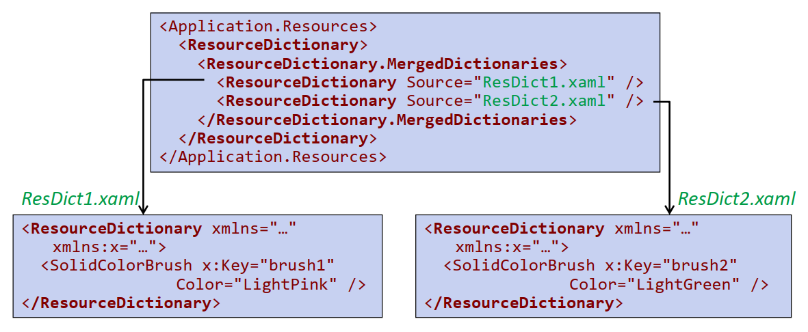

## Routed Events und Kommandos

### Behandlung von Ereignissen

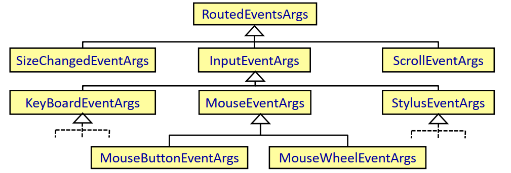

### Routed Events


### Kommandos

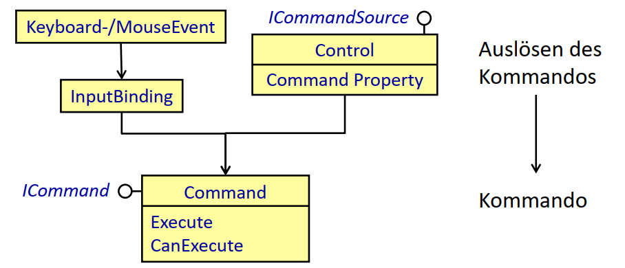

### Bindung von Kommandos

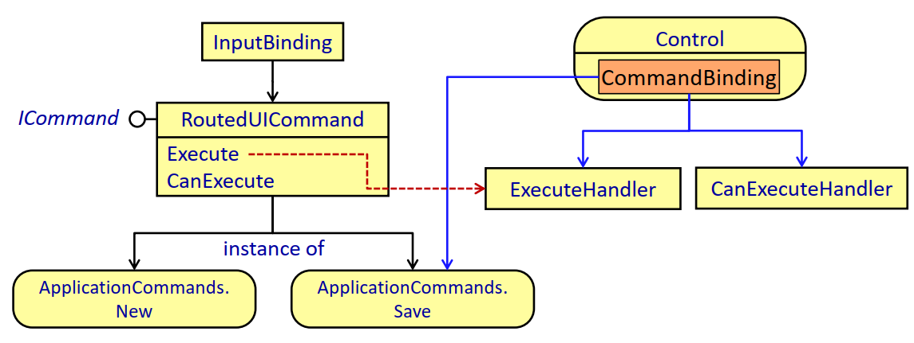

## Datenbindung

### Problemstellung


### Definition einer Bindung


### Die wichtigsten Bindungseigenschaften

### Kopplung zweier GUI-Elemente


### Propagation von Eigenschaftsänderungen

### Kopplung von GUI-Elementen an ein Datenobjekt


### Data-Templates


