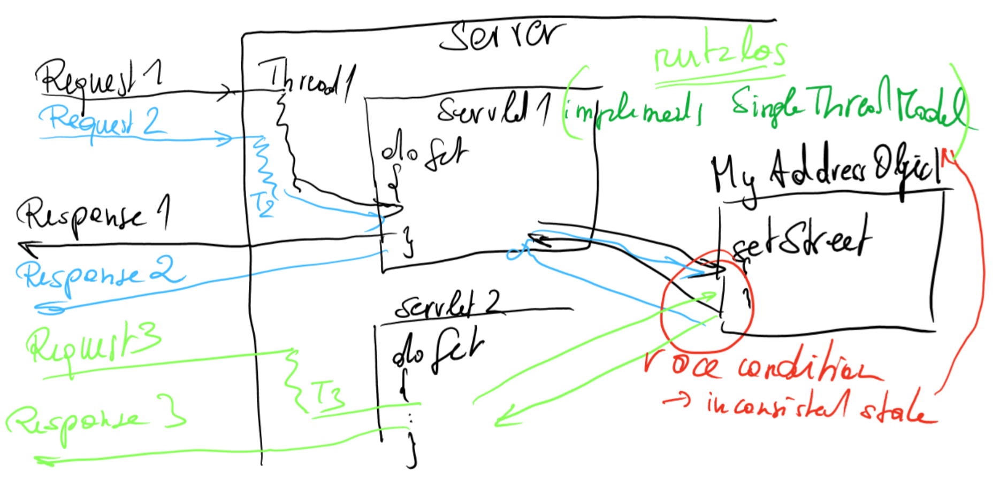

- [Servlets Folien](#servlets-folien)
  - [Overview](#overview)
  - [Multi-Tier-Architecture](#multi-tier-architecture)
    - [Vorteile](#vorteile)
    - [Nachteile](#nachteile)
      - [Challenges](#challenges)
      - [Fat-Client versus Thin-client](#fat-client-versus-thin-client)
      - [Architecture](#architecture)
  - [Characteristics Servlets](#characteristics-servlets)
      - [Servlets](#servlets)
  - [Implementation Overview](#implementation-overview)
  - [Servlet Life Cycle](#servlet-life-cycle)
    - [Simple but Complete Servlet code example](#simple-but-complete-servlet-code-example)
      - [Initializing a Servlet](#initializing-a-servlet)
      - [Rules for overriding init](#rules-for-overriding-init)
      - [Threading Issues](#threading-issues)
  - [Session Management](#session-management)
      - [What is a session?](#what-is-a-session)
      - [URL Rewriting 1](#url-rewriting-1)
      - [Cookie Overview](#cookie-overview)
        - [Characteristics of a Cookie](#characteristics-of-a-cookie)
        - [Cookie Properties](#cookie-properties)
        - [Sending a Cookie](#sending-a-cookie)
        - [Retrieving a Cookie](#retrieving-a-cookie)
        - [Security implications](#security-implications)
        - [Third-Party Cookie](#third-party-cookie)
      - [URL Rewriting 2](#url-rewriting-2)
      - [Characteristics URL Rewriting](#characteristics-url-rewriting)
      - [Alternative approach with HttpSession class](#alternative-approach-with-httpsession-class)
      - [Advantages](#advantages)
        - [Important methods in HTTPSession class](#important-methods-in-httpsession-class)
      - [The basic steps for using the HttpSessionobject are:](#the-basic-steps-for-using-the-httpsessionobject-are)
      - [Obtaining a session](#obtaining-a-session)
      - [Storing and retrieving data from a HTTPSession](#storing-and-retrieving-data-from-a-httpsession)
      - [Invalidatinga session -> Free used memory](#invalidatinga-session---free-used-memory)
      - [Final remarks Session Management](#final-remarks-session-management)
      - [Sum up of techniques](#sum-up-of-techniques)
  - [Web Application](#web-application)
      - [Sharing Resources](#sharing-resources)
      - [Database Connection Pooling (DBCP)](#database-connection-pooling-dbcp)

# Servlets Folien

## Overview
- Three-Tier Architecture 
- Implementation Overview 
- Servlet Life Cycle 
- Session Management 
- Web Application 
- Sharing Resources 
- Database Connection Pooling (DBCP) 
- Non-Blocking IO
- Annotations

## Multi-Tier-Architecture
- Tier 1 – Client - `User Interface` 
  - Handles the user-interface, presenting information as well as getting user input

- Tier 2 – Middle Tier Server - `Business Logic` 
  - Accepts requests from Client, issues requests to back-end, performs business logic processing, and send responses to Clients

- Tier 3 – Back-end Server - `Data Management` 
  - Manage the data and perform data retrieval upon receiving requests from the Middle-Tier Server
  
### Vorteile

### Nachteile

#### Challenges
- Technologies are changing fast 
  - Specific technologies are their code should be encapsulated somehow, to change them easily
- Access to the back end must not compromise security - Front-end access devices can be very diverse (PCs, Tablets, Smartphones, etc.)
    - Widely varying user interface (UI) capabilities have to be supported * UIs on displays with varying quality and size * Automatic speech recognition and natural language understanding
    - Most systems are designed with a specific client device and UI in mind * It is difficult to extend the service’s range of target devices without modifying the service itself
    - Additional support of new devices should be able with minimal effort

#### Fat-Client versus Thin-client
Thin Client: An beliebiger Stelle könnte man die Anwendung aufteilen.


#### Architecture
Server Presentation Layer wenn serverseitiges Rendering.  
Persistence: SQL Abfragen, Caching verringert DB Anfragen
Content Repos: DB, Javaseitig gibt es API für zugriff.


## Characteristics Servlets

#### Servlets

- Small Java-based applications
- Programming model is
similar to CGI scripts 
  - Mapping HTTP requests into HTTP responses
- Address the problem of doing server-side programming with platformspecific APIs
- All of the servlets associated with a Web server run inside a single
process


- Servlets are persistent 
    -  Unlike CGI scripts, a Servlet`s lifecycle extends beyond HTTP each request
    - Servlet container manages the lifecycle of the Servlet and handles the socket-level communication
- Useful for implementing a `multi-tier architecture`

CGI startet eigenen Prozess nicht eigenen Thread -> schwergewichtig  
Servlet (Thread) bleibt nach erstmaligen Aufruf bestehen und läuft weiter
Tomcat default 10000 User (Thread)

## Implementation Overview


## Servlet Life Cycle

- Servlet Package (javax.servlet) 
    - Interfaces 
        - RequestDispatcher, Servlet, ServletConfig, ServletContext, ServletRequest, ServletResponse, SingleThreadModel
    - Classes 
        -  GenericServlet, ServletInputStream, ServletOutputStream, ServletException, UnavailableException
- Servlet Package (javax.servlet.http) 
    - Interfaces 
        - HttpServletRequest, HttpServletResponse, HttpSession, HttpSessionBindingListener, HttpSessionContext
    - Classes 
        - Cookie, HttpServlet, HttpSessionBindingEvent,
HttpUtils

### Simple but Complete Servlet code example
```java
public class SimpleServlet extends HttpServlet { /* Handle the HTTP GET method by building a simple web page. */ 
public void doGet (HttpServletRequest request, HttpServletResponse response)
    throws ServletException, IOException { 
        PrintWriter out;

        String title = "Simple Servlet Output"; 
        // set content type and other response header fields first  
        response.setContentType("text/html"); 
        // then write the data of the response 
        out = response.getWriter(); // CRLF in the response
        out.println("<HTML><HEAD><TITLE>"); 
        out.println(title);
        out.println("</TITLE></HEAD><BODY>"); 
        out.println("<H1>" + title + "</H1>"); 
        out.println("<P> This is output from SimpleServlet."); 
        out.println("</BODY></HTML>"); 
        out.close();
    }
}
```
Zuerst müssen Header geschrieben werden dann der Body. Siehe Bild


- Each servlet has the same life cycle: 
  - A server loads and initializes the servlet 
  - Servlet handles zero or more client requests 
  - Server removes the servlet
    - Some servers do this step only when they shut down  

  

#### Initializing a Servlet
- Initializing a Servlet 
  - Server calls the init method `once`, and 
  - Server will not call the init method again unless the server is reloading the servlet
  - Server can not reload a servlet until the server has destroyed the servlet by running the destroy method
  - A user has to override init method to provide a specific implementation
  
#### Rules for overriding init
- Rules for overriding init 
  - If an initialization error occurs, throw an UnavailableException 
    - e.g. if a required network connection cannot be established
    - Do not call the System.exit method

#### Threading Issues
- Threading Issues 
  - Servlets are typically capable of serving multiple clients concurrently
  - If clients access a shared resource, then a servlet should handle only one client request at a time
  - Servlet has to implement the `SingleThreadModel` interface 
    - Does not involve writing any extra (interface has no methods) 
    - If the servlet implements this interface, the servlet will be thread safe.
  - Note that this will not prevent synchronization problems associated with accessing shared resources (such as static
class variables or classes outside the scope of the servlet)

  

Implement SingleThreadModel sinnlos wenn mehrere Servlets sind und nicht thread safe gearbeitet wird. Synchronized nicht immer sinnvoll -> Performance Probleme! Wenn synchronized dann an wenigen wichtigen Stellen.  
Bei race condition unvorhergesehenes Verhalten.

---

## Session Management
#### What is a session?
- A connection is maintained while the two end points are communicating back and forth in a conversation or `session` of some duration
- Some connections and sessions last only long enough to send a message in one direction
- Other sessions may last longer, usually with one or both of the communicating parties able to terminate it
- For Internet applications, each session is related to a particular port
- A session is typically implemented as a layer in a network
protocol (e.g. telnet, FTP)

- It keeps you from having to ask "oh, is it you again?" every time you receive a request 
  - This is especially important in today's e-commerce Web apps
  - A Web shopping cart, for example, needs to accurately reflect a user's choices at every step in the process
- `Stateful` protocols, such as telnet and FTP, can process multiple operations before closing a connection. The server knows that all requests came from a single person.
- HTTP is a `stateless` protocol, which means every time a client asks for a Web page, the protocol opens a separate connection to the server, and the server doesn't know the
context from one connection to the next.

  

- `Servlet engine` assigns each connection a unique ID and gives that to the client when the session gets established
  - Client uses that ID in subsequent requests 
  - Servlet engine can can map each request to a particular session
- Four different techniques 
  - URL Rewriting 
    - Is the `lowest common denominator of session managment` 
    - Involves adding data to the URL that can be interpreted by the container on the next request with a session
    - Name of the parameter (e.g. jsessionid) depends on the server 
    - e.g. http://server.com/catalog/index.html?jsessionid=1234
  - Cookie 
    - Most used session tracking mechanism 
    - Container sends a cookie to the client and the client will then return the cookie on each subsequent request 
    - `Relies on the browser allowing cookies`
  - HTTPSession class 
    - No need to worry about generating a unique session ID or storing it
    - For browsers that support cookies, a temporary identifier will be issued, and then echoed back by the browser every time a request is made
  - Session token in hidden fields 
    - < INPUT TYPE="`HIDDEN`" NAME="session" VALUE="...">
    - E.g. ASP.NET used this approach

#### URL Rewriting 1
- URL Rewriting 
  - Is a good solution, especially if users have disabled cookies 
  - But be sure to consider the following: 
    -  You have to be sure to append the information `to every URL` that references your site
    - Appending parameters brings up privacy issues 
        - You may not want the actual data you are tracking to be visible
    - Loophole with this technique: 
        - Users can leave the session and come back using a bookmark, in which
case your session information is lost

#### Cookie Overview

- Cookies are a way for a server (or a servlet, as part of a server) `to send some information to a client to store`, and for the server to `later retrieve its data from that client`
- Servlets send cookies to clients by `adding fields to HTTP response headers`
- Clients automatically return cookies by adding fields to HTTP request headers
- Subsequent sessions can access the cookie to extract information
- Cookies store information about a session in a humanreadable file on the client's machine
- Common approach for session tracking

##### Characteristics of a Cookie

Im response ist ein Cookie drin. Auch wenn nur die IP Adresse angegeben wird gibt es auch ein Cookie als response (wenn Server Cookie mitschickt). Bei 1000 requests ala 100 per Cookie = 10^3 * 10^2 = 10^5 Byte nur für Cookies! Also overhead. -> Deshalb http 2.0 

- Name of the cookie must be an HTTP/1.1 token 
- Constraints
    - A cookie cannot grow more than `4K in size` 
    -  No domain can have more than `50 cookies`
    -  A browser can support at least `3.000 cookies` in total
- Privacy concerns for users 
    - Some people don't like the fact that a program can store and retrieve information about their habits
    - `Sensitive information`, e.g. a credit card number could be stored in a cookie
    - It is easy to use cookies inappropriately
    - As a result, some users disable cookies or delete them altogether

##### Cookie Properties

- Domain 
    - This determines which servers can receive the cookie 
    - By default cookies are sent to the server that originally sent the cookie to the client
    - The domain is specified in the form ".google.com", indicating that all servers ending with .google.com can receive this cookie
- Path 
  - Sets the "target” URL indicating the directories on the server that lead to the services that can receive this cookie
  - Cookies can be "targeted” to specific URLs that include directories on the Web server. By default a cookie is returned to services operating in the same directory as the service that sent the cookie or a subdirectory
of that directory

  

- Expires and MaxAge 
    - Expires attribute defines `a specific date and time` for when the browser should delete the cookie
    - Alternatively, the Max-Age attribute can be used to set the cookie's `expiration as an interval of seconds in the future`, relative to the time the browser received the cookie
- Secure and HttpOnly 
    - Secure attribute is meant to keep cookie communication limited to `encrypted transmission`  
Does not have an expiration date, making it a session cookie. It will be deleted after the user closes their browser.
    - HttpOnly attribute directs browsers `not to expose cookies through channels other than HTTP` (and HTTPS) requests. This means that the cookie cannot be accessed via client-side scripting languages (notably JavaScript), and therefore `cannot be stolen easily via cross-site scripting`.
  
  

##### Sending a Cookie

- Cookies are sent `as headers` of the response to the client
  
```java
//remember it by adding a cookie 
if (userId != null) { 
    Cookie c = new Cookie("UserID", userId);
    response.addCookie(c);
```

##### Retrieving a Cookie

```java
// Find the cookie and remove it 
Cookie[] cookies = request.getCookies(); 
for(i=0; i < cookies.length; i++) { 
    Cookie thisCookie = cookie[i]; 
    if (thisCookie.getName().equals("UserID") && 
        thisCookie.getValue().equals(userId)) { 
          // Delete the cookie
          thisCookie.setMaxAge(0);
```

##### Security implications

- If the User-ID authorizes access to a particular resource, then anyone who runs the Web browser can gain access
- In shared environments (such as Internet cafe terminals, or offices), other people can access the browser and masquerade as a particular user
- Solution is 
    - Specify a very `short expiration date` (for example, in two minutes) and to periodically refresh the cookie as new requests come in
    - Provide a `"logout"` function 
        - This allows users to close their account, so that no further access can be gained without specifying a password or being authenticated
        - Some Web applications (e.g. BA Online-B@nking) warn users, if they haven‘t logged out properly, when they log in again
    - Use HttpSession class instead (will be discussed later)

##### Third-Party Cookie

- Normally, a cookie's domain attribute will match the domain that is shown in the web browser's address bar -> `first party cookie`
- A `third-party cookie`, however, belongs to a `domain different` from the one shown in the address bar.
- This sort of cookie typically appears when web pages feature content from `external websites, such as banner advertisements`
- This opens up the `potential for tracking the user's browsing history`, and is often used by advertisers in an effort to serve
relevant advertisements to each user

  

#### URL Rewriting 2

- When you use URL rewriting you call methods that, when necessary, `include the session ID in a link`
- `You must call these methods for every link` in the servlet response
- HttpServletResponse.encodeURL associates a session
ID with a URL

- e.g. CatalogServlet
  
```java
public void doGet (HttpServletRequest request, HttpServletResponse response)
throws ServletException, IOException {
...
    for(int i=0; i < numBooks; i++) { ...
        //Print out info on each book in its own two rows 
        out.println("<tr>" + ... 
        "<a href=\"" 
        + response.encodeURL("/bookstore/bookdetails?bookId=" 
        + bookId) + "\"> <strong>" 
        + books[i].getTitle() + " </strong></a></td> + ...
        "<a href=\"" + response.encodeURL("/bookstore/catalog?Buy=" + bookId) 
        + "\"> Add to Cart </a></td></tr>" +
    }
}
```
response.encodeURL -> wenn ein link nicht encodiert wird ist der User für den Server ein neuer User!

#### Characteristics URL Rewriting

- If the user clicks on a link with a rewritten URL, the servlet recognizes and extracts the session ID
- If the user's browser does not support cookies and the user clicks on an `un-rewritten URL`, the user's `session is lost` 
  - The servlet contacted through that link creates a new session, but the new session does not have the data associated with the previous session
  - Once a servlet loses the session data, the data is lost for all servlets that share the session.
- `Consistently use URL rewriting` if your servlet is to support
clients that do not support or accept cookies

#### Alternative approach with HttpSession class
  - No need to worry about generating a unique session ID or storing it
  - For browsers that support cookies, a temporary identifier will be issued, and then echoed back by the browser every time a request is made
  - If cookies are not supported, then a servlet can use the technique of URL re-writing to encode a session identifier in every hyperlink
  
#### Advantages 
  - Session approach is simpler for the developer 
    - No need to constantly refresh cookies or to write code to expire them
  - Less network utilization
    - State data is kept on the server side

##### Important methods in HTTPSession class 
- isNew 
    - Returns true if the client doesn't yet know about the session. If the client has disabled cookies, then a session is new on each request.
- getId 
    - Returns a string containing the unique identifier assigned to this session. Useful when using URL rewriting to identify the session.
- setAttribute, getAttribute 
    - Binds an object to this session, using the name specified. 
    - Returns the object (with the specified name) bound in this session.
- setMaxInactiveInterval 
    - Specifies the time between client requests before the servlet invalidates this session. A negative time indicates the session should never timeout.
- Invalidate 
    - Expires the current session and unbinds the object bound to it.

#### The basic steps for using the HttpSessionobject are: 
- Obtain a session object 
- Read or write to it 
- Either terminate the session by expiring it, or do nothing so it will expire on its own 
  
#### Obtaining a session
- The getSessionmethod of the HttpServletRequest object returns a user's session 
- If the method is called with create argument as true, the implementation creates a session if necessary 
  
#### Storing and retrieving data from a HTTPSession 
- Application data is stored as a name-value pair 
  - Name is a String, value is an Object 
  - `Object must be Serializable` (If servlet engine tries to store the object for load balancing, failover, snapshot, etc.) -> Cloud Computing 
  - | Serializeable ist sehr wichtig -> Server macht Checkpoint und wenn der Server abstirbt werden Sessions ins Dateisystem geschrieben

  ```java
  public ShoppingCart getShoppingCart(HttpServletRequest request) {
    String sessionKey = "wea5.shop.ShoppingCart";
    ShoppingCart cart = (ShoppingCart) request.getSession(true).getAttribute(sessionKey);
    if (cart == null) {
      cart = new ShoppingCart();
      request.getSession().setAttribute(sessionKey, cart);
    }
    return cart;
  }
  ```

  - `Naming convention` for organizing the names is needed 
    - Multiple servlets have access to a user's session 
    - Avoids servlets accidentally overwriting each other`s values in the session

#### Invalidatinga session -> Free used memory
- Means to remove the HTTPSessionobject and its values from the system 
  - This is a very important step for large scale computing, where 1000 or more users are handled by a server 
- Manually with the invalidatemethod or 
- Automatically, after a certain time (set with setMaxInactiveInterval) 
  - e.g. after the user has bought the books 

#### Final remarks Session Management
- Sessions are for storing `temporary data `
- If data is needed beyond the current session (e.g. browser or servlet terminates) 
  - Important data should be stored to a disk or to a database

#### Sum up of techniques

  

---

## Web Application
- A web application is a `collection` of servlets, HTML pages, classes, and other `resources` that can be `bundled and run` on multiple containers from multiple vendors. 
- A web application may consist of the following items: 
  - Servlets, JavaServerPages, JavaServerFaces, etc. 
  - Utility Classes -Static documents (html, images, sounds, etc.) 
  - Client code (e.g. JavaScript) 
  - `Descriptive meta information` which ties all of the above elements together
- By default an instance of a web application must only be run on one VM at any one time 
  - This behavior can be overridden if the application is marked as `"distributable"` `via its deployment descriptor`

- A web application exists as a structured hierarchy of directories 
- The root of this hierarchy serves as a document root for serving files that are part of this context 
  - e.g. a web application located at /catalog in a web server, the index.html file located at the base of the web application hierarchy can be served to satisfy a request to /catalog/index.html
- A special directory exists within the application hierarchy named WEB-INF 
  - This directory contains all things related to the application that aren’t in the document root of the application
  - The `WEB-INF node is not part of the public document tree` of the application
  - No file contained in the WEB-INF directory may be served directly
to a client

- The contents of the WEB-INF directory are: 
  - /WEB-INF/web.xml 
    - Deployment descriptor
- /WEB-INF/classes/* 
  - Directory for servlet and utility classes. The classes in this directory are used by the application class loader to load classes from.
- /WEB-INF/lib/*.jar 
  - Area for Java Archive files which contain servlets, beans, and other utility classes useful to the web application
  - All such archive files are used by the web
application class loader to load classes from

  

- Web application archive (WAR) 
  - Web applications can be packaged and signed, using the standard Java Archive tools or the J2EE deploytool, into a Web ARchive format (war) file 
    - For example, an application for issue tracking could be distributed in an archive with the filename issuetrack.war
  - When packaged into such a form, a META-INF directory will be present which contains information useful to the Java Archive tools
  - If this directory is present, the servlet container must not allow it be served as content to a web client’s request
  - `With Tomcat, the WAR file has to be in the webapps
directory`

  Bei cloud computing geht kopieren von dateien nicht mehr so einfach, deshalb wird das ganze gezippt (war) und dann deployed. Falls es Probleme gibt ist es wichtig zwischen Server und Eclipse Sicht zu unterscheiden!

- `Deployment descriptor`   
  (Zur Klausur müssen wir nur wissen was er ist.)
  - A deployment descriptor (DD) refers to a configuration file for `an artifact that is deployed to some container` (i.e. web server).
  - For web applications, the deployment descriptor must be called `web.xml` and must reside in the `WEB-INF` directory in the web application root.
  - The root element for web.xml is <web-app>
- The following elements are defined within the <web-app> element: 
  - < welcome-file-list>
    - Contains an ordered list of welcome-file elements
    - One of these files will be shown, when the web app gets started

  - < context-param> 
    - Declares a Web Application's servlet context initialization parameters
  - < servlet> 
    - Contains the declarative data of a servlet
  - < servlet-mapping> 
    - Defines a mapping between a servlet and a URL pattern
  - < session-config> 
    - Defines the session parameters for the Web Application
  - < mime-mapping> 
    - Defines a mapping between an extension and a mime type 
    - Braucht der Browser, um den Content Typ von dem Http request zu identifizieren
  - < error-page> 
    - Specifies a mapping between an error code or exception type to the path of a resource in the Web Application

- How to work with <security-constraint> for authentication?
  - Define a security constraint for your resource in the deployment descriptor (web.xml):
  
  ```xml
  <security-constraint>
    <web-resource-collections>...
  ```

  ++ bild

  - Simple approach: define users and roles in conf/tomactusers.xml
  ```xml
  <role rolename"wea5user"/>
  <user name="werner">
  ```
  - With a Database: We need a table for users und roles:
  ```sql
  ```
  - And configure Tomcat to use a JDBC Realm (server.xml)
    - See tomcat documentation to configure a security realm

  - Additionally, should we keep passwords in a digested form for security reasons 
    - Change the auth-method from BASIC to DIGEST in the web.xml  
    

      
      
  - And finally, we add the right handler for digested passwords to the server.xml file:
  ```xml
  <Realm className="org.apache.catalina.realm.UserDatabaseRealm" resourceName="UserDatabase"> 
  <CredentialHandler className="org.apache.catalina.realm MessageDigestCredentialHandler" algorithm="SHA‐256" />
  ```

#### Sharing Resources

- ServletContext 
  - Defines a set of methods that a servlet uses to communicate with its servlet container, for example, to get the MIME type of a file, dispatch requests, or write to a log file
- `There is one context per "web application" per Java Virtual Machine`
- The ServletContext object is contained within the ServletConfig object, which the Web server provides the servlet when the servlet is initialized
- Servlets in the same server can share attributes 
  - A servlet can bind an `object attribute` into the `context` by name
Web Architectures and Frameworks
  - Any object bound into a context is available to any other
`servlet that is part of the same web application`

- Context attributes `exist locally to the VM` in which they were created and placed 
  - This prevents the ServletContext from being used as a distributed shared memory store
  - If information needs to be shared between servlets running in a `distributed environment`, that information should be placed into a session, a database or set in an Enterprise JavaBean
- Naming conventions for attributes 
  - All servlets in a context share the attributes stored with the ServletContext interface
  - To avoid collisions of attribute names, `name attributes using the same conventions as package names`
  - Example 
    - Bookstore servlets share an attribute called examples.bookstore.database.BookDBFrontEnd
- Demo: ShowContext servlet  
  


- Service Locator Pattern 
  - Problem 
    - Clients interact with service components 
    - To interact with these components, clients must either locate the service component (referred to as a lookup operation) or create a new component.
- Structure  
  

- Consequences 
  - Abstracts Complexity 
    - Encapsulates the complexity of this lookup and creation process (described in the problem) and keeps it hidden from the client
    - The client does not need to deal with the lookup of component factory objects because the ServiceLocator delegates that responsibility.
  - Provides Uniform Service Access to Clients 
    - Ensures that all types of clients in the application uniformly access business objects, in terms of lookup and creation. This uniformity reduces development and maintenance overhead.
  - Facilitates Adding New Business Components 
    - Clients are not directly aware of the connection factories, so new connection factories can be added without impacting the clients.
  - Improves Network Performance 
    - The clients are not involved in lookup and object creation. - Because the Service Locator performs this work, it can aggregate the network calls required to look up and create business objects.
  - Improves Client Performance by Caching 
    - The Service Locator can cache the initial context objects and references to the factory objects to eliminate unnecessary activity that occurs when obtaining the initial context and the other objects.
    - This improves the application performance.

#### Database Connection Pooling (DBCP)

- Problem 
  - Creating a new database connection / connection object on every client request is an expensive process
- Solution 
  - Database `connection pool keeps a pool of persistent connection objects`, all waiting to fulfill database requests
  - Connection pooling `eliminates the overhead` - With Database Connection Pooling (DBCP), we can scale our applications to handle increased load
- Approaches to use DBCP 
  - Explicitely use Apache Commons DBCP 
  - `Delegate the work to Tomcat Web Server`
    - Tomcat uses implicitely Apache Commons DBCP