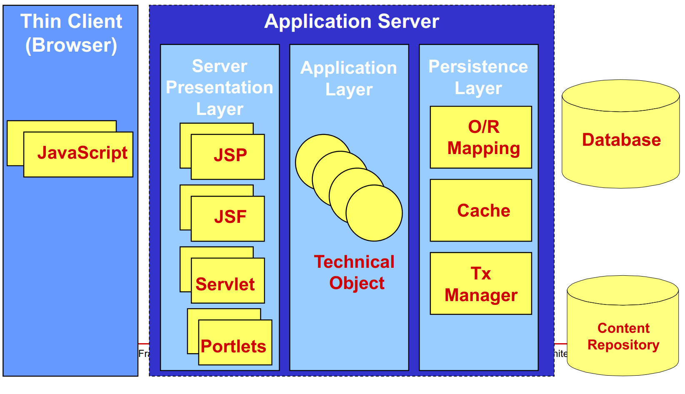
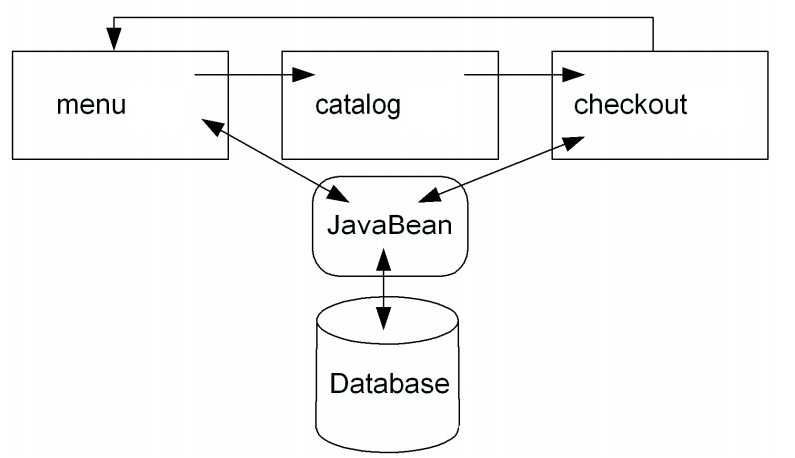
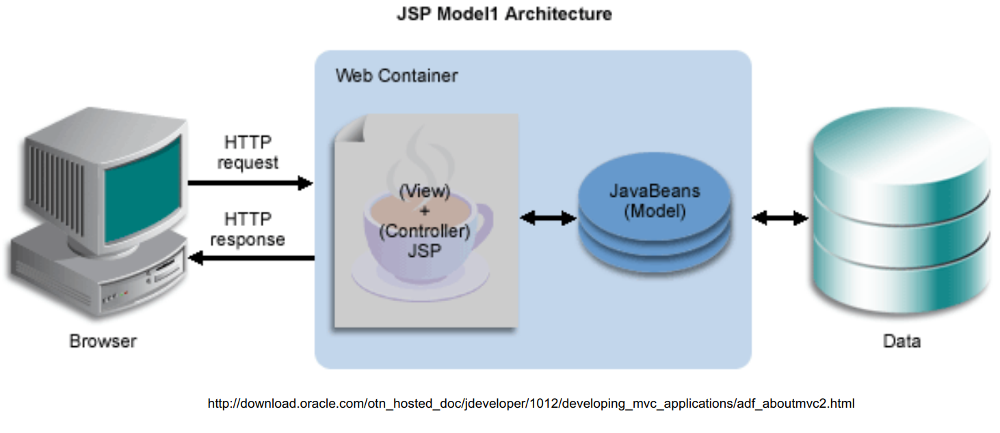
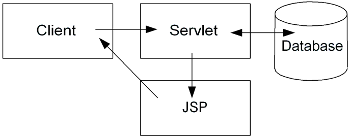
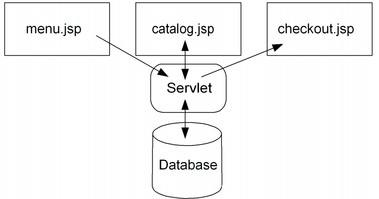
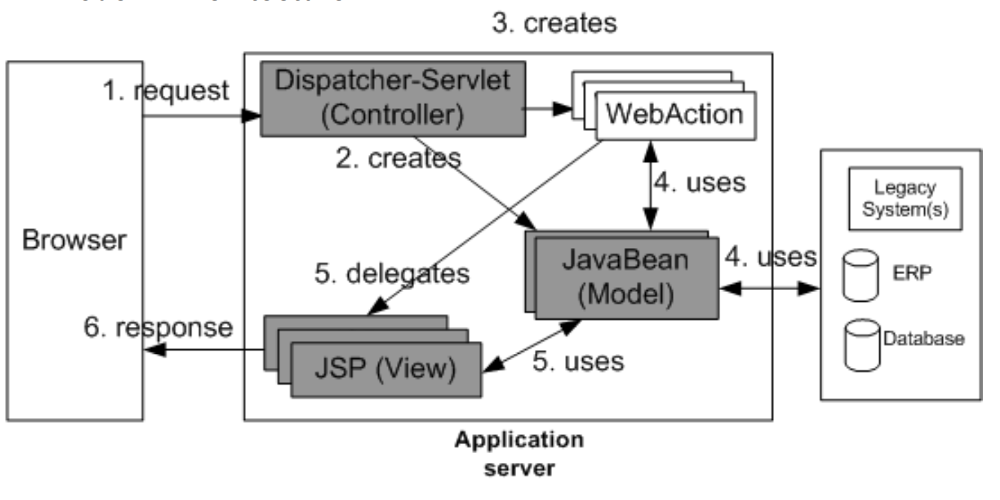

# Architectures

## Overview

- Introduction
- Page-centric Design
- Servlet-Centric Design
- Model-2-Architecture
- Business Delegate Pattern

## Introduction
- High-level architecture of an web application should
include
    - Presentation layer
        - Front end which controls the look and feel and delivers results
        - Also known as the view
    - Control layer
        - Controls application flow
        - Also known as the controller
    - Application layer
        - Manages application data, performs calculation with back-end
resources
        - Also known as the model  
    

- Architectural approaches
    - Page-centric design (Model-1-Architecture)
        - Collection of interrelated pages that handle all aspects (presentation, control, and the application logic)
        - All application and control decisions will be hard coded in the page itself
        - e.g. the next page visited would be determined by a user clicking on a
hyperlink)
    - Servlet-centric design
        - Use JSP pages only for presentation
        - Control and application logic aspects handled by a servlet, or group of
servlets
    - Model-2-Architecture
        - Model View Controller (MVC) pattern

## Page-centric Design
- Page-centric design (Model-1-Architecture)
    - Each page has a very specific role to play
    - For example
        - one page might display a menu of options,
        - another might provide a form for selecting items from a catalog, and another would be needed to complete the shopping process
        - Simple catalog example  
      
    - Model-1-Architecture  
    
    - Limitations of the page-centric approach
        - Very simple
            - Little abstraction
            * Minimum of layers
            * Good choice for developing prototypes
        - Difficult to maintain
            * Both presentation and logic/control code is mixed up
            * No distinction between Web page designer and Java programmer
        - Difficult to preserve the intended control flow
            * Each page is represented by its own URL, so it can be called out of order
            * Therefore, each page must check
                - For valid request parameters
                - Verify open connections
            * Implementation should take an assume-nothing approach

## Servlet-Centric Design

- Also known as dispatcher approach
    - Servlet acts as a mediator or controller, delegating requests to JSP
pages and JavaBeans
        * Authentication
            - Restrict direct access to the JSP pages
        * Store certain info in the user`s session
        * Dispatch request to certain pages depending on the session state
- JSP is used only for presentation
- Control and application logic aspects handled by a servlet, orgroup of servlets  
  
- Hello World Example  
    - HelloWorldServlet.java  
    ```java
    public class HelloWorldServlet extends HttpServlet {
        public void service(HttpServletRequest req HttpServletResponse res) throws ServletException, IOException {
            String theMessage = "Hello, World";
            String target = "helloFromServlet.jsp";
            req.SetAttribute("message", theMessage);
            RequestDispatcher rd;
            rd = getServletContext().getRequestDispatcher(target);
            rd.forward(req, res)
        }
    }
    ```  
    - helloFromServlet.jsp  
    ```java
    <% String msg = (String)request.getAttribute("message"); %>
    <%= msg %>
    ```  
- Simple catalog example redesigned  
    
    - JSP pages are freed from application logic
    - Servlet is a dispatcher
- Servlets as single entry points must encode action information into the request in the following way
    - Using hidden form elements
        * e.g. ```<input type=hidden name="cmd" value="showBooks">```
    - URL encoding
        * e.g. /servlet/catalog?cmd=showItem&item=123
    - Benefits of a dispatcher approach
        - Servlet is central forwarding control
    - Drawback
        - More design work and more coding required

## Model-2-Architecture

- Model-2-Architecture  
    
- Example with Model-2-Architecture
    - HTML form
    ```html
    <form action=“ControllerServlet“ method=“POST“>
        Please enter your name:
        <input type=text name=“name“ value=“your nickname“ />
        <input type=“submit“ value=“OK“ />
        <input type=“hidden“ name=“cmd“ value=“printName" />
    </form>
    ```
    - Dispatcher servlet
    ```java
    public class ControllerServlet extends HTTPServlet {
        public void service (HTTPServletRequest req, HTTPServletResponse resp) {
            String actionParam = req.getParameter(“cmd“);
            if (actionParam.equals(“printName”)) {
                PrintNameAction printAction = new PrintNameAction();
                printAction.perform(req, resp, this);
            }else {...}
        }
    }
    ```
    -  Event management with Action classes
        - Command pattern (see Gamma et al)  
        
        ```java
        public class PrintNameAction implements WebAction {
            public void perform (HTTPServletRequest req, HTTPServletResponse resp, HTTPServlet servlet) {
                String nickname = req.getParameter(“name“);
                Object member = Facade.doSomething(nickname);
                req.getSession().setAttribute(“myMember”, member);
                req.getRequestDispatcher(“PrintName.jsp“).forward(req, resp);
        }
        ```
    - Dynamically generate HTML page with PrintName.jsp
        ```html
        <html><head><title>result</title></head>
        <body>
        Your name is: <%= request.getParameter(“name“) %>
        </body>
        </html>
        ```
- Properties of the Model-2-Architecture
    - Presentation layer and application layer are loosely coupled
    - Model-View-Controller pattern Action classes are
responsible for the control flow
    - For each new functional extension the ControllerServlet in the example has to be modified, compiled and redeployed

- ControllerServlet improvements with Reflection
    - Create WebAction object with reflection
    - Class name could be the value of cmd parameter and a prefix
    ```java
    public class ControllerServlet extends HTTPServlet {
        private static final String ACTION_PREFIX=„wea5.action.“;
        public void service (HTTPServletRequest req, HTTPServletResponse resp) {
            String actionParam = req.getParameter(“cmd“);
            StringBuffer cmdStr = new StringBuffer(ACTION_PREFIX);
            cmdStr.append(actionParam.substring(0,1).toUpperCase());
            cmdStr.append(actionParam.substring(1,
            actionParam.length()).toLowerCase());
            cmdStr.append(“Action”);
            try {
                Class c = Class.forName(cmdStr.toString());
                Constructor ct = c.getConstructor(null);
                WebAction cmd = (WebAction) ct.newInstance(null);
                cmd.perform(req, resp, this);
            } catch (...) {}
        }
    ```
- Model-2-Architecture + Enterprise JavaBeans  
    

## Business Delegate Pattern

- Problem
    - Presentation-tier components interact directly with business services. This direct interaction exposes the underlying implementation details of the business service application program interface (API) to the presentation tier.
    - As a result, the presentation-tier components are vulnerable to changes
in the implementation of the business services:
    - When the implementation of the business services change, the
exposed implementation code in the presentation tier must change too.
- Solution
    - Use a Business Delegate to reduce coupling between presentation-tier clients and business services.
    - The Business Delegate hides the underlying implementation details of the business service, such as lookup and access details of the architecture.