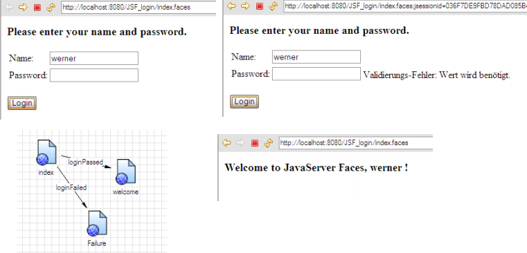
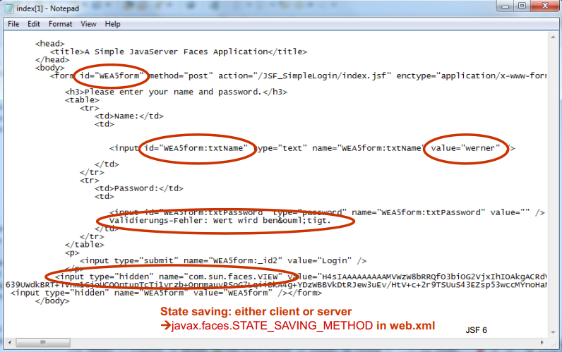
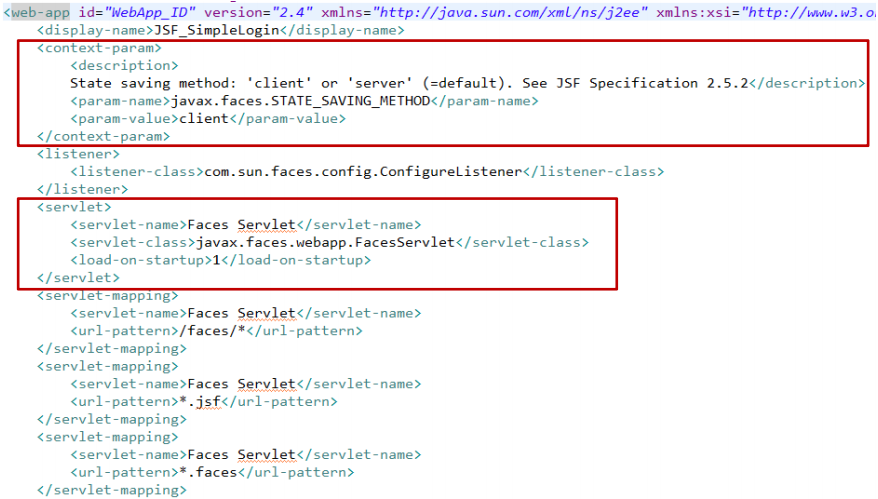
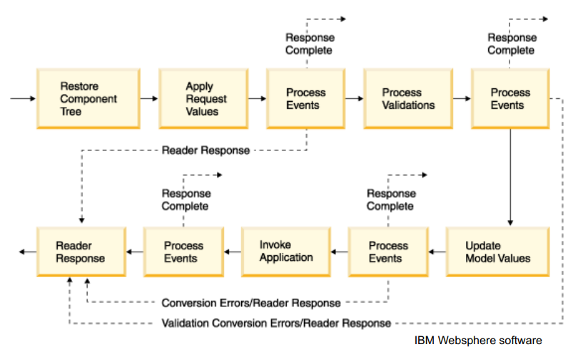
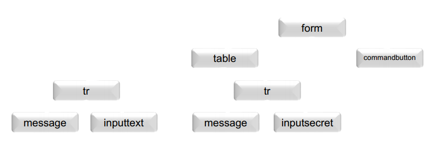
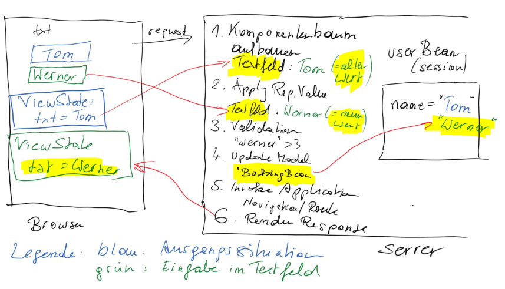
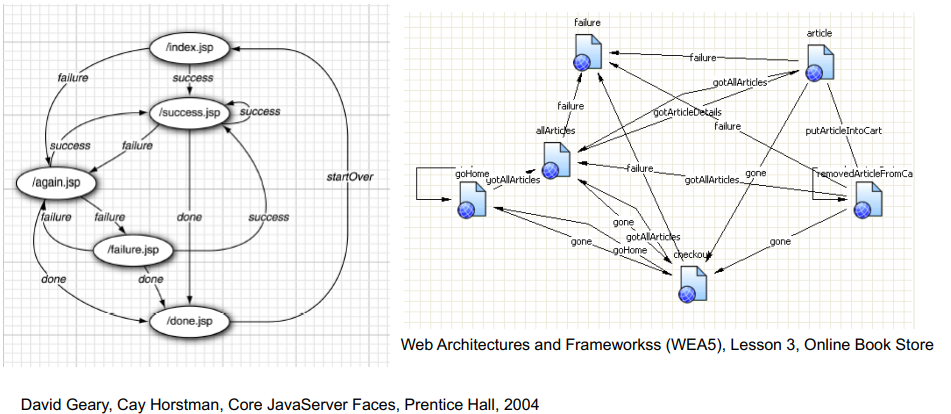
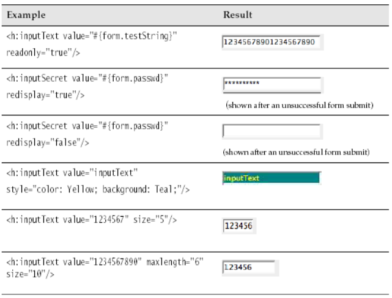

# JavaServer Faces

## Overview
- Introduction
- Life Cycle
- Managed Beans
- Navigation
- Navigation Algorithm
- Standard JSF Tags
- Event Handling
- Custom Components
- JavaServer Faces 2.x

## Introduction
- Popular techniques for developing web applications
    - „Rapid development" style, using a visual development
environment such as Microsoft ASP.NET
- ASP.NET makes it easy to create attractive UIs without tedious
programming
    - „hard-code" coding style, writing lots of code to support a
high-performance back end such as J2EE
- Programmers want both
    - High-performance back end
    - Easy user-interface programming
- Promise of JSF is to bring rapid UI development to serverside Java
- JSF has these parts
    - A set of prefabricated UI components
    - An event-driven programming model
    - A component model that enables third-party developers to supply additional components

- Demo: Login with welcome.jsp  
      
    

- Index.jsp
    ```html
    <%@ taglib uri ="http://java.sun.com/jsf/core" prefix="c"%>
    <%@ taglib uri ="http://java.sun.com/jsf/html" prefix="c"%>

        <c:view>
            <head>
                <title>A Simple JavaServer Faces Application</title>
            </head>
            <body>
                <h:form id="WEA5form">
                    <h3>Please enter your name and password.</h3>
                    <table>
                        <tr>
                            <td>Name:</td>
                            <td>
                                <h:inputText id="txtName" value="#{user.name}">
                                    <c:validateLength minimum="3"/>
                                </h:inputText>
                                <h:message for="txtName" styleClass="errorMessage"/>
                            </td>
                        </tr>
                        <tr>
                            <td>Password:</td>
                            <td>
                                <h:inputSecret id="txtPassword" value="#{user.password}" 
                                    required="true">
                                </h:message for="txtPAsword"></h:message>
                            </td>
                        </tr>
                    </table>
                    <p>
                        <h:commandButton value="Login" action="#{user.checkLogin}"/>
                    </p>
                </h:form>
            </body>
        </c:view>
    ```
- UserBean.java (backing bean)
    ```java
    package wea5;

    public class USerBean {
        private String name;
        private String password;

        // Property: name
        public String getName() { return name; }
        public void setName(String newValue) { name = newValue; }

        // Property: password
        public String getPAssword() { return password; }
        public void setPassword(String newValue) { password = newValue; }

        public String checkLogin {
            if (password.length() > 2)
                return "loginPassed";
            else
                return "loginFailed";
        }
    }
    ```
- Faces-config.xml
    ```xml
    <faces-config>
        <managed-bean>
            <managed-bean-name>user</managed-bean-name>
            <managed-bean-class>wea5.UserBean</managed-bean-class>
            <managed-bean-scope>session</managed-bean-scope>
        </managed-bean>
        <navigation-rule>
            <display-name>index</display-name>
            <from-view-id>/index.jsp</from-view-id>
            <navigation-case>
                <from-outcome>loginPassed</from-outcome>
                <to-view-id>/welcome.jsp</to-view-id>
            </navigation-case>
        </navigation-rule>
        <navigation-rule>
            <display-name>index</display-name>
            <from-view-id>/index.jsp</from-view-id>
            <navigation-case>
                <from-outcome>loginFailed</from-outcome>
                <to-view-id>/Failure_.jsp</to-view-id>
            </navigation-case>
        </navigation-rule>
    </faces-config>
    ```
- Web.xml  
    

- The main components of JavaServer Faces technology are
as follows:
    - An API for representing UI components and managing their state; handling events, server-side validation, and data conversion; defining page navigation; supporting internationalization and accessibility; and providing extensibility for all these features
    - Two JavaServer Pages (JSP) custom tag libraries for expressing UI components within a JSP page and for wiring components to server-side objects
- With minimal effort it is possible to
    - Wire client-generated events to server-side application code
    - Bind UI components on a page to server-side data
    - Construct a UI with reusable and extensible components
    - Save and restore UI state beyond the life of server requests
- A JavaServer Faces application also has
    - A custom tag library for rendering UI components on a page
    - UI components represented as stateful objects on the server
    - Backing beans, which define properties and functions for UI components
    - Validators, converters, event listeners, and event handlers
    - An application configuration resource file for configuring application resources

## Life Cycle  
  

- A faces request occurs
    - when a JSF form is submitted
    - or when a user clicks a link that points to a page with the prefix /faces in the URL
- All faces requests are handled by a FacesServlet (the controller servlet)
- The JSF life cycle consits of the following phases
    - Restore View
        - Recreates the server-side component tree
        - Component tree will be put into the FacesContext

- Component tree  
      
    - Apply Request Values
        - Copies request parameters into component submitted values
        - Values are transformed from the presentation-view to the model-view
        - Lifecylce can be interrupted, when a event listener calls responseComplete()
        - In cases, where exceptions occur, the Render Response phase will be entered and the result is displayed
    - Process Validation
        - Converts submitted values and validates the converted value with registered validators
        - Error messages and events are put into the FacesContext
        - In cases, where exceptions occur, the Render Response phase will be entered and the result is displayed
    - Update Model Values
        - Copies (converted and validated) values to the corresponding model object (= backing bean)
        - For example, it is typically denoted in JSF with reference expression like  `<h:inputText value=„#{user.name}"/>`
            * User is the model object
        - Error messages are put into the FacesContext
    - Invoke Application
        - Invokes action listeners and actions (in that order)
        - For example, first listener and then action:
            * `<h:commandButton action=„#{bean.action}" actionListener=„#{bean.listener}"/>`
    - Render Response
        - Before rendering the response, the state of View is stored in the cache by calling the method UIViewRoot.saveState() method.
    - Generate presentation (view) with the defined encoding  
    

## Managed Beans
- Acording to the JavaBeans specification, a JavaBean is „a
reusable software component that can be manipulated in a
builder tool"
    - Beans must have properties
- A property is any attributed of a bean class that has
    - Name
    - Type
    - Methods for getting and/or setting the property value
    ```xml
    <managed-bean>
        <managed-bean-name>user</managed-bean-name>
        <managed-bean-class>wea5.UserBean</managed-bean-class>
        <managed-bean-scope>session</managed-bean-scope>
    </managed-bean>
    ```
- The backing beans are responsible for
    - Providing application-specific behaviour
    - Storing data for a configurable amount of time (request, session, application scope)
- Many JSF user interface components have an attribute value that lets you specify
    - a value 
        ```html
        <h:outputText value="Hello, World!"/>
        ```
    - or a binding to a value that is obtained from a bean property
        ```html
        <h:outputText value="#{user.name}"/>
        <h:inputText value="#{user.name}"/>
        ```

- The property getter `is invoked` when the `component is rendered`
- The property setter `is invoked` when the `component is processed`

- Property values can also be set in the faces-config.xml file
    - Beans are constructed with the default constructor, for example UserBean()
    - Then the setter methods are executed
    ```xml
    <managed-bean>
        <managed-bean-name>user</managed-bean-name>
        <managed-bean-class>wea5.UserBean</managed-bean-class>
        <managed-bean-scope>session</managed-bean-scope>
        <managed-property>
            <property-name>name</property-name>
            <value>me</value>
        </managed-property>
            <managed-property>
            <property-name>password</property-name>
            <value>secret</value>
        </managed-property>
    </managed-bean>
    ```
## Navigation

- Static Navigation
    - In a simple web application, page navigation is static
    -> Clicking a particular button always selects a fixed JSF page
    - For example
        ```html
        <h:commandButton label="Login" action="login"/>
        <navigation-rule>
            <from-view-id>/index.jsp</from-view-id>
            <navigation-case>
                <from-outcome>login</from-outcome>
                <to-view-id>/welcome.jsp</to-view-id>
            </navigation-case>
        </navigation-rule>
        ```
    - Note: if no navigation rule matches a given action, then the current page is simply redisplayed

- Dynamic Navigation
    - In most web application, navigation is not static -> the page flow doesn`t just depend on which button you click, but also on the inputs you provide
    - For example
        ```html
        <h:commandButton label="Login" action="#{loginController.verifyUser}"/>
        ```
    - And the method verifyUser may be implemented as follows
        ```java
        String verifyUser() {
            if (…)
                return "success";
            else
                return "failure";
        }
        ```
    - The navigation handler uses the returned string to look up matching navigation rules
    - The faces-config.xml may look like
        ```xml
        <navigation-rule>
            <navigation-case>
                <from-outcome>success</from-outcome>
                <to-view-id>/success.jsp</to-view-id>
            </navigation-case>
            <navigation-case>
                <from-outcome>again</from-outcome>
                <to-view-id>/again.jsp</to-view-id>
            </navigation-case>
            <navigation-case>
                <from-outcome>failure</from-outcome>
                <to-view-id>/failure.jsp</to-view-id>
            </navigation-case>
        ...
        </navigation-rule>
        ```
    - This may lead to a transition diagram like  
          

- Wildcards can be used in the from-view-id tag, to apply a rule to a set of pages
    ```xml
    <!-- ShowHomeCmd -->
    <navigation-rule>
        <from-view-id>/*</from-view-id>
        <navigation-case>
            <from-outcome>ShowHomeCmd</from-outcome>
            <to-view-id>/welcome.xhtml</to-view-id>
        <navigation-case>
    </navigation-rule>
    <!-- ShowDBExamplesCmd -->
    <navigation-rule>
        <from-view-id>/*</from-view-id>
        <navigation-case>
            <from-outcome>ShowDBExamplsCmd</from-outcome>
            <to-view-id>/datastore.xhtml</to-view-id>
        <navigation-case>
    </navigation-rule>
    ```
    - In general, if no from-view-id is given, then the navigation rule is applied to all pages
- If you have several backing beans in your application which emit the same `<from-outcome>` string (e.g. „again") you can use the from-action to differentiate them in navigation cases
    ```xml
    <navigation-case>
        <from-action>#{quiz.answerAction}</from-action>
        <from-outcome>again</from-outcome>
        <to-view-id>/again.jsp</to-view-id>
    </navigation-case>
    <navigation-case>
        <from-action>#{quiz.startOverAction}</from-action>
        <from-outcome>again</from-outcome>
        <to-view-id>/index.jsp</to-view-id>
    </navigation-case>
    ```
## Standard JSF Tags
- JSF Core Tags
    | Tag | Description |
    |---------------------|---------------------------------------------------------------------------------------------------------------------------------------------------------------------------------------------------------------------------------------------------------------------------------------------------------------------------------------------------------------------------------------------------------------------------------------------------------------------------------------------------|
    | view |  Creates the top-level view. A view is container   for all JavaServer Faces core and custom   component actions used on a page. |
    | subview | Creats a subview of a view. A subview Container action for allJavaServer Faces core and custom component actions used on anested page via "jsp:include" or any custom action that dynamicallyincludes another page from the same web application, such as JSTL's"c:import". |
    | facet | Adds a facet to a componentFacets  are similar to children, but they have names . It is up to the component how to process them. For example, the  gridPanel  from the standard JSF library has two facet elements for  header  and  footer . It does not matter where the facet is located in the JSP code, the renderer always puts the header at the top and footer at the bottom. Note that a component can contain multiple facets and that each facet can contain only one child component. |
    | attribute | Adds an attribute (key/value) to a component |
    | Param | Add a child UIParameter component to the UIComponentassociated with the closed parent UIComponent custom action. |
    | actionListener | Register an ActionListener instance on the UIComponent |
    | valueChangeListener | Register an ValueChangeListener instance on the UIComponent |
    | converter | Register a named Converter instance on the UIComponent |
    | converterDateTime | Register a NumberConverter instance on the UIComponent |
    | validator | Register a named Validator instance on the UIComponent |
    | validateDoubleRange | Register a DoubleRangeValidator instance on the UIComponent |
    | validateLength | Register a LengthValidator instance on the UIComponent |
    | validateLongRange | Register a LongRangeValidator instance on the UIComponent |
    | loadBundle | Load a resource bundle localized for the Locale of the currentview, and expose it (as a Map) in the request attributes of thecurrent request. |
    | selectItems | Add a child UISelectItems component to the UIComponent |
    | selectitem | Add a child UISelectItem component to the UIComponent |
    | verbatim | Adds markup to a JSF page |

- JSF HTML Tags
    | Tags | Description |
    |------------------------|------------------------------------------------------------------------------------------------------------------------------------------------------------------------------------------------------------------------------------------------------------------|
    | form  | HTML form |
    | inputText  | Single-line text input control |
    | inputTextArea  | Multi-line text input control |
    | imputSecret  | Password input control |
    | inputHidden  | Hidden field |
    | outputLabel  | Renders an HTML "label" element |
    | outputLink  | Render an HTML "a" anchor element. The value of the component isrendered as the value of the "href" attribute. Any child UIParametercomponents are appended to the String to be output as the value ofthe "href" attribute as query parameters before rendering. |
    | outputFormat  | Like outputText, but formats compound messages |
    | outputText  | Single-line text output |
    | commandButton  | Button: submit, reset, or pushbutton |
    | commandLink  | Link that acts like a pushbutton |
    | Message  | Displays the most recent message for a component |
    | Messages  | Displays all messages |
    | GraphicImage  | Displays an image |
    | SelectOneListbox  | Single-select listbox |
    | SelectOneMenue  | Single-select menu |
    | selectOneRadio  | Set of radio buttons |
    | selectBooleanCheckbox  | Checkbox |
    | selectManyListbox  | Multiselect listbox |
    | selectManyCheckbox  | Multiselect checkbox |
    | selectManyMenu  | Multiselect menu |
    | panelGrid  | HTML table |
    | panelGroup  | Two or more components that are laid out as one |
    | dataTable  | A feature rich table control |
    | Column  | Column in a dataTable |

- IDs and Bindings
    - The id attribute is needed to
        - Access JSF components from other JSF tags
        - Obtain component references in Java code
        - Access HTML elements with scripts
- For example, display of an error message
    ```html
    <h:inputText id="name" .../>
    <h:message for="name"/>
    ```
- For example, reference a component in Java code
    ```java
    UIComponent component = event.getComponent().findComponent("name")
    ```
- Some Examples  
      
  - SelectManyCheckbox   
    ```html
    <h:selectManyCheckbox value="#{form.colors}">
        <f:selectItem itemValue="Red"/>
        <f:selectItem itemValue="Blue"/>
        <f:selectItem itemValue="Yellow"/>
        <f:selectItem itemValue="Green"/>
        <f:selectItem itemValue="Orange"/>
    </h:selectManyCheckbox>
    ```
    - The items could also be set programmatically and would reduce coding effort
    ```html
    <h:selectManyCheckbox value="#{form.selectedColors}">
        <f:selectItems value="#{form.colors}"/>
    </h:selectManyCheckbox>
    ```
    - Where form.colors could point to an array of SelectItem instances like
    ```java
    private SelectItem[] colors = {
        new SelectItem("1", "Red"),
        new SelectItem("2", "Blue"),
        new SelectItem("3", , "Yellow"),
        new SelectItem("4", "Green"),
        new SelectItem("5", "Orange")
    };
    public SelectItem[] getColors() {
        return colors;
    }
    public void setSelectedColors(SelectItem[]) {
        …
    }
    ```
## Data Binding

## Event Handling

## Custom Components

## 3rd Party Components

## Summary

# JavaServer Faces 2.x

## Overview
- Facelets
- Ajax
- Navigation
- GET Support
- Configuration
- Validation
- Error Handling

## View Declaration Language and Facelets

## Facelets

### Facelets Debugging

## Ajax

### Ajax Simple Rendering

### Ajax Field Validation

## Navigation

## Configuration

## Validation

## prettyfaces